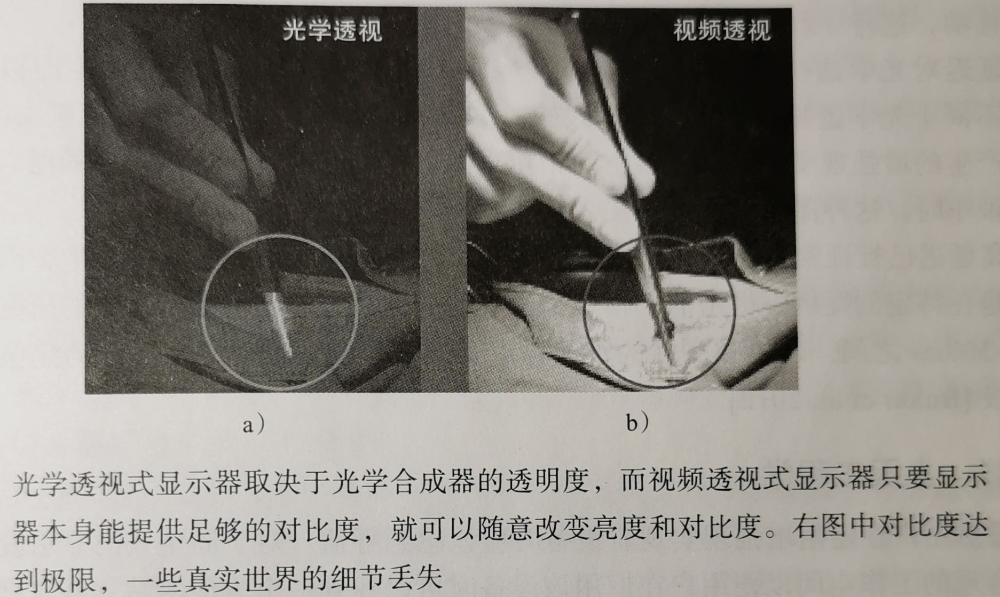

# AR 增强现实 Augmented Reality

2014 年，Facebook 以 20 亿美元收购 Oculus。

## 什么是 AR 增强现实

AR 增强现实是一种将虚拟信息与真实世界巧妙融合的技术，广泛运用了多媒体、三维建模、实时跟踪及注册、智能交互、传感等多种技术手段，将计算机生成的文字、图像、三维模型、音乐、视频等虚拟信息模拟仿真后，应用到真实世界中，两种信息互为补充，从而实现对真实世界的“增强”。

AR 超越了移动计算，在空间和认知上架起了虚拟世界和真实世界之间的桥梁。借助 AR，至少在用户的感觉上数字信息似乎已经成为真实世界的一部分。

AR 并不局限于视觉媒体。尽管可以难以实现，听觉、触觉、甚至嗅觉、味觉等也可以用于 AR 中。

AR 必须具有以下三个特征：

- 虚实结合
- 实时交互
- 三维注册

## AR 基本工作原理

完整的 AR 系统，至少需要以下个组件：

- 跟踪组件。需要真实世界模型作为参照，用来确定用户在真实世界中的位置。

- 注册组件。

- 可视化组件。

- 空间模型（即数据库）。存储关于真实世界和虚拟世界的信息。

- - 虚拟世界模型包含用于增强的内容。
  - 空间模型的这两个部分（真实世界和虚拟内容），必须配准在同一坐标系下。

AR 基本流程：

- 首先通过摄像头和传感器将真实场景进行数据采集，并传入处理器对其进行分析和重构，再通过AR头显或智能移动设备上的摄像头、陀螺仪、传感器等配件实时更新用户在现实环境中的空间位置变化数据，从而得出虚拟场景和真实场景的相对位置，实现坐标系的对齐并进行虚拟场景与现实场景的融合计算，最后将其合成影像呈现给用户。
- 用户可通过AR头显或智能移动设备上的交互配件，如话筒、眼动追踪器、红外感应器、摄像头、传感器等设备采集控制信号，并进行相应的人机交互及信息更新，实现增强现实的交互操作。
- 其中，三维注册是AR技术之核心，即以现实场景中二维或三维物体为标识物，将虚拟信息与现实场景信息进行对位匹配，即虚拟物体的位置、大小、运动路径等与现实环境必须完美匹配，达到虚实相生的地步。

## 增强现实（AR）与 虚拟现实（VR）

虚拟现实（VR）将用户置于一个完全由计算机生成的环境内，而增强现实（AR）旨在呈现直接注册到物理环境的信息。

VR 用户基数较小，移动性较差，具有隔离的沉浸感，因此主要集中在娱乐用途上。VR 是在现实世界之外营造出一个完全虚拟的世界。

与 VR 相比，AR 会触及到更多的人，因为它是对人们日常生活的无缝补充。AR 是将计算机生成的虚拟世界叠加在现实世界上。随着AR技术的成熟，AR越来越多地应用于各个行业，如教育、培训、医疗、设计、广告等。

## 视觉的基本概念

由于视场、分辨率和聚焦能力等其他沉浸因素不可避免地存在与理想值的偏离，因此会造成轻微或非常不自然的体验。

人类已经习惯于不需要任何媒介就可以无障碍地观察物理世界，对高保真显示具有很高的期望，尤其是不同深度线索的相互影响。

### 调焦

在计算机图形学中，通常使用针孔摄像机模型（摄像机光圈是理想点，不使用透镜）对虚拟物体进行渲染，导致不同景深的物体均完美清晰地成像。

我们的眼睛和真实摄像机一样有一定范围的光圈尺寸，因此必须考虑有限景深的问题：只有一定范围内的物体才会被聚焦，而这个范围以外的所有物体都会模糊不清。

当然，我们的眼睛可以根据观看距离调节焦距（调焦）。

调焦可以作为辐辏（通过眼球独立旋转使视线凝聚在空间的一个点上）的条件反射发生，也可以有意识地控制。我们通过改变瞳孔后方的弹性透镜来在一定距离内调焦。

然而，当涉及立体显示屏幕时就不那么简单了，任何用肉眼或通过常规光学系统观看的显示屏都有一个固定的焦距，因此虚拟物体的图像将始终显示在这个固定的距离，尽管该物体的实际深度（到虚拟摄像机的距离）可能会变化很大。

在这样的立体显示器中，物体的实际距离通过立体视差传递给人类视觉系统，从而产生一定程度的辐辏反应。这一结果是调焦和视线凝视发生冲突，即所谓的辐辏调节冲突。

人们从虚拟场景的双目立体线索中得到变化的辐辏信息，这与适应显示器焦深的固定调焦发生冲突。这种现象已被证实会降低任务绩效并导致视觉疲劳。

使用这种立体渲染的光学透视式增强现实系统还会有另外一个相关问题：用户在观察虚拟增强图像时会受到辐辏调节冲突的影响，但是用户会通过正确的调焦线索观察现实世界，为了清楚地观看虚拟的叠加物，用户需要调焦到显示图像平面。

因此，为了读取位于建筑物立面前的虚拟文本标签，用户必须在建筑物立面平面和显示图像平面之间来回聚焦。在注视立面平面时用户可以看到聚焦处的建筑细节，但文本信息将是模糊的，反之亦然。

人们可以毫不费力地调焦，但随着使用时间的增加，视觉疲劳和不适感会随之增加。对于移动设备来说，用户疲劳的风险就更大。
解决这个问题的一个技术途径是使用实时改变焦点平面的显示器。

### 遮挡

虚拟物体与真实物体之间的遮挡是表现场景结构的重要线索。
真实物体之间正确的遮挡关系是自然形成的。
虚拟物体之间正确的遮挡关系很容易通过z缓存的方法实现。
但是如何实现真实物体和虚拟物体之间的遮挡需要特别考虑。
如果可以获得真实场景的几何表示，视频透视系统可以通过使用z缓存的方法确定虚拟和真实物体中的哪一个在前面。
在光学透视系统中，增强内容经常以半透明覆盖的形式出现，因此更难实现虚拟物体看似真正出现在实物体之前的效果。

具体实现遮挡的方法有以下三种：
- 可以将虚拟物体渲染得非常明亮，远远亮于真实物体的可见强度，从而虚拟物体将会凸显。然而，这可能会对真实场景其余部分的感知产生不利影响。
- 在可控环境中，真实场景的相关部分可以通过计算机控制的投影仪进行照明，而场景的其余部分（特别是被虚拟物体遮挡的真实物体）处于暗区域中，从而无法被察觉。在这些暗区域中，虚拟物体看起来可以遮挡真实物体。

- 光学透视式显示器可以通过选择液晶屏单个像素透明或不透明来进行增强，ELMO 头戴式显示器是这一方法的开创性成果。

### 分辨率和刷新率

显示的分辨率直接影响显示图像的保真度。总的来说，分辨率受显示器类型和光学系统的限制。

如果使用视频透视的解决方案，现实世界的分辨率又额外受到摄像机分辨率的限制。
通常，计算机生成的显示图像无法与人类直接感知真实世界的最大分辨率相匹配。
然而，我们总是需要足够的分辨率来抑制影响用户感知真实世界的计算机生成图像（如像素线条或文字）的干扰项。

除了空间分辨率，时间分辨率（即显示器本身的刷新率）对于减少感知闪烁、消除图像滞后和鬼影非常重要。
闪烁融合阈值是普通人类观察者无法分辨灯光闪烁刺激的频率。
许多因素会影响这个阈值，虽然某些人类观察者感受CRT显示器闪烁的刷新率小于75Hz，但类似于LCD显示器的具有更高像素持久性的新显示技术可以避免在60Hz或更低刷新率时发生闪烁。
刷新率影响显示器渲染运动的方式。
为了显示运动图像，人类的闪烁融合阈值通常被设定为16Hz，而不同制式的电视摄像机以每秒25或30帧工作。
更高的帧率（120Hz以上）有利于实现无模糊的快速运动渲染，虚拟现实和增强现实大多需要60Hz以上的帧率。

更高的显示刷新率也常被用于虚拟现实和增强现实显示器中的时间复用信息传输，如立体显示器中左、右眼帧的交替传输，以及场序彩色显示器中通过快速时序显示红、绿、蓝色进行单像素颜色融合。

### 视场

视场（FOV) 比原始分辨率更重要。

视场和分辨率相互关联，因此在相同的像素密度下，需要更多的像素来填充更大的视场。
更大的视场意味着在单个视图中可以向用户显示更多信息。
在增强现实系统中，可以分为叠加视场和外围视场。
在叠加视场中，计算机生成的图像被叠加在真实世界的图像上。与之相对，外围视场是被观察环境自然的、非增强的部分。
假如图中的总视场角为对角线方向62。则标记的叠加视场角大约为30。对角线。
这样一个相对狭窄的视场意味着用户常常需要在自己和虚拟物体或真实物体之间保持一定的距离才能完全看到它们，或者以扫描运动的方式移动头部以观察整个场景。
视场限制在虚拟现实中很常见，尤其是在增强现实显示中限制了用户在显示场景和内容中的存在感，导致沉浸感降低。
在视频透视式增强现实中，决定可呈现的真实世界信息量的实际上是摄像机视场，而非显示器的视场。
摄像机视场通常大于显示器视场，所以摄像机的图像由于被压缩而实际上呈现类似鱼眼的效果。
例如，当使用智能手机作为手持式增强现实魔镜时，由于手臂长度的限制，智能手机背面的摄像头视场角可能要比显示屏的大。

设计头戴式显示器的目标是覆盖尽可能宽的视场。
为了避免头戴式显示器的尺寸过大，我们必须使它靠近眼睛（使用视网膜扫描显示器或增强现实隐形眼镜）或优化光学元件的设计。
头戴式显示器制造商通常给出对角视场而不是水平和垂直的视场，从而可以方便地给出更大的视场角数值。
当人眼与头戴式显示器的距离固定时，视场与显示器的空间分辨率决定了角分辨率。
具有非常高像素密度的显示器可以使用非常简单的放大光路来呈现大视场现实。
伴随着平板显示技术的进步，该方法已被用于最近的 Oculus Rift 等非透视式显示器。
然而，使用固定的像素数可能需要在更宽的视场或更高的分辨率之间做出折中。
例如，飞行员可能喜欢更广阔的视野，而外科医生可能需要更高的分辨率。

### 视点偏移

光学透视式显示器将虚拟和真实光路进行融合，由此产生的图像通过设计实现对齐。
这是一个希望取得的结果，因为它符合自然的观察方式。
然而，这需要对用于生成增强现实显示中虚拟部分的虚拟摄像机相对于用户眼睛的位置进行标定如果标定没有仔细完成，则会产生图像之间的偏移。
在视频透视式显示器中，通过使用摄像机采集的图像帧，可以实现基于计算机视觉的注册（如图所示，从而得到像素级的标注）。

### 亮度和对比度

在透视式显示器中获得充分的对比度通常是困难的。
特别是在户外环境或自然光线充足的情况下，大多数计算机显示器不够明亮，因而无法获得足够的对比度。
一个常见的规避措施是减少影响观察条件的物理光线，例如利用窗帘控制室外的光线对室内空间投影的影响，或操纵头戴式显示器上一个可调节的遮光板。

光学透视式头戴式显示器允许用户直接看到真实世界，显示器的最高亮度必须匹配真实世界的亮度水平，这使得获得可接受的对比度水平很难，尤其是在阳光直射的户外。
在某些情况下，光学系统也可能使现实世界过于黑暗。

### 延迟

与空间误差类似，时间误差也会产生不利的影响。

虚拟与真实之间的时间校准的不足，也会产生空间偏移。

高延迟已被证实会导致观看虚拟现实和增强现实场景时，产生晕动症。

### 扭曲和畸变

如果需要宽视场，这些光学元件可能会引入畸变，特别是鱼眼效应。

此外，电子成像过程可能导致采样和重建伪影。

# AR 关键技术

## 跟踪注册技术

为了实现虚拟信息和真实场景的无缝叠加，这就要求虚拟信息与真实环境在三维空间位置中进行配准注册。

这包括使用者的空间定位跟踪和虚拟物体在真实空间中的定位两个方面的内容。

而移动设备摄像头与虚拟信息的位置需要相对应，这就需要通过跟踪技术来实现。

跟踪注册技术首先检测需要 ‘增强" 的物体特征点以及轮廓，跟踪物体特征点自动生成二维或三维坐标信息。

跟踪注册技术的好坏直接决定着增强现实系统的成功与否。

常用的跟踪注册方法有基于跟踪器的注册、基于机器视觉跟踪注册、基于无线网络的混合跟踪注册技术四种。

## 显示技术

增强现实技术显示系统是比较重要的内容，为了能够得到较为真实的虚拟相结合的系统，使得实际应用便利程度不断提升，使用色彩较为丰富的显示器是其重要基础。

在这一基础上，显示器包含头盔显示器和非头盔显示设备等相关内容，透视式头盔能够为用户提供相关的逆序融合在一起的情境，这些系统在具体操作过程中，操作的原理和虚拟现实领域中的沉浸式头盔等内容之间相似程度比较高级。

其和使用者交互的接口及图像等综合在一起，使用更加真实有效的环境对其实施应用微型摄像机的形式，拍摄外部环境图像，使计算机图像在得到有效处理的时候，可以和虚拟以及真实环境融合在一起，并且两者之间的图像也能够得以叠加。

光学透视头盔显示器可以在这一基础上利用安装在用户眼前的半透半反光学合成器，充分和真实环境综合在一起，真实的场景可以在半透镜的基础上，为用户提供支持，并且满足用户的相关操作需要。

## 虚拟物体生成技术

增强现实技术在应用的时候，其目标是使得虚拟世界的相关内容，在真实世界中得到叠加处理，有效在算法程序的应用基础上，促使物体动感操作有效实现。

当前虚拟物体的生成是在三维建模技术的基础上得以实现的，能够充分体现出虚拟物体的真实感，在对增强现实动感模型研发的过程中，需要能够全方位和集体化对物体对象展示出来。

虚拟物体生成的过程中，自然交互是其中比较重要的技术内容，在具体实施的时候，对现实技术的有效实施有效辅助，使信息注册更好的实现，利用图像标记实时监控外部输入信息内容，使得增强现实信息的操作效率能够提升，并且用户在信息处理的时候，可以有效实现信息内容的加工，提取其中有用的信息内容。

## 交互技术

与在现实生活中不同，增强现实是将虚拟事物在现实中的呈现，而交互就是帮助虚拟事物在现实中更好的呈现做准备，因此想要等到更好的AR体验，交互就是其中的重中之重。

AR设备的交互方式主要分为以下三种：

- 现实世界中的点位选取来进行交互是最为常见的一种交互方式，例如最近流行的AR贺卡和毕业相册就是通过图片位置来进行交互的。 
- 将空间中的一个或多个事物的特定姿势或者状态加以判断，这些姿势都对应着不同的命令。使用者可以任意改变和使用命令来进行交互，比如用不同的手势表示不同的指令。
- 使用特制工具进行交互。比如谷歌地球，它就是利用类似于鼠标一样的东西来进行一系列的操作，从而满足用户对于AR互动的要求。

## 合并技术

增强现实的目标是将虚拟信息与输入的现实场景无缝结合在一起，为了增加AR使用者的现实体验，要求AR具有很强真实感。

为了达到这个目标不单单只考虑虚拟事物的定位，还需要考虑虚拟事物与真实事物之间的遮挡关系以及具备四个条件：几何一致、模型真实、光照一致和色调一致，这四者缺一不可，任何一种的缺失都会导致AR效果的不稳定，从而严重影响AR的体验。

# AR 的增强方法（显示）

基于人类视觉系统的特性和增强现实应用的目标，可以得出增强现实显示装置的需求。包括以下几种方式：

## 光学透视式（OST）显示

通常通过半反半透光学元件来实现虚实结合。

这类光学元件的一个简单示例是半镀银镜，该银镜可以让足够多来自真实世界的光线通过。
因此可以直接观察到真实世界。
同时，显示计算机生成虚拟图像的显示器被放置在头顶或银镜的一侧，从而可以反射虚拟图像并叠加到真实世界上。

## 视频透视式（VST）显示

通过电子的方式进行虚实融合。
这类显示通过摄像机拍摄真实世界的数字视频图像并传输到图形处理器，图形处理器将视频图像与计算机生成的图像进行结合。
通常只需将视频图像复制到帧缓冲区作为背景图像，再在上面绘制计算机生成的图像。
可以通过传统的观看装置呈现组合的图像。

## 单视和体视

众所周知的是，利用立体摄像机输人提供三维空间的逼真感受是非常困难的。

伴随着近眼显示器透视式增强现实显示技术，出现了单视和体视的问题。在应用近眼显示器时，可以通过单目或双目方式构建增强现实。
如果物理世界是借助某种光学透镜进行观察或通过摄像机进行介导的，那么将出现两个有关场景维度的问题：是否保持了真实世界的三维度？是否利用双目视觉通过立体视觉的方式展示增强效果？

- 单目头戴式显示器
  - 单目头戴式显示器仅为一只眼睛呈现图像。
  - 单目显示器可用于增强现实，但由于缺乏沉浸感，这种方法不太受欢迎。
- 双目显示器
  - 双目显示器为双眼显示相同的图像，仅提供了单视的效果。
  - 这种方法有时也被用于视频透视式（VST)头戴式显示器，由于只需要一个单独的摄像机流，因此最小化了感知和处理的要求。
- 双目头戴式显示器
  - 双目头戴式显示器为每只眼睛提供了一幅单独的图像，能够产生立体效果。一套带有两台与眼睛光轴对齐的摄像机的视频透视式显示器，可以产生让用户立体感知的物理世界图像。
  - 显然在这些选项中，双目显示器提供了最高质量的增强现实，但技术成本显著增加。
  - 双目头戴式显示器需要两个显示元件，或者是一个可以使用两个光学元件进行适当分割的宽幅单显示器。
  - 可以通过在一个显示单摄像机获取的真实背景的双目镜显示上进行渲染来实现立体增强（如，手机摄像头）。
  - 但全立体视频透视至少需要两台摄像机的视频输人来提供一个类似于人类双眼的视角。
  - 为了同时传送图像，成对的摄像机和显示器必须保持同步。

## 空间投影显示（空间增强现实）

当增强内容是被投影到实际的物理几何体上（作为虚拟的占位符对象或现实世界中的自然部分）时，称为空间增强现实、基于投影的增强现实或空间投影。

在空间投影中，增强现实显示的虚拟部分是由投影装置产生的，该类显示装置不需要使用特殊的屏幕，而是直接将虚拟图像投影到真实世界的物体上。
这类显示装置也是光学组合的一种形式，但是既不需要单独的光学合成器，也不需要电子屏幕。

头戴式投影仪、可移动投影仪（加装跟踪云台）。

## 手持式显示

智能手机和平板电脑等手持式显示器。
