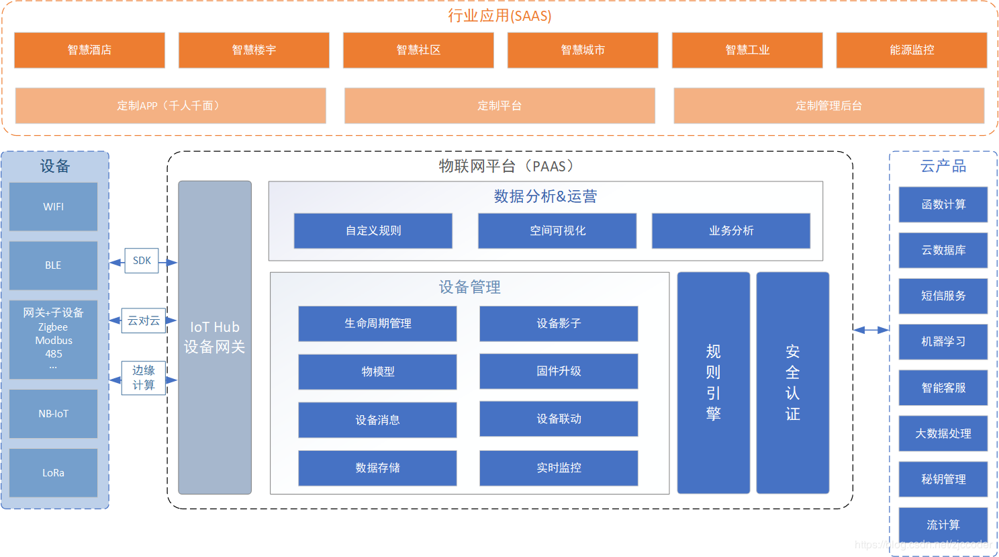

# AIoT Platform 物联网云平台

# AIoT 

AIoT（人工智能物联网）=AI（人工智能 Artificial Intelligence）+IoT（物联网  Internet of Things）

广泛的定义来看，AIoT 就是人工智能技术与物联网在实际应用中的落地融合。它并不是新技术，而是一种新的 IoT 应用形态，从而与传统IoT 应用区分开来。

如果物联网是将所有可以行使独立功能的普通物体实现互联互通，用网络连接万物，那AIoT则是在此基础上赋予其更智能化的特性，做到真正意义上的万物互联。

AI、IoT “一体化”后，“人工智能”逐渐向“应用智能”发展：

（1）通过物联网产生、收集海量的数据存储于云端、边缘端。

（2）再通过大数据分析，以及更高形式的人工智能，实现万物数据化、万物智联化。

（3）物联网技术与人工智能追求的是一个智能化生态体系。

（4）除了技术需要不断革新，技术的落地与应用更是现阶段物联网与人工智能领域亟待突破的核心问题。

AIoT 是一个综合性市场，其容量足够大，且目前呈现多层级、碎片化状态。因此吸引了众多从原赛道切入 AIoT 的玩家，主要有四大类：云计算企业、AI 公司、SI 公司、IoT 公司。

AIoT 具有双重意义：

- 连接创造价值。

- 重新定义物和人的关系。物和人的关系发展的几个阶段：

  - 第 1 阶段：解决人与人之间的沟通和社交需求，比如即时通信工具，微信。
  - 第 2 阶段：人主动找物，比如 O2O、共享单车、饿了么等应用。
  - 第 3、4 阶段：物与物数据化互联互通、物主动服务人的阶段。
    - 物与物数据化互联互通，首先要确立互联互通标准。比如，通过无线通信来实现，例如，Z-Wave、蓝牙Mesh、NB-IoT等。
    - 物主动服务人，实际上是人工智能技术的体现。比如，AI 算法让 “灯主动服务人”，一回家，灯就自动亮起，亮度、颜色等根据用户的习惯或状态，也会自动调节。 

  

## AIoT 与大数据

数据是万物互联、人机交互的基础。，大数据分析、深度学习需要物联网的传感器收集。而物联网的系统，也需要靠人工智能做到正确的辨识、发现异常、预测未来。AI 的介入让I oT 有了连接的 “大脑”。

由此可见，人工智能结合物联网（AIoT）是接下来的重大发展，而这样的发展，影响到各行各业，甚至会进行产业颠覆，也就是说，接下来AIoT 服务，将在我们身边大量出现。

随着5G的加速孕育成熟，人工智能和物联网技术的蓬勃发展，越来越多应用场景将在智能终端和传感器中产生，由此产生的丰富大数据，会成为智能化时代建设的新燃料。

## AIoT 与云

 云服务的快速扩张，则让数据有了发挥价值的物质基础。  

# 云端 Architecture

