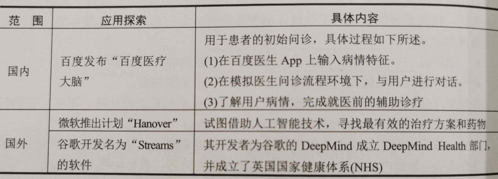

# 人工智能

ABC（AI、Big Data、Cloud Computing）融合，加速物理世界与数字世界的融合，驱动着 “互联网物理化” 的快速变革，将数字世界的互联网技术、商业模式又送回到物理世界，改变未来世界。 

AI 的商业化途径是通过数据加算法、软件与专用硬件这样 ABC 三位一体的智能云来实现的，从而实现用户价值并产生商业价值，而且创新速度将越来越快。

简言之，人工智能就是通过一些科学的计算方法，让机器做一些人类能够做的事情，例如：

- 人类的视觉——目标认知、图像识别
- 人类的听觉——语音识别
- 人类的思考——对图像的分析、对语言中语义的分析、理解以及回答等。

# 人工智能的应用 

## 工业领域：工业 4.0

机器视觉 AI 与工业检查。例如，利用无人机回传的视频和图片来完成结构方面的检查。利用 机器视觉 AI 技术检查产品的缺陷。

富士康推进的 “机器换人” 行动。

## 农业生产领域

无人机喷洒农药，农作物实时监控、物料采购、数据收集、数据分析（生长曲线）等优化农业现代化管理，节省时间和人力等成本，提高产量。

通过天气预报数据，减少因天气变化造成的农作物损失。

利用大数据，调整耕种计划或更换农作物，提高土地的土壤肥沃度和利用率。

室内农业管理 。通过传感器采集物理数据、控制光线、调节水分，并监测每种农作物的生长状况，自动配置最合适的气候条件，并减少代学农药的使用。

采摘机器人。

监控禽畜健康，减少畜牧业受疾病的影响。

## 教育领域
人工智能驱动智慧教育，随着人工智能时代的到来，依照同样的标准批量生产人才的模式难以为继。
智能教育是指以“人的智慧成长”为导向，学校除了教授书本知识，更重要的是激发学生的求知欲，利用所学知识解决问题，拆除各门学科之间的屏障，让科学与艺术不分家，让数学与哲学强强联合，完成大跨度的创新。
以人工智能技术为支撑的智慧校园便应运而生，校园建设也从数字校园转向智慧校园。智慧校园建设的关键在于“云化”。
- 利用物联网技术为学生提供安全舒适的学习环境。
- 借助情境感知技术为学生身心健康发展提供有力支持。
- 利用大数据技术对学习过程进行跟踪，提供量身定制的最优学习路径。

智慧学习方式。利用信息技术辅助学习过程，倡导在更加轻松、愉悦的环境中接受新的知识、提升动手动脑的能力。跨学科学习，无边界学习，采用多元化浸入式互动学习环境。利用混合现实技术，将虚拟场境融入真实世界，不受时间和地点限制的学习空间。

### AI 早教机器人

## 智能家居领域

### 智能语音助手

Siri、Cortana、Alexa、Google Assistant。

### 安防领域的应用

人脸识别。

## 医疗健康领域

例，Airdoc 公司，在放射影像、肿瘤、皮肤科、眼科等领域的人工智能应用。AI 可以分析放射科的照片。

IBM Waston：肿瘤的诊断和治疗。

2018 年 6 月，腾讯发布国内首个 AI 辅诊平台，帮助医生提高常见疾病诊断的准确率和效率。

## 社交领域

2018 年 11 月，新华社首个 “AI 合成主播” 上岗。

### 虚拟现实 VR（Virtual Reality）

虚拟现实 VR（Virtual Reality） 是下一个生活应用、社交平台。VR 本质是一种人机交互的方式，它是人和互联网之间的桥梁。

5G 技术降低虚拟现实的时延，满足虚拟现实对高清画质的要求，给用户提供更加真实的用户体验感。

虚拟游戏、虚拟驾驶、虚拟旅游、虚拟体感购物等。

## 物流领域

京东的重型无人机运输包裹。

## 零售领域

无人超市、无人便利店、无人仓等。24 小时营业，无人监控。

## 金融领域

智能决策、经济交易。AI 经过 大量训练及回溯测试之后，AI 的交易胜率已经可以达到 70%。人工智能程序化交易的引入，可以很好地避免人在投资过程中可能出现的主观判断。因为人性天生存在弱点，贪婪和恐惧等情绪往往都会影响交易决策结果。

## 其他领域

### 智能运维领域

网络异常流量检测。人工智能已经应用于恶意代码检测、恶意流量监测、威胁情报收集、软件漏洞挖掘等网络安全领域。

智能运维的主要作用：进行实时监控、实时报警、异常检测、故障根源分析、趋势预测等。将平台数据集中起一进行优化、分析、处理海量数据，达到动态监控的目的、实时预警。

### 人工智能客服

通过人工智能客服，实现 24 小时在线服务，节约人工客服成本。根据用户的问题，自动为其匹配生成最佳的答案。

# 机器人的 AI 应用

与人类进行友好互动的高级智能机器人，提供管家式服务的机器在人，可以根据用户的搜索习惯和浏览历史，提供个性化的内容推送。

## 安防的机器人应用

监控摄像机无法完全实现全区域的 "全网" 覆盖，一些角落会成为被忽视区域，存在安全隐患。可移动巡线机器人、无人机，可以你不这一缺陷。

## 餐饮领域的机器人应用

机器人餐厅，包括迎宾机器人、煎炸机器人、甜品机器人、调酒机器人、送餐机器人等。

# 智慧城市

智慧城市是城市化与信息化之间高度融合的表现。将城市建设、城市治理，与互联网、大数据、人工智能相结合。

目前，我国城市信息化建设在某种程度上还存在 “碎片化” 、“散点化” 现象，需要重点建设城市信息模型平台，推进城市大数据的汇聚。

阿里巴巴的 “杭州城市大脑 2.0”。一个智慧城市系统，可以连接分散在城市各个角落的数据，通过大量数据的整理和分析，对城市进行管理和调配。例如，缓解城市交通拥堵情况。

# 自动驾驶

## 最优路径规划

物流、外卖、打车等越来越多基于物理信息，高效配置共享资源的手机应用，已经改变着现代人们的的生活方式。以物流配送行业为例，配送中心可以以效益最高、成本最低、路程最短、准确性最高等作为目标设计具体路线。

## 无人驾驶

# 文化传播

