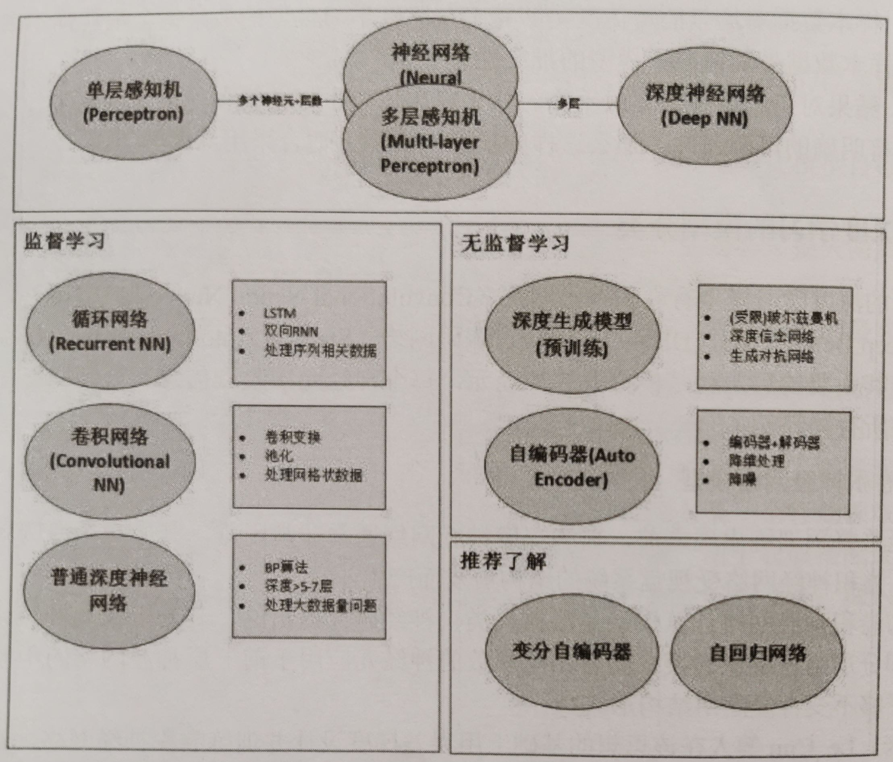
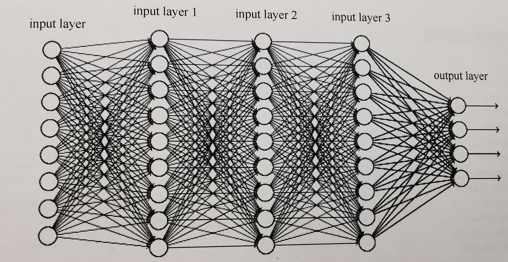

# Deep Learning 深度学习

# 神经网络

生物神经网络的基本单元是生物神经细胞，也叫作生物神经元。一个生物神经元由细胞核、树突、轴突、突触等组织构成。由生物神经元（细胞）、突触等结构组成，大量的神经元通过无数的突触连接可以构成一个大规模神经网络，能够处理人的思维和记忆。

神经网络是机器学习的一个分支，起源于人们对生物体神经网络的认知。

神经网络（Neural Network）起源于 Walter Pitts 等人在 1943 年首次建立的感知机模型，包含输入层、隐藏层、输出层的网络结构：输入层输入一个向量，通过隐藏层计算处理，再由输出层输出最后的结果。

人工神经网络主要包括神经元、权重/偏置项、以及激活函数等内容。

- 神经网络由多个神经元组成。每个神经元都包含权重和激活函数，对传入的变量进行运算。
- 权重与输入的向量相乘。偏置项与计算的结果相加。权重通过反向传播算法来更新。
- 训练神经网络就是指权重的更新迭代过程。
- 激活函数负责将前面的线性运算结果进行计算，以及输出，对于人工神经网络模型学习中复杂的和非线性的函数有非常重要的意义。

  

## 反向传播算法

- 反向传播算法（Back Propagation，BP）以及损失函数的提出，使得多层神经网络也可以很好地学习到参数权重。
- 权重通过反向传播算法来更新。
- 反向传播算法基于梯度下降原则，从网络的高层向低层反向传播，通过计算相对于网络参数的梯度来更新权重，直到网络的输出误差最小。
- 在反向传播中，容易出现梯度消失和梯度爆炸的问题。

## 损失函数

- 损失函数，一般用于衡量模型的当前预测能力。模型学习的目的是对损失函数最大化或最小化的过程。
- 对于某一具体的深度学习模型，没有固定的损失函数，损失函数的选取依赖于模型选取的算法、参数的数量、梯度下降的效率等因素。
- 根据任务的不同，损失函数可以分为两大类：分类、回归。
- 一个合适的损失函数可以有效提高模型的准确率和效率。

## 激活函数

- 激活函数负责将前面的线性运算结果进行计算，以及输出，对于人工神经网络模型学习中复杂的和非线性的函数有非常重要的意义。

- 原始的感知机，由于没有激活函数，因此输入/输出是简单的线性组合，叠加层数不能改善模型的泛化拟合能力。

- 激活函数使网络拥有非线性因素，通过叠加多层网络，可以逼近任何非线性函数。

- 常用的激活函数包括 Sigmoid 函数、Tanh 函数、ReLU 函数等。

## 神经网络模型（架构）基础知识

模型的深度是一把双刃剑，随着模型深度（层数）的不断增加，模型本身会面临许多新的问题。最典型的就是通过机械性累加得到深层次神经网络模型，在进行后向传播的过程中会出现梯度消失、极易过拟合等模型性能退化的问题，梯度消失就意味着我们搭建的神经网络已经丧失自我学习和优化的能力。

当深度学习模型学习失败时，我们做的最重要的操作之一：就是给模型添加更多的层。

- 随着层数的增加，模型的准确率得到提升，然后会达到饱和。
- 这时再增加更多的层，准确率会开如下降。
- 在到达一定深度后，加入更多层，会相应增加挑战性，如梯度消失或爆炸问题。其中一部分可以通过仔细初始化权重和引入中间的正则化层解决。现代架构，如 ResNet 残差网络和 Inception，试图通过引入不同的技术来解决这些问题，如残差连接。

作为深度学习领域两大阵营的 CNN 和 RNN 各具特色。一般来说，CNN 适用于空间任务（如图像），RNN 适用于时序任务（如语音）。

### 深度学习起源于神经网络的研究

- 单层神经网络模型的泛拟合能力有限，对于诸如 “异或” 这样的简单问题都无法解决。
- 多层神经网络可以解决较为复杂的问题，面临参数较多，难以学习的问题还是无法解决。多层神经网络与单层神经网络的最大区别在于，多层神经网络在它的输入层和输出层之间加入了隐藏层（可以自定义隐藏层的层数）。
- 反向传播算法（Back Propagation，BP）以及损失函数的提出，使得多层神经网络也可以很好地学习到参数权重。
- 2006 年，在 Hinton 发表的两篇论文中解决神经网络学习中初始值的设置问题，并提出了一个快速训练深度神经网络的方法，多层的神经网络正式被称为深度学习。

# 深度学习

## 深度学习的发展过程

AI 之父——马文 · 明斯基。他证明单层感知器无法解决线性不可分问题（如异或问题）。单层感知器的致命缺陷导致无法将它推广到多层神经网络中，人工智能神经网络在 20 世纪 70 年代进入了第一个瓶颈期。此后近 20 年，人们对神经网络都没有新的发现。

深度学习之父——杰弗里 · 辛顿。提出了 BP（Back Propagation）算法，它适用于多层感知器的反向传播。即，BP 算法以传统神经网络的正向传播为基础，增加了误差的反向传播过程。反向传播过程不断地调整神经元之间的权值和阈值，直到输出的误差减小到允许的范围内，或达到预先设定的训练次数为止。BP 算法完美地解决了非线性分类问题，使人工神经网络研究再次回暖。由于当时计算机性能有限，在神经网络的规模不断增大的情况下，BP 算法会直接导致 “梯度消失” 问题，使 BP 算法得不到进一步发展。

20 世纪 90 年代中期，以 SVM（支持向量机，Support Vector Machine）为代表的其他浅层机器学习算法被提出，解决了一定的分类、回归问题。但算法的原理与神经网络模型有着明显的不同，人工神经网络的发展，不得不再次停滞，并再一次进入了寒冬期。

2006 年杰弗里 · 辛顿和他的学生鲁斯兰 · 萨拉赫丁诺夫正式提出了深度学习的概念。给出了 “梯度消失” 问题的详细解决方案——通过无人监控的学习方法逐层训练算法，然后使用有监督功能的反向传播算法进行参数调优。在 2006 年，深度学习理论被提出后 ，卷积神经网络的表征学习能力得到了关注。

2016 年，谷歌公司基于深度学习开发的 AlphaGo 以 4:1 的比分战胜了国际顶尖围棋高手李世石。

2017 年，基于强化学习算法的升级版 AlphaGo Zero 采用 “从零开始”、“无师自通” 的学习模式，以 100:0 的比分完胜 AlphaGo。2017 年是人工智能发展突飞猛进的一年。人工智能正在悄无声息地改变着我们的生活！

第三拨的人工智能热潮源于深度学习的复兴。

## 深度学习的流程

1. 数据预处理：不管什么任务，数据的处理都是解决问题的关键步骤。
2. 模型搭建：可以自己搭建自己的模型，也可以根据任务利用经典的模型进行细微调整。
3. 训练模型：有了模型、数据之后，可以把数据 “喂” 给模型，让模型自行学习，直至模型收敛。
4. 结果可视化：在训练过程中，对一些指标进行可视化（例如，Loss 损失函数的变化曲线等），可以辅助对已学习模型的判断，也可以辅助模型的验证选择。
5. 测试（预测）：基于训练好的模型对新的数据进行预测，是模型训练的最终目标。

## 深度学习的模型分类

## 深度学习 与 机器学习

机器学习是人工智能的一个分支。而深度学习是机器学习的一个分支。

实现机器学习的途径一般包括决策树、归纳逻辑程序设计、聚类、强化学习、贝叶斯网络等，而深度学习是另外一种途径。深度学习这一概念的灵感来自大脑的结构和功能，即众多神经元的相互连接。

通过实验所实现的的人工神经网络（ANN）实际上是一种模拟大脑生物结构的算法。在人工神经网络中，存在着具有独立处理层的神经元。其中，每一个独立处理层都有其特定的学习特征。例如，自动地对图像中的曲线或边缘进行识别。正是这种分层的属性，定义了 “深度学习” 这一名称。

深度学习是人工神经网络或者深层神经网络的代名词，“深度” 指的是神经网络的网络层次，是通过使用多个独立层（而不是单个的独立层）来实现的。

典型的深度学习模型是指具有 “多隐藏层（指具有三个以上的隐藏层）” 的神经网络。深度学习模型通常有 8 层、9层，甚至更多的隐藏层，这意味着深度学习模型可以自动提取很多复杂的特征。

随着云计算、大数据时代的到来，海量的训练数据配合逐层预训练、误差逆传播微调的方法，可以大幅提高模型的训练效率，同时降低过拟合的风险。

相比而言，传统的机器学习算法，很难对原始数据进行处理，通常需要人为地从原始数据中提取特征。需要系统设计者对原始数据有相当专业的认识，在获得比较好的特征表示后，需要设计一个对应的分类器，使用相应的特征对问题进行分类。

而深度学习是一种自动提取特征的学习算法，无须考虑烦琐的特征提取过程，一旦设计好网络框架，就能解决问题，节省了大量的特征提取时间。通过多层次的非线性变换，它可以将初始的 “底层” 特征表示转化为 “高层” 特征表示后，用 “简单模型” 即可完成复杂的分类学习任务。

## 深度学习 与 大数据（海量数据）

大规模数据集是成功应用深度神经网络的前提。

对训练图像做一系列随机的变化会产生相似，但又完全不同的训练样本，进而获得更大规模的训练数据集。

深度学习的发展还获益于另外两个重要因素：海量的样本的易获得性和基于 GPU 并行计算的强悍算力。

样本不仅要具有代表性，还要有足够的数量，因为要学习的参数 W 的数量很多，可能会达到数百万个乃至上亿个参数，如果样本数量不足，则容易造成过拟合，从而影响泛化能力，难以进行实际应用。

## 深度学习的样本

样本集对机器学习的学习效果有举足轻重的作用，样本不行，再好的算法也无济于事。

样本不仅要具有代表性，还要有足够的数量，因为要学习的参数 W 的数量很多，可能会达到数百万个乃至上亿个参数，如果样本数量不足，则容易造成过拟合，从而影响泛化能力，难以进行实际应用。

## 深度学习的正则化

许多策略被显式地设计来减少测试误差（可能以增在训练误差为代价），这些策略被统称为正则化。

正则化是一种旨在减少泛化误差（而是不是训练误差）对学习算法的修改。

在深度学习的背景下，大多数正则化策略是对估计进行正则化，以编差的增加换取方差的减少。

神经网络虽然号称 “万能近似”，但是并不能保证训练算法能够学习这个函数，既可能找不到正确的参数，也可能因为过拟合而选择错误的参数。找到合适规范的模型，也不一定能解决模型训练的问题。

所以在更多的场景中，需要训练一个适当正则化的大型模型。

许多正则化方法（如神经网络、线性回归、逻辑回归）通常对目标函数 J 添加一个参数范数 Ω(θ) 和 α（参数范数惩罚程序的超参数，α = 0 表示没有正则化；α 越大，表示正则化惩罚越大），来限制模型的学习能力。

在神经网络中，参数包括每层线性变换的权重和偏置。通常只对权重做正则惩罚，而不对偏置做惩罚，使用向量 ω 表示应受惩罚影响的权重，用向量 θ 表示所有参数。

### L2 正则化

也称为零回归、Tikhonov 正测，通常被称为权重衰减（weight decay），是通过向目标函数添加正则项，使权重更加接近原点。

目标函数经过 L2 参数正则化后，即加入权重衰减后，会导致学习规则的修改，在每步执行梯度更新前，先收缩权重。

### L1 正则化

将 L2 正则化的参数惩罚项 Ω(θ)，由权重衰减项修改为各个参数的绝对值之和，即可得到 L1 正则化。

### 噪声鲁棒性

模型容易过拟合的原因之一：没有太好的抗噪能力。

提高网络抗噪能力的最简单方法，就是在训练中，加入随机噪声一起训练，可以向网络中的不同位置（输入层、隐藏层、输出层）加入噪声。

- 在某种意义上，数据集增强，可以看作在输入层，加入噪声，通过随机旋转、翻转、色彩变换、裁剪等操作，人工扩充训练集的大小，这样可以使网络对输入更加鲁棒。

- Dropout 方法，则属于在隐藏层中，加入噪声的一种方式。

- 数据集的内容，并不能保证 100% 标记正确，多多少少总会有一点错误情况发生。解决这个问题最常见方法：标签平滑，即通过把确切的分类目标从 0 和 1 替换成 □/(k-1) 和 1-□，正则化具有 k 个输出的 softmax 函数的模型，这样可以防止模型追求确切的概率，而不是以学习正确分类。
- 一般情况下，注入噪声远比简单地收缩参数强大，特别是噪声被添加到隐藏单元时会更加强大。
- 从优化过程角度来看，对权重叠加方差极小的噪声，等价于对权重施加范数参数惩罚。因为在权重中添加了一些随机扰动，将会驱使优化过程找到一个参数空间。该空间对微小参数变化引起的输出变化影响很小。因此，模型参数进入这样的区域，找到的不只是极小值点，还有平坦区域包围的极小点。

## 深度模型的优化

### 学习和优化

大多数机器学习问题中，关注的是算法的某些性能指标（如人脸识别的检测率）。这些指标与测试集相关，并且不可以通过直接计算求解。因此，只是间接地优化这些性能指标。

机器学习算法的目标是降低期望泛化误差，但是由于很难知道数据的真实分布，只能用经验分布来代替真实分布。因此，只能对这一误差寻求最小化。

因为利用训练集上的所有样本来计算代价函数的期望值，这一过程的计算量是非常大的。所以，在深度学习中经常使用小批量随机方法（minibatch stochastic）来训练模型。

虽然批量的增大，会获得更精确的梯度估计，但是回报是小于线性的。同时由于内存资源的限制，也很难选择非常大的批量数据。

根据经验，将批量大小设置为 1 时，通常可以获得比较理想的泛化误差。

小批量的随机抽取是非常重要的，为了从一组样本中计算出梯度期望的无偏估计，就要求这些样本是独立的。同时，也希望两个连续的梯度估计是相互独立的，因此，两个连续的小批量样本也应该是彼此独立的。也就是说，在训练前，应该打乱样本顺序。

### 局部极小值

代价函数是学习模型优化时的目标函数或准则，通过最小化代价函数来优化模型。根据选择的模型算法的不同，使用的代价函数也可以不同。

由于神经网络的不可辨认性，神经网络代价函数具有非常多，甚至无限多的局部极小值。

然而，所有这些由于不可辨识性问题，而产生的局部极小值，都有相同的代价函数值。因此，这些局部极小值，并非是算法本身所带来的问题。

但如果局部极小值相比全局最小点，拥有很大的代价，那么局部极小值将会带来很大的隐患。

### 悬崖与梯度爆炸

高度非线性的深度神经网络或循环神经网络的目标函数，通常包含由几个参数连乘而导致的参数空间中的非线性，这些非线性在某些区域会产生非常大的导数，导致出现像悬崖一样的斜率较大的区域。

当遇到这种悬崖结构时，梯度更新会大幅地改变参数的值，进而跳过这样的区域，产生不好的结果。通常，在这种情况下，可以采用启发式梯度截断，即，在梯度上只指明移动的最佳方向，并没有指明最佳步长。因此，启发式梯度截断会减小步长，使得梯度下降，不太可能一步走出最陡下降方向的悬崖区域。

### 局部和全局结构间的弱对应

以上讨论的大都是单点性质，如果利用梯度下降，在某个方向上损失函数改进很大，但是并没有指向全局代价更低的遥远区域，这样单点处表现很好，但是全局表现不佳。

梯度下降和几乎所有可以有效训练神经网络的方法，都是基于局部较小更新的。

大部分训练的运行时间，取决于到达最终解的路径长度，大多数优化研究难点，集中于训练是否可以找到全局的最小点、局部最小点、鞍点。但是在实践中，神经网络并不会到达任何局部。

许多现有的研究方法，在研究求解具有困难全局结构的问题时，均着力于寻找良好的初始点（因为实现的难度更小，可操作性好），而不是在局部范围内更新算法。

## 深度学习/机器学习框架

| 框架名称     | 接口语言                     | 开源？ |      |
| ------------ | ---------------------------- | ------ | ---- |
| TensorFlow   | C++、Java、Python、Go、C# 等 | 开源   |      |
| PaddlePaddle | C++、Python                  | 开源   |      |
| Caffe        | C++、MATLAB、Python          | 开源   |      |
| PyTorch      | C++、Python 等               | 开源   |      |
| MXNet        | C++、Python、R、MATLAB 等    | 开源   |      |

# ■■■■■■■■■■■■■■■■■■■■■■■■■■■■■■■■■■■■■■■■■■■■

# 深度学习的神经网络模型

## 深度学习的经典网络

### AlexNet 模型

AlexNet 是由 2012年 ImageNet 竞赛冠军获得者 Hinton 和他的学生 Alex Krizhevsky 设计的。

AlexNet 网络包含 8 个带权重的层： 5 层卷积层和 3 层全连接层组成的。

AlexNet 可以学习更丰富、更高维的图像特征，其特点：

- 具有更深的网络结构。
- 使用层叠的卷积层，即卷积层+卷积层+池化层来提取图像的特征。
- 使用 Dropout 抑制过拟合。
- 使用数据增强（Data Augmentation）抑制过拟合。
- 使用 Relu 作为激活函数。线性整流函数（Rectified Linear Unit, ReLU），又称修正线性单元，是一种人工神经网络中常用的激活函数（activation function），通常指代以斜坡函数及其变种为代表的非线性函数。
- 使用多个 GPU 进行训练。

### VGGNet 模型

VGG，Visual Geometry Group，是牛津大学计算机视觉组和 Google DeepMind 公司一起研发的深度卷积神经网络。

VGG 模型在多个迁移学习任务中的表现，优于 GoogleNet，而且从图像中提取 CNN 特征，VGG 模型是首选算法。

VGG 最大的缺点：模型参数量有140*10^12 个之多，需要更大的存储空间。

VGG 探索了卷积神经网络的深度与其性能之间的关系，成功地构筑了 16~19层深的卷积神经网络，并且证明了增加网络的深度，能够在一定程度上影响网络最终的性能，使错误率大幅下降，同时拓展性又很强，迁移到其他图片数据上的泛化性也非常好。目前为止，VGG 仍然被广泛用来提取图像特征。

VGG 可以看成是加深版本的 AlexNet。二者都由卷积层、全连接层两大部分构成。

VGG 有如下特点：

- 结构简洁。VGG 由 5 层卷积层、3 层全连接层、softmax 输出层构成，层与层之间使用最大化池分开，所有隐藏层的激活单元都采用 ReLU 函数。
- 小卷积核和多卷积核。VGG 有一个重要的特点，即它具有小卷积核。VGG 没有采用 AlexNet 中比较大的卷积核尺寸，而是降低卷积核的大小（3 x 3）来模仿 AlexNet 的网络结构，增加卷积子层数也能够达到相同的目的。这样的改进可以减少参数，并且通过增加非线性映射的次数，提高网络的拟合或表达能力。
- 小池化核。相比 AlexNet 的 3 x 3 的池化核，VGG 全部采用 2 x 2 的池化核。
- 通道数多。VGG 网络第一层的通道数为 64，后面每层都进行了翻倍，最多 512 个通道。通道数的增加，使得更多的信息可以被提取出来。
- 层数更深、特征图更宽。由于卷积核专注于扩大通道数、池化专注于缩小宽和高，使得模型架构在更深、更宽的同时，控制了计算量的增加规模。
- 全连接转卷积。这也是 VGG 的一个特点。将训练阶段的 3 个全连接替换为 3 个卷积，使测试得到的全卷积网络，因为没有全连接的限制，可以接收任意宽或高的输入，这在测试阶段是非常重要的。

### GoogleNet 模型

2014 年 Christian Szegedy 提出了一种全新的深度学习结构——GoogleNet。并在 2014 年的 ILSVRC 大赛中取得分类任务的第一名。

之前的深度学习结构（AlexNet、VGG 等）都是通过增大网络的深度（层数）来提高训练效果的。但是层数的增加会带来诸如过拟合、梯度消失、梯度爆炸等负作用。将全连接甚至一般的卷积都转化为稀疏连接，才能从根本解决问题。

在传统网络中，计算机的软硬件对非均匀稀疏数据的计算效率很低，所以，AlexNet 为了更好地优化并行运算，重新启用了全连接层。GoogleNet 提出的则是从另一种角度来提升训练结果：在相同的计算量下提取更多的特征，从而提升训练结果，这是高效利用计算资源的一种表现。

与 VGGNet 模型相比，GoogleNet 模型的网络深度已经达到了 22 层，而且在网络架构中引入了 Inception 单元。通过使用 Inception 单元构造的深层次卷积神经网络模型，能进一步提升模型整体的性能。

GoogleNet 的核心是 Inception 网络结构，它构建了一种 “基础神经元”结构，来搭建一个稀疏性、高计算性能的网络结构。

GoogleNet 的网络架构从上往下一共有 22 层，层次类型主要包括输入层、卷积层、最大池化层、平均池化层、全连接层、Inception 单元、输出层。

### ResNet 模型

ResNet 是更深的卷积神经网络模型，在 2015 年的 ILSVRC 大赛中获得分类任务的第一名。

在 ResNet 模型中引入了一种残差网络（Residual Network）结构，通过使用残差网络结构，深层次的卷积神经网络模型，不仅避免了出现模型性能退化的问题，反而取得了更好的性能。

例如，一个具有 34 层网络结构的 ResNet 模型，深度达到了 34 层，但其实在 ResNet 模型中大部分结构都是残差网络结构，所以同样具备了模块化的性质。

通过机械性累加得到深层次神经网络模型，在进行后向传播的过程中会出现梯度消失、极易过拟合等模型性能退化的问题。在 ResNet 模型中大量使用了一些相同的模块来搭建深度更深的网络，最后模型性能上还有很好的表现，其中的一个关键因素：模型累加的模块，并非简单的单输入单输出的结构，而是一种设置了附加关系的新结构。这个附加关系就是恒等映射（Identity Mapping），即残差网络结构。

## DNN（Deep Neural Network）全连接神经网络 （MLP 多层感知器）

DNN 也称为 MLP（Multi-Layer Perceptron）多层感知器，可以理解为有很多隐藏层的神经网络，是基本的深度学习框架。

典型的 DNN 网络架构内部的神经网络层，可以分为三类：

- 第一层：输入层。
- 中间各层：都是隐藏层，层与层之间是全连接的，即第 i 层的任意一个神经元，一定与第 i + 1 层的任意一个神经元相连。
- 最后一层：输出层。

DNN 看起来很复杂，但是从小的局部模型来说，还是和感知器一样，即一个线性关系加上一个激活函数。但是 DNN 层数多，线性关系系数和偏置的数量也很多。

DNN 与 RNN 循环神经网络、CNN 卷积神经网络的区别是：DNN 特指全连接的神经元结构，并不包含卷积单元或者时间上的关联。

## CNN 卷积神经网络

第一个卷积神经网络是 1987 年由 Alexander Waibel 等提出的时间延迟网络（Time Delay Neural Network, TDNN）。
TDNN 是一个应用于语音识别问题的卷积神经网络，使用 FFT 预处理的语音信号作为输入，其隐含层由 2 个一维卷积核组成，以提取频率域上的平移不变特征。由于在 TDNN 出现之前，人工智能领域在反向传播算法（Back-Propagation, BP）的研究中取得了突破性进展，因此 TDNN 得以使用 BP 框架内进行学习。TDNN 的表现超过了同等条件下的隐马尔可夫模型（Hidden Markov Model, HMM），而后者是二十世纪 80 年代语音识别的主流算法。

一般来说，CNN 适用于空间任务（如图像）。

### CNN 卷积神经网络处理文本（分类）

但对于语言处理中的文本分类应用中，自然语言处理任务一般以文本的形式出现，CNN 卷积神经网络在文本分类上的表现比 RNN 更为出色，又因为 RNN 模型的训练时间普遍较长，所以，使用 CNN 做文本分类是更明智的选择。

CNN 卷积神经网络处理文本（分类）的算法流程：

基于 CNN 卷积神经网络的文本分类的实现流程，可以分为 4 个步骤：

- 数据处理
  - 分词。例如，“今天天气很好。” 对句子进行分词后，我们得到 “今天、天气、很好”。
  - Word Embedding。分词之后，建立词汇表，每一个词可用索引数字化为 one-hot 向量。但这样一来，词汇变量维度与词汇量相等，显然维度太高且太稀疏了。Word Embedding 可以将词汇向量化较小的固定的维度，起来降维作用。目前常用的就是 Word2Vec 方法。
- 卷积
  - 经过 Embedding 的一个句子，实际上形成了一个矩阵。例如 “今天、天气、很好” 可转化为 3 x n 的矩阵， n 为 Embedding 大小。
  - 与图像处理的二维卷积不同，文本处理使用一维卷积，因为矩阵的每一行代表一个分词，截断分词没有数学意义，故卷积核的长度恒等于 n。
- 池化
  - 采用最大池化，选取卷积运算后的最强特征。
  - 池化可以自适应输入宽度，从而将不同长度的输入转化为统一长度的输出。
- 全连接和分类
  - 经池化后的数据按深度方向拼接成一个向量后，提供给全连接层，经 softmax 激活后输出最终结果。

CNN 卷积神经网络处理文本（分类）的实验：

- 可以使用 AG' s news corpus 数据集，这是一个由 2000 个数据源和 496835 种类型的新闻组成的数据集。

## RNN 循环神经网络

循环神经网络以序列数据作为输入，由于网络具有记忆性，使其很擅长处理语音、文本、机器翻译等问题。一般来说，RNN 适用于时序任务（如语音）。
与普通的神经网络不同，循环网络的节点按链式连接形成递归的神经网络。
其中，最为著名的循环网络包括：双向循环神经网络（BidirectionalRNN，Bi-RNN）和长短期记忆网络（Long Short-Term Memory Networks，LSTM）。

 RNN 模型的训练时间普遍较长。

## ResNet 残差网络（现代网格架构）

ResNet（Residual Network）残差网络，通过增加捷径连接（shortcut connection），显式地让网络中的层拟合残差映射（residual mapping）。

## Inception（现代网格架构）

GoogleNet 的核心是 Inception 网络结构，它构建了一种 “基础神经元”结构，来搭建一个稀疏性、高计算性能的网络结构。

整个 Inception 结构由多个模块串联起来，主要优势有两个：

- 使用 1 x 1 的卷积来进行升降维。
  - 在相同尺寸的模块中叠加更多的卷积，能提取更丰富的特征。
  - 对于某个像素点来说，1 x 1 卷积等效于该像素点在所有特征上进行一次全连接的计算，每一个卷积后面都需要紧跟着激活函数。将两个卷积串联，就能组合出更多的非线性特征。
  - 使用 1 x 1 卷积进行降维，降低了计算复杂度。当某个卷积层输入的特征数较多时，对这个输入进行卷积运算，将产生巨大的计算量。如果对输入先进行降维，减少特征数后，再做卷积，计算量就会显著减少。
- 在多个尺度上（如1 x 1、3 x 3 、5 x 5 ），同时进行卷积再聚合。
  - 直观感觉，在多个尺度上同时进行卷积，能提取不同尺度的特征。特征更为丰富，也意味着最后分类判断时更加准确。
  - 另一方面，利用稀疏矩阵分解成密集矩阵计算的原理，可以加快收敛速度。例如，
    - 一个稀疏矩阵（很多元素都为 0，不均匀地分布在矩阵中）和一个 2 x 2 的矩阵进行卷积，就需要对稀疏矩阵的每一个元素进行计算。
    - 如果把稀疏矩阵分解成 2 个子密集矩阵，再和 2 x 2 的矩阵进行卷积，那么稀疏矩阵中 0 较多的区域就可以不用计算，可以大在降低计算量。
  - 应用到 Inception 上，就是要将特征维度进行分解。
    - 传统的卷积层的输入数据，只和一种尺度（如 3 x 3）的卷积核进行卷积，输出固定维度（如 256 个特征）的数据，所有 256 个输出特征，基本上是均匀分布在 3 x 3 尺度范围上的，这可以理解成输出了一个稀疏分布的特征集。
    - 而 Inception 模块，在多个尺度上提取特征（如1 x 1、3 x 3 、5 x 5 ），输出的 256 个特征，就不再是均匀分布了，而相关性强的特征聚集在一起（如，1 x 1 的 96 个特征聚集在一起，3 x 3 的 96个特征聚集在一起，5 x 5 的 64 个特征聚集在一起），这可以理解成多个密集分布的子特征集。
    - 在这样的特征集中，因为相关性较强的特征聚集在一起，不相关的非关键特征就被弱化。同样是输出 256 个特征，Inception 方法输出的特征 “冗余” 的信息较少。用这样 “纯” 的特征集层层传递，最后作为反向计算的输入，自然收敛的速度更快。

## DenseNet（现代网格架构）

## encoder-decoder（现代网格架构）

# 深度学习框架

## 深度学习框架的选择

无论前端技术框架、后端技术框架、还是深度学习技术框架，都需要考虑以下几个方面：

- 性能方面
  - 性能方面一部分主要由实现该框架的程序设计语言决定的，还有一小部分由框架实现的架构决定的。
  - 理论上，运行最快的仍旧是 C 或 C++ 程序设计语言编写的程序，与 CPU 指令越接近，程序设计语言的效率就越高。
  - 在真正的工程应用中，造成的差距多来自于样本的数量和网络设计等方面，差距往往是 10 倍甚至 100倍。而此时程序设计语言的效率与其相比，几乎可以忽略不计。故，程序设计语言的性能在这里，就不是最主要的参考标准了。
-  社区的活跃度
  - 活跃铁社区意味着很多人在使用这个框架，会有更多人贡献代码、提交 Bug、修复 Bug。因此，用它做项目的风险比较小，并且入门教程会比较多，也少踩很多坑。

# ■■■■■■■■■■■■■■■■■■■■■■■■■■■■■■■■■■■■■■■■■■■■

## 深度学习框架：TensorFlow 

TensorFlow  是一个符号数学系统，它是以数据流编程为基础的系统，可以实现各类机器学习算法的编程。

TensorFlow 是以谷歌的神经网络算法库 DistBelief 为基础。

TensorFlow 拥有可部署于各类服务器、PC 终端、网页的多层级结构，可以支持 GPU 和 TPU 高性能数值计算。

TensorFlow 依据阿帕奇授权协议（Apache 2.0 open source license）开放源代码。

TensorFlow 可以做很多有趣的工作，例如，图像风格迁移，通过神经网络可以将一幅图片的风格迁移到另一幅图片上。

### TensorFlow 优势

**高度的灵活性**

TensorFlow 不是一个严格的 “神经网络” 库。只 要用户可以将计算表示为一个数据流图，就可以使用 TensorFlow。

TensorFlow 提供了有用的工具来帮助用户组装 “子图” （常用于神经网络），用户可以在 TensorFlow 的基础上完成 “上层库” 的搭建，并且不会产生性能损耗。若找不到想到的底层数据操作，可以通过 C++ 代码来丰富其底层操作。

可移植性（**Portability**）

TensorFlow 可以 CPU 和 GPU 上运行，并且在不改变代码就可以实现将训练的模型在多个 CPU 上规模化运算。

TensorFlow 还可以将训练好的模型放入到手机 APP 里，并可以将模型作为云端服务，运行在服务器上，或者运行在 Docker 容器里。

**自动求微分**

基于梯度的机器学习算法会受益于 TensorFlow 自动求微分的功能。

用户只需要定义预测模型的结构，将这个结构和目标函数结合在一起，并添加数据，TensorFlow 就将自动为用户计算相关的微分异数。

计算某个变量相对于其他变量的层数，仅仅是通过扩展图来完成的，所以用户能一直了解计算过程。

**多语言支持**

TensorFlow 具有合理的 C++ 使用界面，也有一个易用的 Python 使有和界面来构建和执行 Graphs。

用户可以直接写 Python、C++ 程序，也可以通过交互式的 IPython 界面用 TensorFlow 尝试某些想法。

TensorFlow 支持的语言包括 Python、C++、Java、C# 等，但运用最多的还是 Python。

**性能最优化**

由于 TensorFlow 提供了对线程、队列、异步操作等的支持，因此可以将用户硬件的计算潜能全部发挥出来 。

用户可以自由地将 TensorFlow 图中的计算元素分配到不同的设备上，TensorFlow 可以管理好这些不同的计算副本。

### TensorFlow 的计算模型为计算图（Graph）

TensorFlow 由两个单词构成：Tensor 和 Flow。

- Tensor（张量）：在 TensorFlow 中，Tensor 可以简单地理解为多维数组
- Flow（流）：表达了张量之间通过计算进行相互转换的含义
- 在 TensorFlow 中，每一个运算都是一个节点，在整体代码中，系统会维护一个默认的计算图

### TensorFlow 的数据模型为张量（Tensor）

在 TensorFlow 中，所有的数据类型都表示为张量。

张量是一个多维数组，如果直接打印某一个张量，并不会像打印 List 或 NumPy 一样输出它的值，而是会得到一个结构，结构中包括该张量的名称、维度、类型。

### TensorFlow 的运行模型为会话（Session）

在 TensorFlow 中，有了数据模型以及计算模型后，在代码执行过程中需要使用会话。

会话负责管理代码运行时的所有资源。如果没有指定，会话将会自动加入系统生成的默认计算图中，执行其中的运算。

### TensorFlow Hub

TensorFlow Hub 是一个快速获取所需要模型和加快开发速度的工具。https://tfhub.dev

TensorFlow Hub 是 TensorFlow 生态系统提供的在线库，我们可以在浏览该库的同时，寻找最适合我们需求的预训练模型。

TensorFlow Hub 附带的 Python 包，与 TensorFlow 2.0 和 Keras 生态系统完美集成，让用户只需知道其 URL 即可下载和使用预先训练的模型。

使用 TensorFlow Hub 可以轻松地将模型中嵌入的知识转移到新任务，这要归功于 Keras 集成。

### Anaconda 中搭建 TensorFlow + Python 环境

Anaconda 是一个开源的包和环境的管理器，用于在同一台机器上管理不同版本的软件包及其依赖，并能够在不同的环境之间切换。

在 Anaconda 中，新建 TensorFlow + Python（指定的版本）的环境进行学习。

## Caffe 深度学习框架

Caffe（Convolutional architecture for fast feature embedding）是一个兼具表达性、速度、思维模块化的深度学习框架，最初是加利福尼亚大学伯克利分校开发出来的。

Caffe 在 BSD 许可下开源，内核采用 C++ 编写，具有 Python 和 Matlab 的相关接口。

Caffe 支持多种类型的深度学习架构，支持 CNN、RCNN、LSTM、全连接神经网络设计等。

Caffe 以模块化原则设计实现了对新的数据格式、网络层、损失函数的轻松扩展。

Caffe 使用谷歌的 Protocl Buffer 定义模型文件，使用特殊的文本文件 prototxt 表示网络结构实现了表示和实现的分离。

Caffe 中的数据结构是以 Blobs-layers-Net 形式存在的。

- 其中，Blobs 是通过 4 维（num、channel、height、width）向量形式存储网络中的所有权重、激活值、正向和反向的数据。Blobs 还提供了统一的内存接口。
- Layers 表示的是神经网络中的具体层、如卷积层等，是 Caffe 模型的本质内容和执行计算的基本单元。Layers 层接收底层输入的 Blobs，向高层输出 Blobs，在每层会实现前向传播和后向传播。
- Net 是由多个层连接在一起的，组成的有向无环图。

Caffe 利用 MKL、Open BLAS、cu BLAS 等计算库，利用 GPU 实现计算加速。

## PaddlePaddle 深度学习框架

PaddlePaddle 是百度推出的开源深度学习平台。

PaddlePaddle 支持丰富的神经网络架构和优化算法，易于配置复杂模型。例如，带有注意力机制或复杂记忆连接的神经网络机器翻译模型。

为了高效地使用异步计算资源，PaddlePaddle 对框架的不同层进行优化，包括计算、存储、架构、通信。

PaddlePaddle 使利用各种 CPU、GPU、机器来加速的训练变得简单。

PaddlePaddle 的设计也使其易于部署。在百度，PaddlePaddle 已经部署到具有巨大用户量的产品和服务上，包括广告点击率（CTR）预测、大规模图像分类、光学字符识别（OCR）、搜索排序、计算机病毒检测、推荐系统等。

## PyTorch

Torch 框架是一个有大量机器学习算法支持的科学计算框架。Torch 是由于 Facebook 开源的大量 Torch 的深度学习模块和扩展才兴起的。Torch 的特点在于特别灵活。但采用一小众的编程语言 Lua。

PyTorch 的前身便是 Torch，其底层和 Torch 框架一样，但是它使用了 Python 重写了很多内容，不仅更加灵活，支持动态图，即支持了包括 TensorFlow 在内很多主流深度学习框架所无法支持的动态神经网络。

PyTorch 既可以看作是加了 GPU 支持的 numPy，也可以看成一个拥有自动求导功能的强大的深度神经网络。

# ■■■■■■■■■■■■■■■■■■■■■■■■■■■■■■■■■■■■■■■■■■■■

# 深度神经网络工具

## 深度神经网络的可视化工具

### TensorBoard（适用于 TensorFlow 网络格式）

### Netscope（适用于 Caffe 网络格式）

# ■■■■■■■■■■■■■■■■■■■■■■■■■■■■■■■■■■■■■■■■■■■■深度学习的应用

## 计算机视觉领域

计算机视觉领域相关的深度学习，详细内容请查阅 “Image Recognition 图像识别” 模块。

- 图像处理：图像增广
- 图像识别
- 人脸识别
- 动作识别
- 目标跟踪
- 视频行为识别
- 图像风格迁移（Neural Style）

## 自然语言处理领域

自然语言处理领域相关的深度学习，详细内容请查阅 “Speech Recognition 语音识别” 模块。

- 智能音箱、手机语音助手：语音识别、语音合成、文本分类
- 机器翻译
- 语音输入法、同声传译

## 机器人领域

## 无人驾驶领域

## 深度学习其他应用：个性化推荐

如何在海量的信息中，找到感兴趣的信息，是当今最关注的问题。推荐系统的产生很好地解决了此类问题。

目前，深度学习在个性化推荐、计算广告领域中的应用也有着不错的表现。

- 现在的推荐系统都要面对海量的数据，要提取上万到上亿维的特征。而深度学习擅长从海量数据中学习到人类无法提取的特征组合。
- 机器学习的上限取决于数据和特征，有效的模型和算法只是能够无限地逼近这个上限。现在我们使用的推荐系统主要依靠特征工程的效果，而不断地深入理解问题和获取额外的数据源，仍在一直影响特征工程的建立。使用深度学习来做特征表达被看作是一个更好的选择。

# ■■■■■■■■■■■■■■■■■■■■■■■■■■■■■■■■■■■■■■■■■■■■

# 使用云的深度学习

不要那么奢侈地马上为云实例使用一个 NVIDIA leviathan Tesla V100 卡。
可以先从一个便宜得多（有时甚至是免费的）基于 K80 的实例入手，等后面再转为性能更强大的卡。

## 如何选择 Cloud 供应商

### Google Colaboratory

Colaboratory（或 Colab）提供了一个基本上免费的零定制 Jupyter Notebook 环境。
Colab 之所以成为研究深度学习的一个绝佳途径，原因在于它包含 TensorFlow 和 PyTorch 的预安装版本。每个用户可以免费使用 NVIDIA T4 GPU，连续运行时长不超过 12 小时。

### Amazon Web Services （AWS）

AWS 提供了 G3、P2、P3 等实例类型。

- G3 实例更多用于基于图形的实际应用，如视频编码。
- P2 实例使用较老的 NVIDIA K80 卡（一个实例最多可以转接 16 个 K80 卡）
- P3 实例使用速度极快的 NVIDIA V100 卡。

如果选择 AWS，建议使用 p2.xlarge 类作为你的实例类型。
要记住，不使用时一定要关闭你的实例！因为实例没有运行时，你就不用为实例付费。

### Azure

与 AWS 类似。

### Google Cloud Platform（GCP）

除了像 Amazon 和 Azure 一样提供基于 K80、P100、V100 的实例，GCP 还为那些有大量数据和计算需求的用户提供了 TPU（张量处理单元，Tensor Processing Unit）

最后，建议选择 Google Cloud Platform（GCP），因为这个是最便宜的，而且还可以一直扩展到使用 TPU。

## Jupyter Notebook 服务

一旦云实例开始运行，就能登录它的 Jupyter Notebook 服务。
Jupyter Notebook 是一个基于浏览器的环境，允许将动态代码与文本、图像、可视化混合在一起。
Jupyter 中创建的 Notebook 很容易共享。

# ■■■■■■■■■■■■■■■■■■■■■■■■■■■■■■■■■■■■■■■■■■■■

# 组装个人的深度学习服务器

组装一台深度学习的计算机，可以参考网站：
https://pcpartpicker.com

## GPU（Graphical Processing Unit）

GPU（Graphical Processing Unit）本来用于 3D 图形的绘制，一开始主要用于游戏或者虚拟现实等领域，其特点是能并行地完成很多小任务，而且并行程度非常高。
这刚好符合神经网络机器学习的特征，例如，在海量样本的训练过程中，对于相当一部分的步骤，样本之间是独立操作的，可以并行处理。
在神经网络中单独一层的操作中，每个神经元间也是独立的，可以并行处理。再加一些诸如模型并行或者数据并行等技巧，结合 GPU 强悍的并行算力，极大地缩短了深度神经网络的训练和推理所需要的时间，从而提高了神经网络研究者的开发效率。
最近几年，众多公司已经将这种基于 GPU 的方法提升到一个新的层次，Google 推出了他们的张量处理单元（TPU，Tensor Processing Unit）

GPU 在一个芯片上有数百核心，与 CPU 不同的是，GPU 这些核心上的线程没有被独立编程：每个线程实际上执行相同的代码，但是使用不同的数据，称为数据并行计算，与 CPU 的向量化处理能力类似，一个单独的运算单元上对多个数据进行同样的操作。

GPU 建议选择 NVIDIA （例 NVIDIA GeForce RTX 2080 Ti）。如果想更便宜一些，可以选择 1080 Ti。但是如果选择 1080 Ti，还不如选择云方案（Amazon Web Services、Google Cloud、Microsoft Azure）。
不建议选择其他 GPU 卡，尽管市面上有 AMD 制造的 GPU 卡，但是目前它们对 PyTorch 的支持还不够好。不过，需要关注 AMD 的 ROCm 技术，因为以后这个技术会使 AMD 在 GPU 市场上占有一席之地，并成为一个可靠的选择。

## CPU/主板

对于深度学习，虽然有一个性能强大的 GPU，但你会发现，很多情况下，CPU 会成为瓶颈，特别是在处理增强数据时。

## RAM

RAM 越多越好，因为可以在内存中保留更多数据，不用访问速度慢得多的存储器，特别是在训练阶段，这一点尤其重要。你的机器至少要有 64GB DDR4 内存。

## 存储

选择 M2 接口的固态硬盘（solid-state drive，SSD），SSD 要尽可能大。
另外，可以增加一个 4TB Serial ATA（SATA）硬盘来维护不太活跃的数据，并根据需要转换冷热存储。

