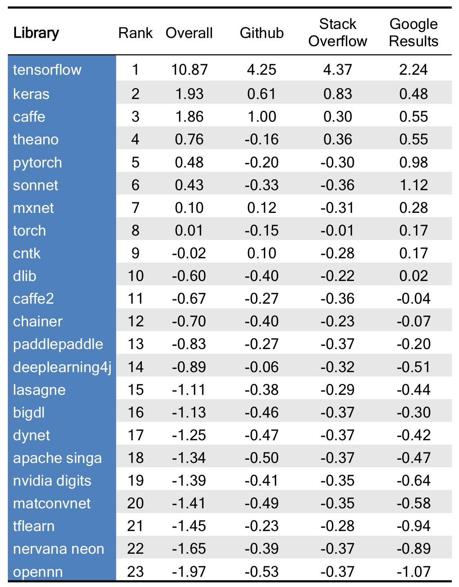
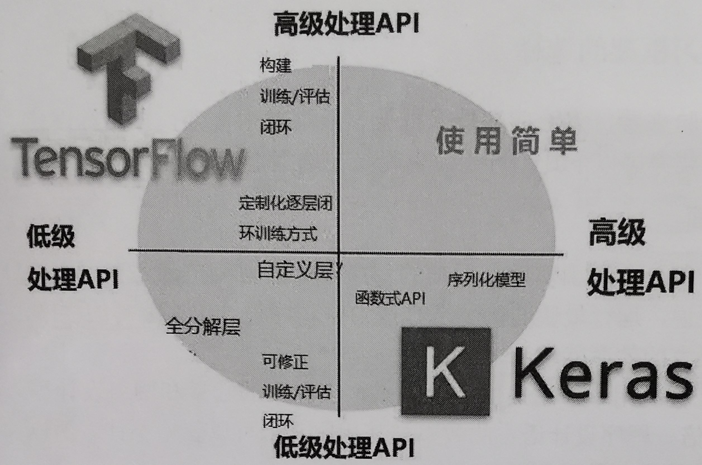

# TensorFlow 深度学习-开源

TensorFlow（TF）是基于数据流图进行数值计算的开源机器学习框架。由谷歌人工智能团队谷歌大脑（Google Brain）开发和维护，拥有包括TensorFlow Hub、TensorFlow Lite、TensorFlow Research Cloud在内的多个项目以及各类应用程序接口。

TensorFlow  命名基于工作原理，tensor 意为张量（即多维数组），flow 意为流动。即多维数组从数据流图一端流动到另一端。


对于所有开源项目, Github 上的五角星数量是衡量其流行度的重要途径。截至2019年3月，TensorFlow、Keras 、PyTorch 的星数分别为 123 000、39 100 和 25 800。可见，TensorFlow 和 Keras 分列一二位，而PyTorch 紧随其后。

## TensorFlow 网站

| TensorFlow官方 (Google)        | https://tensorflow.google.cn/                                |
| ------------------------------ | ------------------------------------------------------------ |
| TensorFlow lite官方 (Google)   | https://tensorflow.google.cn/lite/examples                   |
| TensorFlow lite 的官方中文网页 | https://www.tensorflow.org/lite/examples  里面很多教程，可以看看。 |
| TensorFlow 中文社区            | http://www.tensorfly.cn/                                     |

## TensorFlow 主要功能

- 适用于所有流行的编程语言,比如, Python、C++、Java、R 和  Go。
- Keras 作为高阶神经网络AAPI集成到了 TensorFlow 中(自2.0开始,Keras 成为与 TensorFlow 交互的标准 API)。该API指定了软件组件间的交互方式。
- TensorFlow 允许部署模型且易于在生产中使用。
- TensorFlow 2.0 在基于静态图的图计算基础上,增加了动态计算。
- 最重要的是,TensorFlow拥有非常好的社区支持。
- 灵活的体系结构允许使用单个 API 将计算部署到服务器或移动设备中的某个或多个 CPU 或 GPU。

## TensorFlow 各个版本的区别

tensorflow - 仅支持 CPU 的当前稳定版本（建议新手使用）

tensorflow-gpu - 支持 GPU 的当前稳定版本（Ubuntu 和 Windows）

tf-nightly - 仅支持 CPU 的每夜版（不稳定）

tf-nightly-gpu - 支持 GPU 的每夜版（不稳定，Ubuntu 和 Windows）

tf-nightly 中的 nightly 意为 nightly build，即每日构建自动编译的版本，最新版，不稳定版

## Tensorflow Mobile

TensorFlow Mobile是为Android和iOS等移动平台设计的深度学习解决方案。

## Tensorflow Lite

TensorFlow Lite 是 TensorFlow 针对移动和嵌入式设备的轻量级解决方案。它使设备上的机器学习预测具有低延迟和小的二进制大小。

TensorFlow Lite 是一种用于设备端推断的开源深度学习框架。

TensorFlow Lite 的目标是移动和嵌入式设备，它赋予了这些设备在终端本地运行机器学习模型的能力，从而不再需要向云端服务器发送数据。这样一来，不但节省了网络流量、减少了时间开销，而且还充分帮助用户保护自己的隐私和敏感信息。

TensorFlow Lite 是TensorFlow Mobile 的进化版。在大多数情况下，TensorFlow Lite 拥有跟小的二进制大小，更少的依赖以及更好的性能。

TensorFlow Lite 支持的 OP 比较有限，相比之下 TensorFlow Mobile 更加全面（例如风格迁移的一些 OP）。


## 深度学习库排名

The Data Incubator 2017年11月发布的【 23 个热门深度学习库排名】显示，Keras 是排名最高的非框架深度学习库。而随着 R Studio 发布 Keras 的界面，Keras 的流行度还会不断提高。



# TensorFlow 关键字

## resolver 解析器


## profiler 分析器

# TensorFlow 2.0

TensorFlow 2.0 的核心思想是使 TensorFlow 更易学易用。

TensorFlow 2.0 包含大量的改动。Keras 现在已经是 TensorFlow 的一部分。tf.keras 是 TensorFlow 对 Keras 的具体实现，使用它替换掉 Keras，可以更好地与其他 TensorFlow API（如，动态图 tf.data）集成。

TensorFlow 2.0 侧重于简单性和易用性，其中包含一些更新，例如即刻执行、直观的更高阶 API 以及可在任何平台上灵活建模的功能。

Eager excution 是一种更具 Python 风格的动态计算图处理方式。TensorFlow 2.0 开始支持 eager execution（与 Pytorch 一样）。你可以在 TensorFlow 2.0 与 tf.keras 中使用 eager execution 与 sessions。

## Tensorflow 与 Keras

- TensorFlow 和 Keras 都是深度学习框架。

- 相对于 Keras 来说，TensorFlow 比较灵活，但是难以入门。

- Keras 是基于 TensorFlow 和 Theano（由加拿大蒙特利尔大学开发的机器学习框架）的深度学习库，是由纯 python 编写而成的高层神经网络 API，也仅支持python开发。它是为了支持快速实践而对 tensorflow 或者 Theano 的再次封装，让我们可以不用关注过多的底层细节，能够把想法快速转换为结果。

- Keras 作为前端，TensorFlow 或 theano 作为后端。Keras 默认的后端为 TensorFlow，如果想要使用 theano 可以自行更改。

- TensorFlow 实质上是一个微分器，而 Keras 其实是使用 TensorFlow 与 Keras 的接口（Keras 作为前端，TensorFlow 作为后端）构建的深度学习框架。

- 目前 Keras 已经被 TensorFlow 收录，从 TensorFlow2.0 开始，Keras 已添加到 TensorFlow 中，成为其默认的框架，成为 TensorFlow 官方的高级 API。tf.keras 是 TensorFlow 对 Keras 的具体实现，使用它替换掉 Keras，可以更好地与其他 TensorFlow API（如，动态图 tf.data）集成。

- Keras 可以看作为 TensorFlow 封装后的一个 API。即 Keras 作为一个封装在 TensorFlow 中的接口，很容易被 TensorFlow 调用。

- Keras 是一个高级库，位于其他深度学习模型之上，Keras 支持 CPU、GPU、TPU。

  


# TensorFlow 安装

## 安装 CPU 版本

pip install tensorflow

pip install tensorflow==2.0.0-alpha0   // 安装 TensorFlow 2.0 版本

## 安装指定版本的 TensorFlow 1.14.0

pip install tensorflow==1.14.0

pip install tensorflow-gpu==2.0.0-alpha0 // 安装 TensorFlow 2.0 版本

## 安装 GPU 版本

pip install tensorflow-gpu


## 查询TensorFlow 版本

```bash
# python    或者# python3
>>> import tensorflow as tf
>>> tf.__version__
'1.14.0'
```


