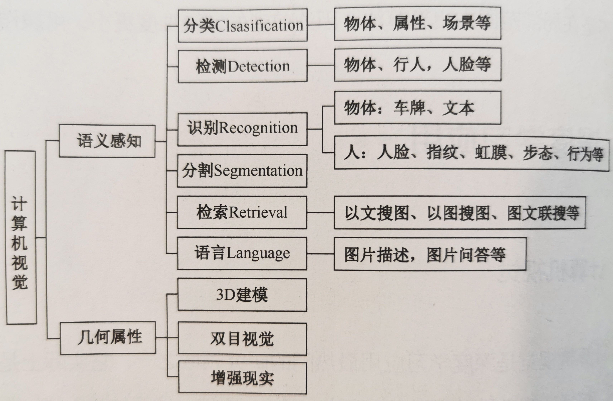
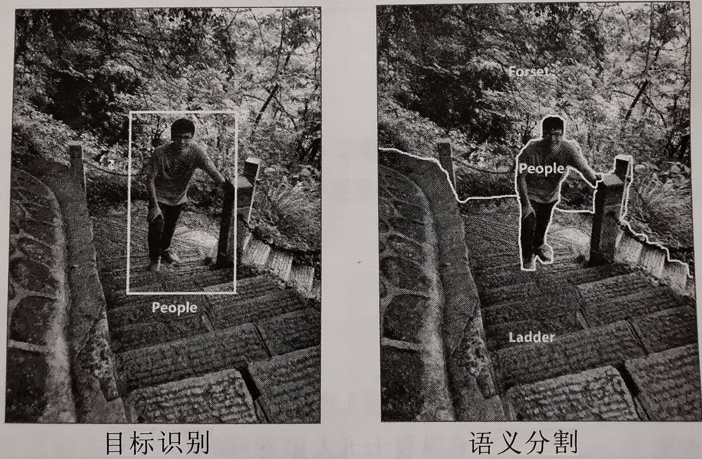
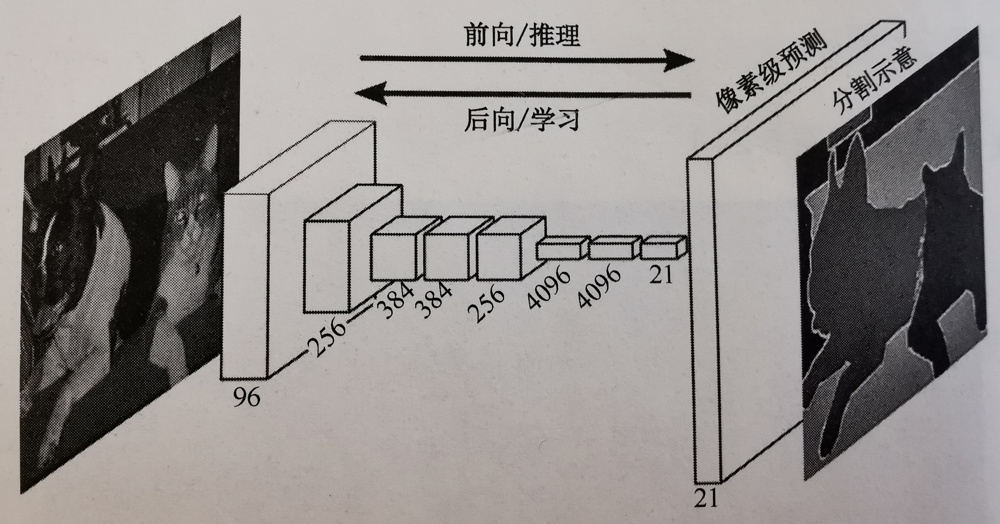
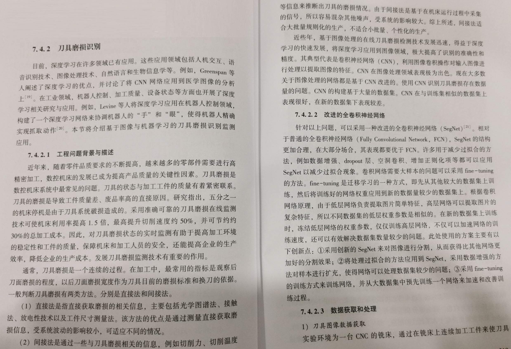
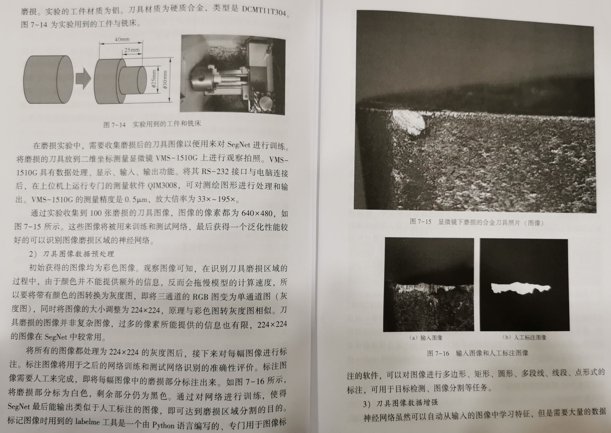
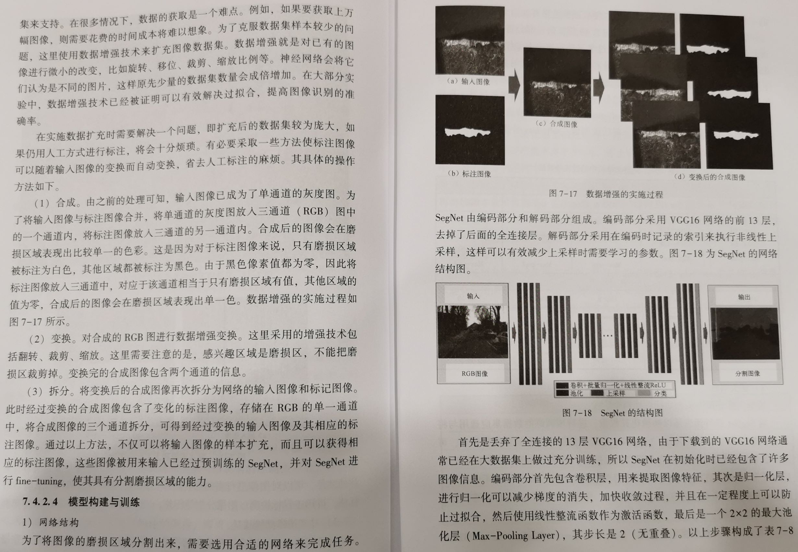
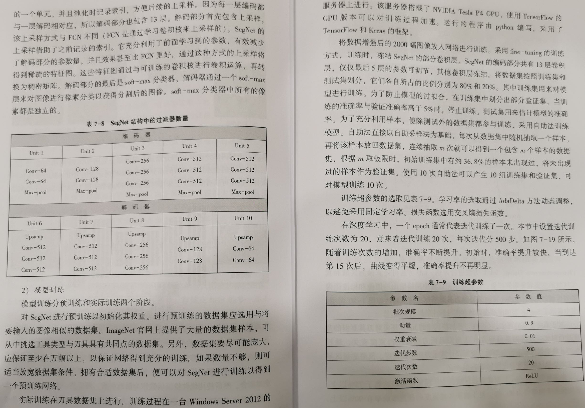
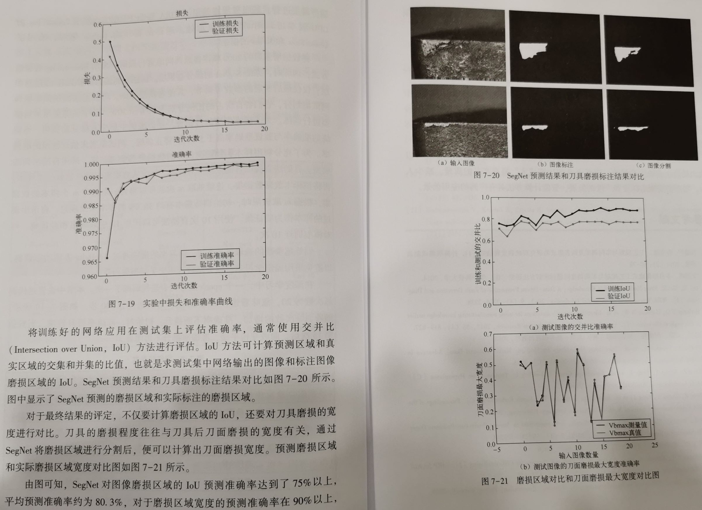

# Image Recognition 图像识别

# 计算机视觉领域

计算机视觉是深度学习应用最热门的研究领域之一。

计算机视觉是一个跨领域的交叉学科，包括计算机科学（图形、算法、理论、系统、体系结构）、数学（信息检索、机器学习）、工程学（机器人、语音、自然语言处理、图像处理）、物理学（光学）、生物学（神经科学）、心理学（认知科学）等。

计算机视觉具有两个主要研究维度：语义感知（Semantic）、几何属性（Geometry）。

计算机视觉的研究目标：解决 “像素值” 与 “语义” 之间的差距。 

## 图像增广

随机改变训练样本可以提高模型的泛化能力，降低模型对某些属性的依赖。例如，对图像进行不同方式的裁剪，可以使感兴趣的物体出现在不同位置，从而减轻模型对物体出现位置的依赖性。

也可以调整亮度、色彩等因素来降低模型对色彩的敏感度。

在当年 AlexNet 的成功中，图像增广功不可没。

## 图像分类

图像分类需要面临的几个挑战：视点变化、尺度变化、类内变化、图像变形、图像遮挡、照明条件、背景杂斑干扰等。

计算机视觉研究提出了一种基于数据驱动的方法，该方法不是直接在代码中指定每个感兴趣图像的类别。而是首先积累了一个带有标记图像的训练集，为每个图像类别提供许多示例，然后设计算法，查看这些示例，并学习每个类别的视觉外观。

具体步骤分解实现，如下：

- 输入是 N 个图像组成的训练集，共有 K 个类别，每个图像都被标记为其中一个类别。
- 使用该训练集训练一个分类器，来学习每个类别的外部特征。
- 预测一组新图像的类标签，评估分类器的性能，我们用分类器预测的类别标签与其真实的类别 标签进行比较。

基于深度神经网络的图像分类，算法实现的基本过程：

- 利用已有的大量数据集，首先构建出自己的深度神经网络。
- 然后，使用数据集中的训练集，对该网络进行训练，调节其中的权重和偏置值。
- 最后，使用该网络对数据集中的测试集进行测试，并计算分类准确率，以评测深度神经网络的图像分类性能。
- 实验方法：基于 Pycharm + Python3，利用 OpenCV 工具库，结合其自带的 Caffe 框架和 DNN 网络，实现对图像的分类应用。

## 对象检测

对图像中的特定对象进行识别，这一任务通常需要为各个检测到的对象绘制边界框、输出分类标签。

如果使用图像分类和定位图像这样的滑动窗口技术，则需要将神经网络应用于图像上的很多不同物体之上，这需要相当大的计算量。

为了解决这个问题，引入区域（region）这一概念，这样就会找到可能包含对象的 “斑点” 图像区域。采用这种方法，计算速度就会大大提高。例如基于区域的卷积神经网络（R-CNN）。

 R-CNN 算法原理：

- 在 R-CNN 中，首先使用选择性搜索算法扫描输入图像，寻找其中的可能对象，从而生成大约 2000 个区域建议。
- 建议在这些区域上运行一个卷积神经网络。
- 将每个卷积神经网络的输出传输给支持向量机（SVM），使用一个线性回归收紧对象的边界框。

## 目标识别和语义分割

目标识别 Object Recognition 和语义分割 Sematic Segmentation 是图像分类的升级版本。需要对一张图片中的多个物体进行分类和识别时，就需要用到目标识别和语义分割相关的算法。

图像的目标识别和语义分割有一个很大的区别：它们对图像中识别出的目标在结果呈现上有所不同。

- 目标识别会对识别出的类别对象，用长方形进行框选，并在框上打上标签名。

- 语义分割则会对识别出的类别，使用同一种像素进行标识，并打上标签。

  

计算机视觉是以分割为核心目标的，首先将整个图像分成一个个像素组，然后标记和分类。

语义分割试图在语义上理解图像中每个像素的角色。除了识别人、道路、树、汽车等之外，还必须确定每个物体的边界。

与分类不同，语义分割需要用模型对密集的像素进行预测。

卷积神经网络在分割任务上也取得了巨大的成功。其中，广为使用的实现方法之一：通过滑动窗口进行 “块” 分类。

- 利用每个像素周围的图像块，对每个像素分别进行分类。
- 但是，这种方法不能在重叠块之间重用共享特征，所以其计算效率非常低。

全卷积网络（FCN），可以较好地解决这一问题。

- 它提出了端到端的卷积神经网络体系结构。

  

- 可以在没有任何全连接层的情况下，进行密集预测。

- 这种方法允许针对任何尺寸的图像生成分割映射，并且比块分类算法快得多。

- 几乎后续所有的语义分割算法都采用了这种范式。

- 另外，由于原始图像分辨率上进行卷积运算效率较低，因此 FCN 在网络内部使用了下采样和上采样技术，构建图像的下采样层和上采样层，对图像分辨率进行了调整。

  - 下采样层，称为条纹卷积（striped convolution）
  - 上采样层，称为反卷积（transposed convolution）
  - 尽管采用了上采样层和下采样层，但由于池化期间的信息丢失，FCN 会生成比较粗糙的分割映射。

SegNet 是一种比 FCN 更高效的内存架构，该架构使用最大池化和编码解码框架，在 SegNet 解码技术中，从更高分辨率的特征映射中引入了 shortcut/skip connections，从而改善上采样和下采样后的粗糙分割映射。

## 实例分割

除了语义分割外，实例分割将不同类型的实例进行分类。例如，用 5 种不同颜色来标记 5 辆汽车。

分类任务就是识别出包含单个对象的图像是什么，但在分割实例时，一般需要执行更复杂的任务。

当在图像中看到多个重叠物体和不同背景的复杂景象时，不仅需要将这些不同的对象进行分类，而且还要确定对象的边界、差异和彼此之间的关系。

## 目标跟踪

目标跟踪，是指在特定场景对某一个或多个特定感兴趣对象进行跟踪的过程。

目前，目标跟踪在无人驾驶领域发挥着重要作用。

根据观察模型的不同，目标跟踪算法，可以分为 2 类：生成算法、判别算法。

- 生成算法
  - 使用生成模型来描述表观特征，同时本着使重建误差最小化的目的，来搜索跟踪目标，如比较经典的主成分分析算法（PCA）。
- 判别算法
  - 判别算法也称为 Tracking-by-Detection 算法，深度学习可以归类为这一算法。
  - 判别用来区分物体和背景时，其性能更稳定。
  - 逐渐成为跟踪对象的主要手段。

## 视频行为识别

海量的视频被分享到互联网上，需要一种通用视频描述符，需要有以下几个属性：

- 通用性：可以表示不同类型的视频，同时具有可区分性。
- 紧凑性：由于需要处理数百万条的视频，一个紧凑的描述符有助于处理、存储、检索任务，更具可扩展性。
- 计算高效性：因为在现实世界中，每一分钟都需要处理成千上万的视频。
- 实现简单：不使用复杂的特征编码方法和分类器，一个好的描述符即使是一个简单的模型（如线性分类器），也能很好地工作。

基于深度学习的视频行为识别实验：

- 在 Anaconda + Python3 平台下，利用 OpenCV 工具库，结合其自带的 PyTorch 框架，和用于视频识别的 C3D 卷积神经网络模型，基于 UCF101 数据集完成对视频行为识别的任务。

### C3D 模型

在图像领域，各种预训练卷积网络（ConvNets）模型可用于提取图像特征。这些特征是网络最后几个全连接层的激活值，在迁移学习任务中表现良好。但是，由于缺少运动建模，这些基于图像的深度特征，并不直接适用于视频。

深度 3D ConvNet 模型可以用来学习时空特征。经验表明，模型学习的特征与简单的线性分类器。在各种视频分析任务中效果良好，在大规模有监督训练集和现代深度学习框架的背景下，利用 3D ConvNet，在不同的视频分析任务中，可以得到很好的性能。

3D ConvNet 提取的特征封装了视频 中与目标、场景、动作有关的信息，使得这些特征对不同的任务都很有用，而不需要对每个任务都微调模型。C3D 是很好的视频描述符。

其他适用于视频内容特征提取的模型，还有 R3D、R2Plus1D 等。

### UCF101 数据集

UCF101 数据集是经常使用的视频序列行为数据库，常用来进行视频序列中的行为识别。

数据集包含来源于 YouTube 的 13320 个短视频，分辨率为 320 x 240 像素。

视频中行为动作主要包括 5 大类、101 小类：人和物体交互、只有肢体动作、人与人交互、玩音乐器材、各类运动。每一类由 25 个人做动作，每个人做 4~ 7 组。

# 计算机视觉的深度学习应用：人脸识别

人脸识别相关应用包括：手机屏蔽解锁、脸部 ID 支付、门禁单机、企业考勤、金融开户等。

人脸识别可以对人的眉毛、眼睛、鼻子、嘴巴以及轮廓等关键点进行检测。

在解锁或支付过程中，找到眼睛的关键点后可以识别眼睛是否为睁开状态，如果是闭着眼睛就不能解锁手机屏蔽。

人脸识别还可以识别被检测者的大概年龄、性别、种族、表情情绪、是否戴眼镜、以及当前的头部姿态等特征。

# 计算机视觉的深度学习应用：动作识别

## 人体姿态估计

## 图像生成

# 计算机视觉的其他深度学习应用 

## 图像风格迁移（Neural Style）

深度学习方法能够提取图像的重要特征，图像风格迁移就是将提取的这些特征迁移到其他图片中进行融合，这样就可以生成混合其他图片风格的新图片。

# 计算机视觉的深度学习案例

## 刀具磨损识别

