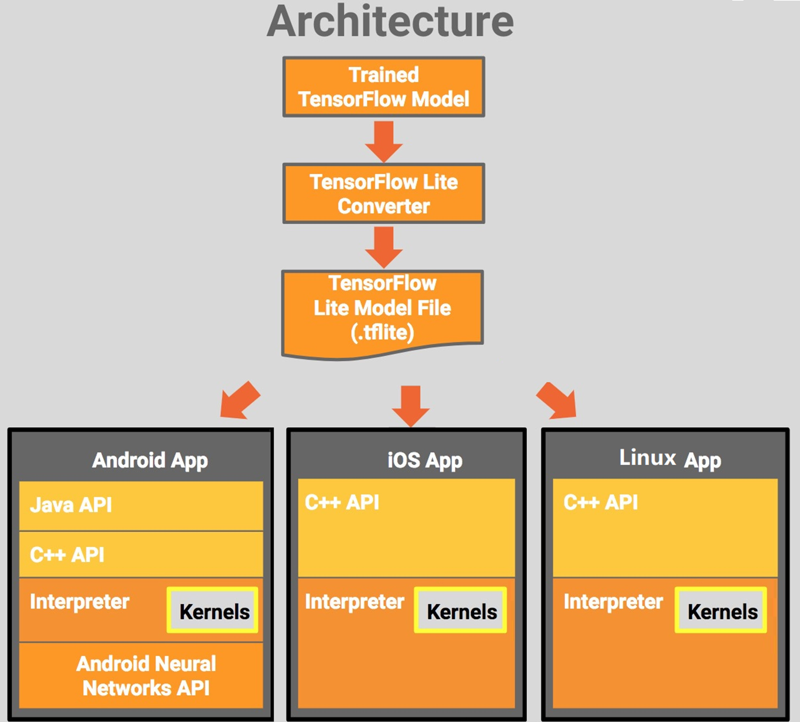

# TensorFlow Lite 深度学习-开源-嵌入式

TensorFlow Lite 是 TensorFlow 针对移动和嵌入式设备的轻量级解决方案。它使设备上的机器学习预测具有低延迟和小的二进制大小。

TensorFlow Lite 是一种用于设备端推断的开源深度学习框架。

TensorFlow Lite 的目标是移动和嵌入式设备，它赋予了这些设备在终端本地运行机器学习模型的能力，从而不再需要向云端服务器发送数据。这样一来，不但节省了网络流量、减少了时间开销，而且还充分帮助用户保护自己的隐私和敏感信息。

- TensorFlow Lite支持一系列数量化和浮点的核心运算符，这些核心运算符已针对移动平台进行了优化。它们结合pre-fused激活和偏差来进一步提高性能和量化精度。此外，TensorFlow Lite还支持在模型中使用自定义操作。
- TensorFlow Lite定义了一个新的模型文件格式，基于FlatBuffers。 FlatBuffers是一个开源的高效的跨平台序列化库。它与协议缓冲区类似，但主要区别在于，FlatBuffers在访问数据之前不需要解析/解包步骤到二级表示，通常与per-object内存分配结合使用。此外，FlatBuffers的代码尺寸比协议缓冲区小一个数量级。
- TensorFlow Lite定义了一个新的模型文件格式，基于FlatBuffers。 FlatBuffers是一个开源的高效的跨平台序列化库。它与协议缓冲区类似，但主要区别在于，FlatBuffers在访问数据之前不需要解析/解包步骤到二级表示，通常与per-object内存分配结合使用。此外，FlatBuffers的代码尺寸比协议缓冲区小一个数量级。
- TensorFlow转换器将TensorFlow-trained模型转换为TensorFlow Lite格式。
- 规模较小：当所有支持的操作符链接时，TensorFlow Lite小于300KB，而仅使用支持InceptionV3和Mobilenet所需的操作符时，TensorFlow Lite小于200KB。
- 

## TensorFlow Lite 网站

| TensorFlow lite官方 (Google)   | https://tensorflow.google.cn/lite/examples                   |
| ------------------------------ | ------------------------------------------------------------ |
| TensorFlow lite 的官方中文网页 | https://www.tensorflow.org/lite/examples  里面很多教程，可以看看。 |
|                                |                                                              |

## TensorFlow Lite 组件、架构

**组件包括**

- TensorFlow 模型（TensorFlow Model）：训练后的 TensorFlow 模型，保存在磁盘中。
- TensorFlow Lite 转换器（TensorFlow Lite Converter）：该程序将模型转换成 TensorFlow Lite 文件格式。
- TensorFlow Lite 模型文件（TensorFlow Lite Model File）：该格式基于 FlatBuffers，经过优化以适应最大速度和最小规模。




## TensorFlow Lite 流程


### TensorFlow Lite模型使用通用流程（以CPM算法为例）

https://blog.csdn.net/weixin_42499236/article/details/102888565


# TensorFlow Lite 预训练的模型

ensorFlow Lite 团队提供了一系列预训练模型（pre-trained models），用于解决各种机器学习问题。这些模型已经转换为能与 TensorFlow Lite 一起使用，且可以在您的应用程序中使用的模型。

这些预训练模型包括：

- [图像分类（Image classification）](https://tensorflow.google.cn/lite/models/image_classification/overview)
- [物体检测（Object detection）](https://tensorflow.google.cn/lite/models/object_detection/overview)
- [智能回复（Smart reply）](https://tensorflow.google.cn/lite/models/smart_reply/overview)
- [姿态估计（Pose estimation）](https://tensorflow.google.cn/lite/models/pose_estimation/overview)
- [语义分割（Segmentation）](https://tensorflow.google.cn/lite/models/segmentation/overview)
- 在[模型列表（Models）](https://tensorflow.google.cn/lite/models)中查看预训练模型的完整列表。
- 可以在许多其他地方得到预训练的 TensorFlow 模型，包括 [TensorFlow Hub](https://tensorflow.google.cn/hub)。在大多数情况下，这些模型不会以 TensorFlow Lite 格式提供，您必须在使用前[转换（convert）](https://tensorflow.google.cn/lite/guide/get_started#2_convert_the_model_format)这些模型。
- 重新训练模型（迁移学习 transfer learning）
  - 迁移学习（transfer learning）允许您采用训练好的模型并重新（re-train）训练，以执行其他任务。例如，一个[图像分类](https://tensorflow.google.cn/lite/models/image_classification/overview)模型可以重新训练以识别新的图像类别。与从头开始训练模型相比，重新训练花费的时间更少，所需的数据更少。
  - 您可以使用迁移学习，根据您的应用程序定制预训练模型。在[用 TensorFlow 识别花朵](https://developers.google.cn/codelabs/codelabs/recognize-flowers-with-tensorflow-on-android)的 codelab 中，您可以学习如何进行迁移学习。

TensorFlow Lite 已经支持多个面向移动端训练和优化的模型：

- MobileNet：一种能够识别超过 1000 种不同物体的视觉模型，专为移动端和嵌入式设备设计；
- Inception V3：一种图像识别模型，功能上类似于 MobileNet，但能提供更高的准确率（当然模型也更大）；
- Smart Reply：一种设备端对话模型（自然语言处理），能对接收到的会话聊天信息提供触发性应答。第一方和第三方通信 App 可在 Android Wear 上使用该特性。

Inception v3 和 MobileNet 都在 ImageNet 数据集上训练过，你可以通过迁移学习轻松地在自己的图像数据集上重新训练这些模型。


## 查看模型参数：minimal

### minimal.cc

// This is an example that is minimal to read a model

// from disk and perform inference. There is no data being loaded

// that is up to you to add as a user.

```c++
/* Copyright 2018 The TensorFlow Authors. All Rights Reserved.

Licensed under the Apache License, Version 2.0 (the "License");
you may not use this file except in compliance with the License.
You may obtain a copy of the License at

    http://www.apache.org/licenses/LICENSE-2.0

Unless required by applicable law or agreed to in writing, software
distributed under the License is distributed on an "AS IS" BASIS,
WITHOUT WARRANTIES OR CONDITIONS OF ANY KIND, either express or implied.
See the License for the specific language governing permissions and
limitations under the License.
==============================================================================*/
#include <cstdio>
#include "tensorflow/lite/interpreter.h"
#include "tensorflow/lite/kernels/register.h"
#include "tensorflow/lite/model.h"
#include "tensorflow/lite/optional_debug_tools.h"

// This is an example that is minimal to read a model
// from disk and perform inference. There is no data being loaded
// that is up to you to add as a user.
//
// NOTE: Do not add any dependencies to this that cannot be built with
// the minimal makefile. This example must remain trivial to build with
// the minimal build tool.
//
// Usage: minimal <tflite model>

using namespace tflite;

#define TFLITE_MINIMAL_CHECK(x)                              \
  if (!(x)) {                                                \
    fprintf(stderr, "Error at %s:%d\n", __FILE__, __LINE__); \
    exit(1);                                                 \
  }

int main(int argc, char* argv[]) {
  if (argc != 2) {
    fprintf(stderr, "minimal <tflite model>\n");
    return 1;
  }
  const char* filename = argv[1];

  // Load model
  std::unique_ptr<tflite::FlatBufferModel> model =
      tflite::FlatBufferModel::BuildFromFile(filename);
  TFLITE_MINIMAL_CHECK(model != nullptr);

  // Build the interpreter
  tflite::ops::builtin::BuiltinOpResolver resolver;
  InterpreterBuilder builder(*model, resolver);
  std::unique_ptr<Interpreter> interpreter;
  builder(&interpreter);
  TFLITE_MINIMAL_CHECK(interpreter != nullptr);

  // Allocate tensor buffers.
  TFLITE_MINIMAL_CHECK(interpreter->AllocateTensors() == kTfLiteOk);
  printf("=== Pre-invoke Interpreter State ===\n");
  tflite::PrintInterpreterState(interpreter.get());

  // Fill input buffers
  // TODO(user): Insert code to fill input tensors

  // Run inference
  TFLITE_MINIMAL_CHECK(interpreter->Invoke() == kTfLiteOk);
  printf("\n\n=== Post-invoke Interpreter State ===\n");
  tflite::PrintInterpreterState(interpreter.get());

  // Read output buffers
  // TODO(user): Insert getting data out code.

  return 0;
}
```

### i.MX8M Mini 运行： ./minimal mobilenet_quant_v1_224.tflite

## 图像分类：label_image

### label_image

TensorFlow Lite C++ image classification demo.

This example shows how you can load a pre-trained and converted.

TensorFlow Lite model and use it to recognize objects in images.

### label_image 代码分析

主要函数说明：

| 作 用            | 函数方法                                                     |      |
| ---------------- | ------------------------------------------------------------ | ---- |
| 加载tflite模型   | tflite::FlatBufferModel::BuildFromFile(filename)             |      |
| 生成resolver     | tflite::ops::builtin::BuiltinOpResolver  resolver;           |      |
| 创建interpreter  | std::unique_ptr<tflite::Interpreter>interpreter;             |      |
| 生成interpreter  | tflite::InterpreterBuilder(*model,  resolver)(&interpreter); |      |
| 加载所有tensor   | interpreter->AllocateTensors();                              |      |
| 取出输入tensor   | float* input =  interpreter->typed_input_tensor(0);          |      |
| 调用模型进行推理 | interpreter->Invoke();                                       |      |
| 取出输出tensor   | float* output =  interpreter->typed_output_tensor(0);        |      |

输入命令：./label_image -v 1 -m ./mobilenet_quant_v1_224.tflite -i ./picture.bmp -l ./labels.txt


| 输入命令                           | 描述                                           |      |
| ---------------------------------- | ---------------------------------------------- | ---- |
| -v 1                               | s.verbose = 1                                  |      |
| -m ./mobilenet_quant_v1_224.tflite | s.model_name = ./mobilenet_quant_v1_224.tflite |      |
| -i ./picture.bmp                   | s.input_bmp_name = ./picture.bmp               |      |
| -l ./labels.txt                    | s.labels_file_name = ./labels.txt              |      |


### i.MX8M Mini 运行： label_image 图像分类 


## Inception V3

- Inception V3是一种流行的模型，用于检测图像中存在的主要对象。

##  MobileNet模型

- MobileNetsmobile-first系列计算机视觉模型，旨在有效提高准确性，同时注意on-device或嵌入式应用程序的受限资源。它们很小，低延迟，低功耗，模型参数化，以满足各种用例的资源约束。它们可以建立在分类，检测，嵌入和分割之上。 MobileNet模型比较小，但是比Inception V3准确度较低。

- MobileNet模型的量化版本，其运行速度比CPU上的non-quantized(浮点)版本快。
