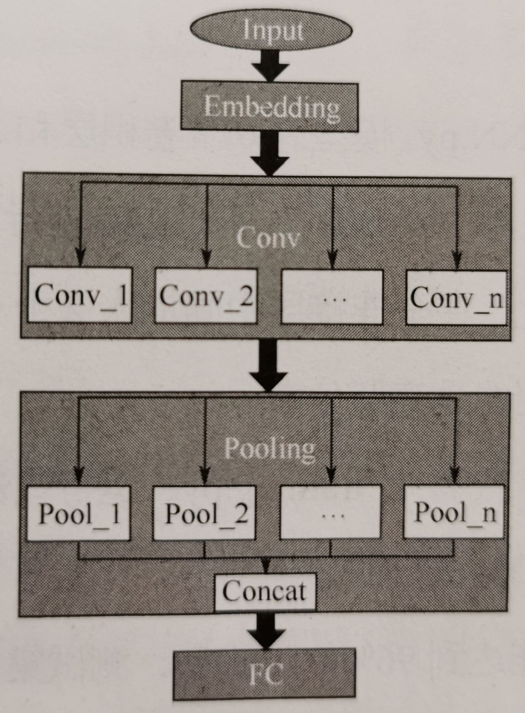

# Speech Recognition 语音识别

语音识别是信息社会朝着智能化和自动化发展的关键技术，也是信息技术中人机接口的关键技术。还可以和其他自然语言处理技术 （如机器翻译及语音合成技术）结合，构建更加复杂的应用。

由于人们的声音不像指纹那样独特和唯一，与指纹识别系统相比，语音识别系统有着更高的误识率。系统需要协同处理器和比指纹系统更多的效能，才能更好进行快速傅里叶变换计算。

## 语音的特点

语音识别应用领域的不断扩大，要求放宽对小词汇表、特定人、孤立词等这些对语音识别的约束条件，这了出现许多新的问题，导致原有的模板匹配方法不再适用。

- 模板的选取和建立，由于词汇表的不断扩大而变得更加复杂。
- 人们在实际情况下的自然对话，生成的都是连续的语音，语音中各个音素、音节及词之间没有明确的界限，前一个音可能会受到前后相邻语音的影响而发生微小的变化，导致计算机无法进行准确辨别。
- 每个人说相同的话的效果是完全不同的，即使是同一个人，在不同时期、不同的生理、心理状态下也都无法说出相同的话。
- 背景噪声或其他干扰影响语音的识别。

语言识别系统根据不同的分类方式，将输入语音的限制分为以下几类：

- 说话者与识别系统的相关性。
  - 特定人语音识别系统，仅识别专人的语音。
  - 非特定人语音系统，所能够识别的语音与人无关，识别系统需要学习大量不同人的语音数据库。
  - 多人的识别系统，能识别一组人的语音。
- 说话的方式。
  - 孤立词识别系统，要求输入每个词后要停顿一下。
  - 连接词输入系统，要求对每个词都清楚发音，但可能会出现一些连音现象。
  - 连续语音识别系统，当输入是自然流利的连续语音输入时，大量连音和娈音出现时，需要此类系统。
- 识别系统的词汇量大小
  - 根据识别系统的词汇量大小，可将系统分为小词汇量、中等词汇量、大词汇量语音识别系统。

# 语音识别核心技术

隐马尔科夫模型（Hidden Markov Model，HMM）的应用是语音识别技术领域的重大突破。首先，由 Baum 提出相关的数学推理。然后， Labiner 等人进行了不断的深入研究。最后，卡内基梅隆大学的李开复实现了 Sphinx，这是一个基于隐马尔科夫模型的非特定人、大词汇量、连续语音识别系统。

目前，主流的大词汇量语音识别系统，多采用统计模型识别技术。典型的基于统计模型识别方法的语音系统，由 5 个基本模块构成：

- 信号处理及特征提取模块。模块从输入信号中提取可供声学模型处理的特征，利用一些信号处理技术降低环境噪声、信道、说话人等因素的影响。
- 统计声学模型。典型系统多采用基于一阶隐马尔科夫模型进行建模。
- 发音词典。发间词典包含系统所能处理的词汇集及其发音。发音词典实际提供了声学模型建模单元与语言模型建模单元之间的映射。
- 语言模型。语言模型对系统所针对的语言进行建模，目前各种系统普遍采用的，还是基于统计的 N 元文法及其变体。
- 解码器。根据声学、语言模型、词典，寻找能够以最大概率输出该输入信号的词串。

1987 年由 Alexander Waibel 等提出的时间延迟网络（Time Delay Neural Network, TDNN）。
TDNN是一个应用于语音识别问题的卷积神经网络，使用FFT预处理的语音信号作为输入，其隐含层由2个一维卷积核组成，以提取频率域上的平移不变特征。由于在TDNN出现之前，人工智能领域在反向传播算法（Back-Propagation, BP）的研究中取得了突破性进展，因此TDNN得以使用BP框架内进行学习。TDNN的表现超过了同等条件下的隐马尔可夫模型（Hidden Markov Model, HMM），而后者是二十世纪80年代语音识别的主流算法。

## 语音识别方法

### 基于语音学和声学

通常将语言理解为由有限个不同的语音基元组成的整体，可以利用其语音信号的频域或时域特性，通过两步来区分：

- 第一步，分段和标号。
  - 首先，把语音信号以时间为基准分成离散的段，不同段具有不同语音基元的声学特性。
  - 然后，根据相应声学特性将每个分段进行相近的语音标号。
- 第二步，得到词序列。将得到的语音标号系列转化成一个语音基元网格，从词典查询有效的词序列，或结合句子的文法和语义同时进行。

### 模板匹配

模板匹配已经进入实用阶段。

模板匹配方法会经历四个主要步骤：特征提取 --> 模板训练 --> 模板分类 --> 判决。

常用的技术有三种：

- 动态时间规整（DTW）。
  - 实际中，不同人的语速不同，需要进行对比的两段时间序列可能并不等长，所以语音信号具有相当大的随机性。
  - 语音信号端点检测是特征训练和识别的基础，就是定位语音信号中的各种段落始点和终点的位置，并从语音信号中排除无声段。
  - 在早期，主要根据能量、振幅、和过零点来进行端点检测，但效果不好。
  - 故出现了动态时间规整算法，可以把未知量均匀地延长或缩短至与参考模式一致的长度，对未知量进行相对优化，实现与模型特征对正的目的。
- 隐马尔可夫法（HMM）。
  - 隐马尔科夫模型是马尔可夫链的一种，是一种能通过观测向量序列观察到的统计分析模型。
  - 语音识别技术中应用的隐马尔可夫模型，通常是自左向右单向、带自环、带跨越的拓扑结构，大多数大词汇量、连续语音、非特定人语音误别系统，都是以隐马尔可夫模型为基础展开的。
  - 一个音素就是 3 ~ 5 个状态的 HMM，一个词就是由多个音素组成的，对语音信号的时间序列结构建立统计模型，将其看作一个数学上的双重随机过程。
- 矢量量化（Vector Quantization，VQ）。
  - VQ 是一种重要的信号 压缩方法。
  - 矢量量化主要适用于小词汇量、孤立词的语音识别。
  - 其过程：将语音信号波形的 k 个样点的每一帧，或有 k 个参数的每一参数帧，构成 k 维空间中的一个矢量，然后对矢量进行量化。量化时，将 k 维无限空间划分为 M 个区域边界，然后将输入矢量与这些边界进行比较，将被量化为 “距离” 最小的区域边界的中心矢量值。

### 神经网络

可以将神经网络看作一个能够模拟人类神经活动的自适应非线性动力学系统。

## 基于统计的完整语音识别系统

基于统计的完整语音识别系统大致分为以下三个部分。

### 语音信号预处理与特征提取

语音识别研究的第一步，是对单元的选择识别。

语音识别单元分为三种：单词（句）、音节、音素。针对不同的研究任务，需要选择不同的语音识别单元。

- 单词（句）单元的模型库很宠大，训练模型任务也很重。所以这种单元更适合中小词汇语音识别系统，并不适合大词汇系统。
- 音节单元，广泛应用于汉语语音识别系统，汉语是单音节结构的语言，在不考虑声调的情况下，汉语大概只有 408 个无调音节。所以，以音节为识别单元更适合中、大词汇量汉语语音识别系统。
- 音素单元，英语语音识别系统的研究多以音素为单元，越来越多的中、大词汇量汉语语音识别系统也在采用音素单元。音素单元受到协同发音的影响而不稳定，还有需要解决。

如何合理地选用特征是语音识别的一个根本性问题。分析处理语音信号、去掉与语音识别无关的冗余信息，在压缩语音信号时，获得影响语言识别的重要信息是提取特征参数的关键。

线性预测（LP）分析技术是目前广泛应用的特征参数提取技术，以 LP 技术为基础提取的倒谱参数已成功应用于许多系统。

线性预测的缺点是没有考虑人类听觉系统对语音的处理特点，它只是一个纯数学模型。

目前，考虑了人类发声与接收声音的特性，梅尔刻度式倒频谱参数具有更好的鲁棒性（Robustness）。

### 声学模型与模式匹配

声学模型是将获取的语音特征通过训练算法进行训练后产生的。将输入的语音特征同声学模型（模式）进行匹配与比较，以得到最佳的识别结果。

声学模型是识别系统的底层模型，它也可提供一种有效的方法计算语音的特征矢量序列和每个发音模板之间的距离。

声学模型的设计与语言发音特点之间有着紧密的联系。声学模型单元大小（字发音模型、半音节模型、音素模型）影响着语音训练数据量大小、系统识别率、灵活性。识别单元的大小取决于不同语言的特点和识别系统词汇量的大小。

基于统计的语音识别模型常用的就是 HMM 模型，涉及 HMM 模型的相关理论包括：模型的结构选取、模型的初始化、模型参数的重估、相应的识别算法等。

### 语言模型与语言处理

语言模型包括由识别语音命令构成的语法网络，或由统计方法构成的语言模型，可以对语言进行语法、语义分析。

语言模型可以根据语言学模型、语法结构、语义学来判断和纠正分类发生错误时产生的问题，尤其是通过上下文结构才能确定词义的同音字。

目前，比较成功的语言模型通常是采用统计语法的语言模型、基于规则语法结构命令的语言模型。

语法结构可以通过对不同词之间的相互连接关系进行限定，以此减少识别系统的搜索空间，从而提高识别性能。

## 基于神经网络的语音识别系统

自然语言处理所采用的核心技术，正在从统计方法转变为神经网络方法。

事实上，一个单一的深度学习模型可以学习词义，并执行语言任务，从而降低了对传统的基于专业人士处理方法的依赖。

自然语言处理的任务有很多，如文本分类、语言建模、语音识别、字幕生成等。

语言处理中的文本分类应用中，自然语言处理任务一般以文本的形式出现，CNN 卷积神经网络在文本分类上的表现比 RNN 更为出色，又因为 RNN 模型的训练时间普遍较长，所以，使用 CNN 做文本分类是更明智的选择。

### CNN 卷积神经网络处理文本（分类）

但对于语言处理中的文本分类应用中，自然语言处理任务一般以文本的形式出现，CNN 卷积神经网络在文本分类上的表现比 RNN 更为出色，又因为 RNN 模型的训练时间普遍较长，所以，使用 CNN 做文本分类是更明智的选择。

CNN 卷积神经网络处理文本（分类）的算法流程：

基于 CNN 卷积神经网络的文本分类的实现流程，可以分为 4 个步骤：

- 数据处理
  - 分词。例如，“今天天气很好。” 对句子进行分词后，我们得到 “今天、天气、很好”。
  - Word Embedding。分词之后，建立词汇表，每一个词可用索引数字化为 one-hot 向量。但这样一来，词汇变量维度与词汇量相等，显然维度太高且太稀疏了。Word Embedding 可以将词汇向量化较小的固定的维度，起来降维作用。目前常用的就是 Word2Vec 方法。
- 卷积
  - 经过 Embedding 的一个句子，实际上形成了一个矩阵。例如 “今天、天气、很好” 可转化为 3 x n 的矩阵， n 为 Embedding 大小。
  - 与图像处理的二维卷积不同，文本处理使用一维卷积，因为矩阵的每一行代表一个分词，截断分词没有数学意义，故卷积核的长度恒等于 n。
- 池化
  - 采用最大池化，选取卷积运算后的最强特征。
  - 池化可以自适应输入宽度，从而将不同长度的输入转化为统一长度的输出。
- 全连接和分类
  - 经池化后的数据按深度方向拼接成一个向量后，提供给全连接层，经 softmax 激活后输出最终结果。

CNN 卷积神经网络处理文本（分类）的实验：

- 可以使用 AG' s news corpus 数据集，这是一个由 2000 个数据源和 496835 种类型的新闻组成的数据集。

# 自然语言处理领域

自然语言处理所采用的核心技术，正在从统计方法转变为神经网络方法。

事实上，一个单一的深度学习模型可以学习词义，并执行语言任务，从而降低了对传统的基于专业人士处理方法的依赖。

自然语言处理技术已经不断渗透并应于互联网垂直领域，如文本分类、问答系统、翻译系统、语言建模、语音识别、字幕生成等。

深度学习处理自然语言任务可以避免传统算法对特征的重度依赖性，准确度也高。作为深度学习领域两大阵营的 CNN 和 RNN 各具特色。一般来说，CNN 适用于空间任务（如图像），RNN 适用于时序任务（如语音）。但，语言处理中的文本分类应用中，自然语言处理任务一般以文本的形式出现，CNN 卷积神经网络在文本分类上的表现比 RNN 更为出色，又因为 RNN 模型的训练时间普遍较长，所以，使用 CNN 做文本分类是更明智的选择。

## 智能音箱：语音识别、语音合成

## 机器翻译

## 手机语音助手

## 语音输入法、同声传译

# 语音识别的应用

人们能够在语音识别技术、语音合成技术的强强联合的帮助下，更加便捷地获取和处理信息，提高人们的效率。

目前，语音识别系统还不适合以电池为电源。

例如，你可能会向谷歌 Home 这样的数字助理提出“奥斯汀最好的早餐玉米卷饼在哪儿”等问题。

这种询问会引发算法的连锁反应：

- 一个算法将原始声波转化成数字信号。
- 另一个算法将这个信号转化成一串英语音素，即独特的听觉感知：“brek-fust-tah-koze”。
- 下一个算法将这些音素划分成词语：“breakfast tacos”。
- 这些词语被发送到搜索引擎－搜索引擎本身就是海量算法的集合，可以处理查询，做出回答。
- 另一个算法将这种回答转化成清晰的英语句子。
- 最后一个算法以听上去不像机器人的方式表述这个句子：“奥斯丁最好的早餐玉米卷饼在杜瓦尔街的胡里奥餐厅。您需要导航吗？”

# 百度语音识别平台

实现文本信息转换为语音信息的过程。将声音转化成文字，让应用长上耳朵。

