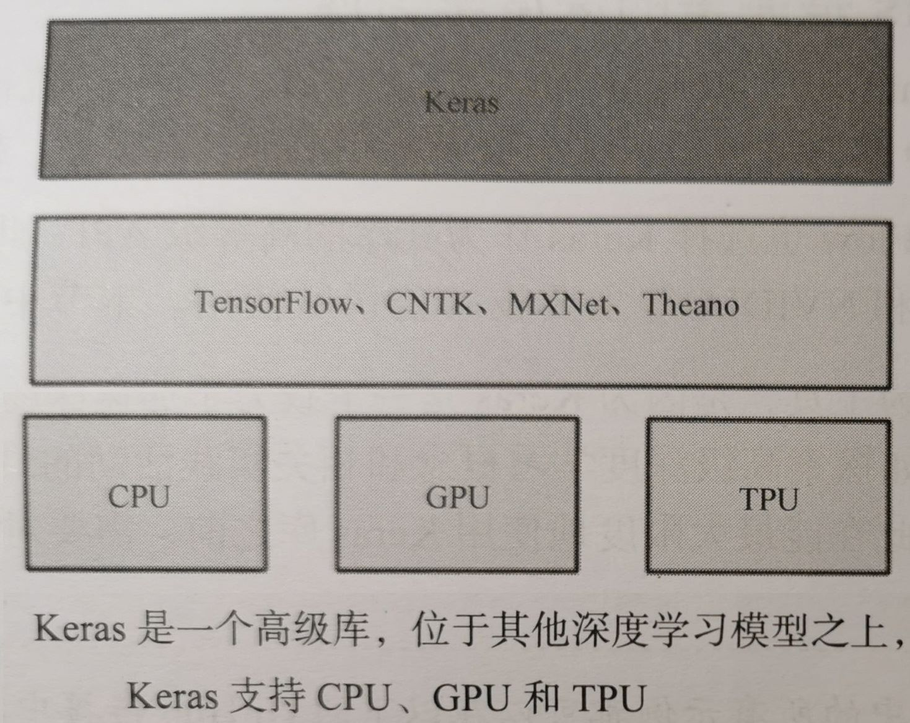
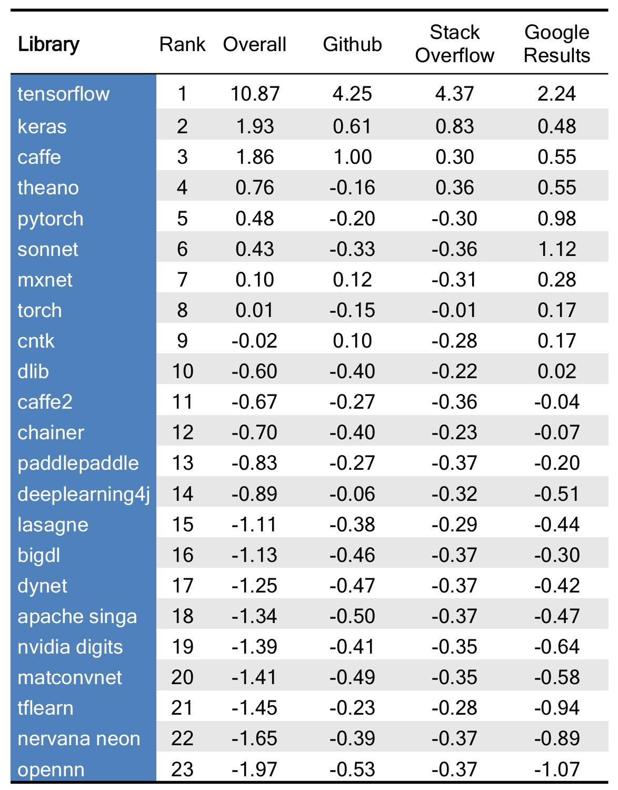

# Keras 深度学习：开源高层深度学习API

Keras 是 2015 年，一个由 Python 编写的开源深度学习人工神经网络库，可以作为 Google Tensorflow、Microsoft CNTK、Amazon MxNet 和 Theano 的高阶应用程序接口，进行深度学习模型的设计、调试、评估、应用和可视化。

Keras 的命名来自古希腊语，含义为将梦境化为现实的 “牛角之门”。

Keras 最核心的数据结构就是模型。Keras 提供的序列模型能够依次叠加想要的层。

Keras 以 TensorFlow、Theano、CNTK 作为后端引擎运行，提供直观而简洁的 API，开发者不需要了解这些复杂的内部引擎，就可以在各自领域轻松使用和开发深度学习模型。

Keras 的主要开发者是谷歌工程师 François Chollet，此外其 GitHub 项目页面包含 6 名主要维护者和超过 800 名直接贡献者。
Keras在其正式版本公开后，除部分预编译模型外，按MIT许可证开放源代码。

2017 年起，Keras 得到了 Tensorflow 团队的支持，其大部分组件被整合至 Tensorflow 的 Python API 中。
在 2018 年 Tensorflow 2.0.0 公开后，Keras 被正式确立为 Tensorflow 高阶 API，即 tf.keras。
此外，自 2017 年 7 月开始，Keras 也得到了CNTK 2.0 的后台支持。

## Keras 的主要特征

- 模块性
  - 提供的模块相对独立，且可配置，能够以最少的代价相互连接。
  - 模型通过序列或图，将这些模块组合在一起。
  - 具体而言，神经网络层、代价函数、优化器、初始化策略、激活函数、正则化方法等，都是独立的模块。可以用它们来构建自己的模型。
- 极简主义
  - 每个模块都短小精干。
  - 每一段代码都直观易懂。
  - 但迭代和创新性方面可能有麻烦。
- 易扩展性
  - 利用新的类或函数，可以轻松添加模块。
  - Keras 更适合于先进的研究工作。
- 基于 Python
  - Keras 不需要单独的模型配置文件类型（而 Caffer 有），模型由 Python 代码描述。
  - 采用 Python 语言，性能虽然不够快，但是满足目前绝大多数工作要求。

## Keras 与 TensorFlow

- TensorFlow 和 Keras 都是深度学习框架。

- 相对于 Keras 来说，TensorFlow 比较灵活，但是难以入门。

- Keras 是基于 TensorFlow 和 Theano（由加拿大蒙特利尔大学开发的机器学习框架）的深度学习库，是由纯 python 编写而成的高层神经网络 API，也仅支持python开发。它是为了支持快速实践而对 tensorflow 或者 Theano 的再次封装，让我们可以不用关注过多的底层细节，能够把想法快速转换为结果。

- Keras 作为前端，TensorFlow 或 theano 作为后端。Keras 默认的后端为 TensorFlow，如果想要使用 theano 可以自行更改。

- TensorFlow 实质上是一个微分器，而 Keras 其实是使用 TensorFlow 与 Keras 的接口（Keras 作为前端，TensorFlow 作为后端）构建的深度学习框架。

- 目前 Keras 已经被 TensorFlow 收录，从 TensorFlow2.0 开始，Keras 已添加到 TensorFlow 中，成为其默认的框架，成为 TensorFlow 官方的高级 API。tf.keras 是 TensorFlow 对 Keras 的具体实现，使用它替换掉 Keras，可以更好地与其他 TensorFlow API（如，动态图 tf.data）集成。

- Keras 可以看作为 TensorFlow 封装后的一个 API。即 Keras 作为一个封装在 TensorFlow 中的接口，很容易被 TensorFlow 调用。

- Keras 是一个高级库，位于其他深度学习模型之上，Keras 支持 CPU、GPU、TPU。

  

## 为什么选 Keras

在业界，Keras 被 Google、Netflix、Uber、NVIDIA 等主要技术公司所使用。

The Data Incubator 2017年11月发布的【 23 个热门深度学习库排名】显示，Keras 是排名最高的非框架深度学习库。而随着 R Studio 发布 Keras 的界面，Keras 的流行度还会不断提高。

# Keras 深度学习 基础概念

## Keras 的核心数据结构是模型

Keras 的核心数据结构是模型。模型是用来组织网络层的方式。模型有两种，

- 一种叫 Sequential 模型

  - Sequential 模型是一系列网络层按顺序构成的栈，是单输入和单输出的，层与层之间只有相邻关系，是最简单的一种模型。

  - Sequential 模型的使用

    - 首先是加载数据，这里我们假设数据已经加载完毕，是X_train, Y_train 和X_test, Y_test。然后构建模型：
      from keras.models import Sequential
      from keras.layers import Dense, Activation
      model = Sequential()
      model.add(Dense(output_dim=64, input_dim=100))
      model.add(Activation(“relu”))
      model.add(Dense(output_dim=10))
      model.add(Activation(“softmax”))

    - 然后，编译模型，同时指明损失函数和优化器：

      model.compile(loss=’categorical_crossentropy’, optimizer=’sgd’, metrics=[‘accuracy’])

    - 最后，训练模型和评估模型：

      model.fit(X_train, Y_train, nb_epoch=5, batch_size=32)
      loss_and_metrics = model.evaluate(X_test, Y_test, batch_size=32)

  - 这就是一个最简单的模型的使用。

- 另一种叫Model 模型。

  - Model 模型是用来建立更复杂的模型的。
  - 如果要搭建复杂的网络，可以使用Keras 的Model 模型，它能定义多输出模型、含有共享层的模型、共享视觉模型、图片问答模型、视觉问答模型等。
