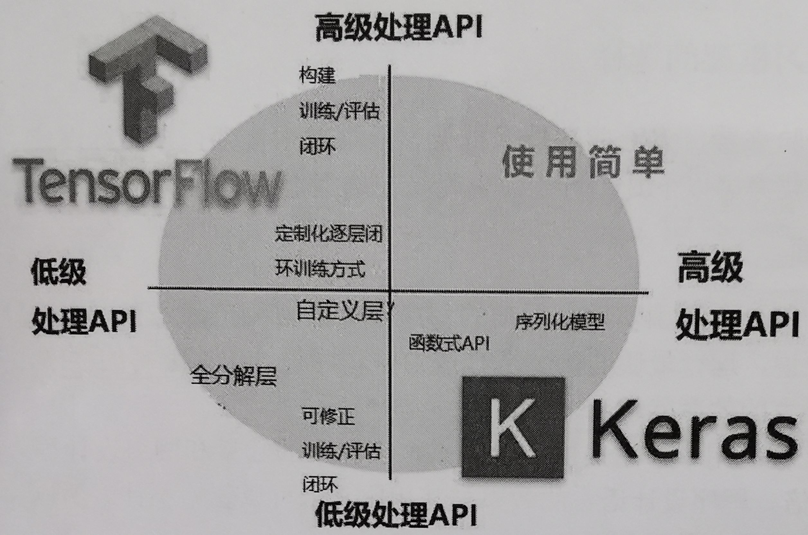

# Keras 深度学习

Keras 是基于 Python 编写而成的深度学习人工神经网络框架。

Keras 最核心的数据结构就是模型。Keras 提供的序列模型能够依次叠加想要的层。

Keras 以 TensorFlow、Theano、CNTK 作为后端引擎运行，提供直观而简洁的 API，开发者不需要了解这些复杂的内部引擎，就可以在各自领域轻松使用和开发深度学习模型。

## Keras 的主要特征

- 模块性
  - 提供的模块相对独立，且可配置，能够以最少的代价相互连接。
  - 模型通过序列或图，将这些模块组合在一起。
  - 具体而言，神经网络层、代价函数、优化器、初始化策略、激活函数、正则化方法等，都是独立的模块。可以用它们来构建自己的模型。
- 极简主义
  - 每个模块都短小精干。
  - 每一段代码都直观易懂。
  - 但迭代和创新性方面可能有麻烦。
- 易扩展性
  - 利用新的类或函数，可以轻松添加模块。
  - Keras 更适合于先进的研究工作。
- 基于 Python
  - Keras 不需要单独的模型配置文件类型（而 Caffer 有），模型由 Python 代码描述。
  - 采用 Python 语言，性能虽然不够快，但是满足目前绝大多数工作要求。

## Keras 与 TensorFlow

- TensorFlow 和 Keras 都是深度学习框架。

- 相对于 Keras 来说，TensorFlow 比较灵活，便是难以入门。

- TensorFlow 实质上是一个微分器，而 Keras 其实是使用 TensorFlow 与 Keras 的接口（Keras 作为前端，TensorFlow 作为后端）构建的深度学习框架。

- Keras 可以看作为 TensorFlow 封装后的一个 API。即 Keras 作为一个封装在 TensorFlow 中的接口，很容易被 TensorFlow 调用。

  
