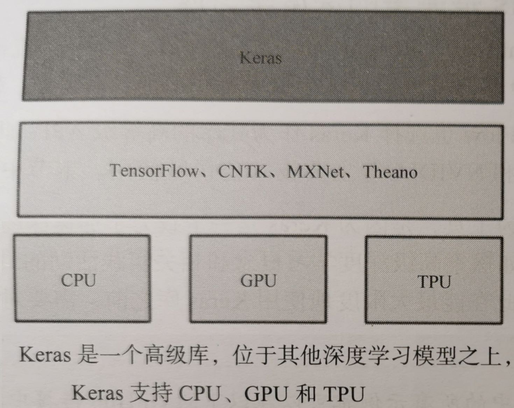

# Keras 深度学习

Keras 是 2015 年，一个由 Python 编写的开源深度学习人工神经网络库，可以作为 Tensorflow、Microsoft-CNTK 和 Theano 的高阶应用程序接口，进行深度学习模型的设计、调试、评估、应用和可视化。

Keras 的命名来自古希腊语，含义为将梦境化为现实的 “牛角之门”。

Keras 最核心的数据结构就是模型。Keras 提供的序列模型能够依次叠加想要的层。

Keras 以 TensorFlow、Theano、CNTK 作为后端引擎运行，提供直观而简洁的 API，开发者不需要了解这些复杂的内部引擎，就可以在各自领域轻松使用和开发深度学习模型。

Keras 的主要开发者是谷歌工程师 François Chollet，此外其 GitHub 项目页面包含 6 名主要维护者和超过 800 名直接贡献者。
Keras在其正式版本公开后，除部分预编译模型外，按MIT许可证开放源代码。

2017 年起，Keras 得到了 Tensorflow 团队的支持，其大部分组件被整合至 Tensorflow 的 Python API 中。
在 2018 年 Tensorflow 2.0.0 公开后，Keras 被正式确立为 Tensorflow 高阶 API，即 tf.keras。
此外，自 2017 年 7 月开始，Keras 也得到了CNTK 2.0 的后台支持。

## Keras 的主要特征

- 模块性
  - 提供的模块相对独立，且可配置，能够以最少的代价相互连接。
  - 模型通过序列或图，将这些模块组合在一起。
  - 具体而言，神经网络层、代价函数、优化器、初始化策略、激活函数、正则化方法等，都是独立的模块。可以用它们来构建自己的模型。
- 极简主义
  - 每个模块都短小精干。
  - 每一段代码都直观易懂。
  - 但迭代和创新性方面可能有麻烦。
- 易扩展性
  - 利用新的类或函数，可以轻松添加模块。
  - Keras 更适合于先进的研究工作。
- 基于 Python
  - Keras 不需要单独的模型配置文件类型（而 Caffer 有），模型由 Python 代码描述。
  - 采用 Python 语言，性能虽然不够快，但是满足目前绝大多数工作要求。

## Keras 与 TensorFlow

- TensorFlow 和 Keras 都是深度学习框架。

- 相对于 Keras 来说，TensorFlow 比较灵活，便是难以入门。

- TensorFlow 实质上是一个微分器，而 Keras 其实是使用 TensorFlow 与 Keras 的接口（Keras 作为前端，TensorFlow 作为后端）构建的深度学习框架。

- Keras 可以看作为 TensorFlow 封装后的一个 API。即 Keras 作为一个封装在 TensorFlow 中的接口，很容易被 TensorFlow 调用。

  

Keras 是一个高级库，位于其他深度学习模型之上，Keras 支持 CPU、GPU、TPU。

## 为什么选 Keras

在业界，Keras 被 Google、Netflix、Uber、NVIDIA 等主要技术公司所使用。

The Data Incubator 17年11月发布的【 23 个热门深度学习库排名】显示，Keras 是排名最高的非框架深度学习库。而随着 R Studio 发布 Keras 的界面，Keras 的流行度还会不断提高。

