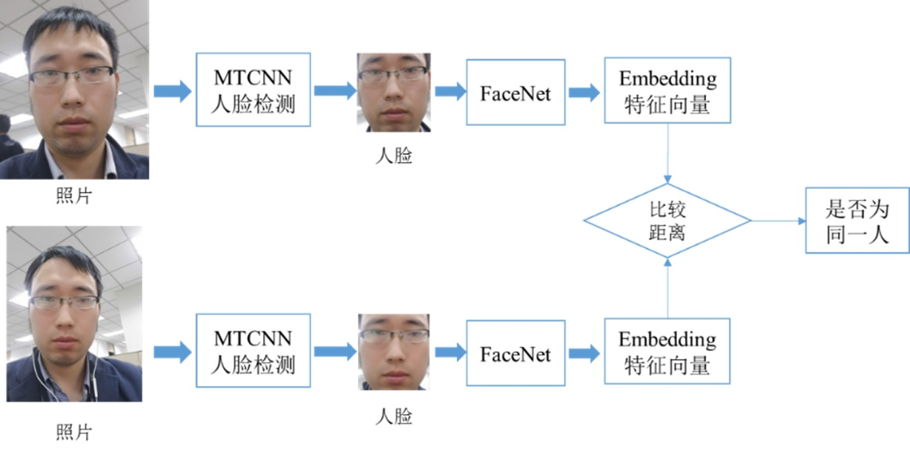

# Face Recognition 人脸识别

# 人脸识别 流程

完整的人脸识别，至少需要跑3个模型：（1）人脸检测Detect ， （2）人脸属性 ， （3）人脸比对

| 步骤                                      | 描述                                                         | 需要的模型         | Note                                                 |
| ----------------------------------------- | ------------------------------------------------------------ | ------------------ | ---------------------------------------------------- |
| Step_01  输入照片  对图像进行预处理       | 例：  缩放/修改图片尺寸大小，到模型要求的大小。  例：FaceNet （160*160的图像） |                    |                                                      |
| Step_02  人脸检测                         | 从图片中准确定位到人脸。扣出 人脸。  返回：高精度的人脸框坐标及人脸特征点坐标。  方法1：MTCNN  方法2：OpenCV  其他方法：Dilb，OpenFace等 | Detect 模型        |                                                      |
| Step_03  人脸矫正（对齐）                 | 检测到的人脸，可能角度不是很正，需要使其对齐。               | 需要单独的模型么？ |                                                      |
| Step_04  对矫正后的人脸进行特征提取       |                                                              |                    |                                                      |
| Step_05‑A   人脸识别  (方法A)             | 输入两张人脸，判定是否属于同一人。  对两张人脸图像的特征向量进行对比，计算相似度。     方法1：FaceNet模型：比较特征向量间的欧式距离，判断是否为同一人，例如当特征距离小于1的时候认为是同一个人，特征距离大于1的时候认为是不同人。 | 人脸识别模型       | （1）A和B 方法，  识别的时间，识别的方法，有区别么？ |
| Step_05_B  人脸识别  (方法B)              | 输入一张人脸，判断其属于人脸数据库全部记录中具体哪一人     当Panel里面，注册的用户多了之后，对识别的时间，影响大么？ | 人脸识别模型       | （2）人脸识别的数据集，需要我们自己训练么？          |
| Step_06  人脸属性                         | 性别，人脸的角度，是否带眼镜等                               | 人脸属性模型       |                                                      |
| Step_07  返回结果                         | 1. 匹配度（Distance）  2.人脸属性（性别，角度，是否带眼镜等） |                    |                                                      |
| Step_08  评估模型和数据集的准备性（精度） |                                                              |                    |                                                      |

# 人脸检测

## MTCNN 人脸检测

# 人脸识别

## FaceNet 人脸识别模型（开源库）

FaceNet 是基于 TensorFlow 的人脸识别开源库。

### FaceNet的理论思想

FaceNet的理论思想：是把人脸图像映射到一个多维空间，通过空间距离表示人脸的相似度。同一个人脸图像的空间距离比较小，不同人脸图像的空间距离比较大，这样通过人脸图像的空间映射就可以实现人脸识别。即，通过 CNN 将人脸映射到欧式空间的特征向量上，计算不同图片人脸特征的距离。通过相同人脸的距离总是小于不同人脸的距离，这一先验知识训练网络，进而可以直接对比2个人脸经过它的网络映射之后的欧式距离，判断是否为同一人。

### FaceNet测试使用

FaceNet 测试使用：因为 FaceNet 只需要计算人脸特征，然后计算距离使用阈值即可判定两张人脸照片是否属于相同的个体，所以在使用 FaceNet 时可以使用已经训练好的模型，也可以自己训练模型，最后根据两幅人像的欧几里得距离去判断两个人像的相似程度：两个人像之间的欧几里得距离越近，说明它们越相似。从初级应用的角度来看，已经训练好的模型已经足够强大，我们只需将一个基准图片与待分类图片通过 FaceNet 模型比较欧几里得距离，即可完成人脸识别任务。

### FaceNet人脸比对的判断

FaceNet人脸比对的判断：该算法主要用于验证人脸是否为同一个人，通过“人脸识别这个人是谁”完成人脸比对。判断依据是“两幅人像的欧几里得距离”，如给定一个阈值a=1，那么：当特征距离等于0的时候，认为是同一张图片（同一个人）；当特征距离小于1的时候，认为是同一个人；特征距离大于1的时候,认为不是同一个人。

### FaceNet数据集

FaceNet数据集：

(1)训练数据,包括10575个人，共453453张图片,可以从http://www.cbsr.ia.ac.cn/english/CASIA-WebFace-Database.html 下载。

(2)验证数据集包含13000张图片,可以从http://vis-www.cs.umass.edu/lfw/ 地方下载,大约180M。

训练数据中，目录名是人名，目录下的文件是对应人的照片。

