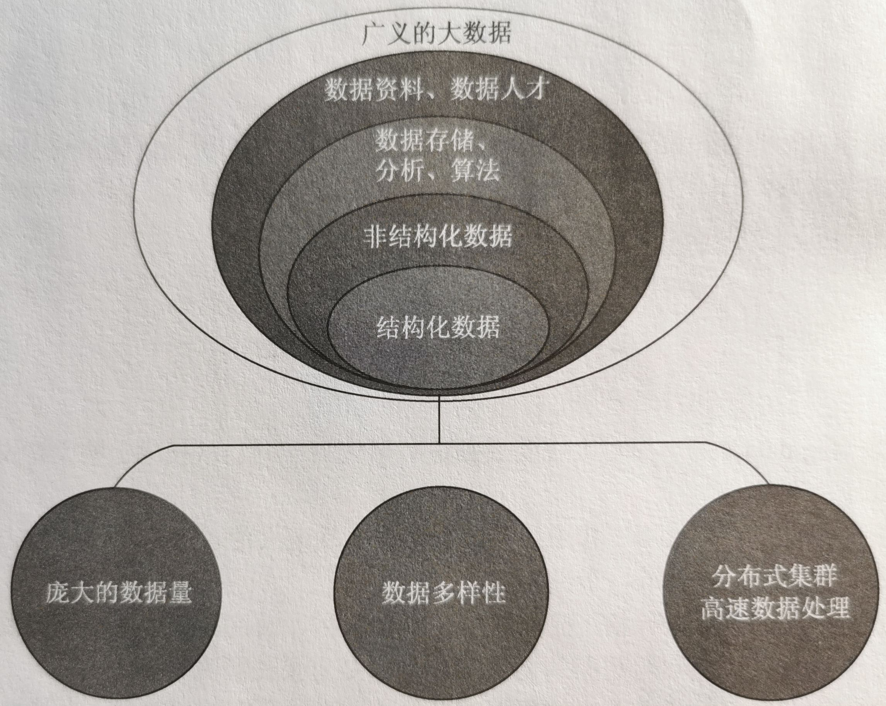
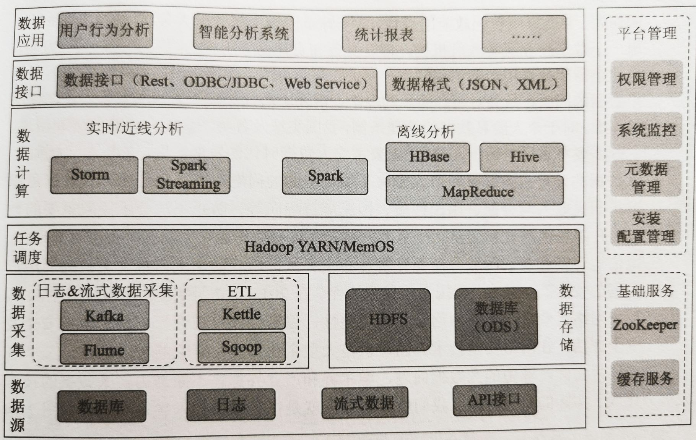
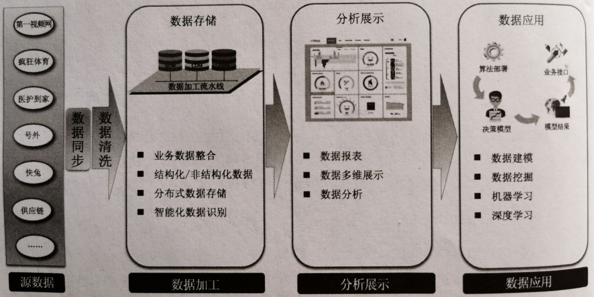
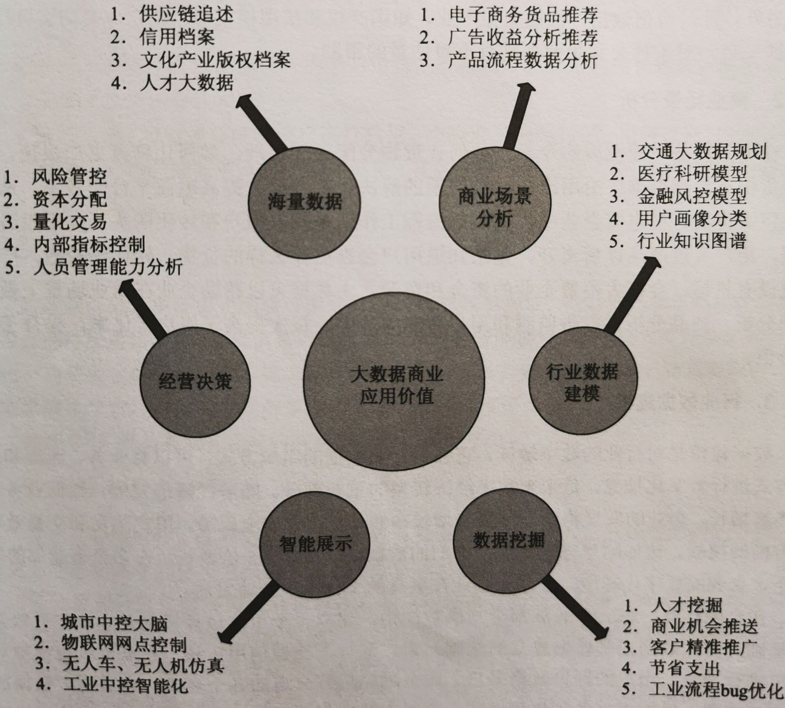
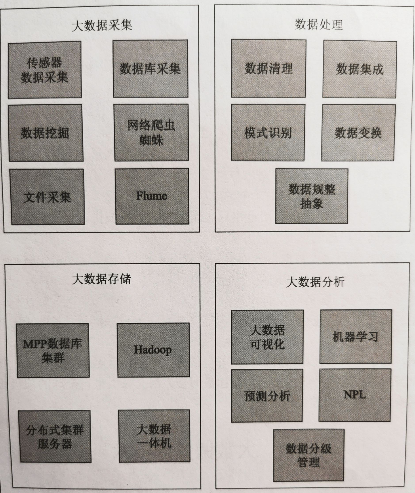
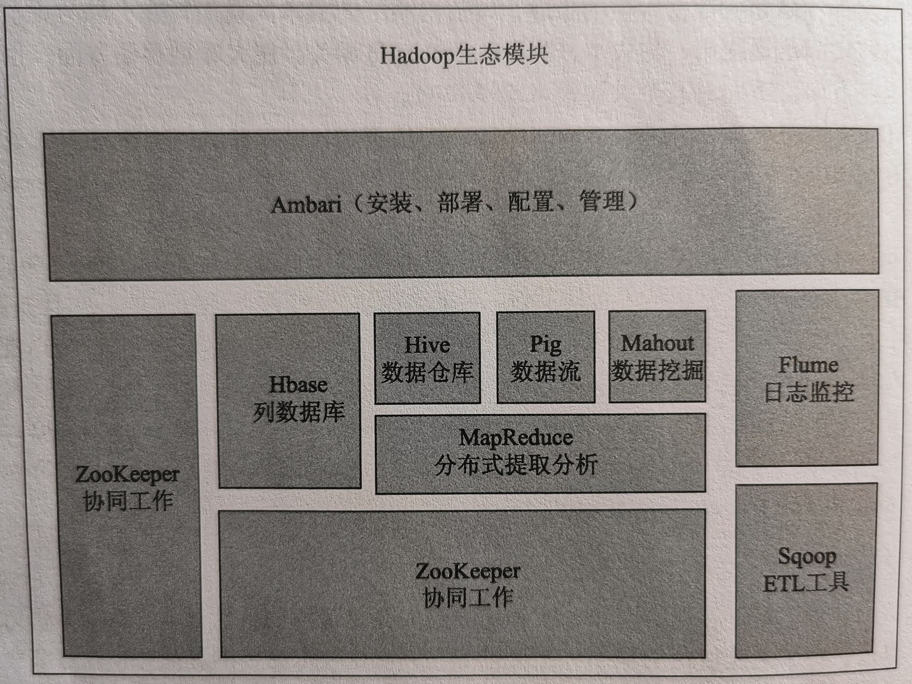

# Big Data 大数据

随着计算机与互联网的飞速发展，数据一直以惊人的速度增长。门户网站、搜索引擎、购物网站、社交软件，使得数据不断膨胀。

智能终端的流行更是让数据的流通插上翅膀，也同时收集着使用者的信息，比如个人信息、所在位置、移动轨迹、生活偏好等。无论是金融分析、机器学习、营销推广，还是其他领域，都需要大数据作为支撑，源源不断地投入算法和应用，就像一个大型机器，需要数据作为燃料提供能量来源。

5 G 时代又推动着物联网的发展，而物联网设备上的传感器，无时无刻不在收集着各种大量数据。想要把这些爆炸式增长的数据使用好，就需要借助大数据技术。

## 大数据的主要特点

- 宠大的数据量。大数据工作中，数据量都是非常庞大的。
- 数据的多样性。数据包括了企业数据、视频数据、设备数据、人群画像数据、个人数据等，种类非常繁杂。处理不同数据的协同工作和关联，也是重要的研究目标。
- 高速的数据处理。宠大的数据量，需要高速的系统处理能力。分布式系统处理与大数据息息相关。
- 从大数据的结构方面来说，主要分为：结构化数据、非结构化数据。
  - 在专一的特定领域，大数据使用结构化数据。例如，医疗图谱数据，研究人员拥有许多同一病例的数据。
  - 在更加普遍的环境下，非结构化的数据逐渐成为主流。
  - 以分布式云计算技术为支持，多样性数据的分析和运用越加成熟。

## 大数据的系统框架

## 大数据的产业研究方向

# 大数据的应用

大数据的应用，可以表现为以下几个方面：

- 可以为政府治理社会、经济、政治问题提供决策。
- 使用大量数据分析，可以预测、评估、解决问题，找寻根源，为企业节省成本。
- 在电商领域，根据用户画像，向用户推荐感兴趣的购买信息。
- 在大量的客户信息中，根据大数据筛选目标客户。
- 使用大数据处理安全问题，比如防御措施，可以通过大数据学习，找出最新出现或者即将出现的安全问题。
- 在出行领域，可以预估交通情况，排解堵塞，做到车辆实时规划，实现智慧出行。
- 分析商业目标和成本规则，实现物品的利润最大化定价和库存规划。可以为企业分析消费者喜好和产品感知，从而更好地制订生产计划。
- 可以分析数百万患者的既往病史，从而提供更准确的诊断。
- 随着人工智能（机器学习、深度学习）的发展，为大数据的应用提供了无限可能性。

# 大数据的关键技术

## 大数据采集

可以通过传感器、互联网设备、社交网络、移动网络、爬虫网络等方式采集数据。

根据不同的内容分为结构化和非结构化的数据。

数据采集需要支持高速的并发，因为数据源可能是千万以上用户的并发行为。

在数据的采集方面发展了许多技术。例如，条形码扫描、二维码扫描、射频识别 RFID、视频扫描监控、智能语音录取、数码点阵、三维点云 SLAM、网络爬虫等。

## 数据处理

刚采集的数据是杂乱无序的。数据处理，就是对这些数据进行处理、归类、清理等，留下真正有价值的数据。

需要通过模式匹配等算法，清理虚假的、不完整的、无价值的数据。

并对有效数据进行填补、平滑、规格化处理，然后合并集成。

## 大数据存储

海量文件存储是大数据永恒的主题，也是技术研究的重点方向。

传统的大数据主要以存储结构化数据为主，而随着行业和数据多样化的发展，大数据需要能够支撑大量的非结构化数据和文件，以及存储、高效检索和管理等。

传统的大数据主要以关系数据库系统 RDBMS 为主，而 Hadoop 所引领的 MapReduce 模型、NoSQL、HBase、HDFS 分布式集群存储等，都是未来数据存储的研究方向。

### MPP 数据库集群

MPP 采用了 Shared Nothing 的架构，对存储进行粗粒度索引处理，采用 MPP 分布式架构，具有高效的存储性能。

它可以集中成本较低的 PC Server 成为一个集群，具有高性能、高扩展性。

### Hadoop

Hadoop 是大数据中的明星产品，最核心的部分是 HDFS、MapReduce、BigTable。

- HDFS 提供了一个分布式文件系统，支持在低配置硬件进行部署，并且提高吞吐量的应用程序接口。
- MapReduce 负责抽象分布式运算为 MapReduce 操作，把 Key/Value 整合为输出 OutPut。
- BitTable 是一个大型的分布式数据库，是一个巨大表格，用来处理结构化数据。

## 大数据分析

大数据分析，是为了让大量的数据变得真正有价值，其中发展最迅速的是云计算和数据挖掘。

大数据处理以后，展现给管理者或者用户的应该是最终的分析结果。

结合人工智能、图形图像处理、概率统计等学科，数据分析的方向决定了业务的方向。

在金融领域，广泛用到大数据分析。例如，数据可视化报告、金融搜索、量化交易、智能投顾等。

# Hadoop

## Hadoop 生态模块

Hadoop 的生态核心模块，是许多大数据平台的核心部分。

# 分布式数据库

分布式数据库可以分为物理分布和全方位分布。

- 物理分布：表示存储设备是分布的，但是存储逻辑是集中化的。
- 全方位分布：表示存储设备和数据库逻辑都是分布的，它们相对 “自治”，具有高容错性和高扩展性，适合大规模集成。

分布式数据库一般包括两个部分：

- 分布式数据库管理系统 DDBMS
- 分布式数据库 DDB

分布式数据库的主要优点：

- 体系结构较为灵活。
- 适合分布式结构的管理机构。
- 具有较高的经济性。
- 高扩展性，即插即用。
- 局部响应较快。
- 系统可靠性高，具有高容灾性。

 在 Hadoop 中，应用最为广泛的分布式数据库是 HBase。HBase 是开源的 BigTable 实现，支持海量数据和分布式并发，具有高效性、高伸缩性、低成本等优势。

# 分布式计算

分布计算是大数据系统的核心能力。

分布式计算，主要研究的是分散系统，处理的是将分散的一组计算机相互连接为一个网络。将计算的工作和数据分块，分别给多台计算机进行处理。然后，再上传集合，统一得出归纳后的总论。

分布式计算可以实现资源共享、多计算负载均衡、多任务执行。

相较于并行计算，分布式计算任务之间具有独立性，并行计算更多的是处理共享内存单元的数据。分布式的实时性要求相对较低，允许计算错误。

云计算，就是结合了分布式计算、网格运算、并行运算，并结合了分布式存储和分布式缓存等技术，是互联网计算的集大成概念。

常用的分布式框架：

- Storm 分布式框架
  - 它是 Twitter 由 Lisp 语言开发的，用来处理实时的大数据流式计算。
  - 它解决了 Hadoop 的延迟大、节点运算复杂等问题，具有非常高的效率。
  - 它的主要功能由 Nimbus 和 Supervision 组成，负责监控任务和进程运行。
- Spark 分布式框架
  - 它是由 Scala 编写，基于弹性分布式内存数据集 RDD 框架。
  - 它解决了 Hadoop 中的迭代任务效率较低的问题，支持任务期间进行交互查询。
  - Spark 相比 Hadoop 的通用性架构，提供了特定的算法，解决数据缓存的处理效率和内存控制。
- MapReduce  分布式框架
  - 它是 Hadoop 的核心模块，是分布式计算的主要框架。
  - MapReduce 是数据静态的处理，它的运算工作通过进程的方式进行启动，具有离线处理、易于开发、易于部署等优点。

# 数据挖掘

如何在大规模的数据中获得有用的商业价值信息，特别是来自于全行业的数据，具有非标准化、非结构化、非应用化等问题。

数据挖掘是通过对大数据集合进行分析和模式分类，建立生产关系，解决业务问题，或者发现新的商业机会。

