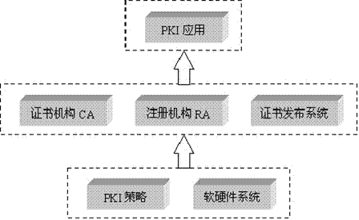
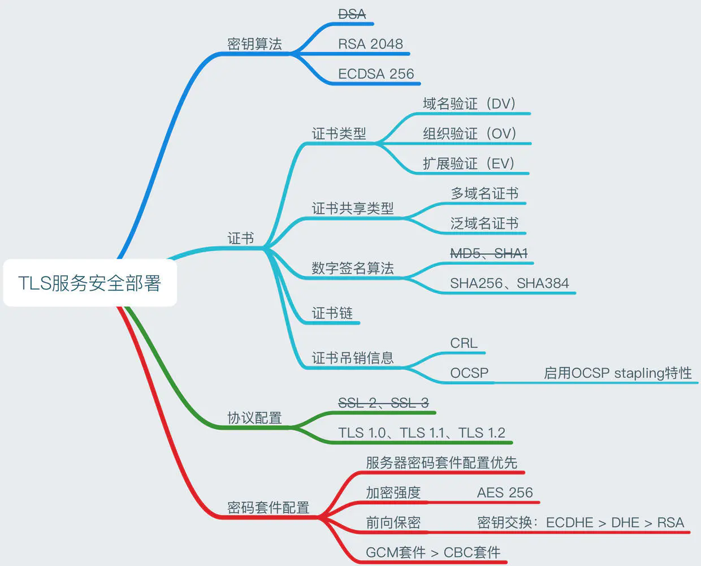
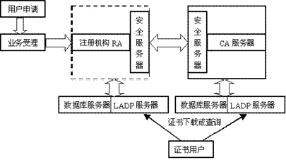
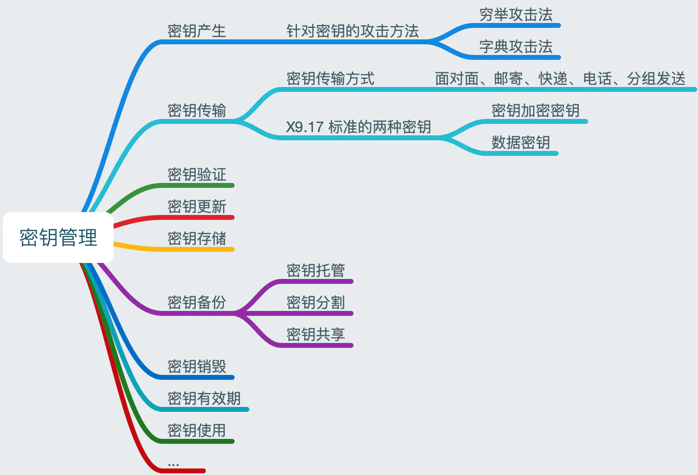
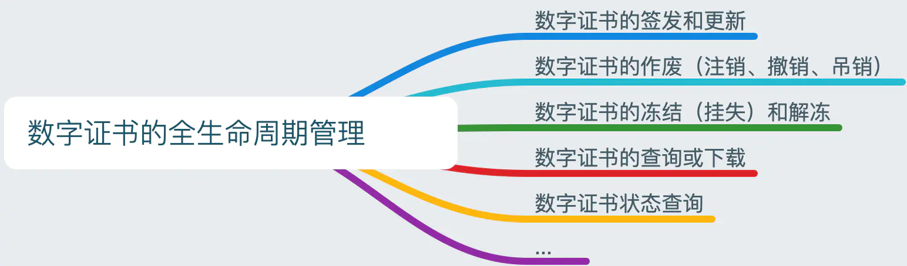
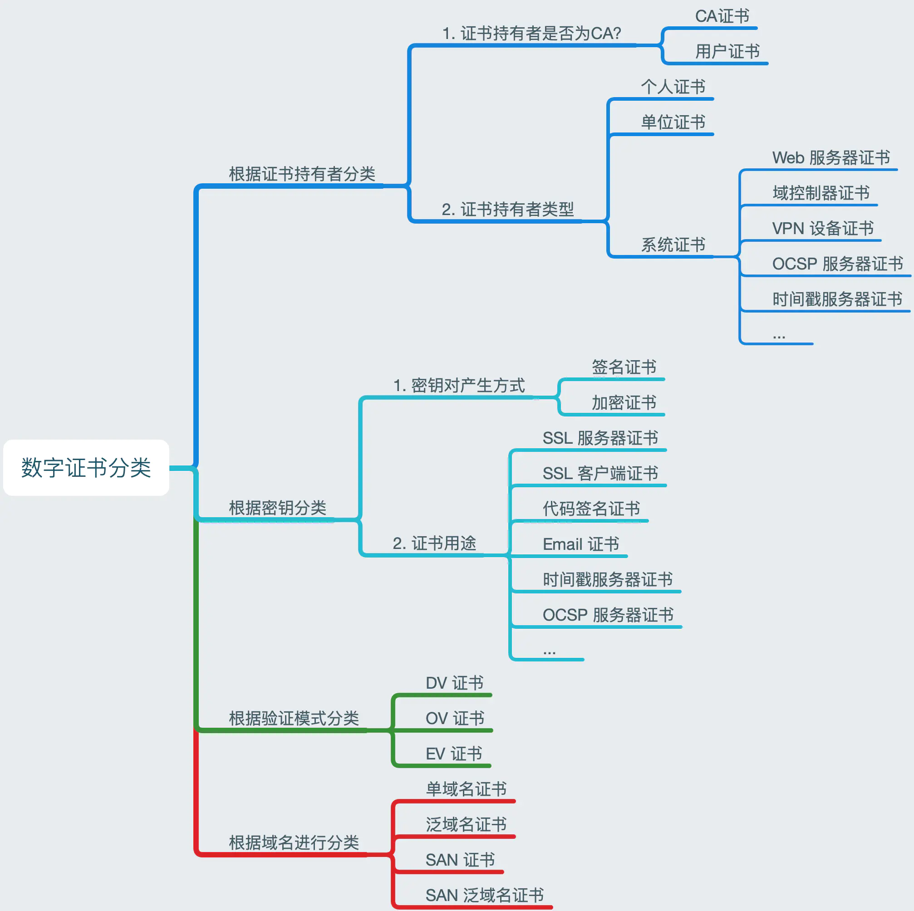

# Security & Encryption 安全与加密

# ■■■■■■■■■■■■■■■■■■■■■■■■■■■■■■■■

# 密码学 基础概念

密码学主要分为：编制密码、破译密码。密码学需要通过算法，提供信息的隐秘传递方式，它包括一些通信架构和加密算法等部分。

## 加密基元

加密基元就是一些基础的密码学算法，通过它们才能够构建更多的密码学算法、协议、应用程序。

.webp)

- **散列函数（散列（hash）、指纹、消息摘要、摘要算法、杂凑函数）**：把任意长度的输入消息数据转化成固定长度的输出数据的一种密码算法。
- **消息验证代码**：验证数据完整性，即数据没有被篡改。
- **数字签名**：RSA私钥加密，公钥解密，结合散列函数。验证消息真实性。
- **伪随机函数（PRF）**：生成任意数量的伪随机数据。
- **RSA**：可以同时用于密钥交换和身份验证（数字签名）。
- **DHE_RSA**：DHE 算法：密钥协商，RSA 算法：身份验证（数字签名）。
- **ECDHE_RSA**： ECDHE 算法：密钥协商，RSA 算法：身份验证（数字签名）。
- **ECDHE_ECDSA** ：ECDHE 算法：密钥协商，ECDSA 算法：身份验证（数字签名）。


## 密码

通信的时候双端进行信息变换和保密的方法，主要包括加密变换和脱密变换。

随着技术的发展，文字、图形、语音、图像和数据都可以进行密码变换。

根据加密方式的不同，密码的种类包括：

- 对称密码。主要有 3 种：DES、三重 DES、AES（Advanced Encryption Standard）
- 分组密码。通过密码迭代的方式，对任意长度明文进行加密，DES 和 AES 都属于分组密码。主要包括 5 种模式：ECB 模式、CTR 模式、CBC 模式、OFB 模式、CFB 模式。
- 公钥密码。主要解决了密钥输送问题，它通过公钥加密，通过私钥解密，不需要接收者接收配送的密钥。公钥和私钥必须一一对应，称为密钥对，它们之间具有密切的数学联系，无法单独生成。公钥发送给其他人，私钥只有自己握有。RSA 算法是常用的公钥密码算法。
- 混合密码。它是一种结合对称密码和公钥密码的方案，它可以提高对称密码的速度，并且使用公钥密码保护会话层。


## 认证

认证是密码学的重要组成部分，是对消息进行确认完整性和合法性的技术，一般通过发送者和接收者的密钥，识别信息的非法伪装和私自篡改等问题。

它通过密码认证协议 PAP,允许用户信息传输权限。

它确认了网络活动中用户可以获取信息的范围。它会使用消息认证码和认证函数，与密钥息息相关。

认证经常使用单向散列函数和消息认证码进行处理。

- 单向散列函数，通过输入值和输出值处理验证问题。输入的是消息，输出的是消息的散列值。
- 常用的单向散列函数在开发过程中会用到，例如，MD4、MD5、SHA-128、SHA-256、SHA-512等。SHA-256 哈希算法，成为区块链“探矿”的主要算法。
- 消息认证码。它是一种认证完整性的技术，简称 MAC（Message Authentication Code），是一种和密钥共同动作的单向散列函数。


## 数字签名

数字签名的作用是为了证明某段数据或者文件是某人的权益，从而进行签名，具有不可伪造、不可抵赖的特性。

在许多网络信息和金融交易当中，需要对某段数据或者交易进行证明，表示它的所属人员，这个时候就需要数字签名。

数字签名需要密码技术来保证其不被篡改，并且可以通过密钥生成和验证签名。

数字签名常用的方式是使用公钥加密系统，常用的算法包括：

- RSA 算法。基于对大整数进行质因数分解非常困难的原理。
- DSA 算法。基于离散对数原理。
- ECDSA 算法。DSA 的变化版本，基于椭圆曲线的离散对数原理。ECDSA 通过椭圆对称算法，使用 SHA-256 进行加密计算，其实也是一种 DSA 的算法过程。在区块链中，比特币的账户就是通过 ECDSA 进行加密的。

# ■■■■■■■■■■■■■■■■■■■■■■■■■■■■■■■■

# 加密算法

## Hash 散列函数算法

- Hash 算法：Hash 算法是一种单向算法，用户可以通过Hash算法对目标信息生成一段特定长度的唯一的 Hash值，却不能通过这个Hash值逆向获得目标信息。
- Hash 散列函数特点是函数单向不可逆、对输入非常敏感、输出长度固定，针对数据的任何修改都会改变散列函数的结果，用于防止信息篡改并验证数据的完整性。
- 在信息传输过程中，散列函数不能单独实现信息防篡改，因为明文传输，中间人可以修改信息之后重新计算信息摘要，因此需要对传输的信息以及信息摘要进行加密。
- 常见的Hash算法：MD2、MD4、MD5、SHA、SHA-1、SHA-2 等。

## 非对称加密

- 非对称加密：指加密和解密使用不同密钥的加密算法，也称为公私钥加密。
- 算法特点是，密钥成对出现，一般称为公钥(公开)和私钥(保密)，公钥加密的信息只能私钥解开，私钥加密的信息只能公钥解开。
- 因此掌握公钥的不同客户端之间不能互相解密信息，只能和掌握私钥的服务器进行加密通信，服务器可以实现1对多的通信，客户端也可以用来验证掌握私钥的服务器身份。
- 非对称加密的特点是信息传输1对多，服务器只需要维持一个私钥就能够和多个客户端进行加密通信，但服务器发出的信息能够被所有的客户端解密，且该算法的计算复杂，加密速度慢。
- 常见的非对称加密算法：RSA、ECC、DH 、DSA（数字签名用）等。


## 对称加密

- 对称加密：指加密和解密使用相同密钥的加密算法。对称加密算法的优点在于加解密的高速度和使用长密钥时的难破解性。
- 相同的密钥可以用于信息的加密和解密，掌握密钥才能获取信息，能够防止信息窃听，通信方式是1对1。
- 对称加密的优势是信息传输1对1，需要共享相同的密码，密码的安全是保证信息安全的基础，服务器和 N 个客户端通信，需要维持 N 个密码记录，且缺少修改密码的机制。
- 常见的对称加密算法：DES、3DES、DESX、AES、RC4、RC5、RC6等。


# AES 对称加密

AES（Advanced Encryption Standard）采用 Rijndael 的加密算法，使用 SPN 作为基本网络结构，其密钥长度规范有3种: 128 比特、192 比特、256 比特。


# 公钥与私钥

公钥密码。主要解决了密钥输送问题，它通过公钥加密，通过私钥解密，不需要接收者接收配送的密钥。公钥和私钥必须一一对应，称为密钥对，它们之间具有密切的数学联系，无法单独生成。公钥发送给其他人，私钥只有自己握有。RSA、ECDSA 算法是常用的公钥密码算法。

公钥和私钥主要应用在非对称加密算法中。

公钥是公开的密码，应用在各个加密部分。公钥可以在网络上公开。

私钥是自己掌握的密钥，主要用来数据解密。

例如，在区块链的资产当中，私钥保护着用户所有的数字资产，用户最好保证私钥处于封闭的环境中，不在网络中流通，防止网络黑客。

# ■■■■■■■■■■■■■■■■■■■■■■■■■■■■■■■■

# PKI 体系

PKI 公共基础设施 Public Key Infrastructure 是遵循标准的公钥基础设施。

PKI 公钥基础设施是一个包括硬件、软件、人员、策略和规程的集合，用来实现基于公钥密码体制的密钥和证书的产生、管理、存储、分发和撤销等功能。

## PKI 的安全服务及应用 

PKI 的应用非常广泛，其为网上金融、网上银行、网上证券、电子商务、电子政务等网络中的数据交换提供了完备的安全服务功能。

PKI 作为安全基础设施，能够提供身份认证、数据完整性、数据保密性、数据公正性、不可抵赖性和时间戳六种安全服务。

- 身份认证
  - 由于网络具有开放性和匿名性等特点，非法用户通过一些技术手段假冒他人身份进行网上欺诈的门槛越来越低，从而对合法用户和系统造成极大的危害。
  - 身份认证的实质就是证实被认证对象是否真实和是否有效的过程，被认为是当今网上交易的基础。
  - 在 PKI 体系中，认证中心(Certification Authority，CA)为系统内每个合法用户办一个网上身份认证，即身份证。
- 数据完整性
  - 数据的完整性就是防止非法篡改信息，如修改、复制、插入、删除等。
  - 在交易过程中，要确保交易双方接收到的数据与原数据完全一致，否则交易将存在安全问题。
  - 在网络安全中，一般使用散列函数的方法 ( Hash 函数，也称密码杂凑函数)来保证通信时数据的完整性。
  - 通过 Hash 算法我们将任意长度的数据通过变换为长度固定的数字摘要(消息认证码，MAC)，并且原始数据中任何一位的改变都将会在相同的计算条件下产生截然不同的数字摘要，从而很好地保证了数据的完整性和准确性。
  - PKI 系统主要采用的散列算法有 SHA-1 和 MD5。
- 数据保密性
  - 数据的保密性就是对需要保护的数据进行加密，从而保证信息在传输和存储过程中不被未授权人获取。
  - 在 PKI 系统中，所有的保密性都是通过密码技术实现的。
  - 密钥对分为两种，一种称作加密密钥对，用作加解密；另一种称作签名密钥对，用作签名。
  - 一般情况下，用来加解密的**密钥对**（例，非对称加密）并不对实际的大量数据进行加解密，只是用于**协商会话密钥**，而真正用于大量数据加解密的是**会话密钥**（例，对称加密）。
    - 在实际的数据通信中，首先发送方产生一个用于实际数据加密的对称算法密钥，此密钥被称为会话密钥，用此密钥对所需处理的数据进行加密。
    - 然后，发送方使用接收方加密密钥对应的公钥对会话密钥进行加密，连同经过加密处理的数据一起传送给接收方。
    - 接收方收到这些信息后，首先用自己加密密钥对中的私钥解密会话密钥，然后用会话密钥对实际数据进行解密。
- 数据公正性
  - PKI 中支持的公正性是指数据认证。
  - 也就是说，公证人要证明的是数据的正确性，这种公正取决于数据验证的方式，与公正服务和一般社会公证人提供的服务是有所不同的。
  - 在 PKI 中，被验证的数据是基于对原数据 Hash 后数字摘要的数字签名、公钥在数学上的正确性和私钥的合法性。
- 不可抵赖性
  - 不可抵赖性保证参与双方不能否认自己曾经做过的事情。
  - 在 PKI 系统中，不可抵赖性来源于数字签名。
  - 由于用户进行数字签名的时候，签名私钥只能被签名者自己掌握，系统中的其他实体不能做出这样的签名。
  - 因此，在私钥安全的假设下签名者就不能否认自己做出的签名。保护签名私钥的安全性是不可抵赖问题的基础。
- 时间戳服务
  - 时间戳也叫安全时间戳，是一个可信的时间权威，使用一段可以认证的数据来表示。
  - PKI 中权威时间源提供的时间并不需要正确，仅仅需要用户作为一个参照“时间”，以便完成基于PKI的事务处理，如时间 A 发生在时间 B 的前面等。
  - 一般的 PKI 系统中都设置一个时钟统一 PKI 时间。
  - 当然也可以使用时间官方事件源所提供的时间，其实现方法是从网中这个时钟位置获得安全时间，要求实体在需要的时候向这些权威请求在数据上盖上时间戳。
  - 一份文档上的时间戳涉及对时间和文档内容的哈希值的签名，权威的签名提供了数据的真实性和完整性。一个PKI系统中是否需要实现时间戳服务，完全依照应用的需求来决定。 
- 数字签名
  - 由于单一的、独一无二的私钥创建了签名，所以在被签名数据与私钥对应的实体之间可以建立一种联系，这种联系通过使用实体公钥验证签名来实现。
  - 如果签名验证正确，并且从诸如可信实体签名的公钥证书中知道了用于验证签名的公钥对应的实体，那么就可以用数字签名来证明被数字签名数据确实来自证书中标识的实体。
  - 因此，PK的数字签名服务分为两部分：签名生成服务和签名验证服务。
  - 签名生成服务要求能够访问签名者的私钥，由于该私钥代表了签名者，所以是敏感信息，必须加以保护。如果被盗，别人就可以冒充签名者用该密钥签名。
  - 因此，签名服务通常是安全应用程序中能够安全访问签名私钥的那一部分。相反，签名验证服务要开放一些，公钥一旦被可信签名者签名，通常就被认为是公共信息。验证服务接收签名数据、签名、公钥或公钥证书，然后检查签名对所提供的数据是否有效。它返回验证成功与否的标识。 


## PKI 主要包括四个部分

- X.509 证书格式的证书 (X.509 V3) 和 证书废止列表 CRL (X.509 V2)。
  -  X.509 标准是 PKI 的雏形。
  - 由可信实体签名的电子记录，记录将公私钥对所有者的身份捆绑在一起
- CA 操作协议
- CA 政策管理协议
- CA政策制定

## PKI 系统组成

PKI 作为一组在分布式计算系统中利用公钥技术和 X.509 证书所提供的安全服务，企业或组织可利用相关产品建立安全域，并在其中发布密钥和证书。在安全域内，PKI 管理加密密钥和证书的发布，并提供诸如密钥管理（包括密钥更新，密钥恢复和密钥委托等）、证书管理（包括证书产生和撤销等）和策略管理等。PKI 产品也允许一个组织通过证书级别或直接交叉认证等方式来同其他安全域建立信任关系。

PKI 系统包括 PKI 安全策略、软硬件系统、证书机构 CA、注册机构 RA、证书发布系统和 PKI 应用等。

一个简单的 PKI 系统包括证书机构 CA、注册机构RA和相应的 PKI 存储库。CA 用于签发并管理证书；RA可作为CA的一部分，也可以独立，其功能包括个人身份审核、CRL 管理、密钥产生和密钥对备份等；PKI 存储库包括 LDAP 目录服务器和普通数据库，用于对用户申请、证书、密钥、CRL 和日志等信息进行存储和管理，并提供一定的查询功能。



### PKI 安全策略

- PKI 安全策略建立和定义了一个组织信息安全方面的指导方针，同时也定义了密码系统使用的处理方法和原则。
- 它包括一个组织怎样处理密钥和有价值的信息，根据风险的级别定义安全控制的级别。
- 一般情况下，在PKI中有两种类型的策略：
  - 一是证书策略，用于管理证书的使用，比如，可以确认某一CA是在Internet上的公有CA，还是某一企业内部的私有CA；
  - 另外一个就是CPS（Certificate Practice Statement）。一些由商业证书发放机构（CCA）或者可信的第三方操作的PKI系统需要CPS。
- 这是一个包含如何在实践中增强和支持安全策略的一些操作过程的详细文档。它包括CA是如何建立和运作的，证书是如何发行、接收和废除的，密钥是如何产生、注册的，以及密钥是如何存储的，用户是如何得到它的等等。

### 证书机构 CA

- 证书机构CA是PKI的信任基础，它管理公钥的整个生命周期，其作用包括：发放证书、规定证书的有效期和通过发布证书废除列表（CRL）确保必要时可以废除证书。

### 注册机构 RA

-  注册机构 RA 提供用户和 CA 之间的一个接口，它获取并认证用户的身份，向 CA 提出证书请求。
- 它主要完成收集用户信息和确认用户身份的功能。
- 这里指的用户，是指将要向认证中心（即CA）申请数字证书的客户，可以是个人，也可以是集团或团体、某政府机构等。
- 注册管理一般由一个独立的注册机构（即RA）来承担。它接受用户的注册申请，审查用户的申请资格，并决定是否同意CA给其签发数字证书。
- 注册机构并不给用户签发证书，而只是对用户进行资格审查。
- 当然，对于一个规模较小的 PKI 应用系统来说，可把注册管理的职能由认证中心 CA 来完成，而不设立独立运行的 RA。
- PKI 国际标准推荐由一个独立的RA来完成注册管理的任务，可以增强应用系统的安全。

### 证书发布系统

- 证书发布系统负责证书的发放，如可以通过用户自己，或是通过目录服务。目录服务器可以是一个组织中现存的，也可以是 PKI 方案中提供的。


# 证书颁发机构 CA（certification authority）

CA 是第三方机构，被你信任，由它保证证书的确发给了应该得到该证书的人。CA 自己有一个庞大的public key数据库，用来颁发给不同的实体。CA 也是一个实体，它也有自己的公共密钥和私有密钥。

证书颁发机构（CA）是一个值得信赖的第三方的机构（所有者），其证书值得信任。


## CA 框架模型

证书机构 CA 用于创建和发布证书，它通常为一个称为安全域（security domain）的有限群体发放证书。

创建证书的时候，CA系统首先获取用户的请求信息，其中包括用户公钥（如果用户端是个人使用或者测试用，则公钥一般由用户端产生，如电子邮件程序或浏览器等或者使用第三方开发的具有独立CSP的智能终端如USBkey），CA将根据用户的请求信息产生证书，并用自己的私钥对证书进行签名。其他用户、应用程序或实体将使用CA的公钥对证书进行验证。如果一个CA系统是可信的，则验证证书的用户可以确信，他所验证的证书中的公钥属于证书所代表的那个实体。

CA还负责维护和发布证书废除列表CRL（certificate revocation lists，又称为证书黑名单）。当一个证书，特别是其中的公钥因为其他原因无效时（不是因为到期），CRL提供了一种通知用户和其他应用的中心管理方式。CA系统生成CRL以后，要么是放到LDAP服务器中供用户查询或下载，要么是放置在Web服务器的合适位置，以页面超级连接的方式供用户直接查询或下载。

最常见的解决方案是借助证书颁发机构（CA）做这项工作（如下图） ：在浏览器中指定哪些 CA 是可信任（根 CA 证书），CA 负责验证你访问的每个网站，并进行审核，以确认这些证书没有被滥用或受损害。如果任何网站违反了 CA 的证书的安全性规定，那么 CA 有责任撤销其证书。




一个典型的CA系统包括安全服务器、注册机构 RA、CA 服务器、LDAP 目录服务器和数据库服务器等。如下图所示：




- 安全服务器
  - 安全服务器面向普通用户，用于提供证书申请、浏览、证书撤消列表以及证书下载等安全服务。
  - 安全服务器与用户的的通信采取安全信道方式（如SSL的方式，不需要对用户进行身份认证）。
  - 用户首先得到安全服务器的证书（该证书由CA颁发），然后用户与服务器之间的所有通信，包括用户填写的申请信息以及浏览器生成的公钥均以安全服务器的密钥进行加密传输，只有安全服务器利用自己的私钥解密才能得到明文，这样可以防止其他人通过窃听得到明文。从而保证了证书申请和传输过程中的信息安全性。
- CA 服务器
  - CA 服务器使整个证书机构的核心，负责证书的签发。
  - CA 首先产生自身的私钥和公钥（密钥长度至少为1024 位），然后生成数字证书，并且将数字证书传输给安全服务器。
  - CA 还负责为操作员、安全服务器以及注册机构服务器生成数字证书。
  - 安全服务器的数字证书和私钥也需要传输给安全服务器。
  - CA 服务器是整个结构中最为重要的部分，存有 CA 的私钥以及发行证书的脚本文件，出于安全的考虑，应将 CA 服务器与其他服务器隔离，任何通信采用人工干预的方式，确保认证中心的安全。
- 注册机构 RA
  - 登记中心服务器面向登记中心操作员，在CA体系结构中起承上启下的作用，一方面向CA转发安全服务器传输过来的证书申请请求，另一方面向LDAP服务器和安全服务器转发CA颁发的数字证书和证书撤消列表。
- LDAP服务器
  - LDAP服务器提供目录浏览服务，负责将注册机构服务器传输过来的用户信息以及数字证书加入到服务器上。这样其他用户通过访问LDAP服务器就能够得到其他用户的数字证书。
- 数据库服务器
  - 数据库服务器是认证机构中的核心部分，用于认证机构中数据（如密钥和用户信息等）、日志合统计信息的存储和管理。
  - 实际的的数据库系统应采用多种措施，如磁盘阵列、双机备份和多处理器等方式，以维护数据库系统的安全性、稳定性、可伸缩性和高性能。


## 密钥管理

密钥管理也是PKI（主要指CA）中的一个核心功能，主要是指密钥对的安全管理，包括密钥产生、密钥备份、密钥恢复和密钥更新等。

PKI  的本质是把非对称密钥管理标准化。

密钥管理模式：

- 无中心模式；
- 有中心模式；



- 密钥产生
  - 密钥对的产生是证书申请过程中重要的一步，其中产生的私钥由用户保留，公钥和其他信息则交于CA中心进行签名，从而产生证书。
  - 根据证书类型和应用的不同，密钥对的产生也有不同的形式和方法。
  - 对普通证书和测试证书，一般由浏览器或固定的终端应用来产生，这样产生的密钥强度较小，不适合应用于比较重要的安全网络交易。
  - 而对于比较重要的证书，如商家证书和服务器证书等，密钥对一般由专用应用程序或CA中心直接产生，这样产生的密钥强度大，适合于重要的应用场合。 
  - 另外，根据密钥的应用不同，也可能会有不同的产生方式。比如签名密钥可能在客户端或RA中心产生，而加密密钥则需要在CA中心直接产生。
- 密钥备份和恢复
  - 在一个 PKI 系统中，维护密钥对的备份至关重要，如果没有这种措施，当密钥丢失后，将意味着加密数据的完全丢失，对于一些重要数据，这将是灾难性的。
  - 密钥一般用口令进行保护，而口令丢失则是管理员最常见的安全疏漏之一。
  - PKI产品应该能够备份密钥，即使口令丢失，它也能够让用户在一定条件下恢复该密钥，并设置新的口令。 
  - 在某些情况下用户可能有多对密钥，至少应该有两个密钥：一个用于加密，一个用于签名。签名密要不需要备份，因为用于验证签名的公钥（或公钥证书）广泛发布，即使签名私钥丢失，任何用于相应公钥的人都可以对已签名的文档进行验证。
  - 另外，使用 PKI 的企业也应该考虑所使用密钥的生命周期，它包括密钥和证书的有效时间，以及已撤销密钥和证书的维护时间等。
- 密钥更新
  - 对每一个由CA颁发的证书都会有有效期，密钥对生命周期的长短由签发证书的CA中心来确定，各CA系统的证书有效期限有所不同，一般大约为2-3年。 
  - 当用户的私钥被泄漏或证书的有效期快到时，用户应该更新私钥。这时用户可以废除证书，产生新的密钥对，申请新的证书。


## CA 管理数字证书的全生命周期

- **数字证书**：解决公钥与用户映射关系问题；
- **CA**：解决数字证书签发问题；
- **KMC**：解决私钥的备份与恢复问题；
- **双证书机制**：「签名证书及私钥」只用于签名验签，「加密证书及私钥」只用于加密解密。
- **LDAP**：解决数字证书查询和下载的性能问题，避免 CA 中心成为性能瓶颈。
- **CRL（证书作废列表）** 和 **OSCP（在线证书状态协议）**：方便用户快速获得证书状态。
- **RA**：方便证书业务远程办理、方便证书管理流程与应用系统结合。
- **电子认证服务机构**：保证 CA 系统在数字证书管理方面的规范性、合规性和安全性。




## 在线证书状态协议（OCSP）

**在线证书状态协议（OCSP）：**提供一种实时检查证书状态的机制，支持验证端直接查询证书数据库中的序列号，从而验证证书是否有效。

## 证书撤销名单（CRL）

**证书撤销名单（CRL）**：每个证书颁发机构维护并定期发布一份吊销证书序列号列表。要想验证证书的可靠性，直接查询CRL名单即可。

CRL文件本身可以定期公布，或在每次更新时都公布，CRL文件可以通过HTTP，或任何其他文件传输协议传输。该名单也是由CA签名，通常允许以指定的时间间隔缓存。

偶尔证书的颁发机构可能需要撤销或作废证书，这可能由于证书的私钥被攻破了，证书颁发机构本身被攻破，或者其他一些正常的原因譬如证书替换、证书签发机构发生变化，等等。为了解决这个问题，证书本身包含了检查是否已吊销的逻辑。因此，为了确保信任链不会受到攻击影响，每个节点都可以检查每个证书的状态，连同签名。

## 申请请书 CSR

在 X.509 里，组织机构通过发起证书签名请求 ( CSR ) 来得到一份签名的证书。

首先需要生成一对钥匙对，然后用其中的私钥对 CSR 进行签名，并安全地保存私钥。

CSR 进而包含有请求发起者的身份信息、用来对此请求进行验真的的公钥以及所请求证书专有名称。

CSR 里还可能带有 CA 要求的其它有关身份证明的信息。

然后 CA 对这个专有名称发布一份证书，并绑定一个公钥。 

组织机构可以把受信的根证书分发给所有的成员，这样就可以使用公司的 PKI 系统了。


# 证书 Certificate 

证书是建立公共密钥和某个实体之间联系的数字化的文件。它包含的内容有：版本信息（X.509 也是有三个版本的）、系列号、证书接受者名称、颁发者名称、证书有效期、公共密钥、一大堆的可选的其他信息、CA 的数字签名。证书由CA颁发，由 CA 决定该证书的有效期，由该CA签名。每个证书都有唯一的系列号。证书的系列号和证书颁发者来决定某证书的唯一身份。常用的证书是采用 X.509 结构的，这是一个国际标准证书结构。

最简单的证书包含一个公开密钥、名称以及证书授权中心的数字签名。


证书是在公钥的基础上进行数字签名，可以用来判断公钥的合法性，保障不受外部的非法攻击，它一般由认证机构来签名认证。即通过签发证书机构在证书中进行数字签名以后再发放给用户，用户可以通过证书进行机构所给权限的活动。

主要使用公钥和数字来加密，也称为公钥证书。

## 数字证书分类



## 证书的签名和验证流程：


## 证书的结构具有标准规范：

- 签名证书：包含了签名的对象数据。
- 签名算法：对证书签名使用的密码算法。
- 数字签名：证书使用的数字签名对象。

机构发放证书有一系列的规范，总称为 PKI。例如，证书在区块链的联盟链中用于处理成员授权，主要包括：

- 用户：全名用证书 PKI　的人或者机构。
- 认证机构：发放证书的人或者机构（认证中心）
- 仓库：存储证书的数据库。

## 证书中包含什么信息

- 证书信息：过期时间和序列号
- 所有者信息：姓名等
- 所有者公钥

## 为什么服务端要发送证书给客户端

- 互联网有太多的服务需要使用证书来验证身份，以至于客户端(操作系统或浏览器等)无法内置所有证书，需要通过服务端将证书发送给客户端。

## 客户端为什么要验证接收到的证书：

- 中间人攻击

- 客户端<----------------------攻击者<--------------------服务端

  ​                 伪造证书                         拦截请求


## 客户端如何验证接收到的证书

为了回答这个问题，需要引入数字签名(Digital Signature)。

将一段文本通过哈希(hash)和私钥加密处理后生成数字签名。

- 假设消息传递在Bob，Susan和Pat三人之间发生。Susan将消息连同数字签名一起发送给Bob，Bob接收到消息后，可以这样验证接收到的消息就是Susan发送的。
- 当然，这个前提是Bob知道Susan的公钥。更重要的是，和消息本身一样，公钥不能在不安全的网络中直接发送给Bob。
- 此时就引入了证书颁发机构(Certificate Authority，简称CA)，CA数量并不多，Bob客户端内置了所有受信任CA的证书。CA对Susan的公钥(和其他信息)数字签名后生成证书。
- Susan将证书发送给Bob后，Bob通过CA证书的公钥验证证书签名。
- Bob信任CA，CA信任Susan， 使得 Bob信任Susan，信任链(Chain Of Trust)就是这样形成的。
- 事实上，Bob客户端内置的是CA的根证书(Root Certificate)，HTTPS协议中服务器会发送证书链(Certificate Chain)给客户端。


# X.509  数字证书

- X.509 是密码学里公钥证书的格式标准。 X.509 证书应用在包括 TLS/SSL（ WWW 万维网安全浏览的基石）在内的众多 Internet 协议里。

- 同时它也用在很多非在线应用场景里，比如电子签名服务。
- X.509 证书里含有公钥、身份信息(比如网络主机名，组织的名称或个体名称等)和签名信息（可以是证书签发机构CA的签名，也可以是自签名）。
- 对于一份经由可信的证书签发机构签名或者可以通过其它方式验证的证书，证书的拥有者就可以用证书及相应的私钥来创建安全的通信，对文档进行数字签名。
- 另外除了证书本身功能，X.509 还附带了证书吊销列表和用于从最终对证书进行签名的证书签发机构直到最终可信点为止的证书合法性验证算法。

## X.509 数字证书结构图


## X.509 证书基本部分

- 版本号(Version)： 标识证书的版本（版本1、版本2或是版本3）。
- 序列号(Serial Number)：标识证书的唯一整数，由证书颁发者分配的本证书的唯一标识符。
- 签名(Signature)：用于签证书的算法标识，由对象标识符加上相关的参数组成，用于说明本证书所用的数字签名算法。例如，SHA-1和RSA的对象标识符就用来说明该数字签名是利用RSA对SHA-1杂凑加密。

- 颁发者(Issuer:)：证书颁发者的可识别名（DN）。
- 有效期(Validity)：证书有效期的时间段。本字段由”Not Before”和”Not After”两项组成，它们分别由UTC时间或一般的时间表示（在RFC2459中有详细的时间表示规则）。

- 主体(Subject)：证书拥有者的可识别名，这个字段必须是非空的，除非你在证书扩展中有别名。

- 主体公钥信息(Subject Public Key Info)：主体的公钥（以及算法标识符）。

- 颁发者唯一标识符(Issuer Unique Identifier)：标识符—证书颁发者的唯一标识符，仅在版本2和版本3中有要求，属于可选项。

- 主体唯一标识符(Subject Unique Identifier)：证书拥有者的唯一标识符，仅在版本2和版本3中有要求，属于可选项。

## X.509 证书扩展部分(Extensions)

可选的标准和专用的扩展（仅在版本2和版本3中使用），扩展部分的元素都有这样的结构：

- extnID：表示一个扩展元素的 OID
- critical：表示这个扩展元素是否极重要
- extnValue：表示这个扩展元素的值，字符串类型。

```
Extension ::= SEQUENCE {
    extnID      OBJECT IDENTIFIER,
    critical    BOOLEAN DEFAULT FALSE,
    extnValue   OCTET STRING }
```

- 发行者密钥标识符(Autority Key Identifier)：证书所含密钥的唯一标识符，用来区分同一证书拥有者的多对密钥。
- 密钥使用(Key Usage)：一个比特串，指明（限定）证书的公钥可以完成的功能或服务，如：证书签名、数据加密等。如果某一证书将 KeyUsage 扩展标记为“极重要”，而且设置为“keyCertSign”，则在 SSL 通信期间该证书出现时将被拒绝，因为该证书扩展表示相关私钥应只用于签写证书，而不应该用于 SSL。
- CRL分布点(CRL Distribution Points)：指明CRL的分布地点。
- 私钥的使用期：指明证书中与公钥相联系的私钥的使用期限，它也有Not Before和Not After组成。若此项不存在时，公私钥的使用期是一样的。
- 证书策略(Certificate Policies)：由对象标识符和限定符组成，这些对象标识符说明证书的颁发和使用策略有关。
- 策略映射：表明两个 CA 域之间的一个或多个策略对象标识符的等价关系，仅在 CA 证书里存在。
- 主体别名：指出证书拥有者的别名，如电子邮件地址、IP 地址等，别名是和 DN 绑定在一起的。
- 颁发者别名：指出证书颁发者的别名，如电子邮件地址、IP 地址等，但颁发者的DN 必须出现在证书的颁发者字段。
- 主体目录属性：指出证书拥有者的一系列属性。可以使用这一项来传递访问控制信息。


## X.509 证书实例

[https://www.github.com](https://www.github.com/) 的证书信息如下：

.png)

调用 Openssl 库的 API 对 githubcom.pem 证书文件解析结果如下：

_OpenSSL.png)

## X.509 C语言解析源码

```c
#include <fstream>
#include <openssl/pem.h>
#include <openssl/x509.h>
#include <openssl/x509v3.h>
#include <iostream>
#include <sstream>

using namespace std;
//----------------------------------------------------------------------*/
void parseCert(X509* x509)
{
    cout <<"--------------------" << endl;
    BIO *bio_out = BIO_new_fp(stdout, BIO_NOCLOSE);
    //PEM_write_bio_X509(bio_out, x509);//STD OUT the PEM
    X509_print(bio_out, x509);//STD OUT the details
    //X509_print_ex(bio_out, x509, XN_FLAG_COMPAT, X509_FLAG_COMPAT);//STD OUT the details
    BIO_free(bio_out);
}

//----------------------------------------------------------------------*/
int main(int argc, char **argv)
{
    OpenSSL_add_all_algorithms();

    std::ifstream t;
    int length;
    t.open("./githubcom.pem");      // open input file
    t.seekg(0, std::ios::end);    // go to the end
    length = t.tellg();           // report location (this is the length)
    t.seekg(0, std::ios::beg);    // go back to the beginning
    char*  buffer = new char[length];    // allocate memory for a buffer of appropriate dimension
    t.read(buffer, length);       // read the whole file into the buffer
    t.close();                    // close file handle
 
    BIO *bio_mem = BIO_new(BIO_s_mem());
    BIO_puts(bio_mem, buffer);
    X509 * x509 = PEM_read_bio_X509(bio_mem, NULL, NULL, NULL);
    parseCert(x509);
    BIO_free(bio_mem);
    X509_free(x509);
}
//----------------------------------------------------------------------
```


# ■■■■■■■■■■■■■■■■■■■■■■■■■■■■■■■■

# SSL 安全套接层协议

SSL 是 Secure Sockets Layer（安全套接层协议）的缩写，可以在 Internet 上提供秘密性传输。

SSL 是网景（Netscape）公司提出的基于 WEB 应用的安全协议。

SSL 能使用户/服务器应用之间的通信不被攻击者窃听，并且始终对服务器进行认证，还可选择对用户进行认证。

SSL 协议要求建立在可靠的传输层协议 (TCP) 之上。

SSL 协议的优势在于它是与应用层协议独立无关的，高层的应用层协议(例如：HTTP，FTP，TELNET等)能透明地建立于 SSL 协议之上。

SSL 协议在应用层协议通信之前就已经完成加密算法、通信密钥的协商及服务器认证工作。在此之后应用层协议所传送的数据都会被加密，从而保证通信的私密性。


SSL 协议指定了一种在应用程序协议 (如 HTTP、Telnet、NNTP 和 FTP等) 和 TCP/IP 协议之间提供数据安全性分层的机制，它为 TCP/IP 连接提供数据加密、服务器认证、消息完整性以及可选的客户机认证。

SSL 握手协议：SSL 包含两个子协议，一个是包协议，一个是子协议，包协议说明 SSL 的数据包是如何封装的；握手协议说明通信双方协商通信双方决定使用什么算法及算法使用的key。

## 握手协议的过程

 1) Client 向服务器发送自己支持的协议版本（如TLS1.2）、client 生成的随机数、自己加密算法的一些配置。
 2) Server 收到 Client 请求后向客户端 response:确认使用加密通信协议的版本、生成一个随机数、确认使用加密的方法、server certificate（服务器证书）。
 3) Client 验证服务器证书，在确认无误后取出其公钥，并发送随机数 Pre-Master-Key（用于公钥加密）、编码变更通知（通信双方都用商定好的密钥进行通信;即随后的信息都将用双方商定好的加密方法和密钥发送. ）
 4) Server 验证完 client 的身份之后，用自己的私有密钥解密得到 pre-master-key 后,然后双方利用这个 pre-master key 来共同协商，得到 master secret。返回信息给 client。
 5) 双方用 master 一起产生真正的 session key，这就是他们在剩下的过程中的对称加密的 key 了。这个 key 还可以用来验证数据完整性。双方再交换结束信息。握手结束。


# TLS/SSL 安全传输层协议 

TLS 安全传输层协议 Transport Layer Security 用于在两个通信应用程序之间提供保密性和数据完整性。
该协议由两层组成： TLS 记录协议（TLS Record）和 TLS 握手协议（TLS Handshake）。

TLS 协议采用主从式架构模型，用于在两个应用程序间透过网络创建起安全的连接，防止在交换数据时受到窃听及篡改。

TLS/SSL 的功能实现主要依赖于三类基本算法：

- 散列函数 Hash
- 对称加密
- 非对称加密


## TLS的 基本工作方式

利用非对称加密实现身份认证和密钥协商，对称加密算法采用协商的密钥对数据加密，基于散列函数 Hush 验证信息的完整性。

结合三类算法的特点，TLS的基本工作方式。

- 客户端使用非对称加密与服务器进行通信，实现身份验证并协商对称加密使用的密钥。
- 然后对称加密算法采用协商密钥对信息以及信息摘要进行加密通信。
- 不同的节点之间采用的对称密钥不同，从而可以保证信息只能通信双方获取。

# ■■■■■■■■■■■■■■■■■■■■■■■■■■■■■■■■

# HTTPS 

HTTPS (Secure Hypertext Transfer Protocol)安全超文本传输协议，是一个安全通信通道，它基于 HTTP 开发用于在客户计算机和服务器之间交换信息。它使用安全套接字层 SSL 进行信息交换，简单来说它是HTTP的安全版,是使用 TLS/SSL 加密的HTTP协议。


HTTPS 能够加密信息，以免敏感信息被第三方获取。所以很多银行网站或电子邮箱等等安全级别较高的服务都会采用 HTTPS 协议。

**浏览器和操作系统 ：**每个操作系统和大多数浏览器都包含了知名的证书颁发机构的列表。因此，你也可以信任这个软件的供应商，提供并维护的信任列表。

## HTTPS、TLS、SSL、HTTP区别和关系

HTTPS，也称作 HTTP over TLS。TLS 的前身是 SSL，TLS 1.0 通常被标示为 SSL 3.1，TLS 1.1为 SSL 3.2，TLS 1.2 为 SSL 3.3。

TLS/SSL 全称安全传输层协议 Transport Layer Security, 是介于 TCP 和 HTTP 之间的一层安全协议，不影响原有的 TCP 协议和 HTTP 协议，所以使用 HTTPS 基本上不需要对HTTP页面进行太多的改造。

## HTTP 和 HTTPS 协议的区别

1、HTTPS 协议需要到证书颁发机构 ( Certificate Authority，简称 CA ) 申请证书，一般免费证书很少，需要交费。

2、HTTP 是超文本传输协议，信息是明文传输，存在信息窃听、信息篡改和信息劫持的风险，HTTPS 则是具有安全性的 SSL 加密传输协议。

3、HTTP 和 HTTPS 使用的是完全不同的连接方式，使用的端口也不一样,前者是80,后者是443。

4、HTTP 的连接很简单,是无状态的。

5、HTTPS 协议是由S SL + HTTP 协议构建的可进行加密传输、身份认证的网络协议，要比HTTP 协议安全。

从上面可看出，HTTPS 和 HTTP 协议相比提供了

- 数据完整性：内容传输经过完整性校验

- 数据隐私性：内容经过对称加密，每个连接生成一个唯一的加密密钥

- 身份认证：第三方无法伪造服务端(客户端)身份

- 其中，数据完整性和隐私性由 TLS Record Protocol 保证，身份认证由 TLS Handshaking Protocols 实现。

## HTTPS 的基本原理


1. 客户端发起 HTTPS 请求

用户在浏览器里输入一个 HTTPS 网址，然后连接到server的443端口。

2. 服务端的配置

采用 HTTPS 协议的服务器必须要有一套数字证书，可以自己制作，也可以向组织申请。区别就是自己颁发的证书需要客户端验证通过，才可以继续访问，而使用受信任的公司申请的证书则不会弹出提示页面 ( startssl 就是个不错的选择，有1年的免费服务)。这套证书其实就是一对公钥和私钥。如果对公钥和私钥不太理解，可以想象成一把钥匙和一个锁头，只是全世界只有你一个人有这把钥匙，你可以把锁头给别人，别人可以用这个锁把重要的东西锁起来，然后发给你，因为只有你一个人有这把钥匙，所以只有你才能看到被这把锁锁起来的东西。

3. 传送证书

这个证书其实就是公钥，只是包含了很多信息，如证书的颁发机构，过期时间等等。

4. 客户端解析证书

这部分工作是由客户端的 TLS 来完成的，首先会验证公钥是否有效，比如颁发机构，过期时间等等，如果发现异常，则会弹出一个警告框，提示证书存在问题。如果证书没有问题，那么就生成一个随机值。然后用证书对该随机值进行加密。就好像上面说的，把随机值用锁头锁起来，这样除非有钥匙，不然看不到被锁住的内容。

5. 传送加密信息

这部分传送的是用证书加密后的随机值，目的就是让服务端得到这个随机值，以后客户端和服务端的通信就可以通过这个随机值来进行加密解密了。

6. 服务端解密信息

服务端用私钥解密后，得到了客户端传过来的随机值(私钥)，然后把内容通过该值进行对称加密。所谓对称加密就是，将信息和私钥(随机值)通过某种算法混合在一起，这样除非知道私钥(随机值)，不然无法获取内容，而正好客户端和服务端都知道这个私钥(随机值)，所以只要加密算法够彪悍，私钥(随机值)够复杂，数据就够安全

7. 传输加密后的信息

这部分信息是服务端用私钥(随机值)加密后的信息，可以在客户端被还原。

8. 客户端解密信息

客户端用之前生成的私钥(随机值)解密服务端传过来的信息，于是获取了解密后的内容。整个过程第三方即使监听到了数据，也束手无策。

## HTTPS 的通信流程和握手过程

HTTPS 在传输数据之前需要客户端(浏览器)与服务端(网站)之间进行一次握手，在握手过程中将确立双方加密传输数据的密码信息。TLS/SSL 协议不仅仅是一套加密传输的协议，更是一件经过艺术家精心设计的艺术品，TLS/SSL 中使用了非对称加密，对称加密以及HASH 算法。握手过程的具体描述如下：

1. 浏览器将自己支持的一套加密规则发送给网站。

2. 网站从中选出一组加密算法与 HASH 算法，并将自己的身份信息以证书的形式发回给浏览器。证书里面包含了网站地址，加密公钥，以及证书的颁发机构等信息。

3. 浏览器获得网站证书之后浏览器要做以下工作：

- a) 验证证书的合法性(颁发证书的机构是否合法，证书中包含的网站地址是否与正在访问的地址一致等)，如果证书受信任，则浏览器栏里面会显示一个小锁头，否则会给出证书不受信的提示。
- b) 如果证书受信任，或者是用户接受了不受信的证书，浏览器会生成一串随机数的密码，并用证书中提供的公钥加密。
- c) 使用约定好的 HASH 算法计算握手消息，并使用生成的随机数对消息进行加密，最后将之前生成的所有信息发送给网站。

4. 网站接收浏览器发来的数据之后要做以下的操作：

- a) 使用自己的私钥将信息解密取出密码，使用密码解密浏览器发来的握手消息，并验证 HASH 是否与浏览器发来的一致。
- b) 使用密码加密一段握手消息，发送给浏览器。

5. 浏览器解密并计算握手消息的HASH，如果与服务端发来的HASH一致，此时握手过程结束，之后所有的通信数据将由之前浏览器生成的随机密码并利用对称加密算法进行加密。

# ■■■■■■■■■■■■■■■■■■■■■■■■■■■■■■■■

