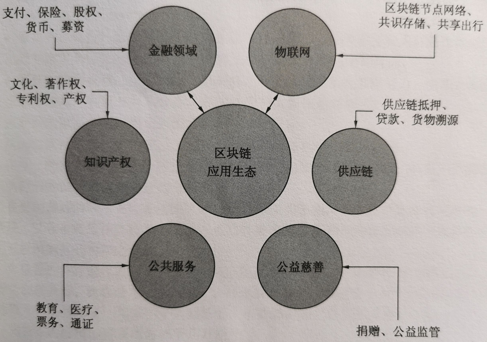

# Blockchain 区块链

区块链起源于比特币，2008 年由中本聪提出。区块链是分布式的共享账本，也就是分布式的数据库，具有去中心化、不可篡改、全程留痕、可以追溯、集体维护、公开透明等特点。

区块链是未来数字经济变革和重构互联网的重要技术（新基建）。

## 区块链的分类

区块链进入大发展时代，大量的概念被提出，使其逐渐进入了细分领域。根据不同的分类原则，可以细分如下：

### 1.以开放和权限划分

主要有三种类型：公链、联盟链和私链，具体说明如下。

- 公链：人人都可以加入，系统全面开放，所有节点的权限和等级平等，任何人都可
  以参与区块链，完全去中心化，不受机构控制，主要代表有 BTC 和 ETH。
- 联盟链：系统属于半开放，加入需要权限许可，使用仅限于联盟成员，一般应用在
  机构企业之间，主要代表有超级账本（ Hyperledger )和 R3 联盟。
- 私链：仅限个人或企业内部使用，系统封闭，外部无法加入，不完全解决去中心化
  信任问题，但是可以改善企业内部的流程制度，主要代表有 Multichain。

### 2.以链的应用领域划分

主要有两种类型：基链和行业链，具体说明如下。

- 基链：区块链使用底层通用的协议和 API，方便用户在链的基础上开发 DApp，一
  般来说，公链都是基链，主要代表有 ETH 和 EOS。
- 行业链：在底层的通用性上不如基链，一般是为某些行业定制协议和工具，可以解
  释为行业专用公链，主要代表有 BTM 和 SEER。

### 3.以程序独立划分

- 主链：一般指的是正式上线以后的区块链，独立自主并且承担主要的业务，在自有
  的网络之中自成生态环境，主要代表有 BTC 和 ETH。
- 侧链：不特指某个区块链，一般是作为主链的补充，侧链是为了实现加密货币在链
  之间的互相转移，与主链使用同样的协议传输，主要代表有 Mixin Network.

### 4.以链的层级关系划分

- 母链：能够不断生出新链，是某些区块链底层中的底层，主要代表有 NULS。
- 子链：基于母链的基础，再次构建的区块链，主要代表有 Press one。
  随着技术的发展，区块链的种类越来越多，以后也可能会出现新的概念。读者熟悉链
  的划分，会有利于在未来的学习和工作中，更好地理解不同链存在的意义。

## 区块链的相关概念

### P2P 网络（对等网络）

区块链是一个去中心化的分布式网络应用系统，它们是通过 P2P 网络进行通信。

对等网络与服务型网络不一样，P2P 网络的每个节点是逻辑平等的，没有特定的服务端和客户端。每个节点既对外提供服务，也在使用外部服务，而且每个节点的权限相同，任何单一节点丢失，都不会对整个网络稳定造成致命破坏。

### 数字货币

区块链基于密码学技术，创造出了密码货币，通过区块链的激励和发行机制，让货币得以流通。例如，比特币、以太币、莱特币等。

### ICO 首次币发行 

与 IPO（Initial Public Offering）首次公开募股不同。

ICO（Initial Coin Offering），是一种加密数字货币和区块链项目的资金募集方式，对投资者使用数字货币进行抵押和回报。

### DAO 分布式自治组织

DAO（Distributed Autonomous Organization）是区块链改变世界的核心技术之一。

DAO 通过区块链的共识和激励形式，可以在无人干预的情况下运转社区组织。它是以开源形式出现，每个人都可以贡献开发、购买权益股份、获得激励和共同推广。这是一种改变未来互联网的组织形式。

# 区块链的应用

## 区块链应用生态

## 区块链的不可篡改和溯源的相关应用

- 信息防伪：链上记录产品的地址和重要信息，可以精准追溯，并且不可篡改。
- 食品安全：根据区块链，记录和追溯食品供应链的每个环节。
- 信息安全：防止信息篡改和 DDOS 攻击等。
- 身份验证：通过区块链来保存、鉴别和验证身份权限。

## 通过区块链的去中心化和 Token，变革金融数字经济

- 数字货币：帮助发行映射现实资产的货币，不可增加，也不可减少。
- 跨境支付：减少中间交易环节，减少手续费用，实现点对点直接交易。
- 通证和供应链金融：提供资产凭证 Token 和交易合约，减少供应链金融融资和供应风险。
- 股票发行和交易：通过区块链技术，减少股票中间渠道和人为错误，提供更公平、更可信、更透明的交易平台。
- 众筹：应用最为广泛的就是 ICO 筹集项目资金。

## 在组织治理和管理方面，区块链也给出了新的解决方案

通过数字资产、数字交易、智能合约、共识激励和仲裁服务等，一体化给出了未来智能自治组织方案，变革结
构，极大节省了成本，提高了工作效率，自动产生社会经济价值。

## 案例：区块链技术对传统证券结算的变革

区块链逐渐被应用到证券市场领域，而最先与区块链结合的是证券结算，实现对传统证券结算的优化。

- 降低结算周期与成本，提高结算效率。
  - 以代码为基础的区块链技术，可以自动完成相应程序，结算参与人不需要分别记帐。
- 降低证券市场系统性风险。
  - 区块链具有数据无法篡改性，增加证券交易数据安全性。
  - 智能合约、自动交收、实时核查等技术，还可以在证券交易前端检测交收风险。
  - 自动锁定风险帐户并发出提示，从而在交易端化解违约风险。
  - 区块链网络不依赖中心机构的背书动作，而是基于共识机制，由众多独立的节点构成的。单一节点或者单个主体的系统故障，不会传导至其他主体，克服传统中心化结算下可能产生的系统性风险。
- 增加数据的开放性与结算过程的公正性、透明度。
  - 分布记帐的形式，使得网络中的成员，不需要第三方主体参与，就可以完成点对点交易，券款对付，交易即时完成。
  - 打破了传统证券交易双方信息不对称的局面，区块链网络中所有主体都可以平等获取交易信息。
  - 区块链技术下，各个结算参与主体，可以按照统一的标准，把数据存储在区块链数据中，并且数据更加真实可靠、及时全面，可以打破数据壁垒、增加数据的开放性和透明性。
- 自动结算，保证货银对付的实现。
  - 智能合约和区块链技术的结合，提升了证券交易与结算的自动化程序，实现了银货对付。
  - 智能合约经过共识机制的认定之后，就无法再修改或撤销，嵌入其中的资金与证券，将会被自动执行，无须再次确认或对账，证券交易更加便捷。
  - 证券与资金交收同时进行，没有时差，证券结算真正实现了 T+0，资金与证券交收要么同时成功，要么同时失败。
- 无需全约替代与交收担保，增强证券市场流动性。
  - 区块链证券结算可以实现中央对手方的违约担保功能，证券参与人无需在提供抵押品、备付金等担保。

