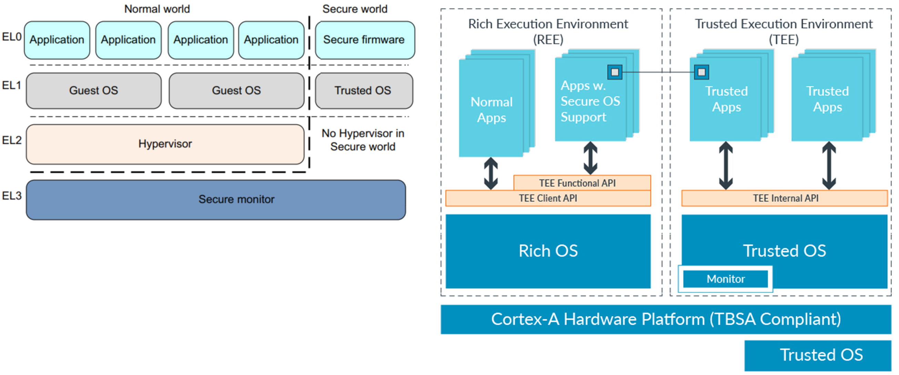
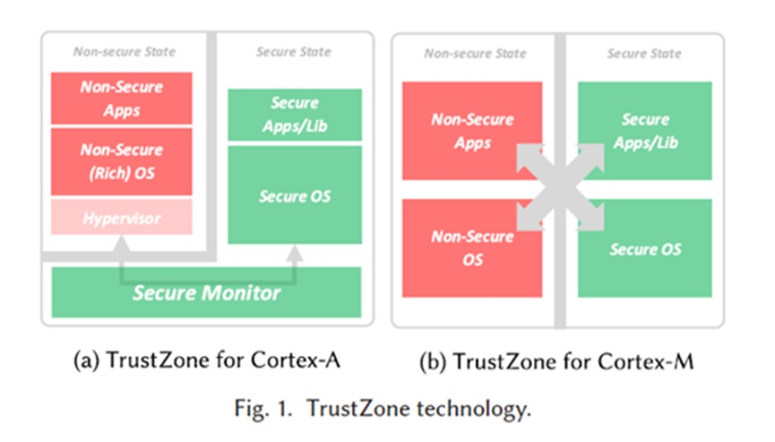
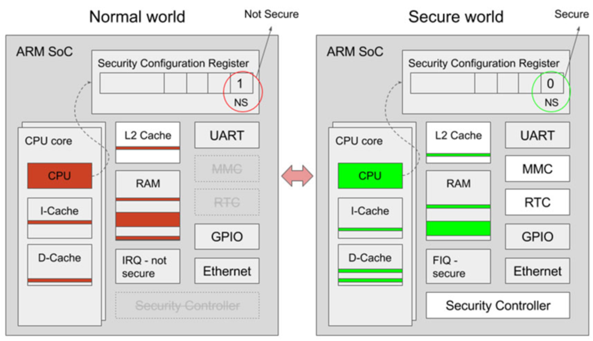
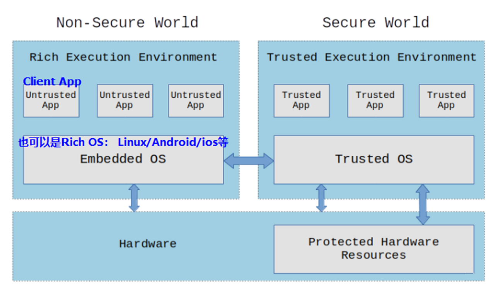
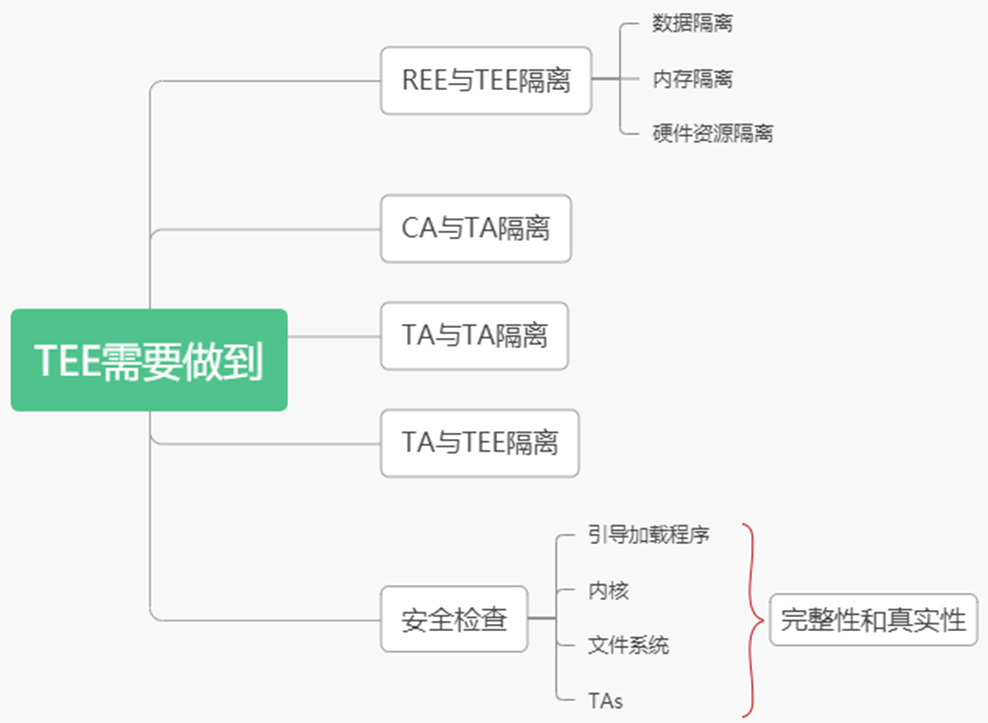

# TrustZone_TEE 可信执行环境

# ARM TrustZone

ARM TrustZone是ARM公司推出的SoC及CPU系统范围的安全解决方案，目前已在一些采用ARM指令集的应用处理器上广泛使用。

ARM TrustZone是基于硬件的安全功能，它通过对原有硬件架构进行修改，在处理器层次引入了两个不同权限的保护域——安全世界和普通世界，任何时刻处理器仅在其中的一个环境内运行。

同时这两个世界完全是硬件隔离的，并具有不同的权限，正常世界中运行的应用程序或操作系统访问安全世界的资源受到严格的限制，反过来安全世界中运行的程序可以正常访问正常世界中的资源。

这种两个世界之间的硬件隔离和不同权限等属性为保护应用程序的代码和数据提供了有效的机制：

- 通常正常世界用于运行商品操作系统（例如Android、iOS等），该操作系统提供了正常执行环境（Rich Execution Environment，REE）；
- 安全世界则始终使用安全的小内核（TEE-kernel）提供可信执行环境（Trusted Execution Environment，TEE），机密数据可以在TEE中被存储和访问。
- 这样一来即使正常世界中的操作系统被破坏或入侵（例如iOS已被越狱或Android已被ROOT），黑客依旧无法获取存储在TEE中的机密数据。

TrustZone 利用的是CPU时间片切换来模拟了安全世界，这两个世界（REE和TEE）可以将它理解成一个CPU上处理的两个进程，它们通过上下文切换来将CPU的时间片占满以利用CPU。

从安全角度，仅仅分时复用或拟化，是不足以确保安全的，因此ARM另外定义了安全框架，从硬件级别两个世界，包括Timer、TRNG、TZPC、MMU、Cache等相关设备，不同的芯片厂商会有自己的考虑，这个设备可能是双份的，或者是动态切换以达到隔离目的。

同时，安全侧也需要有一个可信操作系统执行应用。从原理上，REE侧和TEE侧是对等的，因此并不会性能的差异。应用程序的开发，除了使用TEE定义的标准接口，依赖的都POSIX API，使用标准的开发语言。

## Cortex-A 上采用的 TrustZone 架构

- 通常，ARM Cortex-A 处理器有3种执行模式：用户模式、内核模式和hypervisor模式。
- 在运行GNU/Linux的典型系统中，应用程序以用户模式运行，Linux内核以内核模式运行，而hypervisor模式不使用。
- 图中描述了Cortex-A上采用的TrustZone架构，该架构中还引入了一种称为**安全监控模式**的处理器模式，该模式负责在世界过渡时保留处理器状态，两个世界可以通过称为安全监视器调用（SMC）的特权指令进入监视模式并实现彼此切换。
- 在这种新模式下运行时，CPU处于安全状态，可以访问设备的所有外围设备和内存。不在这种模式下运行时，CPU处于非安全状态，只能访问外设的子集和特定范围的物理内存。

## Cortex-M 上采用的 TrustZone 架构

除了Cortex-A微架构外，ARM发布的新一代Cortex-M微架构同样为TrustZone提供了硬件支持。

- 与Cortex-A相同的是，Cortex-M依旧将处理器运行状态划分为安全世界和正常世界，并阻止运行于正常世界的软件直接访问安全资源。

- 不同的是，Cortex-M已针对更快的上下文切换和低功耗应用进行了优化。

- 具体来说，Cortex-M中世界之间的划分是基于内存映射的，并且转换是在异常处理代码中自动发生的（如图所示）。

- 这意味着，当从安全内存运行代码时，处理器状态为安全，而当从非安全内存运行代码时，处理器状态为非安全。

- Cortex-M中的TrustZone技术排除了监视模式，也不需要任何安全的监视软件，这大大减少了世界切换延迟，使得世界之间的转换为更高效。

- 为了在两个世界之间架起桥梁，Cortex-M引入了三个新指令：

  - secure gateway（SG）：SG指令用于在安全入口点的第一条指令中从非安全状态切换到安全状态
  - branch with exchange to non-secure state（BXNS）：安全软件使用BXNS指令来返回到非安全程序
  - branch with link and exchange to non-secure state（BLXNS）：安全软件使用BLXNS指令来调用非安全功能。
  - 最后，此外，Cortex-M 中的状态转换也可以由异常和中断触发。

  

## TrustZone 技术硬件框图

- 当安全配置寄存器bit0为1时，CPU切换执行REE侧 OS，CPU不能访问安全模块和安全内存（提前配置好）。
- 当安全配置寄存器bit0为0时，CPU切换执行TEE侧 OS，CPU可以访问任何模块和内存。

## TrustZone 安全隐患

- 当前已发现的TrustZone漏洞主要可以归纳为两类：
  - 一类是缺乏鲁棒的TEE实现，导致无法为应用程序提供安全的运行容器；
  - 另一类是实现TrustZone的硬件存在缺陷，攻击者可以针对硬件漏洞发起攻击，进而获取存储的机密数据。
- 根据国家漏洞数据库（National Vulnerability Database，NVD）和一些公司（例如，高通，华为和三星）发布的安全公告，已发现的有关TrustZone和基于TrustZone的TEE的漏洞已达到了130多个。
- 这些漏洞中的大多数都与TEE内核以及TEE驱动程序有关，例如缺乏输入验证、缓冲区溢出、过度读取、未初始化变量以及竞争条件等。
- 出现这种情况的原因在于，尽管在设计TEE时能够保证其具有安全的体系结构以及能够提供完善而鲁棒的隔离，但是TEE内部运行的代码可能包含一些漏洞，攻击者可以利用这些漏洞破坏TEE并进而损害整个系统的信任状态。
- 针对TEE中运行的代码存在的漏洞，业界尚缺乏用于验证和分析代码安全性的框架，同时TEE中也缺乏适当防御机制。
- 除了与TEE中运行的代码有关的漏洞外，在过去的几年中，研究者还发现了许多与实现TrustZone的硬件相关的漏洞，这些漏洞涉及构成平台信任根的组件、缓存、电源管理机制和FPGA等。

## TrustZone 的应用

- 用于提高物联网设备的安全
  - 随着“万物互联”概念的到来，物联网设备被大量的部署，而这一新的互联网浪潮能否成功在很大程度上取决于数十亿种不同连接设备的安全性。
  - 最近的一些针对物联网设备的攻击表明，设计不佳的连接设备被黑客入侵后会造成巨大的损失。因此，保护物联网设备的安全是实现“万物互联”必须攻克的一个难题。
  - 为了解决这个问题，ARM将TrustZone扩展到新一代微控制器。借助内置于物联网设备上的TrustZone，物联网设备制造商或软件开发者可以以较低的代价建立起可靠的安全防御体系。
  - 如今，ARM正在大力投资于物联网和嵌入式设备的规范与标准化，并且发布了平台安全体系结构（Platform Security Architecture，**PSA**）规范以及随附的名为**Trusted Firmware-M**的开源软件项目。
  - PSA主要是为保护低开销的IoT设备而设计的，可以在基于Cortex-M、Cortex-R和基于Cortex-A的设备上实现。
  - 不同的物联网设备制造商或开发者可以根据PSA，提供适合于自己设备的实现。
- 用于移动端环境的隐私保护
  - 现有的基于TrustZone开发的应用主要用于提高移动平台上数据和应用程序的安全性，通过将用户的机密数据保存在基于TrustZone构建的TEE中，即使黑客完全控制了REE中的OS，也无法获取这些机密数据。
  - 早在iPhone 5s中，Apple便已利用TrustZone保护其Touch ID，这可确保即使iOS受到完全破坏，用户的指纹数据仍然无法被窃取。
  - 2017年，谷歌也强制性要求所有配备指纹扫描仪的Android设备都需具有TEE。 如今，几乎所有的手机和平板电脑都部署了TEE。
- 用于云计算环境的隐私保护
  - 云计算厂商也推出了基于ARM架构的产品，在云端使用ARM架构已是大势所趋。
  - 目前已有一些研究迈出了在云上使用TrustZone的第一步
  - 例如在Zookeeper 中便使用TrustZone构建了受TEE保护的隐私代理，用于保护Zookeeper中存储的所有数据的安全。

# TEE = 可信执行环境

可信执行环境（TEE）是一种环境，其中执行的代码和访问的数据在机密性（没有人可以访问数据）和完整性（没有人可以更改代码及其行为）方面被隔离和保护。

## TEE 的硬件支持的几种方案 

我们可以在“沙箱”中隔离应用程序，例如使用容器。这将阻止应用程序查看和访问来自其他应用程序的数据。

但是内核呢？如何防止在内核空间中运行的代码被利用来访问受信任应用程序使用的某个外围设备或内存区域？

**软件不能保护软件！**所以我们需要硬件上的支持来实现TEE。我们需要一种方法来划分和隔离硬件（总线、外围设备、内存区域、中断等），以便运行的代码不能访问受保护的资源。

在现代处理器中有许多技术可用于实现TEE：

- Arm 的 TrustZone 技术提供了一种高效的、系统范围的安全方法，它将硬件强制隔离内置于 CPU 中。
- 多区域安全是 Hex-Five 安全创建的第一个 RISC-V 可信执行环境。
- AMD 平台安全处理器（PSP）的正式名称是 AMD 安全技术，是一个集成在 AMD 微处理器中的可信执行环境子系统。
- Intel Software Guard Extensions（SGX）是一组与安全相关的指令代码，内置于一些现代 Intel CPU 中，可用于实现 TEE。
- 苹果使用了一种专用处理器 SEP（Secure Enclave processor）来实现数据保护、触摸 ID 和人脸识别等功能。SEP 负责处理密钥和其他信息，如生物特征识别，这些信息非常敏感，不会被应用处理器处理。
- 谷歌也有一个类似的解决方案称为 Titan M，这是一些 Android Pixel 设备上可用的外部芯片，可以实现TEE和处理安全引导、锁屏保护、磁盘加密等功能。

## TEE 的必要性

- 软件越来越复杂，像Linux内核和Android开源项目（AOSP）这样的大型项目有数百万行代码，这意味着会有很多bugs。在修复某个漏洞时，有时还会造成新的bug，虽然我们可以防止某些类型的错误，但软件中总是会有错误。其中一些漏洞可能会暴露安全漏洞，更糟糕的是，如果bug在内核中，整个系统就会受到损害。
- 那么如何解决这个问题呢？如果软件遭到破坏，如何保护您在系统中的资产？
- 解决这个问题的一种方法是**创建一个隔离的环境**，在这个环境中，即使操作系统受到破坏，您的数据也会受到保护。这就是我们所说的可信执行环境或TEE。

## TEE 基本原理

在TEE中，所有受信任的应用程序（TAs）和相关数据都与正常（不可信）操作系统及其应用程序完全隔离。另外，受信任的应用程序必须与其他受信任的应用程序以及TEE本身隔离运行。

另外，TEE只接受经过适当授权并由其他授权代码检查的代码来执行。因此，在TEE中，我们需要一个安全引导特性来检查所有操作系统组件（引导加载程序、内核、文件系统、可信应用程序等）的完整性和真实性。这样可以确保在设备关机时没有人篡改操作系统的代码。

TEE实际上是一个执行环境（有或没有操作系统），可以独占访问某些硬件资源。

## TEE 用例

- TEE 是存储和管理设备加密密钥的一个很好的解决方案，可以用来验证操作系统的完整性。
- TEE 非常适合实现生物特征认证方法（面部识别、指纹传感器和语音授权），隔离设备内的资源以存储生物特征算法、用户凭证和相关数据。
- TEE 可用于移动电子商务应用，如移动钱包、点对点支付或非接触式支付，以存储和管理凭证和敏感数据。
- TEE 也是保护智能手机、平板电脑和智能电视等连接设备上的数字版权信息（书籍、电影、音频等）的合适环境。虽然数字内容在传输或流式传输过程中使用加密进行保护，但一旦内容在设备上被解密，TEE 将通过确保解密的内容不会暴露于操作系统环境来保护内容。

