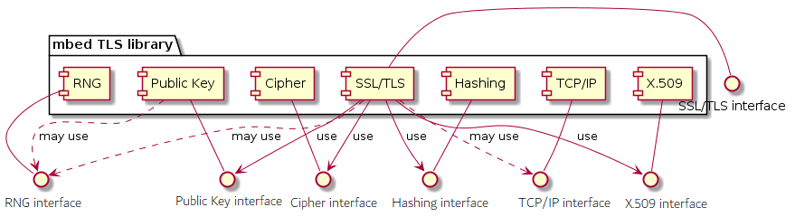
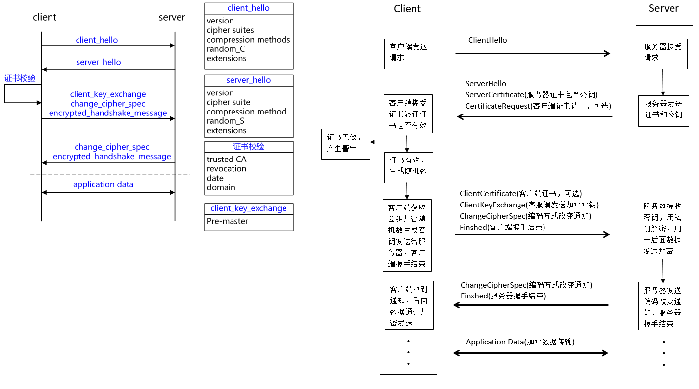
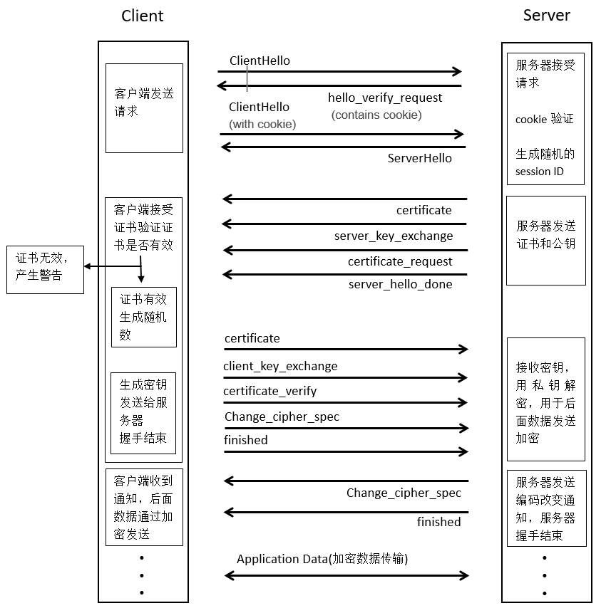

# mbedTLS 算法库

mbedTLS（前身 PolarSSL）是一个由 ARM 公司开源和维护的 SSL/TLS 算法库。其使用 C 编程语言以最小的编码占用空间实现了 TLS/SSL 功能及各种加密算法，易于理解、使用、集成和扩展，方便开发人员轻松地在嵌入式产品中使用 TLS/SSL 功能。

mbedTLS主要是面向小型嵌入式设备，代码紧凑，最小完整的TLS堆栈需要60KB的程序空间和64KB的RAM空间，而且执行效率高，可以说是行业内最小巧的SSL加密算法库。

另外，mbedTLS是高度模块化的设计：每个组件，如加密函数，可以独立于框架的其余部分使用。mbedTLS完全是由C语言编写的，没有外部依赖，因此，mbedTLS是应用于嵌入式系统最理想的TLS加密算法库。

mbedTLS 没有 core，而是有一些组件构成，我们可以通过配置头文件 (*include/mbedtls/config.h*) 加入或排除这些组件。

mbedTLS 软件包提供了如下的能力:

- 完整的 SSL v3、TLS v1.0、TLS v1.1 和 TLS v1.2 协议实现
- X.509 证书处理
- 基于 TCP 的 TLS 传输加密
- Hashing
- 基于 UDP 的 DTLS（Datagram TLS）传输加密
- Random number generation (RNG)
- 其它加解密库实现

## 工作原理

mbedTLS 建立安全通信连接需要经过以下几个步骤：

- 初始化 TLS/SSL 上下文
- 建立 TLS/SSL 握手
- 发送、接收数据
- 交互完成，关闭连接

其中，最关键的步骤就是 TLS/SSL 握手 连接的建立，这里需要进行证书校验。

## TLS/SSL 握手流程

## DTLS 握手流程

为了避免拒绝服务攻击，DTLS 采用和 IKE 一样的无状态 cookie 技术。当客户端发送 client hello 消息后，服务器发送 HelloVerifyRequest 消息，这个消息包含了无状态 cookie。客户端收到之后必须重传添加上了 cookie 的 clienthello。

DTLS 握手流程如下图所示：

