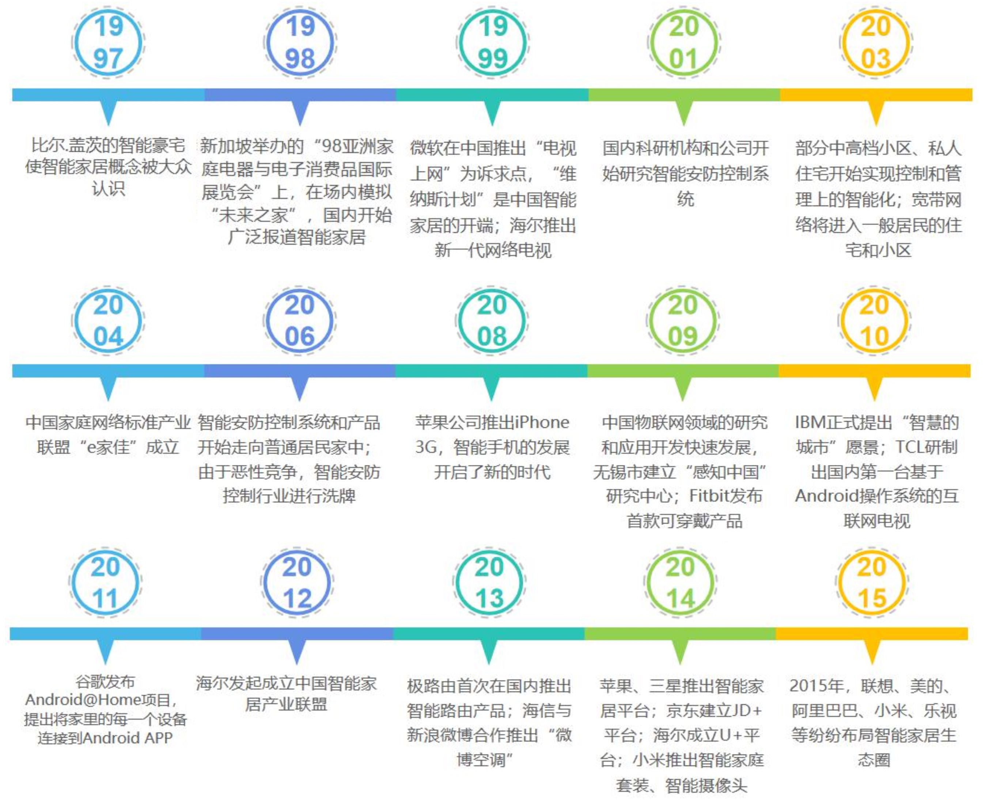
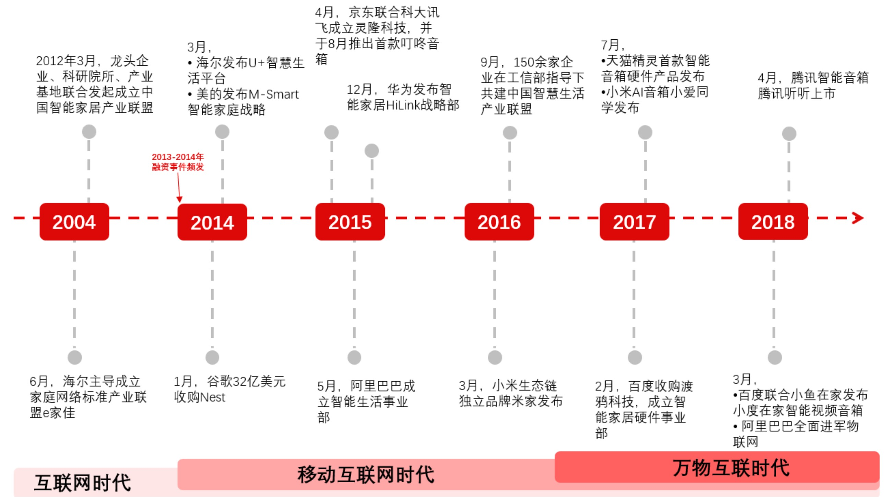
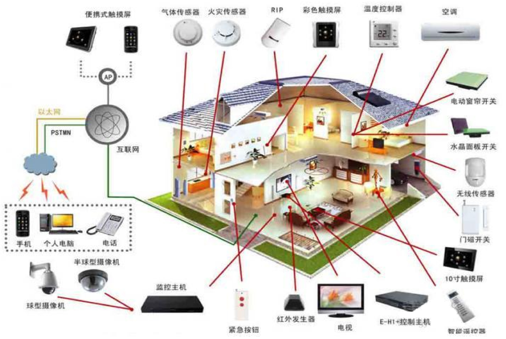
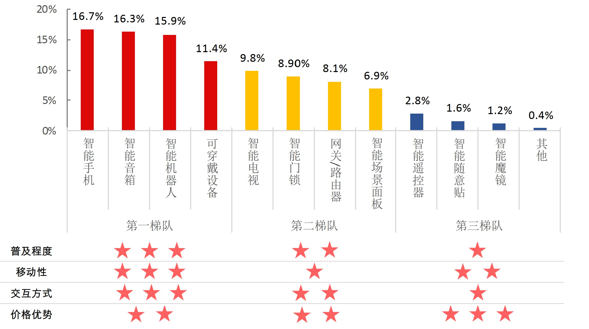
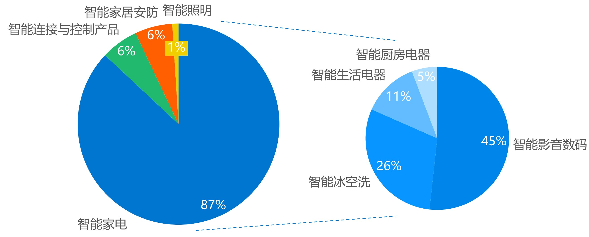

# Smart Home 智能家居

## 什么是智能家居

智能家居（smart home, home automation）是以住宅为单位，基于物联网技术，由硬件、软件系统、云平台构成的家居生态圈。

- 就是以住宅为平台，利用综合布线技术、网络通信技术、安全防范技术、自动控制技术、音视频技术将家居生活有关的设施集成，构建高效的住宅设施与家庭日程事务的管理系统；
- 基于物联网技术，由硬件、软件系统、云计算平台构成的一个家庭生态圈，实现人远程控制设备、设备间互联互通、设备自我学习等功能。
- 最后，通过收集、分析用户行为数据为用户提供个性化的生活服务，提升家居安全性、便利性、舒适性、艺术性，使家居生活更加安全、舒适、便捷，并实现环保节能的居住环境。

例如，智能家居的家庭智能化系统：

- 三表抄送功能
- 安防报警功能
- 可视对讲动能
- 监控中心功能
- 家电控制功能
- 有线电视接入功能
- 住房信息留言功能
- 家庭智能控制面板
- 智能布线箱
- 宽带网接入和系统软件配置

## 智能家居行业发展历程

智能家居经历了互联网时代、移动互联网时代，进入物联网时代。

智能家居这个概念，从比尔.盖茨的豪宅说起，至今已经有二十余年。不同于当下热门的人工智能、物联网等新生领域，智能家居是伴随着互联网、移动互联网和物联网的发展而发展。智能家居可谓“长盛不衰”，每个阶段都有一些新的扩展。

中国智能家居行业发展历程：

## "All in One" 全能型（万物互联型 ） 智能家居

智能家居是未来 “万物互联” 的雏形。相同之处，例如，都需要管理各种各样的传感器、收集各种传感器的数据、都采用无线通信、低功耗设备等。

智能家居、智能安防、智能建筑、消防这四大模块，不断地在融合、统一，将形成万物互联的雏形，以及更大的市场规模!

智能家居已经过好几个阶段。当前，处于融合演变期。例如，三网融合（All in One），即安防、消防、comfortable 提高生活质量（净化器、净水器等）相关的控制功能，将统一到一台主机上（All in One）。另外，在无线通信上，也会出现融合（All in One）,即 主机上，不仅会有 Sub-1G 的无线控制器（例，Z-Wave、其他私有的无线协议），还会有 2.4 G 的无线控制器（例，BLE、RF6、WI-Fi）

AIoT 以及 5G 时代，数据将变得更有价值，才能达到真正“智能家居”。  

智能家居最终目的是让家庭更舒适，更方便，更安全，更符合环保。随着人类消费需求和住宅智能化的不断发展，智能家居系统拥有更加丰富的内容，系统配置也越来越复杂。
全面的智能家居系统有二十余种，涉及到网关、安防、能源、教育、健康、金融等方方面面。

智能家居主要子系统有：智能家居布线系统、家庭网络系统、控制管理系统、窗帘控制系统、照明控制系统、安防监控系统、背景音乐系统、家庭影院与娱乐系统、家庭环境控制系统等。  

- 智能家居布线系统是一个以家为单位的小型综合布线系统，从功用说它是一个能支持语音/数据、多媒体、家庭自动化、保安等多种应用的传输通道，是智能家居系统的基础。它可以作为一个完善的智能小区综合布线系统的一部份，也可以完全独立成为一套综合布线系统。

- 家庭网络是在家庭范围内将PC、家居家电、安全系统、照明系统和广域网相连接的一种新技术。涉及家庭上班、网上购物、远程医疗保健、网络学校和培训、老幼入托、就业、游戏、休闲等。各国家庭网络市场的发展均以家庭宽带市场发展为基础，并紧跟宽带市场发展的步伐，与其保持几乎相同的速率，在迅速发展壮大。

- 智能管理控制是指以住宅为平台，构建兼备建筑、网络通信、信息家电、设备自动化，集系统、结构、服务、管理为一体的高效、舒适、安全、便利、环保的居住环境，将家中的各种设备连接到一起，提供家电控制、照明控制、窗帘控制、电话远程控制、室内外遥控、防盗报警、以及可编程定时控制等多种功能和手段，帮助家庭与外部保持信息交流畅通，优化人们的生活方式，帮助人们有效安排时间，增强家居生活的安全性。

- 家庭安防系统包括门磁开关、紧急求助、烟雾检测报警、燃气泄露报警、碎玻探测报警、红外微波探测报警等。安防系统可以对陌生人入侵、煤气泄漏、火灾等情况及时发现并通知主人，视频监控系统可以依靠安装在室外的摄像机有效的阻止小偷进一步行动，并且也可以在事后取证给警方提供有利证据。  

- 智能家居照明控制系统帮助实现对全宅灯光的智能管理，可以用遥控等多种智能控制方式实现对全宅灯光的遥控开关，调光，全开全关及“会客、影院”等多种一键式灯光场景效果的实现，从而达到智能照明的节能、环保、舒适、方便的功能。根据环境及用户需求的变化，只需做软件修改设置就可以实现灯光布局的改变和功能扩充。  

- 智能家居窗帘控制系统广泛应用于高级公寓、家庭住宅等，只需遥控一下，窗帘就自动开合，保护业主的个人隐私以及遮阳挡尘，非常方便；还可以实现窗帘的定时开关、灯光转换、场景控制等更多高级的窗帘控制功能。  

- 智能家庭影院与娱乐系统是指把家庭影音室内所有影音设备(功放，音响，高清播放机，投影机，投影幕，高清电视)以及影院环境设备(空调，地暖，电动窗帘)完整地整体智能控制起来，创造智能的家庭影院视听与娱乐环境，以达到最佳的观影、听音乐、游戏娱乐的视听效果。通过控制实现影院、音乐、游戏等各种情景控制模式快速进入与自由切换，以节省单独手动控制设备开关与调节时间。  

- 智能家居控制系统集住宅设备控制及环境监控于一体，提供全方位的信息交换功能，并通过Internet及通讯网络（4G、5G）与外部保持音视频及数据信息交流，增强住宅的安全性、舒适性，可排除各种危险隐患。系统集成了家电设备控制、灯光控制、安防监控、环境监控、智能浇灌、门禁管理、三表抄送、车库管理等功能。常用在住宅、公寓、酒店及办公场所等。智能家居控制系统承担着管家的角色，协调管控各场景系统。  

  

## 中国智能家居从业者的用户入口调查

## 中国智能家居时称规模各部分占比  

根据艾瑞咨询数据，2017年中国智能家居市场规模为3342.3亿元，同比增长24.8%，其中智能家电规模为2828.0亿元，占比87%。预计未来三年内，智能家居和智能家电的市场规模将保持21.4%和22.2%的年复合增长率，到2020年市场规模将达到5819.3亿元和5155.0亿元。  

# 智能家居现状

## 国外智能家居

### 亚马逊

- 智能音箱 Echo 系列、语音助手 Alexa 等。通过旗下基金 Alexa Fund 布局智能家居全产业链。
- 2018 年，超过 10亿美元，收购美国加州的智能门铃企业 Ring
- 投资智能安防摄像头公司 Scout Security、智能音箱系统公司 Musaic、人工智能技术公司 Semantica Labs、人工智能实验工具公司 Comet。

### 谷歌

- 主要投资，以 32 亿美元收购 Nest，其主要业务包括智能恒温器、智能摄像头等。
- 以 Nest 为主体，收购 Dropcam、Revolo 等智能家居公司。
- 谷歌的母公司 Alphabet 也成立了相对独立的 Google Ventures、CapitalG、Gradient Ventures 等，对尖端技术进行不同程度的投资。例如 Google Ventures 已经投资了 3 百多家企业，包括智能家居、人工智能、大数据等领域。

### Apple

- Apple 的智能家居平台：Home Kit。此平台开放数据接口给开发者。
- 收购 Regaind、Lattice Data 等人工智能相关技术公司。
- 收购很多半导体公司，例如 Anobit Technologies、PrimeSense、Authen Tec 等。
- 收购智能家居初创公司 Silk Labs。
- 苹果与各国房地产商联合推出智能家居项目，意图利用苹果封闭稳定的智能家居生态，提供全屋智能定制方案。

### 微软

微软公司开发的 “未来之家”。

### 三星

智能家居平台：Smart Home

### Verzion 公司

构建智能家居业务平台，通过提供多样化服务捆绑用户，打包销售智能设备。

## 国内智能家居

### 阿里巴巴

- 智能客厅：由自有操作系统阿里云OS（YunOS）联合各大智能家居厂商，共同打造智能家居环境生态。
- 包括阿里云智能电视、天猫魔盒、智能空调、智能热水器等众多智能家居设备。
- 阿里与海尔联合推出海尔阿里电视，主打电视购物的概念。同时，国美也加入进来。
- 成立阿里巴巴智能生活事业部，全面进军智能生活领域等。将电商销售资源、云端数据服务、内容平台进行集成，加速智能硬件的孵化速度等，旨在打造全产业链。
- 成立 IoT合作伙伴计划联盟（IoT Connectivity Alliance，简称 ICA 标准联盟）
- 天猫精灵，进入智能智能音箱市场，把天猫精灵打造成智能家居控制中心。

### 腾讯

- 2018 年，腾讯也推出了自己的智能音箱——腾讯听听。
- 微信智能硬件平台

### 百度

- 小度音箱
- 百度的天工合作伙伴计划，包括百度智能家居开放平台——度家，涵盖多种智能家居设备。从连接、识别、储存、计算、安全等方面全方位地提供开放平台支持。

### 小米

- 2018 年的 AIoT 开发者大会，宣布成立 “小米 AIoT 开发者基金”。
- 小米与宜家达成全球战略合作协议，宜家的产品将会全线进入到小米的智能家居平台。
- 小米生态链中的智能家居企业有多家，其中，华米、云米在 2018 年实现了上市。
  - 华米科技，产品主要在可穿戴设备领域。例，华米推出的 Amazfit 羚羊轻户外跑鞋。
  - 云米科技，产品主要是智能净水系统、智能电视。推出了全屋互联网家电的概念。

### 华为

- 现阶段的华为，更多的是开放智能家居平台、操作系统源代码的方式，与智能家居厂商进行合作。
- 华为与京东签订合作协议，双方智能产品可以互联互通。
- 华为旗下的 HiLink 系统、鸿蒙 OS 作为智能家居控制中枢，HarmonyOS Connect生态。

### 联想

- 在智能家居领域，投资了旷视科技、中奥科技、超融合技术厂商 SmartX 等智能家居基础技术领导厂商。
- 同时，推出了 SIOT 合作社计划，针对新加入的开发者也推出了千万奖励加速计划。
- 通过智能家居设备，不断采集用户数据，通过大数据和云计算分析用户，形成智能家居闭环。

### 中国移动 “和家庭”

- “和家庭”，面向家庭用户提供视频娱乐、智能家居、健康、教育等一系列产品服务的平台。

- “魔百盒” 是打造 “和家庭” 智能家居解决方案的核心设备和一站式服务的入口。
- “灵犀语音助手 3.1 ” 可以用语音实现智能家居的操控。以语言识别切入智能家居。

### 中国电信 “悦 me” 

- “悦 me” 智能家居产品，可以为用户提供家庭信息化服务的综合解决方案。
- 与电视机厂商、芯片厂商、终端厂商、渠道商、应用提供商等共同发起，成立智能家居产业联盟。

# 智能家居的产品

## 智能摄像头

智能安防产品作为企业进军智能家居领域的入口之一，其中最火爆的就是智能摄像头。例如，三星 SmartCam HD Pro、莹石、360 家庭卫士、联想看家宝。

## 智能音箱

- 智能音箱的扩展表明人工智能技术在语音领域的长足发展，从而进入市场化的阶段。
- 可以进行语音交流的智能音箱，作为智能家居的控制中枢。
- 智能音箱作为入口，高频地使用，可以很方便地收集用户的各种数据。
- 语音作为人原本的属性之一，语音交流更容易被用户在潜意识里当作两个人在进行交流。
- 例如，小米 AI 音箱。小米音箱最大优势在于小米庞大的生态链。小米 AI 音箱能够连接小米旗下的任何智能家居产品。
- 例如，Sonos 无线智能扬声器。
- 小度：人工智能音箱

## 全屋智能家居控制系统

全屋智能家居控制系统涉及很多方面，例如，智能灯光控制系统、智能电器控制系统、安防系统、家庭影院系统、环境监测系统、能源管理系统等。

例如，LifeSmart 云起，由杭州行至云起科技有限公司研制发布。产品致力于让软、硬件的结合服务于智能、环保的生活体验，上市单品有智慧中心、智能开关、智能窗帘、环境感应器、动态感应器和入墙开关等全屋智能系列产品 。

