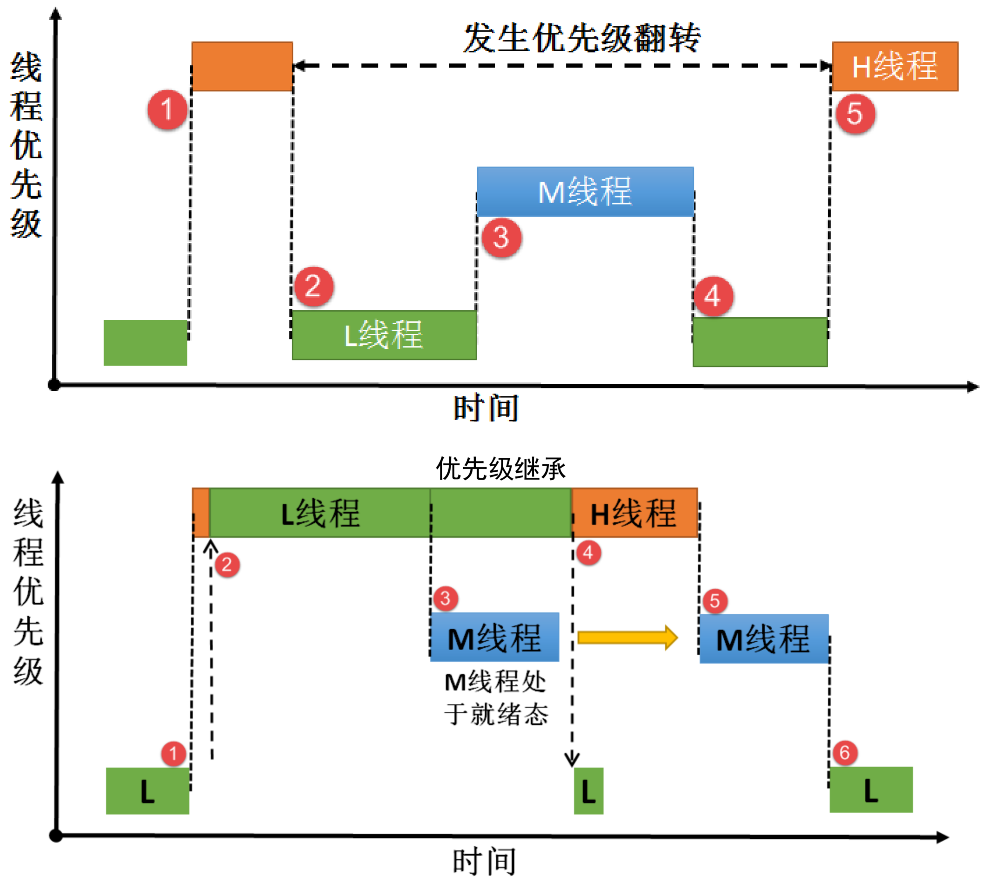

# RTOS Bug 常见问题、原因分析、解决方案

使用 RTOS 会使调试复杂化。

RTOS 可能会引入诸如优先级反转、死锁和任务抖动等问题。


# ■■■■■■■■■■■■■■■■■■■■■■

# 互斥量 vs 二值信号量 

- 拥有互斥量的线程拥有互斥量的所有权，互斥量支持递归访问且能防止线程**优先级翻转**；  
- 持有该互斥量的线程也能够再次获得这个锁而不被挂起，这就是**递归访问**。
- 并且互斥量只能由持有线程释放，而信号量则可以由任何线程释放。  
-  在信号量中， 由于已经不存在可用的信号量，线程递归获取信号量时会发生主动挂起（最终形成**死锁**） 。  
- 如果想要用于实现同步（线程之间或者线程与中断之间）， 二值信号量或许是更好的选择， 虽然互斥量也可以用于线程与线程、 线程与中断的同步，但是互斥量更多的是用于保护资源的互锁。用于互锁的互斥量可以充当保护资源的令牌。  
- 用于临界资源的保护一般建议使用互斥量。  
- 注意的是互斥量不能在中断服务函数中使用。 
  - 其他能挂起的操作也都不能用在中断中。 
  - 因为互斥锁上的锁定操作可以睡眠，并且在 ISR 中睡眠是非法的。导致中断无法退出，系统无法正常调试。如果您在中断时进行任何阻塞调用，则调度程序将永远不会运行。
  - 系统中，有一个线程上下文和一个中断上下文。中断由硬件调用，而线程由RTOS调度程序调度。现在当中断发生时，任何线程都将立即被抢占;中断必须运行完成，只能被优先级较高的中断（支持嵌套中断）抢占。所有挂起的中断将在调度程序运行之前运行完毕。
  - 请改用自旋锁。在中断处理程序中可以使用自旋锁”意思是使用自旋锁即使它一时获取不到需要的资源，也会在那里自旋，不会让出处理器，而导致睡眠。


# 优先级反转

## 现象：

- 优先级反转是实时系统中的一个问题，当使用基于优先级的抢占式内核时会发生。
- 使用信号量会导致的另一个潜在问题是线程优先级翻转问题。  
  - 所谓优先级翻转，即当一个高优先级线程试图通过信号量机制访问共享资源时，如果该信号量已被一低优先级线程持有，而这个低优先级线程在运行过程中可能又被其它一些中等优先级的线程抢占，因此造成高优先级线程被许多具有较低优先级的线程阻塞，实时性难以得到保证。  
  - 有优先级为 A、 B 和 C 的三个线程，优先级 A> B > C。
  - 线程 A， B 处于挂起状态，等待某一事件触发，线程 C 正在运行，此时线程 C 开始使用某一共享资源 M。
  - 在使用过程中，线程 A 等待的事件到来，线程 A 转为就绪态，因为它比线程 C 优先级高，所以立即执行。
  - 但是当线程 A 要使用共享资源 M 时，由于其正在被线程 C 使用，因此线程 A 被挂起切换到线程 C 运行。
  - 如果此时线程 B 等待的事件到来，则线程 B 转为就绪态。
  - 由于线程 B 的优先级比线程 C 高，因此线程 B 开始运行，直到其运行完毕，线程 C 才开始运行。
  - 只有当线程 C 释放共享资源 M 后，线程 A 才得以执行。
  - 在这种情况下，优先级发生了翻转：线程 B 先于线程 A 运行。
  - 这样便不能保证高优先级线程的响应时间。  
- 优先级翻转的危害很大
  - 发生优先级翻转，对我们操作系统是致命的危害，会导致系统的高优先级线程阻塞时间过长。  
  - 假如很多个这样子的（中等优先级）线程打断最低优先级的线程，那这个系统最高优先级线程岂不是崩溃了。特别是对时序要求比较严格的系统。

## 解决方案：避免优先级反转

- 可以使用 RTOS 的互斥量机制来解决上面描述的优先级反转问题。互斥量可以解决优先级翻转问题，实现的是**优先级继承算法**。
  - 优先级继承是通过在线程 A 尝试获取共享资源而被挂起的期间内，将线程 C 的优先级提升到线程 A 的优先级别，从而解决优先级翻转引起的问题。
  - 这样能够防止 C（间接地防止 A）被 B 抢占。
  - 优先级继承是指，提高某个占有某种资源的低优先级线程的优先级，使之与所有等待该资源的线程中优先级最高的那个线程的优先级相等，然后执行，而当这个低优先级线程释放该资源时，优先级重新回到初始设定。
  - 因此，继承优先级的线程避免了系统资源被任何中间优先级的线程抢占。  
  - 这个优先级继承机制确保高优先级线程进入阻塞状态的时间尽可能短，以及将已经出现的 “优先级翻转” 危害降低到最小。但要完全消除需要在设计时避免。
  
- 注意：在获得互斥量后，请尽快释放互斥量，并且在持有互斥量的过程中，不得再行更改持有互斥量线程的优先级。  

- 使用 Tracealyzer 的执行实例视图，开发者立刻就能发现问题。

  


# 死锁

## 现象：

- 死锁是至少两个任务相互等待另一个任务拥有的资源，导致任务都无法继续进行，就会发生死锁。
- 死锁可能不会立即发生，它很大程度上取决于两个任务何时需要彼此的资源。
- 例如， 在信号量中， 由于已经不存在可用的信号量，线程递归获取信号量时会发生主动挂起（最终形成**死锁**） 。  

## 检测方法：

- 通过监视/显示每个任务的执行频率（RTOS 切换任务的频率）, 来检测是否有死锁。
- 任务中加放一些计数器，如果至少两个任务的计数出现停止，则可能存在死锁。

## 解决方案：避免死锁

- 在设计时避免死锁的发生，如所有的任务都按照固定的顺序使用共享资源，或者同一时间任务不持有多个共享资源。
- 任务先获取所有必需的资源，以相同的顺序获取它们，以相反的顺序释放它们。
- 在 RTOS API 调用中使用超时机制，以避免永远等待资源可用。
- 检查 RTOS API 返回的错误代码，以确保对所需资源的请求成功。


# 线程饥饿

## 现象：

- 在嵌入式多任务系统中，一些任务可能会执行缓慢，或者甚至得不到执行，常见的原因是由于优先级顺序设置不正确导致。
- 高优先级的任务使用了太多的 CPU 时间，低优先级的任务可能就没有足够的时间执行，这就是所谓的线程饥饿。
- 饥饿的影响是响应性和产品特性的下降，例如嵌入式目标的显示更新缓慢、通信堆栈中的数据包丢失、操作界面响应迟缓等。

## 解决方案：解决饥饿问题

- 优化消耗大多数CPU 带宽的代码。例如，减少该任务/线程的时间片
- 高优先级应该保留给可预测、循环执行、且循环周期较短的任务。
- 对于高优先级、CPU占用时间长的任务应该拆分为多个任务，缩小时间关键代码，通过任务同步机制，将占用CPU时间多的工作交给中或低优先级任务处理。
- 将受影响的任务的优先级提高，确实可以改善问题，但违背了使用优先级的意义。


# 线程抖动

## 现象：

- 周期性执行的任务，随机发生的延迟时间叫做**抖动**。

- 虽然轻微的抖动很难避免，但是抖动太严重就会导致性能变差，间歇性的数据丢失。

- 例如，每隔 5 ms 调整电机的控制参数，如果控制任务的抖动过大就会使得控制性能就变差。

- 除了线程饥饿会导致抖动之外，RTOS 系统配置也会有影响，例如系统节拍定时器节拍频率。

  

## 解决方案：

- 理想情况下，两个节拍之间的时间应该比系统中最频繁任务的周期时间短得多。
- 使用 Tracealyzer 通过记录任务执行的时间，在以时间为坐标的图上很快可以发现抖动很大的执行实例，假如这是对抖动敏感的任务，这可能就是导致系统问题的原因了。

# ■■■■■■■■■■■■■■■■■■■■■■

# 中断响应

## 现象：

- 在临界代码处理时，RTOS 和应用程序代码通常必须禁用中断。关中断会影响系统对事件的响应，RTOS 应用中尽量减少中断禁用时间。
- 中断被禁用的时间很大程度上取决于 CPU、其时钟速率、应用程序和调用的 RTOS 服务。

## 解决方案：

- 如果最大中断禁用时间是由 RTOS 引起的，则可以采用以下方法优化中断响应时间：
  - 查找并使用中断禁用时间较低的 RTOS API。
  - 增加 CPU 的时钟速率。
  - 使用非内核感知中断来处理高度时间敏感的代码。

# ■■■■■■■■■■■■■■■■■■■■■■

# 定时、延时相关

## RTOS 如何实现高精度延时、定时

### 方法一：用另外一个硬件定时器，单独使用，产生中断来精准定时。

### 方法二：共用 SysTick 时钟节拍（OS Tick）来高精度延时、定时

- 定时器的最小精度是由系统时钟节拍所决定（1 OS Tick = 1/ TICK_PER_SECOND 秒，定时器设定的时间必须是 OS Tick 的整数倍。  

- 当需要实现更短时间长度的系统定时时，例如 OS Tick 是 10ms，而程序需要实现 1ms 的定时或延时，这种时候操作系统定时器将不能够满足要求，只能通过读取系统某个硬件定时器的计数器或直接使用硬件定时器的方式。  

- 在 Cortex-M 系 列 中， SysTick 已经被 用 于 作 为 OS Tick 使 用， 它 被 配 置 成 1/ TICK_PER_SECOND 秒后触发一 次中断的方式，中断处理函数使用 Cortex-M3 默认的 SysTick_Handler 名字。  

- 在 Cortex-M3 的 CMSIS（Cortex Microcontroller Software Interface Standard）规范中规定了 SystemCoreClock 代表芯片的主频，所以基于 SysTick 以及 SystemCoreClock，我们能够使用 SysTick 获得一个精确的延时函数。

- 高精度延时的例程  。例如，Cortex-M3 上的基于 SysTick 的精确延时（需要系统在使能 SysTick 后使用）： 

  ```c
  void hw_us_delay(rt_uint32_t us)
  {
      uint32_t delta;
      /* 获 得 延 时 经 过 的 tick 数 */
      us = us * (SysTick->LOAD/(1000000/TICK_PER_SECOND));
      /* 获 得 当 前 时 间 */
      delta = SysTick->VAL;
      /* 循 环 获 得 当 前 时 间， 直 到 达 到 指 定 的 时 间 后 退 出 循 环 */
      while (delta - SysTick->VAL< us);
  }    
  ```

  - 注意：其中入口参数 us 指示出需要延时的微秒数目，这个函数只能支持低于 1 OS Tick 的延时，否则 SysTick 会出现溢出而不能够获得指定的延时时间。  


