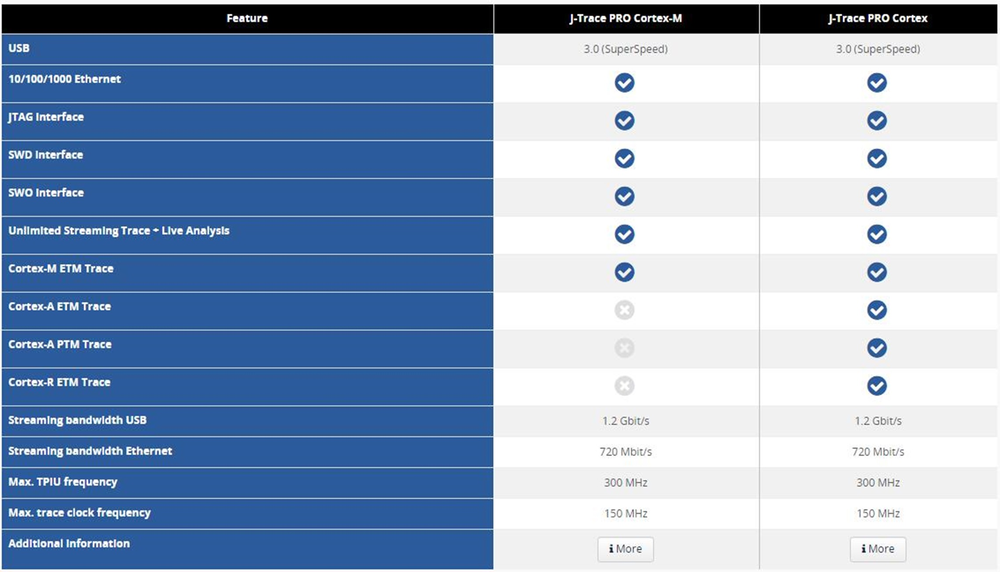

# ■■■■■■■■■■■■■■■■■■■■■■

# RTOS Debug 调试方法、组件、软件包、工具

- 调试嵌入式系统是一项重大挑战。使用 RTOS 会使调试复杂化。RTOS 可能会引入诸如优先级反转、死锁和任务抖动等问题。
- IDE 内置的调试器通常不足以调试基于 RTOS 的实时系统。

- 可以使用全新的调试技术(例如跟踪)来调试他们的系统。这些工具可以记录任务开始和结束执行的时间以及事件发生的时间，例如数据被放入消息队列或互斥锁被锁定。
- 甚至可以使用跟踪工具来验证应用程序是否按预期执行。

# ■■■■■■■■■■■■■■■■■■■■■■

# Debug 调试方法、组件、软件包

## Log 日志

- 提供日志输出功能。
- 日志严重级别由高到低依次为错误、警告、提示和调试；
- 支持静态和动态设置日志系统的过滤级别；
- 支持彩色信息输出和时间戳标记，以及用户指定 TAG 字符串。

## SystemView

- 测试/调试实时嵌入式系统的另一个非常有用的工具是 SEGGER 的 SystemView。此工具通常与 RTOS 一起工作，按时间顺序显示任务和 ISR 的执行，可以查看每个任务需要执行的时间（最小/平均/最大），任务何时就绪，每个任务实际开始执行时间，ISR 何时执行等。
- SystemView 可以帮助你发现不易发现的错误。但 SystemView 需要向目标系统添加记录 RTOS 事件和 ISR 的驻留代码(由 SEGGER 免费提供)，SystemView 还会消耗少量的 RAM 来缓存这些事件。
- SystemView 会按时间顺序显示 ISR 和任务的执行，收集运行时统计数据，如最小和最大执行时间、ISR 与任务之间的关系、CPU 负载等。

## μC/Probe

- Micrium 的 μC/Probe，这是一个通用工具，它允许开发人员在不干扰 CPU 的情况下，可视化和改变正在运行的嵌入式目标的行为。
- μC/Probe 可以用于裸机或基于 RTOS 的应用中。
- 对于基于 RTOS 的应用程序，μC/Probe 包括非侵入性的、实时内核感知以及 TCP/IP 协议栈感知功能。

# ■■■■■■■■■■■■■■■■■■■■■■

# Debug 调试工具

## CoreSight

- ARM Cortex-M内核配备了强大的调试硬件。CoreSight提供了非侵入性的功能，允许工具在不停止CPU的情况下监视和控制实时系统，例如：
  - 动态内存/外设访问（读写）
  - 指令跟踪(芯片需包括一个执行跟踪宏单元，ETM)
  - 数据跟踪
- J-Link 连接到 CoreSight 调试端口，启动/停止 CPU，下载代码，编程板载Flash等。即使目标系统正在执行代码，J-Link 也可以读写内存。
- J-Link 允许多个进程同时访问 CoreSight，因此你可以同时使用这三个工具。

## 调试组件 Ozone

- Ozone 是一个跨平台支持的代码调试软件，支持 J-link 和 J-Trace 调试器。
- Ozone 可以加载 IAR、keil、GCC、clang/LLVM 等工具链编译生成的 Elf/Dwarf 可执行文件，进行 C/C++ 源码调试和汇编指令调试。
- 通过 J-Link 实现高速下载和无限 Flash 断点功能。
- Ozone 提供了众多的调试控制功能和信息观察窗口，并且支持ETM指令跟踪。  
- Ozone 支持 Windows、Linux 和 macOS 操作系统，以及 ARM 和 RISC-V 处理器架构。
- Ozone 作为一个独立的调试软件，Ozone 不仅提供了 J-Trace 跟踪功能，还提供了代码剖析、代码覆盖率分析、功耗采用等功能，有利于发现系统的缺陷和 bug。
- 当 ARM 处理器 Fault 异常触发之后，Ozone 会自动弹出 Fault 寄存器窗口，并且每个寄存器添加了功能描述，方便开发人员分析导致 Fault 的原因。
- 基于高速的 J-Link，Ozone 可以快速更改变量的值，并通过图形化的方式实现类似示波器的显示效果。包括功耗测量，也绘制成直观的图形。
- Ozone 通过插件对 RTOS 内核调试，查看系统的任务，堆栈消耗等。通过 SDK，用户还可以开发针对自己OS的插件。提供了类 C 脚本语言，允许实现自动化调试工作流程。通过 GUI 操作的多数动作都有一个附属的脚本功能。在项目文件中也可以使用事件 handler 来执行特定的事件，也可以把事件 handler 添加到断点。
- J-Trace 与 Ozone 调试器结合使用非常好。首先我认为这个 Ozone 调试器不是必需的。但它是非常有用的，加上它可以用于 Eclipse或任何其他 IDE。

## J-Link 调试器、仿真器

- J-Link 和 J-Trace 是 SEGGER 公司的是一个开源项目，其目标是使嵌入式开发者能够通过 JTAG 接口，用开放的硬件和软件系统进行烧写、校验和调试。他们都基于 JTAG 调试接口协议。  

- J-Link 直接接收来自 keil、ads、iar 等软件的调试命令，由 J-Link 做 rdi->jtag 协议的转换。然后与目标板通信，这就是 jlink 的工作原理。(这也就实现了 USB转 JTAG 协议。)     

### J-Link 接口定义：JTAG、SWD

## J-Trace 调试器、仿真器

- IAR  J-Trace 结合了 ETM(embedded trace macrocell) 和嵌入式 ICE (in circuit emulator)，来实现传统仿真器的所有实时调试功能。同时，它自带了4MB的缓冲存储器，无需其他额外的硬件，就能让整个调试过程可视化。
- 此外，IAR J-Trace 还能与 C-SPY 调试器完全集成，J-TAG 速度高达 20MHz ，Trace 速度高达200MHz 。

### J-Link 与 J-Trace 区别

- J-Link
  - JTAG emulator for ARM cores.
  - lUSB driven JTAG interface for ARM cores.
  - J-Link就像照相机，程序(在断点处)停下来才能看调试信息，通过JTAG/SWD接口;
- J-Trace
  - JTAG emulator for ARM cores.
  - USB driven JTAG interface for ARM cores with Trace memory. 
  - supporting the ARM ETM (Embed-ded Trace Macrocell).
  - J-Trace就像录像机，可以纪录、回放整个调试接口， 通过ETM接口。

最近一些Cortex-M3的芯片支持**SWO**接口，就好像是高速连拍照相机，采样间隔小的话，有那么点Trace的样子，这个调试功能在J-Link v7和EWARM v5.30中已经得到支持。

### J-Trace 的使用

使用 IAR J-Trace 非常简单，通过 USB 线与运行 Windows 操作系统的主机连接，并通过这个 USB 接口供电。此外，通过一个独立的JTAG 接口，它可以被用作 JTAG 仿真器。

### J-Trace 的配置

## 逻辑分析仪

- 查看调度、时序：逻辑分析仪  

- 例如，逻辑分析仪查看两个线程轮流切换波形图、占空比、时间片。

