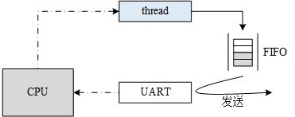

# RTOS Interrupt Management 中断管理

## 什么是异常

- 异常是指任何打断处理器正常执行，并且迫使处理器进入一个由有特权的特殊指令执行的事件。   
- 异常是导致处理器脱离正常运行转向执行特殊代码的任何事件，如果不及时进行处理，轻则系统出错，重则会导致系统毁灭性地瘫痪。  
- 所以正确地处理异常，避免错误的发生是提高软件鲁棒性（稳定性）非常重要的一环，对于实时系统更是如此。  
- 异常通常可以分成两类：同步异常和异步异常。  
  - 同步异常
    - 由内部事件（像处理器指令运行产生的事件）引起的异常称为同步异常
    - 同步异常事件是由于执行某些指令而从处理器内部产生的。  
    - 同步异常触发后，系统必须立刻进行处理而不能够依然执行原有的程序指令步骤。 
    - 例如，造成被零除的算术运算引发一个异常。
    - 例如，必须从内存的偶数地址进行读和写操作。但是从一个奇数内存地址的读或写操作将引起存储器存取一个错误事件并引起一个异常，（称为校准异常） 。  
  - 异步异常
    - 异步异常主要是指由于外部异常源产生的异常， 是一个由外部硬件装置产生的事件引起的异步异常。  
    - 异步异常事件的来源是外部硬件装置。
    - 异步异常则可以延缓处理甚至是忽略，例如按键中断异常，虽然中断异常触发了，但是系统可以忽略它继续运行（同样也忽略了相应的按键事件）。  
    - 例如，按下设备某个按钮产生的事件。     


## 什么是中断

- 中断， 中断属于**异步异常**。  
- 当 CPU 正在处理内部数据时，外界发生了紧急情况，要求 CPU 暂停当前的工作转去处理这个 异步事件。处理完毕后，再回到原来被中断的地址，继续原来的工作，这样的过程称为**中断**。  
- 实现这一功能的系统称为 **中断系统**，申请 CPU 中断的请求源称为 **中断源**。  
- 中断号：每个中断请求信号都会有特定的标志，使得计算机能够判断是哪个设备提出的中断请求，这个标志就是中断号。  
- 中断请求：“紧急事件”需向 CPU 提出申请，要求 CPU 暂停当前执行的线程，转而处理该“紧急事件”，这一申请过程称为中断请求。  
- 中断优先级：为使系统能够及时响应并处理所有中断，系统根据中断时间的重要性和紧迫程度，将中断源分为若干个级别，称作中断优先级。  
- 中断处理程序：当外设产生中断请求后， CPU 暂停当前的线程，转而响应中断申请，即执行中断处理程序。  
- 中断触发：中断源发出并送给 CPU 控制信号，将中断触发器置“1”，表明该中断源产生了中断，要求 CPU 去响应该中断， CPU 暂停当前线程，执行相应的中断处理程序。  
- 中断触发类型：外部中断申请通过一个物理信号发送到 NVIC，可以是电平触发或边沿触发。  
- 中断向量：中断服务程序的入口地址。  
- 中断向量表：存储中断向量的存储区，中断向量与中断号对应，中断向量在中断向量表中按照中断号顺序存储。  
- 临界段：代码的临界段也称为临界区，一旦这部分代码开始执行，则不允许任何中断打断。为确保临界段代码的执行不被中断，在进入临界段之前须关中断，而临界段代码执行完毕后，要立即开中断。  


## 中断实时性相关概念

- 关中断时间

  - 指的是程序中有一些临界段代码，需要关闭中断才能安全访问那么访问这段代码前关总中断，访问完后打开总中断，在这个时间内，系统是无法响应外部任何中断的。

- 最大关中断时间

  - 指的是这么多个临界段代码的关中断时间中最大的那个，即这个时间就代表了最差最坏情况下中断的关闭时间了，因为实时操作系统中很多时间问题都是基于最差情况下考虑的。

- 中断响应时间

  - 接收到此中断到此中断对应的中断服务函数的第一条语句执行所经历的时间。其计算公式是：


```
中断响应时间 ＝ 最大关中断时间 + 保护 CPU 内部寄存器的时间 + 进入中断服务函数的执行时间（会根据中断向量表找到对应的终端服务函数地址即入口）+ 开始执行中断服务例程 (ISR) 的第一条指令时间。
```

- 中断恢复时间

  - 指从中断响应成功（即开始执行中断服务例程 ( ISR ) 的第一条指令时刻）一直到中断服务函数执行完毕再到切换回被中断的任务的接着一条代码执行所经历的时间。其计算公式是：

```
中断恢复时间 = 中断服务函数执行所需时间（这样说不太准确，意思就是基本执行完所需时间，不包括退出中断服务函数前会调用一下 OSIntExit() 函数）+ OSIntExit()（这个函数在中断服务函数末尾调用的，退出中断前来发生任务切换的）+ OSIntCtxSw()（真正发生任务切换的函数，会进行寄存器数据弹出等操作）。
```

- 任何使用了操作系统的中断响应都不会比裸机快。（因为临界段虽然通过开关中断保护了关键代码的执行不被打断， 但会影响系统的实时）

# ■■■■■■■■■■■■■■■■■■■■■

# ARM Cortex-M 处理器  

- 不同于老的经典 ARM 处理器（例如： ARM7, ARM9）， ARM Cortex-M 处理器有一个非常不同的架构， Cortex-M 是一个家族系列，其中包括 Cortex M0/M3/M4/M7 多个不同型号。
- 每个型号之间会有些区别，例如 Cortex-M4 比 Cortex-M3 多了浮点计算功能等，但它们的编程模型基本是一致的。


## 寄存器简介  

Cortex-M 系列 CPU 的寄存器组里有 R0~R15 共 16 个通用寄存器组和若干特殊功能寄存器：

- R0~R15 共 16 个通用寄存器组
  - **R0-R12**：通用寄存器，都是32 位通用寄存器，用于数据操作。
    - 但是注意：绝大多数 16 位 Thumb 指令只能访问 R0‐R7，
    - 而 32 位 Thumb‐2 指令可以访问所有寄存器
  - **R13** 作为**堆栈指针寄存器** (Stack Pointer， SP)  
    - SP 有两个，任一时刻只能使用其中的一个，这也就是所谓的 “banked” 寄存器。
    - 主堆栈指针（MSP）：复位后缺省使用的堆栈指针，用于操作系统内核以及异常处理例程（包括中断服务例程）
    - 进程堆栈指针（PSP）：由用户的应用程序代码使用。
  - **R14** 作为**连接寄存器 (Link Register，LR)**，用于在调用子程序时，存储返回地址。即，当呼叫一个子程序时，由R14 存储返回地址。
  - **R15** 作为**程序计数寄存器**，指向当前的程序地址。如果修改它的值，就能改变程序的执行流。


- 特殊功能寄存器，例如，Cortex‐M3 还在内核水平上搭载了若干特殊功能寄存器，包括：

  - **程序状态字寄存器组（PSRs）**：保存算术与逻辑标志，例如负数标志，零结果标志，溢出标志等等。
  - **中断屏蔽寄存器组（PRIMASK, FAULTMASK, BASEPRI）**：控制 Cortex-M 的中断除能。
  - **控制寄存器（CONTROL）**：用来定义特权级别和当前使用哪个堆栈指针。
  - 可以通过 MSR/MRS 指令来访问特殊功能寄存器。例如，

  ```assembly
  MRS R0, CONTROL ; 读取 CONTROL 到 R0 中
  MSR CONTROL, R0 ; 写入 R0 到 CONTROL 寄存器中
  ```

- FPU 浮点计算功能

  - 如果是具有浮点单元的 Cortex-M4 或者 Cortex-M7，控制寄存器也用来指示浮点单元当前是否在使用
  - 浮点单元包含了 32 个浮点通用寄存器 S0\~S31 和特殊 FPSCR 寄存器（Floating point status and control register）。


## 操作模式和特权级别  

- Cortex-M 引入了两种运行模式，**hander模式**和**线程模式**。根据操作权限的不同，又分为**特权级**和**用户级**。

  - 为了提供一种存储器访问的保护机制，使得普通的用户程序代码不能意外地，甚至是恶意地执行涉及到要害的操作，处理器支持**两种特权级（特权级hander模式、特权级线程模式）**
  - 如果进入异常或中断处理则进入异常处理（handler）模式，其他情况则为线程模式。  

  

- Cortex-M 有两个运行级别，分别为特权级和用户级
  - 线程模式可以工作在特权级或者用户级
  - 而异常处理（handler）模式总工作在特权级，可通过 CONTROL 特殊寄存器控制

- Cortex-M 的堆栈寄存器 SP 对应两个物理寄存器 MSP (主堆栈) 和 PSP (进程堆栈)
  - 线程模式可以选择使用 MSP 或 PSP 作为堆栈
  - 处理模式总是使用 MSP 作为堆栈
  - 同样通过 CONTROL 特殊寄存器控制。(控制寄存器用来定义特权级别和当前使用哪个堆栈指针。)
- 复位后，Cortex-M 默认进入线程模式、特权级、使用 MSP 堆栈。


## 中断相关的硬件  

中断处理与 CPU 架构密切相关。例如，ARM Cortex-M 的 CPU 架构。

与中断相关的硬件可以划分为三类： 外设、中断控制器、 CPU 本身。  

- 外设： 当外设需要请求 CPU 时，产生一个中断信号，该信号连接至中断控制器。  
- 中断控制器：中断控制器是 CPU 众多外设中的一个。
  - 它一方面接收其它外设中断信号的输入
  - 另一方面，它会发出中断信号给 CPU。
  - 可以通过对中断控制器编程实现对中断源的优先级、触发方式、打开和关闭源等设置操作。
  -  在 Cortex-M 系列控制器中常用的中断控制器是 NVIC（内嵌向量中断控制器 Nested Vectored Interrupt Controller） 。
  - NVIC 最多支持 240 个中断，每个中断最多 256 个优先级。  
- CPU： CPU 会响应中断源的请求，中断当前正在执行的线程，转而执行中断处理程序。
  

## 嵌套向量中断控制器 NVIC

- Cortex-M 中断控制器名为 NVIC（嵌套向量中断控制器），支持中断嵌套功能。

- 当一个中断触发并且系统进行响应时，处理器硬件会将当前运行位置的上下文寄存器自动压入**中断栈**中，这部分的寄存器包括 **PSR、PC、LR、R12、R3-R0 寄存器**。

- 当系统正在服务一个中断时，如果有一个更高优先级的中断触发，那么处理器同样会打断当前运行的中断服务程序，然后把这个中断服务程序上下文的 PSR、PC、LR、R12、R3-R0 寄存器自动保存到中断栈中。

  

## PendSV 系统调用

- PendSV 也称为可悬起的系统调用，它是一种异常，可以像普通的中断一样被挂起，它是专门用来**辅助操作系统进行上下文切换**的。
- PendSV 异常会被初始化为**最低优先级**的异常。
- 每次需要进行上下文切换的时候，会手动触发 PendSV 异常，在 PendSV 异常处理函数中进行上下文切换。
- PendSV 和 SysTick 属于系统异常，定时器中断，串口中断这些属于外部中断。
- PendSV 和 SysTick 的中断优先级可以编程，一般要把 PendSV 的优先级设置成最低。


### PendSV 异常和 SVC 系统调用

- PendSV 异常是和 SVC 系统调用有些类似，都是软件的方式产生的中断，称其为内中断。
  - PendSV 异常，cpu 需要手动将往 NVIC 的 PendSV 悬起寄存器中写 1，然后产生中断。
  - 系统调用（SVC）是 cortex-M3  CPU 执行 SVC 指令之后产生中断（arm 中一般是 SWI 指令）。

- PendSV 和SVC 两个内中断的不同之处在于：
  - SVC指令执行之后，必须立即响应（保证能够立即硬件入栈r0-r3等寄存器，这是因为SVC中断需要传递参数到中断模式，所以必须立即响应，保证寄存器中存储的参数不被破坏，另一个原因是用户态程序，即线程模式的程序有的时候必须得到SVC中断响应函数的返回值才能继续执行，否则强行继续执行，将会出错），SVC的中断服务程序（ISR）立即执行，如果此时有别的ISR正在执行，且此中断的优先级比SVC的优先级高，将会产生硬fault。
  - 注：SVC 通常在用户级线程模式下运行，但可以在特权级线程模式或者 handler 模式下运行。
  - PendSV中断，一般在特权模式下 往 NVIC 的PendSV 悬起寄存器中写1，来触发，一般在SysTick中断的ISR中执行，也就是Handler模式下并且，PendSV的优先级一般设置成最低，PendSV的ISR一般等到其他中断全部响应完成后，再响应，PendSV（悬起异常）设计的理念就是可以将此异常悬起， 这样就可以完美应用在  上下文切换的场景中。
    

## 中断向量表

- 中断向量表是所有中断处理程序的入口，如下图所示是 Cortex-M 系列的中断处理过程：把一个函数（用户中断服务程序）同一个虚拟中断向量表中的中断向量联系在一起。

- 当中断向量对应中断发生的时候，被挂接的用户中断服务程序就会被调用执行。

  

- 在 Cortex-M 内核上，所有中断都采用中断向量表的方式进行处理，即当一个中断触发时，处理器将直接判定是哪个中断源，然后直接跳转到相应的固定位置进行处。

- 每个中断服务程序必须排列在一起放在统一的地址上（这个地址必须要设置到 NVIC 的中断向量偏移寄存器中）。

- 中断向量表一般由一个数组定义或在起始代码中给出，默认采用起始代码给出：

  ```assembly
    __Vectors     DCD     __initial_sp             ; Top of Stack
                  DCD     Reset_Handler            ; Reset 处理函数
                  DCD     NMI_Handler              ; NMI 处理函数
                  DCD     HardFault_Handler        ; Hard Fault 处理函数
                  DCD     MemManage_Handler        ; MPU Fault 处理函数
                  DCD     BusFault_Handler         ; Bus Fault 处理函数
                  DCD     UsageFault_Handler       ; Usage Fault 处理函数
                  DCD     0                        ; 保留
                  DCD     0                        ; 保留
                  DCD     0                        ; 保留
                  DCD     0                        ; 保留
                  DCD     SVC_Handler              ; SVCall 处理函数
                  DCD     DebugMon_Handler         ; Debug Monitor 处理函数
                  DCD     0                        ; 保留
                  DCD     PendSV_Handler           ; PendSV 处理函数
                  DCD     SysTick_Handler          ; SysTick 处理函数
  
  … …
  
  NMI_Handler             PROC
                  EXPORT NMI_Handler              [WEAK]
                  B       .
                  ENDP
  HardFault_Handler       PROC
                  EXPORT HardFault_Handler        [WEAK]
                  B       .
                  ENDP
  … …
  ```

- 请注意代码后面的 [WEAK] 标识，

  -  [WEAK] 是符号弱化标识，在 [WEAK] 前面的符号 (如 NMI_Handler、HardFault_Handler）将被执行弱化处理。
  - 如果整个代码在链接时遇到了名称相同的符号（例如与 NMI_Handler 相同名称的函数），那么代码将使用未被弱化定义的符号（与 NMI_Handler 相同名称的函数），而与弱化符号相关的代码将被自动丢弃。
  - 以 SysTick 中断为例，在系统启动代码中，需要填上 SysTick_Handler 中断入口函数，然后实现该函数即可对 SysTick 中断进行响应。

- 在 ARM Cortex-M 系列处理器上，
  - 所有中断都采用中断向量表的方式进行处理。
  - 即当一个中断触发时，处理器将直接判定是哪个中断源，然后直接跳转到相应的固定位置进行处理。  
  - 而ARM Cortex-M 系列处理器则恰恰相反，每个中断服务例程必须排列在一起放在统一的地址上（这个地址必须要设置到 NVIC 的中断向量偏移寄存器中） 。   
  - 中断向量表一般由一个数组定义（或在起始代码中给出）。
  - RT-Thread 在 Cortex-M 系列处理器上也遵循与裸机中断一致的方法，当用户需要使用自定义的中断服务例程时，只需要定义相同名称的函数覆盖弱化符号即可。  
- 而在 ARM7、 ARM9 中，
  - 一般是先跳转进入 IRQ 入口，然后再由软件进行判断是哪个中断源触发，获得了相对应的中断服务例程入口地址后，再进行后续的中断处理。  
  - ARM7、 ARM9 的好处在于，所有中断它们都有统一的入口地址，便于 OS 的统一管理。  


## 中断嵌套

- 在允许中断嵌套的情况下，在执行中断服务程序的过程中，如果出现高优先级的中断，当前中断服务程序的执行将被打断，以执行高优先级中断的中断服务程序。

- 当高优先级中断的处理完成后，被打断的中断服务程序才又得到继续执行，如果需要进行线程调度，线程的上下文切换将在所有中断处理程序都运行结束时才发生，如下图所示。


- ARM Cortex-M NVIC 支持中断嵌套功能：
  - 当一个中断触发并且系统进行响应时，处理器硬件会将当前运行的部分上下文寄存器自动压入中断栈中，这部分的寄存器包括 PSR，R0， R1， R2， R3 以及 R12 寄存器。
  - 当系统正在服务一个中断时，如果有一个更高优先级的中断触发，那么处理器同样的会打断当前运行的中断服务例程，然后把老的中断服务例程上下文的寄存器通过硬件自动保存到中断栈中。
  - 这部分的寄存器包括 PSR （程序状态字寄存器组）、PC（R15 The Program Counter）、LR（R14 The Link Register）、R12、R3-R0 寄存器。
  - 这一点是与其他 ARM 处理器（例，ARM7、 ARM9）最大的区别（以往都需要依赖于**软件保存上下文**）。  

# ■■■■■■■■■■■■■■■■■■■■■

# 中断 常见问题、注意事项、调试方法  


## 注意01：中断模式 vs 轮询模式

- 当驱动外设工作时，其编程模式到底采用中断模式触发还是轮询模式触发往往是驱动开发人员首先要考虑的问题，并且这个问题在实时操作系统与分时操作系统中差异还非常大。

- 轮询模式

  - 因为轮询模式本身采用顺序执行的方式：查询到相应的事件然后进行对应的处理。

  - 所以轮询模式从实现上来说，相对简单清晰。

  - 例如，往串口中写入数据，仅当串口控制器写完一个数据时，程序代码才写入下一个数据（否则这个数据丢弃掉）。

  - ```c
    	/* 轮询模式向串口写入数据 */
        while (size)
        {
            /* 判断 UART 外设中数据是否发送完毕 */
            while (!(uart->uart_device->SR & USART_FLAG_TXE));
            /* 当所有数据发送完毕后，才发送下一个数据 */
            uart->uart_device->DR = (*ptr & 0x1FF);
    
            ++ptr; --size;
        }
    ```

  - 在**实时系统**中轮询模式可能会出现非常大问题，因为在实时操作系统中，当一个程序持续地执行时（轮询时），它所在的线程会一直运行，比它优先级低的线程都不会得到运行。
  - 而分时系统中，这点恰恰相反，几乎没有优先级之分，可以在一个时间片运行这个程序，然后在另外一段时间片上运行另外一段程序。

- 所以通常情况下，**实时系统中更多采用的是中断模式来驱动外设**。

  - 当数据达到时，由中断唤醒相关的处理线程，再继续进行后续的动作。

  - 例如,一些携带 FIFO（包含一定数据量的先进先出队列）的串口外设，其写入过程可以是这样的：

    

  - 线程先向串口的 FIFO 中写入数据，当 FIFO 满时，线程主动挂起。
  - 串口控制器持续地从 FIFO 中取出数据并以配置的波特率（例如 115200bps）发送出去。
  - 当 FIFO 中所有数据都发送完成时，将向处理器触发一个中断；
  - 当中断服务程序得到执行时，可以唤醒这个线程。
  - 这里举例的是 FIFO 类型的设备，在现实中也有 DMA 类型的设备，原理类似。

- 对于**低速**设备来说
  - 运用这种模式非常好，因为在串口外设把 FIFO 中的数据发送出去前，处理器可以运行其他的线程，这样就提高了系统的整体运行效率。
  - 甚至对于分时系统来说，这样的设计也是非常必要。
- 但是对于一些**高速**设备
  - 例如,传输速度达到 10Mbps 的时候，假设一次发送的数据量是 32 字节，我们可以计算出发送这样一段数据量需要的时间是：(32 X 8) X  1/10Mbps = 25us。
  - 当数据需要持续传输时，系统将在 25us 后触发一个中断以唤醒上层线程继续下次传递。
  - 假设系统的线程切换时间是 8us（通常实时操作系统的线程上下文切换时间只有几个 us），那么当整个系统运行时，对于数据带宽利用率将只有 25/(25+8) =75.8%。
  - 但是采用**轮询**模式，数据带宽的利用率则可能达到 100%。
  - 这个也是大家普遍认为实时系统中数据吞吐量不足的缘故，系统开销消耗在了线程切换上（有些实时系统，采用**底半处理**，分级的中断处理方式，相当于又拉长中断到发送线程的时间开销，效率会更进一步下降）。

- 通过上述的计算过程，我们可以看出其中的一些关键因素：发送数据量越小，发送速度越快，对于数据吞吐量的影响也将越大。归根结底，取决于系统中产生中断的频度如何。
- 当一个实时系统想要提升数据吞吐量时，可以考虑的几种方式：
  - 1）增加每次数据量发送的长度，每次尽量让外设尽量多地发送数据；
  - 2）必要情况下更改中断模式为轮询模式。同时为了解决轮询方式一直抢占处理机，其他低优先级线程得不到运行的情况，可以把轮询线程的优先级适当降低。


## 注意02：中断的上半处理 vs 底半处理

- RT-Thread 不对中断服务程序所需要的处理时间做任何假设、限制，但如同其他实时操作系统或非实时操作系统一样，用户需要保证所有的中断服务程序在尽可能短的时间内完成（中断服务程序在系统中相当于拥有最高的优先级，会抢占所有线程优先执行）。
- 这样在发生中断嵌套，或屏蔽了相应中断源的过程中，不会耽误嵌套的其他中断处理过程，或自身中断源的下一次中断信号。

- 当一个中断发生时，中断服务程序需要取得相应的硬件状态或者数据。如果中断服务程序接下来要对状态或者数据进行简单处理，比如 CPU 时钟中断，中断服务程序只需对一个系统时钟变量进行加一操作，然后就结束中断服务程序。这类中断需要的运行时间往往都比较短。

- 但对于另外一些中断，中断服务程序在取得硬件状态或数据以后，还需要进行一系列更耗时的处理过程，通常需要将该中断分割为两部分，即**上半部分**（Top Half）和**底半部分**（Bottom Half）。
  - 在上半部分中，取得硬件状态和数据后，打开被屏蔽的中断，给相关线程发送一条通知（可以是 RT-Thread 所提供的信号量、事件、邮箱或消息队列等方式），然后结束中断服务程序；
  - 而接下来，相关的线程在接收到通知后，接着对状态或数据进行进一步的处理，这一过程称之为**底半处理**。


## 注意03：中断与线程与临界区保护

- 中断能打断线程的运行，无论该线程具有什么样的优先级，因此中断一般用于处理比较紧急的事件。
- 中断只做简单处理，例如标记该事件， 在使用 RTOS 系统时，一般建议使用信号量、消息或事件标志组等标志中断的发生，将这些内核对象发布给处理线程，处理线程再做具体处理。  

- 临界段虽然保护了关键代码的执行不被打断， 但也会影响系统的实时，任何使用了操作系统的中断响应都不会比裸机快。  
  - 比如，某个时候有一个线程在运行中，并且该线程部分程序将中断屏蔽掉，也就是进入临界段中。
  - 这个时候如果有一个紧急的中断事件被触发，这个中断就会被挂起，不能得到及时响应，必须等到中断开启才可以得到响应。
  - 如果屏蔽中断时间超过了紧急中断能够容忍的限度，危害是可想而知的。   


## 注意04：Cortex-M3 寄存器自动压栈

- 在 Cortex-M3 架构上发生中断时，硬件会自动压栈部分寄存器 R0-R3，R12（The Intra-Procedure-call scratch register）、R14（The Link Register）、R15（The Program Counter），那么其他的寄存器是否需要保存，答案是肯定的。
- 当程序调用一个 C 函数时，需要自己保存 R4-R8, R10, R11 and SP，这就意味着，如果你在中断处理函数里只编写了 C 函数，那么当函数调用结束时，这些 C 函数破坏了的上述寄存器组会被妥善的恢复。
- 那么谁来做这件事呢，答案是编译器，ARM 编译器会严格遵守上述规则来生成相应的汇编代码，保证你编写的 C 语言函数，破坏的寄存器都会被完全恢复。


## 注意05：中断栈 vs 线程栈

### 任务栈

- 每个任务都是独立开的，任务之间也相互独立，所以要为每个线程都分配独立的栈空间，这个栈空间通常是一个预先定义好的全局数组， 也可以是动态分配的一段内存空间，但它们都存在于 RAM 中。  
- 任务之间通讯通过 IPC，这里的“独立”指的是每个任务都有自己的运行环境 —— 栈空间，称为任务栈，栈空间里保存的信息包含局部变量、寄存器、函数参数、函数返回地址等等。
- 但系统中只有一个 CPU，任务又是独立的，调度的本质就是 CPU 执行一个新 task，老 task 在什么地方被中断谁也不清楚，是随机的。那如何保证老任务被再次调度选中时还能从上次被中断的地方继续玩下去呢？
- 答案是：任务上下文，CPU 内有一堆的寄存器，CPU 运行本质的就是这些寄存器的值不断的变化，只要切换时把这些值保存起来，再还原回去就能保证 task 的连续执行，让用户毫无感知。
- 例如，鸿蒙内核给一个任务执行的时间是 20ms，也就是说有多任务竞争的情况下，一秒钟内最多要来回切换50次。

### 中断栈

- 在中断处理过程中，在系统响应中断前，软件代码（或处理器）需要把当前线程的上下文保存下来（通常保存在当前线程的线程栈中），再调用中断服务程序进行中断响应、处理。
- 在进行中断处理时（实质是调用用户的中断服务程序函数），中断处理函数中很可能会有自己的局部变量，这些都需要相应的栈空间来保存，所以**中断响应依然需要一个栈空间来做为上下文，运行中断处理函数**。
  - 中断栈可以保存在打断线程的栈中，当从中断中退出时，返回相应的线程继续执行。
  - 中断栈也可以与线程栈完全分离开来，即每次进入中断时，在保存完打断线程上下文后，切换到新的中断栈中独立运行。在中断退出时，再做相应的上下文恢复。
  - 使用独立中断栈相对来说更容易实现，并且对于线程栈使用情况也比较容易了解和掌握（否则必须要为中断栈预留空间，如果系统支持中断嵌套，还需要考虑应该为嵌套中断预留多大的空间）。

- RT-Thread 采用的方式是提供独立的中断栈。
  - 即中断发生时，中断的前期处理程序会将用户的栈指针更换到系统事先留出的中断栈空间中。
  - 等中断退出时再恢复用户的栈指针。
  - 这样中断就不会占用线程的栈空间，从而提高了内存空间的利用率，且随着线程的增加，这种减少内存占用的效果也越明显。

- 在 Cortex-M 处理器内核里有两个堆栈指针，
  - 一个是主堆栈指针（MSP），是默认的堆栈指针，在运行第一个线程之前和在中断和异常服务程序里使用；
  - 另一个是线程堆栈指针（PSP），在线程里使用。
  - 在中断和异常服务程序退出时，修改 LR 寄存器的第 2 位的值为 1，线程的 SP 就由 MSP 切换到 PSP。

- ARM Cortex-M NVIC 支持中断嵌套功能：

  - 当一个中断触发并且系统进行响应时，处理器硬件会将当前运行的部分上下文寄存器自动压入中断栈中，这部分的寄存器包括 PSR，R0， R1， R2， R3 以及 R12 寄存器。

  - 当系统正在服务一个中断时，如果有一个更高优先级的中断触发，那么处理器同样的会打断当前运行的中断服务例程，然后把老的中断服务例程上下文的寄存器通过硬件自动保存到中断栈中。

  - 这部分的寄存器包括 PSR （程序状态字寄存器组）、PC（R15 The Program Counter）、LR（R14 The Link Register）、R12、R3-R0 寄存器。

  - 这一点是与其他 ARM 处理器（例，ARM7、 ARM9）最大的区别（以往都需要依赖于**软件保存上下文**）。  

    

