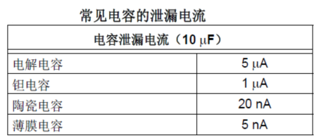

# RTOS Low Power 低功耗、电源管理

- 随着物联网 (IoT) 的兴起，产品对功耗的需求越来越强烈。作为数据采集的传感器节点通常需要在电池供电时长期工作，而作为联网的 SOC 也需要有快速的响应功能和较低的功耗。  
- 高性能与有限的电池能量在嵌入式系统中矛盾最为突出。

- 硬件低功耗设计与软件低功耗管理的联合应用成为解决矛盾的有效手段。  

- 现在的各种 MCU 都或多或少的在低功耗方面提供了管理接口  
  - 对主控时钟频率的调整  
  - 工作电压的改变  
  - 总线频率的调整甚至关闭  
  - 外围设备工作时钟的关闭等  

- 低功耗管理是一项十分细致的任务，开发者在移植时，不仅需要充分了解芯片本身的功耗管理，还需熟悉板卡的外围电路  

## 低功耗管理分为三个类别  

- 处理器电源管理主要实现方式：对 CPU 频率的动态管理，以及系统空闲时对工作模式的调整。
- 设备电源管理主要实现方式：关闭个别闲置设备
- 系统平台电源管理主要实现方式：针对特定系统平台的非常见设备具体定制。  

## 系统状态: 运行状态 (RUN) 和休眠状态 (Sleep)  

- 运行状态 (RUN)

  - 运行状态控制 CPU的频率，适用于变频场景；  

  - 运行状态通常用于改变 CPU 的运行频率，独立于休眠模式。当前运行状态划分了四个等级：高速、正常、中速、低速。

    | 模式                     | 描述                                          |
    | ------------------------ | --------------------------------------------- |
    | PM_RUN_MODE_HIGH_SPEED   | 高速模式，适用于一些超频的场景                |
    | PM_RUN_MODE_NORMAL_SPEED | 正常模式，该模式作为默认的运行状态            |
    | PM_RUN_MODE_MEDIUM_SPEED | 中速模式，降低 CPU 运行速度，从而降低运行功耗 |
    | PM_RUN_MODE_LOW_SPEED    | 低速模式， CPU 频率进一步降低                 |

- 休眠状态 (Sleep)  

  - 休眠状态根据 SOC 特性实现休眠 CPU，以降低功耗。  

  - 休眠状态也就是通常意义上的低功耗状态，通过关闭外设、执行 SOC 电源管理接口，降低系统功耗。  

  - 休眠状态又分为六个模式，呈现为金字塔的形式。随着模式增加，功耗逐级递减的特点。  

  - **注意:** 因各家芯片差异，功耗管理的实现也不尽相同。

    | 模式                   | 级别 | 描述                                                         |
    | ---------------------- | ---- | ------------------------------------------------------------ |
    | PM_SLEEP_MODE_NONE     | 0    | 系统处于活跃状态，未采取任何的降低功耗状态。 在此模式下，CPU和所有片上其它资源都正常工作运行。该模式是系统整体功耗的最主要组成部分。 |
    | PM_SLEEP_MODE_IDLE     | 1    | 空闲模式，该模式在系统空闲时停止 CPU 和部分时钟，任意事件或中断均可以唤醒 |
    | PM_SLEEP_MODE_LIGHT    | 2    | 轻度睡眠模式， CPU 停止，多数时钟和外设停止，唤醒后需要进行时间补偿。 该模式主要与CPU有关。当CPU进入休眠状态后，其时钟移除。CPU这时对总功耗的唯一影响就是静态功耗，因为这时已经没有时钟开关切换工作，也就不会有动态功耗。ADC和比较器等其它外设在此模式下可用。 |
    | PM_SLEEP_MODE_DEEP     | 3    | 深度睡眠模式， CPU 停止，仅少数低功耗外设工作，可被特殊中断唤醒 此电源模式下即便是系统时钟也被禁用，所以在此模式下所有高频资源都不可用。不过，这些资源的当前状态不受影响，也就是说CPU寄存器、 SRAM等的当前状态不受影响。由于高频时钟被禁用，因此能节约开关消耗的功率。通常情况下，深度休眠模式提供低频时钟运行的选项，低频时钟可用来驱动定时器等低频资源。此外，该模式也允许开发人员使用I2C从设备等通信协议块，其无需器件自身生成时钟。然而，模块仍然可通电。该模式对功耗的影响主要在于片上所有时钟的静态功耗。 |
    | PM_SLEEP_MODE_STANDBY  | 4    | 待机模式， CPU 停止，设备上下文丢失 (可保存至特殊外设)，唤醒后通常复位。 在此模式下，所有时钟都关闭，包括低速振荡器。片上所有资源，除了用于外部事件触发唤醒的资源以外全都断电。由于本模式下几乎所有组件都断电，因此该模式能减少静态和动态功耗组件，从而实现最低功耗。 |
    | PM_SLEEP_MODE_SHUTDOWN | 5    | 关断模式，比 Standby 模式功耗更低，上下文通常不可恢复，唤醒后复位。 所有外设断电，即使是RAM和CPU寄存器的内容也不保持。这种模式下仅保持IO引脚的状态。从这种模式下唤醒会进入芯片重启动。 |

# ■■■■■■■■■■■■■■■■■■■■■■■

# 功耗、电流测试方法+工具

MCU 总功耗可以分为两大类：动态功耗和静态功耗。

## 测试方法一：使用专门的功耗测试仪器

- 可以使用 DC-DC 电源分析仪
- 或者专门测试电流功耗的电流表（安捷伦的六位半电流表）。

## 测试方法二：串联分压原理+示波器+采样电阻（高精度、大功率、小阻值）

- 功耗的具体测试方法：

  - 通过在硬件电路中的电源地端串联2个0.68欧姆的高精度电阻（总采样电阻的阻值为1.36欧姆）。
  - 通过串联分压原理，用示波器测得电阻两端的压降，可较为精确的测量出报警装置工作时每个阶段消耗的电流和时间值，从而计算出电池的使用寿命。
  - 另外，所使用的采样电阻阻值较小，故在采样电阻上所消耗的功耗很小，可以忽略采样电阻那部分的功耗。

- 示波器+采样电阻 功耗测试原理

  

- 实例：嵌入式 Wi-Fi 模块功耗测试（报警装置完成一次报警操作时所产生的功耗波形图）

  - ①为未发生报警时报警装置处于低功耗休眠状态；
  - ②为报警从休眠状态下唤醒阶段；
  - ③、④、⑤和⑥为 Wi-Fi 功能模块的启动使能阶段；
  - ⑦为 Wi-Fi 发送报警信息阶段；
  - ⑧为发送完报警信息，关闭Wi-Fi模块阶段；
  - ⑨为完成报警操作后，返回低功耗休眠状态；
  - 因此，完成一次报警操作，所消耗功耗包括阶段②～⑧，总花费约 2.7 秒的时间。
  - 
  - 由上述测试结果：

    - 可知报警装置工作在低功耗的休眠模式，三轴加速度传感器的功耗很小，所以这部分功耗非常少（平均电流在uA级）；
    - 报警装置的 Wi-Fi 通信模块在工作时所消耗的功耗较大，Wi-Fi 模块激活工作时，平均电流约为 39 mA（瞬时电流可达 200 mA）；
    - 并且，在 Wi-Fi 模块发送报警信息时的功耗最大。
    - 每次Wi-Fi激活工作时间主要取决于无线路由器和网络状态（加入网络、安全认证、DHCP、DNS、数据传输等），一般在2~4秒之间。

# ■■■■■■■■■■■■■■■■■■■■■■■

# RTOS 实现低功耗

- MCU 实现低功耗本质而言便是停止 MCU 工作，通过中断的方式重新唤醒 MCU，这些中断可以包括外部 IO 中断，UART 接收中断，定时器中断等等。
- 但是在 uCOS、FreeRTOS 之类的操作系统，实现这一模式就有点麻烦，最大的问题是任务切换是无法控制的，经常出现唤醒之后程序跑飞的情况。
- 利用操作系统进入和退出低功耗模式，需要熟悉嵌入式操作系统的空任务和系统滴答时钟中断。
- 结合嵌入式操作系统，**可以在空任务或者空任务钩子函数中进入低功耗模式，在系统滴答时钟中断服务函数中重新回到正常工作模式。**
- 要把休眠的代码段放在低优先级任务中，不一定是系统自带的空闲任务，也可以是用户自定义的最低优先级的任务。

## 方法 1：空任务或者空任务钩子函数中进入低功耗模式

- 因为系统要响应系统节拍中断事件，因此使用这种方法会周期性的退出、再进入低功耗状态。
- 如果系统节拍中断频率过快，则大部分电能和CPU时间会消耗在进入和退出低功耗状态上。
- 空任务优先级最低且一直保持就绪状态，空任务可以用于统计 CPU 使用率，或者让 MCU 进入低功耗状态。如果不想修改空任务，还可以通过空任务的钩子函数插入实现低功耗的代码。
- 以 FreeRTOS 为例
  - 空闲钩子设置低功耗时，需要在 FreeRTOSConfig.h 中，将宏 configUSE_IDLE_HOOK 置为 1，然后自己实现固定接口：void vApplicationIdleHook(void );
  - 同时， 这个钩子函数不可以调用会引起空闲任务阻塞的API函数（例如：vTaskDelay()、带有阻塞时间的队列和信号量函数），在钩子函数内部使用协程是被允许的。
  - 在空闲任务钩子函数中设置微处理器进入低功耗模式来达到省电的目的。

## 方法 2：Tickless 无系统滴答时钟方式实现低功耗

- Tickless 低功耗机制是当前小型 RTOS 所采用的通用低功耗方法，比如 FreeRTOS, embOS，RTX 和 uCOS-III （类似方法）都有这种机制。
- 当用户任务都被挂起或者阻塞时，最低优先级的空闲任务会得到执行。那么 STM32 支持的睡眠模式，停机模式就可以放在空闲任务里面实现。
- 为了实现低功耗最优设计，我们还不能直接把睡眠或者停机模式直接放在空闲任务就可以了。
- RTOS 的系统时钟是由嘀嗒定时器中断来提供的，系统时钟频率越高，嘀嗒定时器中断频率也就越高。如果嘀嗒定时器中断频率太高的话会导致大量的能量和时间消耗再进出睡眠模式中，这样导致的结果就是低功耗模式的作用被大大的消弱。

### Tickless Idle Mode 的软件设计原理

Tickless Idle Mode 的设计思想在于：尽可能地在 MCU 空闲时使其进入低功耗模式，软件设计时，需要解决以下问题：

- 合理的进入低功耗模式（避免频繁使 MCU 在低功耗模式和运行模式下进行不必要的切换）
  - RTOS 的系统时钟源于硬件的某个周期性定时器（Cortex-M 系列内核多数采用 SysTick)
  - RTOS 的任务调度器可以预期到下一个周期性任务（或者定时器任务）的触发时间。
  - 如上文所述，进入空闲任务后，首先要计算可以执行低功耗的最大时间，也就是求出下一个要执行的高优先级任务还剩多少时间。
  - 然后就是把低功耗的唤醒时间设置为这个求出的时间，**调整系统时钟定时器中断触发时间**，到时间后系统会从低功耗模式被唤醒，继续执行多任务。
  - 这个就是所谓的 tickless 模式。，可以避免 RTOS 进入不必要的时间中断，从而更长的时间停留在低功耗模式中。
  - 此时 RTOS 的时钟不再是周期的而是动态的。在原有的时钟基准时将不再产生中断，即 Tickless。

- 当 MCU 被唤醒时，通过某种方式提供为系统时钟提供补偿
  - MCU 可能被两种情况所唤醒
    - 动态调整过的系统时钟中断。
    - 或者突发性的外部事件（其他中断发生）。
  - 无论是哪一种情况，都可以通过运行在低功耗模式下的某种定时器来计算出 MCU 处于低功耗模式下的时间，在 MCU 唤醒后对系统时间进行软件补偿。
- 软件实现时，要根据具体的应用情景和 MCU 低功耗特性来处理问题。
  - 尤其是 MCU 的低功耗特性，不同 MCU 处于不同的低功耗模式下所能使用的外设（主要是定时器）是不同的，RTOS的系统时钟可以进行适当的调整。

- 实现 Tickless 模式最麻烦是低功耗可以执行的时间如何获取。
  - 关闭嘀嗒定时器会导致系统节拍停止，系统时钟就会停止
    - 例如，可以再用另外的定时器，记录下系统节拍中断的关闭时间，当系统节拍中断再次开启运行的时候补上这段时间。
  - 如何保证下一个要运行的任务能被准确的唤醒
    - 在进入低功耗模式之前获取还有多长时间进行下一个任务。

### 使用案例：FreeRTOS + STM32 + Tickless

- \#define configUSE_TICKLESS_IDLE   1  //启用低功耗模式
-  使能 Tickless 后，符合下面两种情况会调用宏 portSUPPRESS_TICKS_AND_SLEEP() 来处理低功耗的工作
  - 空闲任务是唯一可运行的任务，因为其他所有任务都处于阻塞态或挂起态
  - 系统处于低功耗模式的时间至少大于 configEXPECTED_IDLE_TIME_BEFORE_SLEEP 个时钟节拍，宏configEXPECTED_IDLE_TIME_BEFORE_SLEEP默认在文件FreeRTOS.h中定义为 2，重新定义大于 2。
- 由于在 STOP 下，为 FreeRTOS 提供心跳时钟的 SYSTICK 也停止了工作，所以，在被唤醒之后，还需要将在 STOP 下流逝的时间告诉 FreeRTOS。
- 总之，降低整个产品功耗的基本思想，就是让 FreeRTOS 仅可能多的时间处于 IDLE 任务，让 STM32 尽可能多的时间处于 STOP 模式，最终达到尽可能多的降低功耗的目的。

## 方法 3：低功耗设计中，还需要做一些特殊处理

- 对主控时钟频率的调整。将处理器降低到合适的频率，因为频率越低功耗越小，甚至可以在进入低功耗以后关闭系统时钟。
- 修改时钟源，晶振的功耗肯定比处理器内部的时钟源高，进入低功耗模式以后可以切换到内部时钟源，比如 STM32 的内部 RC 振荡器。
- 关闭其他外设时钟，比如IO口的时钟。
- 改变工作电压。
- 关闭板子上其他功能模块电源，这个需要在产品硬件设计的时候就要处理好，比如可以通过MOS管来控制某个模快电源的开关，在处理器进入低功耗模式之前关闭这些模块的电源。
- 需熟悉板卡的外围电路，进入低功耗状态时逐一处理，避免出现外围电路漏电拉升整体功耗的情况。  

# ■■■■■■■■■■■■■■■■■■■■■■■

# 低功耗设计——软件角度设计

## 用“中断”代替“查询”

- 使用中断方式，CPU 可以什么都不做，甚至可以进入等待模式或停止模式;
- MCU 实现低功耗的本质而言是停止 MCU 工作，通过中断的方式重新唤醒  MCU。这些中断可以包括外部 IO 中断，串口中断，定时器中断等。
- 而查询方式下，CPU 必须不停地访问 I/O 寄存器，这会带来很多额外的功耗。

## 用“宏”代替“子程序”

- 子程序调用的入栈出栈操作，要对 RAM 进行两次操作，会带来更大的功耗。
- 宏在编译时展开，CPU 按顺序执行指令。
- 使用宏，会增加程序的代码量，但对不在乎程序代码量大的应用，使用宏无疑会降低系统的功耗。

## 让I/O模块间歇运行

- 在系统运行过程中，不用的I/O模块要关掉，间歇使用的I/O模块要及时关掉，以节省电能。
- 同时，不用的I/O引脚要设置成输出或设置成输入，用上拉电阻拉高。
- 不用的 GPIO，设置 IO 为复位状态 

## 时钟的选择也很重要

- 一般用 MCU 内部 RC 作为时钟源，但精度不够，需要用高精度的时钟来较校准这个内部的 RC 时钟源。

## 改变 CPU 运行频率。

- 降低运行频率能有效减少系统的功耗
- 但是，降频率意味着 CPU 性能降低、处理速度减慢，可能会导致任务的执行时间增长，需要合理进行权衡。  

## 尽量减少 CPU 的运算量

- 减少 CPU 的运算工作量，可以有效地降低 CPU 的功耗。
- 减少 CPU 运算的工作可以从很多方面入手：
  - 用查表的方法替代实时的计算，例如 AES 加解密
  - 不可避免的实时计算，算到精度够了就结束，避免“过度”的计算
  - 尽量使用短的数据类型
  - 例如，尽量使用字符型的8位数据替代16位的整型数据，尽量使用分数运算而避免浮点数运算等。

- 把整个中断向量表，在芯片初始化时，全部复制到 RAM 中，并重定向到 RAM。

## 从闪存执行，改成从 RAM 执行。

- 为 MCU 的闪存供电和读取闪存是功耗最大的操作之一。从 RAM 读取所消耗的电能比从闪存读取所消耗的电能少。主要是降低动态功耗。
- 要从RAM 运行，必须将代码从闪存复制到RAM。此任务会消耗大量时间和电能。为了使该任务有执行价值，从RAM 运行的函数通常有大小限制。
- 将经常调试的代码，从 Flash 拷贝到 RAM 中运行，以提高程序运行的速度，从而降低功耗（即尽快回到低功耗模式）。
- 例如， IAR 下，可使用 “__ramfunc” 关键字。可以在同样的系统时钟，运行更快，进一步减少功耗，可以省个5%的功耗。（说白了，就是以空间换时间）
- ramfunc 来声明将某个函数放到 RAM 中运行。该函数用 ramfunc 声明后，编译器将这段程序和其他需要初始化的变量，放在一个具有读/写属性的区域（SECTION）。系统启动时，自动和其他的需要初始化的变量，一起从 ROM 拷贝到 RAM。
- 使用 __ramfunc 关键字的缺点，就是不能指定具体的 RAM 位置。而且在 ramfunc 的函数中调试不是 ramfunc 的函数会降低执行速度。

## While 循环里面代码的低功耗处理

- While 循环里面代码、驱动，尽量不要调库，直接对芯片的寄存器操作。
- 减少一些函数的嵌套，减少出栈入栈所消耗的时间。尽可能地减少指令周期。
  - 主循环中核心代码，减少库函数的调用，通过对寄存器直接操作，来减少函数嵌套，同时提高运行速度，来降低功耗。
  - 初始化时，倒是可以使用库函数。例如，STM32 的 HAL 相关的驱动库函数。
- 提高 "常用（经常被调用）的代码" 的运行速度，从而让芯片尽早运行完代码，减少总的运行时间，快速回来低功耗状态。
  - 方法 01：变频，MCU 在运行时，提高主时钟，提高代码运行效率
  - 方法 02：可以 “以空间换时间” 的方法。例如，对于 AES 算法，可以提前到 AES 表格提前存到 Code Flash，采用查表方法实现AES 算法。
  - 方法 03：利用芯片一些硬件模块，来提速。例如，AES 硬件加速器、浮点运算单元。
  - 方法 04：可以使用  register 关键字（对于嵌入式 C 语言）
    - 当对一个变量频繁被读写时，需要反复访问内存，从而花费大量的存取时间。为此，C语言提供了一种变量，即寄存器变量。这种变量存放在CPU的寄存器中，使用时，不需要访问内存，而直接从寄存器中读写，从而提高效率。

## 通信相关，实现低功耗的方法

- 如果是 UART 通信，当有接收到 UART 数据时，才自动唤醒芯片。但需要对 UART 的波特率有要求，一般要求只能使用较低的波特率。
- 对于大数据块传输，使用 DMA 提速。
- 清空 DMA  

# ■■■■■■■■■■■■■■■■■■■■■■■

# 低功耗设计——硬件角度设计

## 电容

- 所有电容在电流通过电介质时都会产生少量电荷损失，即使完全充电后也是如此，称为“电容泄漏电流”。

- 通常，钽电容和电解电容的泄漏电流较高，而陶瓷电容和薄膜电容的泄漏电流较低。

  

## 电阻

- 如果需要上拉电阻，尽量先大一点的上位电阻。因为，例 3V 的电源，用 1M 的上拉电阻，就会产生 3 uA 的静态电流。

## 晶振

- 低功耗晶振设计的基本要点是将晶振尽可能接近 MCU 放置。
- 在可能的情况下，使接地环包围晶振驱动器电路，以防止耦合噪声。
- 确保为晶振和驱动器选择了大小适当的大容量电容，使用具有理想负载电容（3.7 pF 至6 pF）的低功耗晶振，以获得更可靠的低功耗运行。

## 稳压器

- **开关**稳压器在低工作电流时效率很低，如升压稳压器在50 mA 时的效率可达95%，而在负载电流为10 uA 时可能只有大约20% 或更低的效率。
- 在设计低功耗系统时，系统大部分时间处于休眠状态，因此从总体上看**线性**稳压器是更有效的选择。
- 在某些情况下，运行不带稳压器的电池供电系统可能很理想。
  - 通过设计能够使用电池直接供电的系统，可以显著延长系统使用寿命。
  - 特别是：LiFeS2（锂AA电池）、LiMnO2（纽扣电池）和碱性电池都在大多数低功耗单片机的1.8-3.6V工作电压范围内工作。

## 端口引脚的配置

- 未使用的引脚
  - 不用连接，配置为输出模式并驱动到任一状态（高电平或低电平）；
  - 可考虑将数字输入引脚配置为模拟输入降低功耗。
- 数字输入引脚
  - 输入电压接近VDD或VSS时，引脚的功耗最低；
  - 输入电压接近(VDD+VSS)/2时，引脚功耗最高。
- 模拟输入引脚：模拟输入阻抗很高，引脚功耗很低
- 数字输出引脚：只在引脚为外部电路供电时消耗电流，注意外部电路。
- CLR / I2C /开关/电阻分压器引脚
  - 使用较大上拉电阻。
  - 如 I2C 上拉之后，减少电流消耗，代价是总线速度变低，折中设计。

## 按键

- 即使非常快的按键操作也需要数百毫秒。
- 如果按键上有 10 kΩ上拉电阻，则意味着几百毫秒的 300 uA 电流消耗，这在低功耗系统中是相当可观的。
- 按键低功耗设计方案 01：
  - 增加上拉电阻值可有助于降低功耗。
  - 但高阻值可能会减小抗干噪能力。
  - 此外，增加上拉电阻还会增加信号的时间常量，这会延长检测到高电压前的上升时间。
- 按键低功耗设计方案 02：
  - 建议使用 MCU 的内部上拉电阻作为按键的电压源。
  - 由于可在代码中动态使能和禁止内部上拉，只要检测到按键按下，MCU 即可禁止上拉，去除接地电流路径。
  - 这也提供了简单的去抖动功能并减少了外部元件数。
  - 对于需要能够检测按住状态的按键，可以定期重新使能上拉来确定按键是否处于按住状态。
- 按键低功耗设计方案 03：
  - 通过 2 个 GPIO 来实现按键。这样比较省电。当需要采样按键值时，用一个 GPIO 对按键电路供电。另一个 GPIO 用来采样按键是否按下。平时，则处于断电模式，不会耗电。便要注意，RC 电路的取值。
  - **注意：**时间常数  RC 电路有个时间常数 T = R x C。根据公式可知，当 R x C 越大，时间常数越大，积分电路充放电就慢。反之，当 R x C 越小，时间常数越小，积分电路充放电就快。
  - 故，有时为了极致的低功耗，减少GPIO 对按键电路的供电时间，让另外GPIO 电平快速稳定，快速获取有效按键值，减少功耗损失，我们会**去掉按键电路中的滤波电容**。

## LED

- LED在运行时的电流消耗很大（2 mA 至50 mA）。

- 低功耗设计方案 01：
  - 使用 PWM 以较低占空比驱动 LED。
  - 这种方法能够在必要时动态降低亮度，从而使代码可在一定程度上控制LED 功耗。
- 低功耗设计方案 02：
  - 通过增加限流电阻的大小来以较低的电流驱动LED。
  - 并选择新型高亮度和高效率LED。因为额定电流为20 mA 的高亮度LED 在低于1 mA 的电流下驱动时仍可保持高可见性。

## 外围芯片模块：存储器、模拟器件

- 外围芯片模块主要功耗都集中在读写时候，所以需要选择低功耗的芯片。
- 不使用的外设，可以通过设置外设模块禁止位断开外设的所有电源。
- 对于外围传感器、EEPROM、LCD 背光、收发器（RF/232）等功耗较高电路，IO 引脚可以驱动的直接供电即可；
- 不能驱动的可通过使能、禁止 MOSFET 驱动来供电。
- 根据 外围硬件电路，设置相关 GPIO 的输出电平，避免出现外围电路漏电拉升整体功耗的情况。  
- 控制外围芯片的使能引脚，让外围芯片进入到自己的低功耗模型。

- 通过 MOS 管来控制某个模快电源的开关，在处理器进入低功耗模式之前关闭这些模块的电源。

## 接口选择

- 尽量少用 I2C 通信接口。（ 2 个上拉电阻，静态电流，比较大）

## 低功耗 MCU 的选型

- MCU 总功耗可以分为两大类：动态功耗和静态功耗。
- 动态功耗是单片机在运行和执行编程的任务时消耗的功率，主要是开关CMOS电路时造成的功率损失。
  - 降低系统工作电压可以显著降低功耗。
  - 低频率会导致低动态电流。
  - 但很多情况下，以较高的频率运行会更节电，因为加快相应操作的完成速度，从而可使系统更快进入休眠模式减少功耗。
  - 另外，在低频运行时，动态开关电流有可能不再是系统功耗的主要影响因素。
- 静态功耗是只对器件供电，但不运行代码时消耗的功率，主要是模拟电路的偏置电流、低功耗计时振荡器和泄漏电流。
  - 减少泄漏电流最好的办法是降低电压，并关闭不需要的电路。
- MCU 功耗的计算：
  - 每种工作模式（静态功耗+动态功耗）的电流消耗乘以该模式的时间，得到每种模式的电量消耗，然后将每种模式的电量相加，在总循环时间内求平均，得到平均电流消耗。
  - 直接用 DC-DC 电源分析仪连接收集 24 或 48 小时的设备的功耗，通过仪表，直接得到平均电流消耗。
- 功能比较少、对性能要求较小的设备（例，传感器：Smoker、CO等），可选择 Cortex-M0+ 超低功耗的 STM32L0 系列。 
- 功能比较多、对性能要求较大的设备（例，PIR+Camera、无线AP 等），可选择 Cortex-M4 超低功耗的 STM32L4 系列。

# ■■■■■■■■■■■■■■■■■■■■■■■

# 低功耗 常见问题及调试方法  

## 问题 01：系统进入低功耗模式后功耗偏高  

- 根据外围电路，检查设备是否处于合理状态，避免出现外设漏电的情况。
  - 例如 GPIO 状态（输入或输出）、输出时，是输出高电平还是低电平。
- 根据产品自身情况，关闭相应休眠模式期间不使用的外设和时钟。  

## 问题 02：无法进入更低等级的功耗  

- 检查在进入更低等级的功耗时，是否有按数据手册进行相关操作：
  - 将相关的电源模块禁用
  - 调整相关的时钟配置
  - 禁用无法在 “更低等级”模式下工作的模块等。

# ■■■■■■■■■■■■■■■■■■■■■■■

