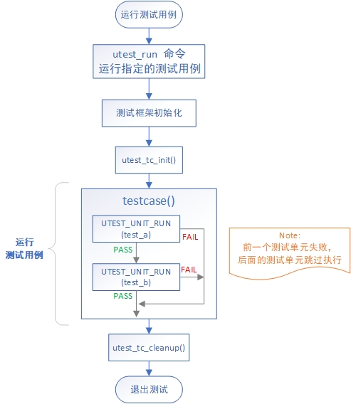
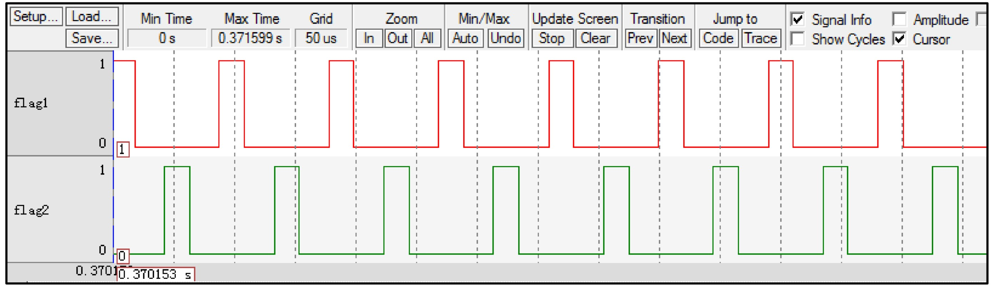

# RTOS Test 测试方法、工具、性能指标

# ■■■■■■■■■■■■■■■■■■■■■■

# RTOS 测试框架

## 测试分类

RTOS 测试框架，目的使用统一的框架接口编写测试程序，实现以下测试：
- 单元测试（主要测试软件单元设计）、覆盖测试（MC/DC 分支测试）、代码静态扫描（SonarQube、LDRA 等测试工具）
- 集成测试（主要测试软件架构设计）
- 系统测试（主要测试软件需求）
- 压力自动测试（Python 搭建自动化测试，用于系统或功能模块的稳定性压力测试）

## 测试用例

- 测试用例（testcase，简称 tc）是为实现特定测试目标而执行的单个测试，是包括测试输入、执行条件、测试过程和预期结果的规范，是一个有明确的结束条件和明确的测试结果的有限循环。
- utest（unit test）测试框架定义用户编写的测试程序为测试用例，一个测试用例仅包含一个 testcase 函数（类似 main 函数），可包含多个测试单元函数。
- 具体地通过 utest 测试框架提供的 API 完成的针对某一功能的测试代码就是一个测试用例。

## 测试单元定义

测试单元（test unit）是被测功能细分后的测试点，每个测试点可以任务是被测功能的最小可测单位。当然，不同的分类方式会细分出不同的测试单元。

## 测试用例运行流程

# ■■■■■■■■■■■■■■■■■■■■■■

# 系统性能测试

测试系统的性能，主要分为如下三个方面：

- 计算性能
- 内存性能
- IO 性能

## 计算性能

如果想要测试性能，就需要测试方法和性能测试程序，今天主要考虑测试系统的计算性能，目前在 RTT 中测试计算性能有两种选择，分别是 `dhrystone` 和`coremark`，通过软件包可以很方便地将相关测试代码加入到系统中。

接下来对手上的 `zynq 7020/7045` 开发板分别进行计算性能测试结果如下：

| 7020 开发板 666M | 开启 cache | 关闭 cache | 03 优化 | 03 关闭分支预测 |
| ---------------- | ---------- | ---------- | ------- | --------------- |
| `dhrystone`      | 510        | 24         | 1500    | 659             |
| `coremark`       | 461        | 24         | 2571    | 1161            |

| 7045 开发板 800M | 开启 cache | 关闭 cache | 03 优化 | 03 关闭分支预测 |
| ---------------- | ---------- | ---------- | ------- | --------------- |
| `dhrystone`      | 358        | 24         | 2148    | 931             |
| `coremark`       | 361        | 23         | 3000    | 1333            |

`dhrystone` 只能对系统的整形运算性能进行测试，而且其结果受到编译器性能很大的影响，有人开玩笑说 `dhrystone` 是测试了编译器的性能。 `coremark` 是更新一些的测试，其测试项也更加丰富，例如整数，浮点，矩阵等等都可以进行测试。

### 计算性能影响因素

经过测试发现如下因素对系统计算性能影响较大，如果这些影响系统性能的因素叠加起来，会带来上百倍的性能差距，例如在 `zynq 7045 800M` 的情况下，如果系统未经任何优化，`coremark` 性能分只有 23，而打开所有优化项之后，性能分高达 3000 分（与该 CPU 的标准分数相符），这其中计算性能差距 **高达 130 倍** 之多。

| 影响因素         | 说明                             |
| ---------------- | -------------------------------- |
| cache            | 带来 20-30 倍计算性能影响        |
| 编译器优化等级   | O3 优化带来 3-5 倍的计算性能影响 |
| CPU 分支预测功能 | 带来 2 倍多的计算性能影响        |

# ■■■■■■■■■■■■■■■■■■■■■■

# CPU 性能测试

# ■■■■■■■■■■■■■■■■■■■■■■

# RTOS 测试工具

## 查看调度、时序：逻辑分析仪  

例如，逻辑分析仪查看两个线程轮流切换波形图、占空比、时间片。

# ■■■■■■■■■■■■■■■■■■■■■■

# RTOS 性能指标

## STM32 运行 RTOS 内核性能指标

- STM32基本内核配置资源占用情况： 13344字节 ROM，1800字节 RAM
- 最小版本资源占用情况：2.5K ROM，1K RAM
- 线程上下文切换时间（在 72 MHz 的 STM32 上采用逻辑分析仪测得的结果）
  - 挂起操作引起线程上下文切换：4.25 μs
  - 信号量引起线程上下文切换：7.25 μs
  - 邮箱引起线程上下文切换：8.63 μs

# ■■■■■■■■■■■■■■■■■■■■■■

