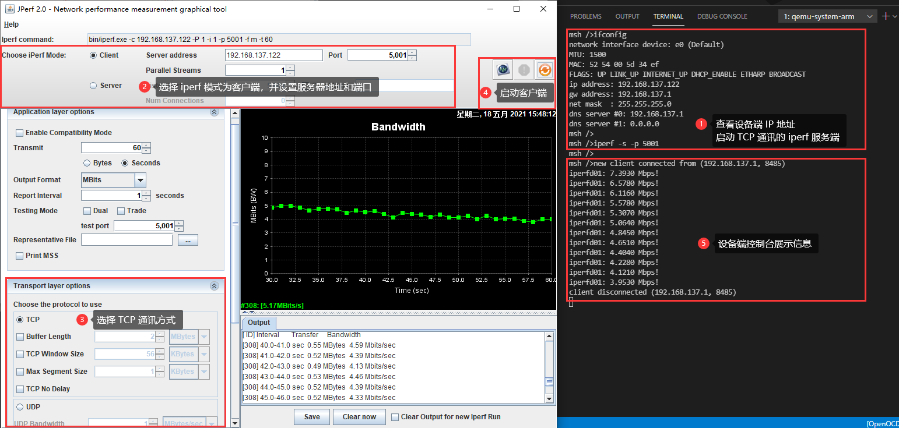
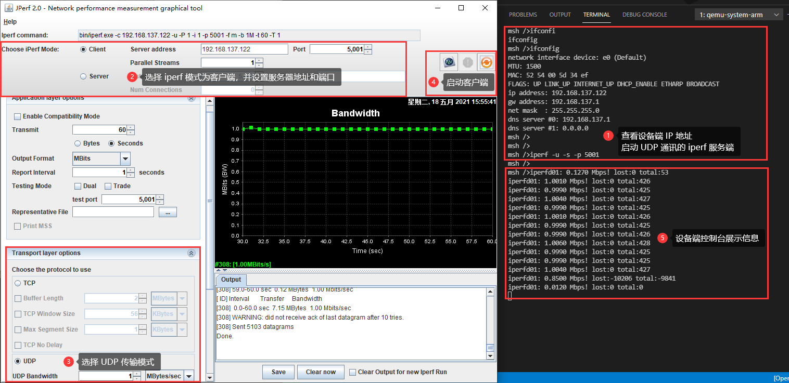
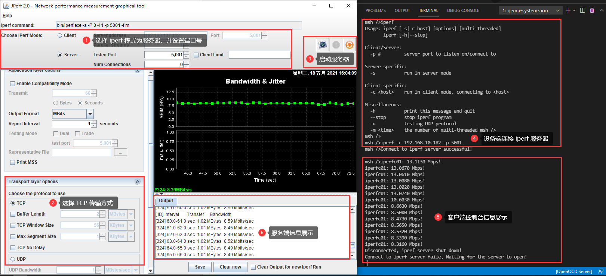
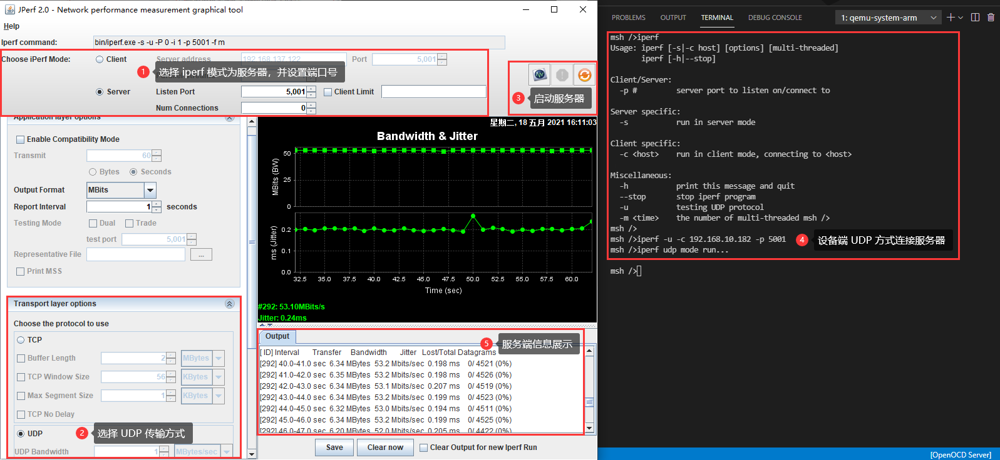

# RTOS Test 测试方法、工具、性能指标

# ■■■■■■■■■■■■■■■■■■■■■■

# RTOS 测试框架

## 测试分类

RTOS 测试框架，目的使用统一的框架接口编写测试程序，实现以下测试：
- 单元测试（主要测试软件单元设计）、覆盖测试（MC/DC 分支测试）、代码静态扫描（SonarQube、LDRA 等测试工具）
- 集成测试（主要测试软件架构设计）
- 系统测试（主要测试软件需求）
- 压力自动测试（Python 搭建自动化测试，用于系统或功能模块的稳定性压力测试）

## 测试用例

- 测试用例（testcase，简称 tc）是为实现特定测试目标而执行的单个测试，是包括测试输入、执行条件、测试过程和预期结果的规范，是一个有明确的结束条件和明确的测试结果的有限循环。
- utest（unit test）测试框架定义用户编写的测试程序为测试用例，一个测试用例仅包含一个 testcase 函数（类似 main 函数），可包含多个测试单元函数。
- 具体地通过 utest 测试框架提供的 API 完成的针对某一功能的测试代码就是一个测试用例。


## 测试单元定义

测试单元（test unit）是被测功能细分后的测试点，每个测试点可以任务是被测功能的最小可测单位。当然，不同的分类方式会细分出不同的测试单元。

## 测试用例运行流程


# ■■■■■■■■■■■■■■■■■■■■■■

# 系统性能测试

测试系统的性能，主要分为如下三个方面：

- 计算性能
- 内存性能
- IO 性能

## 计算性能

如果想要测试性能，就需要测试方法和性能测试程序，今天主要考虑测试系统的计算性能，目前在 RTT 中测试计算性能有两种选择，分别是 `dhrystone` 和`coremark`，通过软件包可以很方便地将相关测试代码加入到系统中。

接下来对手上的 `zynq 7020/7045` 开发板分别进行计算性能测试结果如下：

| 7020 开发板 666M | 开启 cache | 关闭 cache | 03 优化 | 03 关闭分支预测 |
| ---------------- | ---------- | ---------- | ------- | --------------- |
| `dhrystone`      | 510        | 24         | 1500    | 659             |
| `coremark`       | 461        | 24         | 2571    | 1161            |

| 7045 开发板 800M | 开启 cache | 关闭 cache | 03 优化 | 03 关闭分支预测 |
| ---------------- | ---------- | ---------- | ------- | --------------- |
| `dhrystone`      | 358        | 24         | 2148    | 931             |
| `coremark`       | 361        | 23         | 3000    | 1333            |

`dhrystone` 只能对系统的整形运算性能进行测试，而且其结果受到编译器性能很大的影响，有人开玩笑说 `dhrystone` 是测试了编译器的性能。 `coremark` 是更新一些的测试，其测试项也更加丰富，例如整数，浮点，矩阵等等都可以进行测试。

### 计算性能影响因素

经过测试发现如下因素对系统计算性能影响较大，如果这些影响系统性能的因素叠加起来，会带来上百倍的性能差距，例如在 `zynq 7045 800M` 的情况下，如果系统未经任何优化，`coremark` 性能分只有 23，而打开所有优化项之后，性能分高达 3000 分（与该 CPU 的标准分数相符），这其中计算性能差距 **高达 130 倍** 之多。

| 影响因素         | 说明                             |
| ---------------- | -------------------------------- |
| cache            | 带来 20-30 倍计算性能影响        |
| 编译器优化等级   | O3 优化带来 3-5 倍的计算性能影响 |
| CPU 分支预测功能 | 带来 2 倍多的计算性能影响        |


## RTOS 系统性能测试

系统性能测试采用的是 `benchmark` 软件包，包含如下测试内容：

| 文件                              | 测试内容                                  |
| --------------------------------- | ----------------------------------------- |
| benchmark_mbox.c                  | 邮箱 recv/send 性能测试                   |
| benchmark_mpool.c                 | 内存池 alloc/free 性能测试                |
| benchmark_semaphore.c             | 信号量 take/release 性能测试              |
| benchmark_thread_create.c         | 线程 create API 性能测试                  |
| benchmark_thread_init.c           | 线程 init API 性能测试                    |
| benchmark_thread_switch_mb.c      | 使用邮箱进行线程切换时的性能测试          |
| benchmark_thread_switch_sem.c     | 使用信号量进行线程切换时的性能测试        |
| benchmark_thread_switch_suspend.c | 使用 suspend API 进行线程切换时的性能测试 |
| benchmark_thread_switch_count     | 使用 yield API 进行线程切换时的性能测试   |
| benchmark_thread_switch_interrupt | 使用中断触发线程切换时的性能测试          |
| benchmark_memory_correctness.c    | 内存正确性测试                            |
| benchmark_memory_performance.c    | 内存性能测试                              |
| benchmark_file_correctness.c      | 文件正确性测试                            |
| benchmark_file_performance.c      | 文件读写性能测试                          |
| benchmark_float.c                 | 浮点数计算测试                            |

### 测试记录

以下是在 `qemu-vexpress-a9` 开发平台上进行的测试日志（平台：`qemu-vexpress-a9`，主频：`1MHZ`，编译选项：`-O0 -gdwarf-2`，系统心跳：`100 hz` ）

### 邮箱

```bash
msh />benchmark_mbox
MBox send time:
CPU: 1 MHz,OS Tick: 100 HZ
Average time: 0.843 us
Maximum time: 0.999 us
Minimum time: 0.000 us
MBox receive time:
CPU: 1 MHz,OS Tick: 100 HZ
Average time: 0.531 us
Maximum time: 0.999 us
Minimum time: 0.000 us
```

### 内存池

```bash
msh />benchmark_mpool
MemPool allocate time:
CPU: 1 MHz,OS Tick: 100 HZ
Average time: 0.749 us
Maximum time: 0.999 us
Minimum time: 0.000 us
MemPool free time:
CPU: 1 MHz,OS Tick: 100 HZ
Average time: 0.843 us
Maximum time: 0.999 us
Minimum time: 0.000 us
```

### 信号量

```bash
msh />benchmark_sem
Semaphore take time:
CPU: 1 MHz,OS Tick: 100 HZ
Average time: 0.531 us
Maximum time: 0.999 us
Minimum time: 0.000 us
Semaphore release time:
CPU: 1 MHz,OS Tick: 100 HZ
Average time: 0.656 us
Maximum time: 0.999 us
Minimum time: 0.000 us
```

### 线程创建

```bash
msh />benchmark_thread_create
msh />Thread create time:
CPU: 1 MHz,OS Tick: 100 HZ
Average time: 0.994 us
Maximum time: 0.997 us
Minimum time: 0.988 us
```

### 线程初始化

```bash
msh />benchmark_thread_init
msh />Thread init time:
CPU: 1 MHz,OS Tick: 100 HZ
Average time: 0.995 us
Maximum time: 0.997 us
Minimum time: 0.992 us
```

### 使用邮箱切换线程

```bash
msh />benchmark_thread_switch_mb
Thread switch by mailbox:
CPU: 1 MHz,OS Tick: 100 HZ
Average time: 0.814 us
Maximum time: 0.999 us
Minimum time: 0.000 us
```

### 使用信号量切换线程

```bash
msh >benchmark_thread_switch_sem
Thread switch by semaphore:
CPU: 1 MHz,OS Tick: 100 HZ
Average time: 0.901 us
Maximum time: 0.999 us
Minimum time: 0.000 us
```

### 使用 suspend 切换线程

```bash
msh >benchmark_thread_switch_suspend
Thread switch by suspend:
CPU: 1 MHz,OS Tick: 100 HZ
Average time: 0.944 us
Maximum time: 0.999 us
Minimum time: 0.000 us
```

### 使用 yield 切换线程

```bash
msh >benchmark_thread_switch_count
In one second, t1: 244371 times,t2: 244372 times, total: 488743 times
Average thread switching time 2.4us
```

### 使用中断切换线程

```bash
msh />Thread switch from interrupt by semaphore:
CPU: 1 MHz,OS Tick: 100 HZ
Average time: 0.997 us
Maximum time: 0.998 us
Minimum time: 0.989 us
```

### 内存正确性

```bash
benchmark_mem_test
Test has started.
msh />benchmark_mem_test -stop
msh />Test finished. All memory is correct.
Memory test count is 3990191.
```

#### 内存正确性测试参数介绍


* `-m` : 测试指定的 memheap. 例如: `benchmark_memory_test --m heap`


* `-stop` : 停止测试


* `-addr` 测试指定地址: 例如 : `benchmark_memory_test -addr 0x60000000`


### 内存性能

``` bash
msh />benchmark_mem_perf
BENCHMARK_SIZE:8192byte BENCHMARK_LOOP:4096
---------- item ------ tick -- speed ----------
heap       [8bit]    write    8      400.00Mbyte/s
heap       [8bit]    read    11      290.90Mbyte/s
heap       [16bit]   write    4      800.00Mbyte/s
heap       [16bit]   read     5      640.00Mbyte/s
heap       [32bit]   write    2     1600.00Mbyte/s
heap       [32bit]   read     3     1066.66Mbyte/s
heap       [memset]  write    1     3200.00Mbyte/s
heap       [memcpy]  write    1     3200.00Mbyte/s
```

#### 内存性能测试参数介绍

* `-m` : 测试指定的 memheap. 例如: `benchmark_mem_perf --m heap`
* `-addr` 测试指定地址: 例如 : `benchmark_mem_perf -addr 0x60000000`
* 支持多指令测试 例如 ： `benchmark_mem_perf -m heap -addr 0x601a0500 -addr 0x601a0918`

### 文件正确性及其参数介绍

#### `benchmark_file_correctness filename count size times`

* `filename` ： 测试文件名称
* `count`    ： 测试文件生成数量
* `size`     ： 测试文件总大小
* `times`    ： 测试次数

```bash
msh />benchmark_file_correctness test 10 50M 10240
start file test[test]. success
Use 'benchmark_file_correctness -i' command to view test details
```

#### `benchmark_file_correctness -i`

* `-i` : 查看测试详情

```
msh />benchmark_file_correctness -i
  name              percent      index       size   state
----------------  -----------  -----------  ------  -----
test              10240/0          10/8       4.50M/3.75M  -r
test                  1/1          10/9           0/0      ok
```

测试状态

* `-r`   ： 正在读取文件
* `-w`   ： 正在写入文件
* `-d`   ： 正在删除文件
* `err`  ： 文件异常
* `stop` ： 停止测试
* `ok`   :  测试成功

#### `benchmark_file_correctness -d name`

* `-d`   ： 删除测试
* `name` ： 测试名称

测试成功

```bash
msh />benchmark_file_correctness -d test
delete file test:test
file test success!
```

### 文件读写性能

```bash
msh />benchmark_file_perf perf.txt 4096 4096
file:perf.txt total:4096 bs:4096
write: >
read : <
File speed test end.
write: 4095.99Mbyte/s
read : 4095.99Mbyte/s
```

#### 文件读写性能测试参数介绍

`benchmark_file_perf filename total_length block_size`

* `filename` : 文件名称
* `total_length` ：文件大小    
* `block_size` : 单次写入数据量

### 浮点数计算

```bash
msh />benchmark_float
Wait for 10000 ms to end automatically
msh />test ok. pi=3.141522 c=14140
test ok. pi=3.141670 c=12995
test end
```


# 内存性能

内存性能测试采用的是 `memoryperf` 软件包。

## 测试记录

以下是在 `qemu-vexpress-a9` 开发平台上进行的测试日志（平台：`qemu-vexpress-a9`，主频：`1MHZ`，编译选项：`-O0 -gdwarf-2`，系统心跳：`100 hz` ）

```bash
msh />memory_perf
Memory performance Uasge...
    memory_perf [address] [size]
```

```bash
msh />memory_perf 0x10030000 0x80000
Memory performance testing start...
address: 0x10030000, length: 524288
--------------------------------------
8-bit write speed test begin.
Data length : 524 MB.
Spend time : 26.879999 s.
8-bit write speed: 19.504763 M/s.
8-bit read speed test begin.
Data length : 524 MB.
Spend time : 26.430000 s.
8-bit Read speed: 19.836851 M/s.
--------------------------------------
16-bit write speed test begin.
Data length : 524 MB.
Spend time : 13.900000 s.
16-bit write speed: 37.718563 M/s.
16-bit read speed test begin.
Data length : 524 MB.
Spend time : 13.690000 s.
16-bit Read speed: 38.297153 M/s.
--------------------------------------
32-bit write speed test begin.
Data length : 524 MB.
Spend time : 6.880000 s.
32-bit Write speed: 76.204651 M/s.
32-bit read speed test begin.
Data length : 524 MB.
Spend time : 6.760000 s.
32-bit Read speed: 77.557388 M/s.
Memory performance completed.
```


# CPU 性能测试

CPU 性能测试采用的是 `coremark` 和 `dhrystone` 软件包。

## coremark

以下是在 `qemu-vexpress-a9` 开发平台上进行的测试日志（平台：`qemu-vexpress-a9`，主频：`1MHZ`，编译选项：`-O0 -gdwarf-2`，系统心跳：`100 hz` ）

```bash
msh />core_mark
Benchmark started, please make sure it runs for at least 10s.

2K performance run parameters for coremark.
CoreMark Size    : 666
Total ticks      : 5423
Total time (secs): 54.230000
Iterations/Sec   : 663.839203
Iterations       : 36000
Compiler version : GCC5.4.1 20160919 (release) [ARM/embedded-5-branch revision 240496]
Compiler flags   :
Memory location  : STACK
seedcrc          : 0xe9f5
[0]crclist       : 0xe714
[0]crcmatrix     : 0x1fd7
[0]crcstate      : 0x8e3a
[0]crcfinal      : 0xcc42
Correct operation validated. See README.md for run and reporting rules.
CoreMark 1.0 : 663.839203 / GCC5.4.1 20160919 (release) [ARM/embedded-5-branch revision 240496]  / STACK
```

以下是在 `qemu-vexpress-a9` 开发平台上进行的测试日志（平台：`qemu-vexpress-a9`，主频：`1MHZ`，编译选项：`-O3`，系统心跳：`100 hz` ）

```bash
msh />core_mark
Benchmark started, please make sure it runs for at least 10s.

2K performance run parameters for coremark.
CoreMark Size    : 666
Total ticks      : 1183
Total time (secs): 11.830000
Iterations/Sec   : 3043.110735
Iterations       : 36000
Compiler version : GCC5.4.1 20160919 (release) [ARM/embedded-5-branch revision 240496]
Compiler flags   :
Memory location  : STACK
seedcrc          : 0xe9f5
[0]crclist       : 0xe714
[0]crcmatrix     : 0x1fd7
[0]crcstate      : 0x8e3a
[0]crcfinal      : 0xcc42
Correct operation validated. See README.md for run and reporting rules.
CoreMark 1.0 : 3043.110735 / GCC5.4.1 20160919 (release) [ARM/embedded-5-branch revision 240496]  / STACK
```

## dhrystone

以下是在 `qemu-vexpress-a9` 开发平台上进行的测试日志（平台：`qemu-vexpress-a9`，主频：`1MHZ`，编译选项：`-O0 -gdwarf-2`，系统心跳：`100 hz` ）

```bash
msh />dhrystone_test

Dhrystone Benchmark, Version 2.1 (Language: C)

Program compiled without 'register' attribute

Execution starts, 6000000 runs through Dhrystone
Execution ends

Final values of the variables used in the benchmark:

Int_Glob:            5
        should be:   5
Bool_Glob:           1
        should be:   1
Ch_1_Glob:           A
        should be:   A
Ch_2_Glob:           B
        should be:   B
Arr_1_Glob[8]:       7
        should be:   7
Arr_2_Glob[8][7]:    6000010
        should be:   Number_Of_Runs + 10
Ptr_Glob->
  Ptr_Comp:          1613368260
        should be:   (implementation-dependent)
  Discr:             0
        should be:   0
  Enum_Comp:         2
        should be:   2
  Int_Comp:          17
        should be:   17
  Str_Comp:          DHRYSTONE PROGRAM, SOME STRING
        should be:   DHRYSTONE PROGRAM, SOME STRING
Next_Ptr_Glob->
  Ptr_Comp:          1613368260
        should be:   (implementation-dependent), same as above
  Discr:             0
        should be:   0
  Enum_Comp:         1
        should be:   1
  Int_Comp:          18
        should be:   18
  Str_Comp:          DHRYSTONE PROGRAM, SOME STRING
        should be:   DHRYSTONE PROGRAM, SOME STRING
Int_1_Loc:           5
        should be:   5
Int_2_Loc:           13
        should be:   13
Int_3_Loc:           7
        should be:   7
Enum_Loc:            1
        should be:   1
Str_1_Loc:           DHRYSTONE PROGRAM, 1'ST STRING
        should be:   DHRYSTONE PROGRAM, 1'ST STRING
Str_2_Loc:           DHRYSTONE PROGRAM, 2'ND STRING
        should be:   DHRYSTONE PROGRAM, 2'ND STRING

Microseconds for one run through Dhrystone: 1
Dhrystones per Second:                      651465 
VAX  MIPS rating:                           370
```

以下是在 `qemu-vexpress-a9` 开发平台上进行的测试日志（平台：`qemu-vexpress-a9`，主频：`1MHZ`，编译选项：`-O3`，系统心跳：`100 hz` ）

```bash
dhrystone_test
msh />dhrystone_test

Dhrystone Benchmark, Version 2.1 (Language: C)

Program compiled without 'register' attribute

Execution starts, 6000000 runs through Dhrystone
Execution ends

Final values of the variables used in the benchmark:

Int_Glob:            5
        should be:   5
Bool_Glob:           1
        should be:   1
Ch_1_Glob:           A
        should be:   A
Ch_2_Glob:           B
        should be:   B
Arr_1_Glob[8]:       7
        should be:   7
Arr_2_Glob[8][7]:    6000010
        should be:   Number_Of_Runs + 10
Ptr_Glob->
  Ptr_Comp:          1613237192
        should be:   (implementation-dependent)
  Discr:             0
        should be:   0
  Enum_Comp:         2
        should be:   2
  Int_Comp:          17
        should be:   17
  Str_Comp:          DHRYSTONE PROGRAM, SOME STRING
        should be:   DHRYSTONE PROGRAM, SOME STRING
Next_Ptr_Glob->
  Ptr_Comp:          1613237192
        should be:   (implementation-dependent), same as above
  Discr:             0
        should be:   0
  Enum_Comp:         1
        should be:   1
  Int_Comp:          18
        should be:   18
  Str_Comp:          DHRYSTONE PROGRAM, SOME STRING
        should be:   DHRYSTONE PROGRAM, SOME STRING
Int_1_Loc:           5
        should be:   5
Int_2_Loc:           13
        should be:   13
Int_3_Loc:           7
        should be:   7
Enum_Loc:            1
        should be:   1
Str_1_Loc:           DHRYSTONE PROGRAM, 1'ST STRING
        should be:   DHRYSTONE PROGRAM, 1'ST STRING
Str_2_Loc:           DHRYSTONE PROGRAM, 2'ND STRING
        should be:   DHRYSTONE PROGRAM, 2'ND STRING

Microseconds for one run through Dhrystone: 0 
Dhrystones per Second:                      1006711
VAX  MIPS rating:                           572
```


# 网络性能

网络性能测试采用的是 `jperf` 工具和 `iperf` 软件包

## 服务器模式

### 测试 TCP 性能

该测试主要展示了开发板作为 `iperf` 服务器，与其他设备（`iperf` 客户端）建立连接并进行测试的过程。

测试过程，如下图所示：

- 用户在设备端控制台输入 `iperf -s -p 5001` 指令启动服务器，并指定监听端口；

- 打开电脑端 jperf 工具，选择 `client` 模式，输入正确的服务器地址及端口，并选择 `TCP` 方式进行连接测试；

- 设备端控制台打印相关信息，说明测试成功；

- 用户可以在设备端控制台输入 `iperf --stop` 指令来关闭测试；

  

### 测试 UDP 性能

该测试主要展示了开发板作为 `iperf` 服务器，与其他设备（`iperf` 客户端）建立连接并进行测试的过程。

测试过程，如下图所示：

- 用户在设备端控制台输入 `iperf -u -s -p 5001` 指令启动服务器，并指定监听端口；

- 打开电脑端 `jperf` 工具，选择 `client` 模式，输入正确的服务器地址及端口，并选择 `UDP` 方式进行连接测试；

- 设备端控制台打印相关信息，说明测试成功；

- 用户可以在设备端控制台输入 `iperf --stop` 指令来关闭测试；

  

## 客户端模式

### 测试 TCP 性能

该测试主要展示了开发板作为 `iperf` 客户端，连接其他设备（`iperf` 服务端）并进行测试的过程。

测试过程，如下图所示：

- 打开电脑端 `jperf` 工具，选择 `server` 模式，指定监听端口，并选择 `TCP` 方式启动服务器；

- 用户根据实际服务器地址和端口号，在设备端控制台输入类似 `iperf -c 192.168.10.182 -p 5001` 指令启动客户端测试；

- 电脑端 `jperf` 工具打印相关信息，说明测试成功；

- 用户可以在设备端控制台输入 `iperf --stop` 指令来关闭测试；

  

### 测试 UDP 性能

该测试主要展示了开发板作为 `iperf` 客户端，连接其他设备（`iperf` 服务端）并进行测试的过程。

测试过程，如下图所示：

- 打开电脑端 `jperf` 工具，选择 `server` 模式，指定监听端口，并选择 `UDP` 方式启动服务器；

- 用户根据实际服务器地址和端口号，在设备端控制台输入类似 `iperf -c 192.168.10.182 -p 5001` 指令启动客户端测试；

- 电脑端 `jperf` 工具打印相关信息，说明测试成功；

- 用户可以在设备端控制台输入 `iperf --stop` 指令来关闭测试；

  

# ■■■■■■■■■■■■■■■■■■■■■■

# RTOS 测试工具

## 查看调度、时序：逻辑分析仪  

例如，逻辑分析仪查看两个线程轮流切换波形图、占空比、时间片。


# ■■■■■■■■■■■■■■■■■■■■■■

# RTOS 性能指标

## STM32 运行 RTOS 内核性能指标

- STM32基本内核配置资源占用情况： 13344字节 ROM，1800字节 RAM
- 最小版本资源占用情况：2.5K ROM，1K RAM
- 线程上下文切换时间（在 72 MHz 的 STM32 上采用逻辑分析仪测得的结果）
  - 挂起操作引起线程上下文切换：4.25 μs
  - 信号量引起线程上下文切换：7.25 μs
  - 邮箱引起线程上下文切换：8.63 μs


# ■■■■■■■■■■■■■■■■■■■■■■

