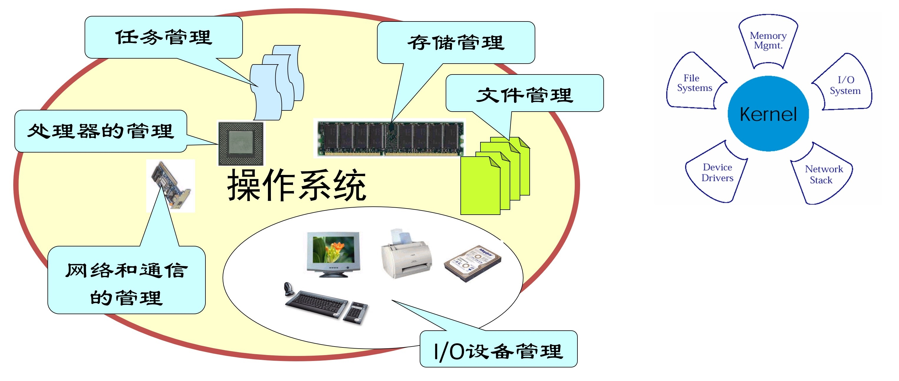
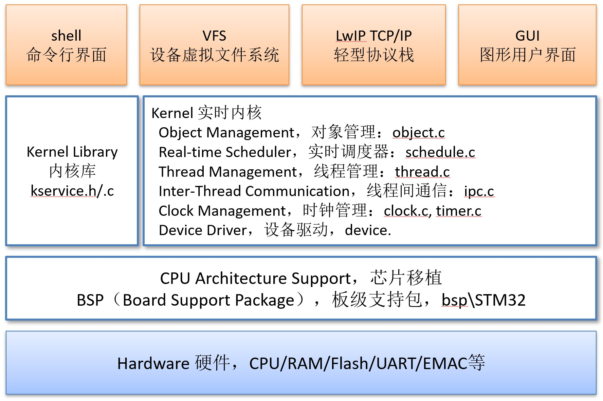
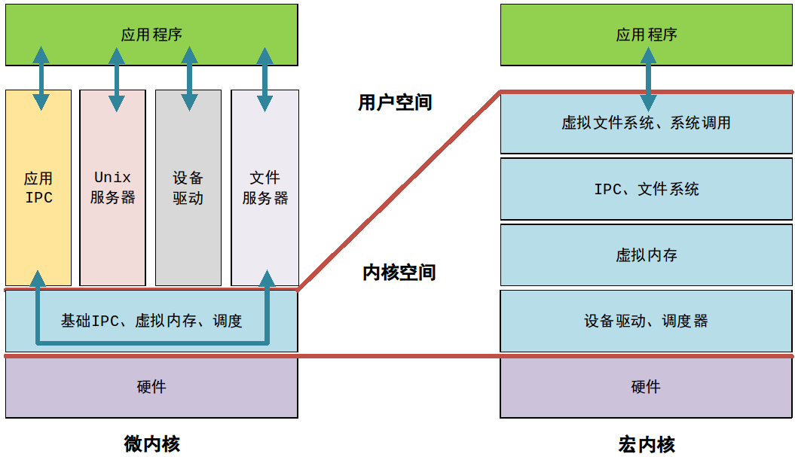
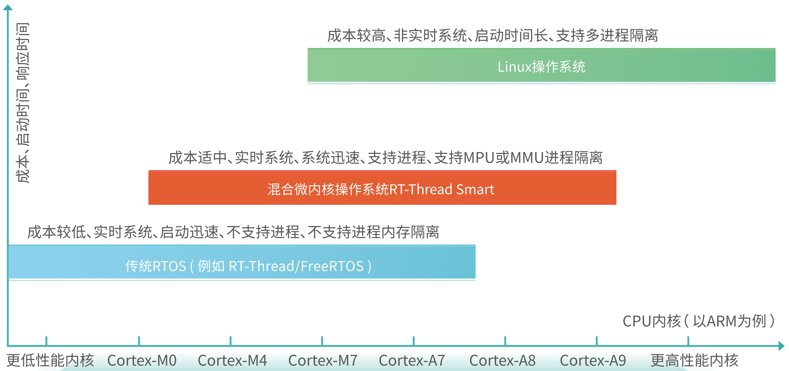
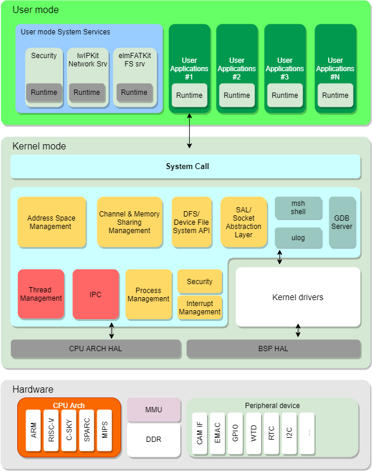
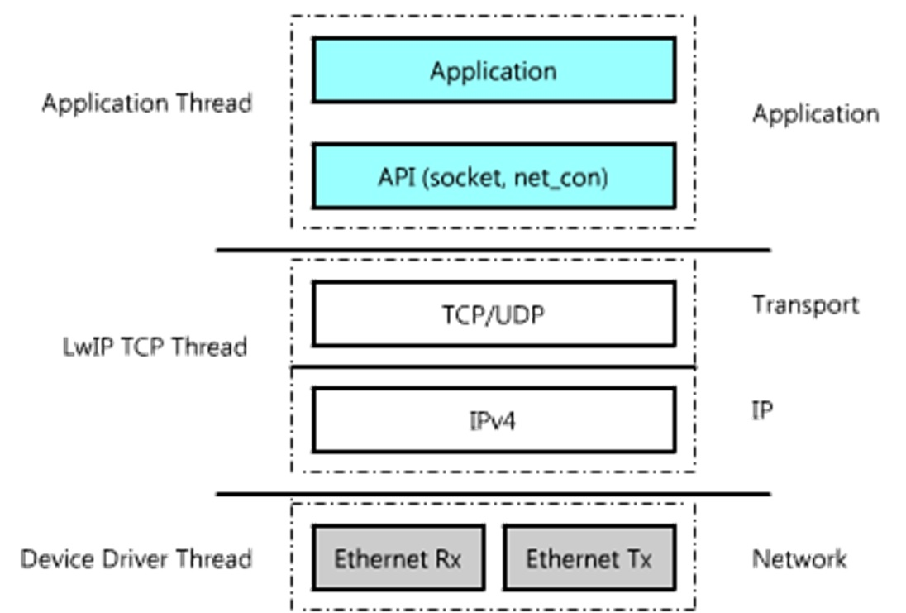

## ■■■■■■■■■■■■■■■■■■■■■■

# RTOS 嵌入式实时操作系统

## OS 操作系统 Operating System

操作系统按硬件范畴的表现形式分：芯片级嵌入（含程序或算法的处理器）、模块级嵌入（系统中的某个核心模块）系统级嵌入。

操作系统按软件范畴实时性要求分：非实时系统、软实时系统、硬实时系统。

## 实时操作系统（RTOS）

- 实时操作系统（RTOS）是指当外界事件或数据产生时，能够接受并以足够快的速度予以处理，其处理的结果又能在规定的时间之内来控制生产过程或对处理系 统作出快速响应，并控制所有实时任务协调一致运行的操作系统。因而，提供及时响应和高可靠性是其主要特点。
- 实时操作系统是保证在一定时间限制内完成特定功能的操作系统。

- 实时操作系统有硬实时和软实时之分
  - 硬实时要求 在规定的时间内必须完成操作，这是在操作系统设计时保证的；在“硬”实时操作系统中，如果不能在允许时间内完成使物体可达的计算，操作系统将因错误结束。
  - 软实时则只要按照任务的优先级，尽可能快地完成操作即可。在“软”实时操作系统中，生产线仍然 能继续工作，但产品的输出会因产品不能在允许时间内到达而减慢，这使机器人有短暂的不生产现象。
- 我们通常使用的操作系统在经过一定改变之后就可以变成实时操作系统。

### 实时操作系统的特征

- 多任务
- 有线程优先级
- 多种中断级别

- 时间约束性
  实时系统的任务具有一定的时间约束，即截止时间，超出截止时间将变成错误的结果；
- 可预测性
  指的是能够对实时任务的执行时间进行判断，以确定是否能够满足任务的时间约束性要求；
- 可靠性
  大多数实时系统要求有较高的可靠性，特别是硬实时系统，它基本上是一个功用性系统；
- 与外部环境的交互性
  实时系统通常运行在一定的环境下，等待外界事件触发而后进行处理响应；

### 硬实时系统与软实时系统

- 外在的区别在于功用性上:
  硬实时系统在给定时间t之后，马上变为零值。
  软实时系统随着给定时间t的推移，效用迅速的走向零值。
- 内在的区别在于，软实时允许偶尔计算过程超出时间限定。
- 采用实时操作系统的意义就在于能够及时处理各种突发的事件，即处理各种中断，因而衡量嵌入式实时操作系统的最主要、最具有代表性的性能指标参数无疑应该是中断响应时间了。中断响应时间通常被定义为：
  - 中断响应时间=中断延迟时间+保存CPU状态的时间+该内核的ISR进入函数的执行时间
  - 中断延迟时间=MAX(关中断的最长时间，最长指令时间) + 开始执行ISR的第一条指令的时间

### 硬实时系统

- 硬实时系统指系统要在最坏情况（负载最重）下确保服务时间，即对于事件的响应时间的截止期限是无论如何都必须满足。硬实时要求在规定的时间内必须完成操作，这是在操作系统设计时保证的；
- 在“硬”实时操作系统中，如果不能在允许时间内完成使物体可达的计算，操作系统将因错误结束。

- 硬实时系统的代表产品：VxWorks。以性能稳定而著称。
- 对于一些涉及到人身安全或者非常重要的任务，必须使用硬实时操作系统，更多用于对实时性要求更高的工业制造领域。比如汽车安全气囊的控制，晚一秒钟打开可能就会丧生一条人命，这种场合必须使用硬实时系统。

### 软实时系统

- 软实时系统是从统计的角度，任何一个任务都能够有一个预期的处理时间，但任务一旦超过截止期限，也并不会带来致命的错误。软实时则没有那么严，只要按照任务的优先级，尽可能快地完成操作即可。
- 在“软”实时操作系统中，生产线仍然能继续工作，但产品的输出会因产品不能在允许时间内到达而减慢，这使机器人有短暂的不生产现象。
- 软实时系统的代表产品：各种实时 Linux。当然，也有不少在 Linux 基础上做了实时性的改进，例如 RTLinux等。
- 对于 IPTV 数字电视机顶盒，需要实时的解码视频流，所以需要使用实时操作系统。但即使丢失了几个视频帧，在短时间内视频可能会有一些不流畅，但马上就会恢复，不会造成什么严重的后果。这种消费类电子产品，适合使用软实时操作系统。

## 裸机系统 与 多线程系统

### 裸机系统

裸机系统通常分成轮询系统和前后台系统：

- 轮询系统
  - 轮询系统即是在裸机编程的时候，先初始化好相关的硬件，然后让主程序在一个死循环里面不断循环，顺序地做各种事情 。   
  - 轮询系统只适合顺序执行的功能代码，当有外部事件驱动时，实时性就会降低。  
- 前后台系统
  - 前后台系统是在轮询系统的基础上加入了中断。  
  - 外部事件的响应在中断里面完成，事件的处理还是回到轮询系统中完成。  
  - 中断在这里我们称为前台， main 函数里面的无限循环我们称为后台。 
  - 在中断服务程序里面标记事件，如果事件要处理的事情很简短，则可在中断服务程序里面处理，如果事件要处理的事情比较多，则返回到后台程序里面处理。  
  - 相比轮询系统，前后台系统确保了事件不会丢失，再加上中断具有可嵌套的功能，这可以大大的提高程序的实时响应能力。  

### 多线程系统  

- 相比前后台系统，多线程系统的事件响应也是在中断中完成的，但是事件的处理是在线程中完成的。 
- 在多线程系统中，根据程序的功能，我们把这个程序主体分割成一个个独立的，无限循环且不能返回的小程序，这个小程序我们
  称之为线程。  
- 每个线程都是独立的，互不干扰的，且具备自身的优先级，它由操作系统调度管理。  
- 在多线程系统中，线程跟中断一样，也具有优先级，优先级高的线程会被优先执行。
- 当一个紧急的事件在中断被标记之后，如果事件对应的线程的优先级足够高，就会立马得到响应。
- 相比前后台系统，多线程系统的实时性又被提高了。   
- 加入操作系统后，我们在编程的时候不需要精心地去设计程序的执行流，不用担心每个功能模块之间是否存在干扰。
- 加入了操作系统，我们的编程反而变得简单了。  

## RTOS 和 Linux

- RTOS 是实时操作系统，实时操作系统是多任务、有线程优先级、多种中断级别、在规定时间内可以对处理系统，快速做出响应的操作系统；

- 而 Linux 是分时操作系统。而分时操作系统是一台计算机，可以同时拥有多个用户的操作系统。

- Linux是时分系统，不过可以通过配置内核改成实时系统。

  

## RTOS 嵌入式实时操作系统

RTOS 嵌入式实时操作系统适用于设备端、功能较简单的主机网关、无线控制器 AP 等

- FreeRTOS 
- embOS
- ThreadX
- uCOS
- VxWorks

### RTOS 基本结构框图

## RTOS 比较：UCOS-II  vs FreeRTOS vs RT-Thread

|                | **UCOS-II**                                                  | **FreeRTOS**                                                 | **RT-Thread**                                                |
| -------------- | ------------------------------------------------------------ | ------------------------------------------------------------ | ------------------------------------------------------------ |
| 任务/线程调度  | 256  个优先级，不允许有相同优先级任务     最大256个任务      | 优先级抢占式调度  协作式调度  允许存在相同优先级任务  任务数不受限制 | 256/32/8个优先级、允许存在相同优先级线程 、线程数不受限制、 允许动态创建/删除线程 |
| 同步、通信机制 | 信号量、互斥量 、事件集、邮箱（邮箱中最多只能放置1条消息）  消息队列 | 信号量、互斥量、消息队列                                     | 信号量、互斥量、事件集、邮箱（邮箱中可存储多条消息）、消息队列 |
| 内存管理       | 固定分区内存块管理                                           | 动态内存                                                     | 固定分区内存管理      小内存系统动态内存管理      大内存系统 SLAB 内存管理 |
| 定时器         | 只能使用OSTimeDly进行时间间隔处理                            | 依赖vTaskDelay()进行时间间隔处理                             | 挂接到OS定时器的硬定时器/软定时器                            |
| 中断嵌套       | 允许  （老的STM32版本不支持中断嵌套）                        | 允许                                                         | 允许                                                         |
| 设备框架       | 无                                                           | 无                                                           | 有                                                           |

## 微内核与宏内核架构

### 内核架构

- 在计算机科学中，内核是操作系统的核心部分，它管理着系统的各种资源，譬如时钟、中断、存储、进程、设备驱动、原语等。应用程序运行在内核之上，并通过系统调用访问内核空间。
- 从内核架构来划分，操作系统内核可分为微内核 (Micro Kernel) 和宏内核 (Monolithic Kernel，也翻译为单内核)
- 从操作系统功能模块来看，操作系统厂商依据自己的实际情况，可以将宏内核操作系统中的部分功能模块从内核空间移到用户空间，也可以将微内核操作系统中的部分功能模块从用户空间移到内核空间，由此就构成了微内核、小内核、大内核、宏内核等称谓。
- 对于介于微内核和宏内核之间的小内核、大内核来说，有时也把它们称之为混合内核。
- 微内核 (Micro Kernel) 
  - 微内核（通常缩写为μ内核）由一群数量尽可能最少的软件程序组成，它们负责提供实现一个操作系统所必须的各种机制。
  - 微内核操作系统仅在内核中保留了调度、基础 IPC、虚拟内存管理等少数核心功能模块，它们位于内核空间，而操作系统的其他功能模块（譬如文件系统、驱动程序等）与用户应用程序一起运行于用户空间
- 宏内核 (Monolithic Kernel，也翻译为单内核)
  - 宏内核操作系统在内核中包括了整个操作系统的大部分功能模块（譬如文件系统、驱动程序等），并且这些系统模块都运行在同一个内核地址空间，模块之间通过简单的系统调用进行协调工作。

### 微内核 vs 宏内核

- 安全性
  - 在安全性方面，通常认为微内核操作系统比宏内核操作系统更安全。
  - 微内核之上的模块之间相对独立，单个模块崩溃后可以重启，通常不影响全局；
  - 宏内核的模块之间因为都在内核内而纠缠在一起，一个模块的崩溃容易导致整个系统的失败。
  - 宏内核不安全的核心问题在于其不符合最低授权原则POLA（Principle Of Least Authority）。其中，最大的隐患在于宏内核可不断扩张的内核模块。
  - 例如，对Linux来说，一旦进入内核，所有的代码都运行在CPU最高等级Ring 0，内核级的恶意软件可以破坏中断表、系统调用表等关键数据。
  - 然而，在微内核架构中，进程管理、文件系统、网络服务等均运行在Ring 1并且没有动态扩展，微内核的这种封闭性很好地保障了隔离性，当然这种隔离性也带来了性能开销。
- 可靠性、可移植性、可维护性
  - 由于内核较小，微内核操作系统相比宏内核操作系统还具有可靠性好、可移植性好、可维护性好的特点。
- 可扩展性
  - 微内核操作系统只在内核部分包括功能几乎不变的核心模块，其他模块位于内核之上，便于扩展新的模块
  - 宏内核操作系统则在内核部分包括了大部分操作系统功能模块，添加新模块会影响到其他模块，因而不便于扩展。
- 可连续性
  - 在工控领域，有些系统可以连续运行几个月甚至几年。可连续性是指长时间运行而不重启；当然，如果失败后应能很快恢复运行。
  - 相比宏内核，微内核因为功能少，安全性和可靠性高，因而具有更好的连续性。
- 性能
  - 微内核的性能通常认为比宏内核差。
  - 宏内核操作系统因为在内核部分包括了大部分操作系统功能模块，这些模块只需要通过函数调用的方式就可以完成相互间的调用。
  - 但是，微内核操作系统的大部分功能模块在内核之外，需要通过上下文切换和地址空间（用户空间和内核空间）切换才能够完成。
  - 但即便如此，也有观点认为微内核因为其他各种优点而会在未来的PC、服务器等领域占有一席之地。
- 实时性
  - 微内核与实时性没有必然联系。
  - 由于一些微内核操作系统在实时性方面做了处理，因而具有较好的实时性
  - 但宏内核操作系统也可以在实时性方面进行优化处理。

## 微内核操作系统

- 微内核结构的优点：
  - 提供一致的接口：微内核设计为进程请求提供一致的接口，进程不在需要区分内核级服务还是用户级服务，因为都是通过消息传递；
  - 可扩展性：使用微内核结构，当需要为系统增加新的服务时，只是增加一个新的服务进程，而不是修改内核；
  - 灵活性：可以根据需要定制不同的服务进程，例如分布式系统需要增加安全性相关的服务；
  - 可移植性：在微内核结构中，大部分处理器专用代码都在微内核中，如果需要移植到另一个处理器上时，需要修改的代码很少；
  - 可靠性：模块化的结构有利于增加稳定性，而且足够小的微内核更能进行充分的测试，为外部的系统服务提供更稳定的代码。而且它只提供少量的API和交互方式给程序员，可以减少组件之间的相互影响；
  - 驱动程序、网络协议、文件系统等操作系统模块和内核相互独立，任何模块的故障都不会导致内核的崩溃；
  - 驱动程序、网络协议、文件系统和应用程序都处于程序空间，都调用相同的内核API，开发与调试和应用程序没有区别；
  - 操作系统功能模块可以根据需要动态地加载或卸载，不需要编译内核。
  - 在高可靠性要求的情况下，可以编写监视模块，对可靠性要求高的模块进行监视，必要的时候重新启动或重新加载而无须重启系统。

- 微内核操作系统适用于车载或主机网关。

### QNX 微内核实时操作系统

- QNX 是一种商用的遵从 POSIX 规范的类 Unix 实时操作系统，目标市场主要是面向嵌入式系统。它可能是最成功的微内核操作系统之一。

- QNX 是一个分布式、嵌入式、可规模扩展的实时操作系统。它遵循 POSIX.1、(程序接口)和 POSIX.2 ( Shell 和工具)、部分遵循 POSIX.1b (实时扩展)。它最早开发于 1980 年，到现在已相当成熟。

- QNX 是一个微内核实时操作系统，其核心仅提供 4 种服务：进程调度、进程间通信、底层网络通信和中断处理，其进程在独立的地址空间运行。所有其它 OS 服务，都实现为协作的用户进程，因此 QNX 核心非常小巧（ QNX4.x 大约为 12Kb）而且运行速度极快。
- QNX 提供 POSⅨ.1b 标准进程调度：
  - 255 个进程优先级；
  - 抢占式的、基于优先级的正文切换；
  - 可选调度策略：FIFO、轮转策略、适应性策略。 
- QNX 的微内核结构，内核独立自处于一个被保护的地址空间；驱动程序、网络协议和应用程序处于程序空间中。高可靠性的内核结构使 QNX 具备了高可靠性嵌入式操作系统的本质特征。

### rt-smart 微内核操作系统

- RT-Thread Smart（简称 rt-smart）嵌入式实时操作系统是基于 RT-Thread 操作系统衍生的新分支，面向带 MMU，中高端应用的芯片，例如 ARM Cortex-A 系列芯片。

- rt-smart 是一款高性能混合微内核操作系统，在传统嵌入式操作系统划分中，rt-smart 能够填补传统 RTOS 和大型操作系统 Linux 之间的空白，在实时性、成本、安全性、启动速度等方面可以取得最佳的平衡。

- rt-smart 操作系统架构框图，如下图所示。rt-smart 操作系统主要包含内核模块和用户态运行时环境。内核模块包括虚拟地址空间管理、进程管理、线程管理、进程间通信、虚拟文件系统框架、网络接口层框架、设备驱动框架、msh 控制台、日志系统、异常中断管理和系统调用接口，设备驱动框架包含串口驱动框架和看门狗驱动框架。用户态运行时环境包括用户态 C 库。

# ■■■■■■■■■■■■■■■■■■■■■■

# Kernel 内核

## 01_Clock Management 时钟管理

### 时钟节拍 SysTick

### 线程时间片

### 定时器

## 02_Real-time Scheduler 实时调度器-线程调度

### 调度器最主要的工作

- 保证一个最高优先级的任务运行（如果是抢占式调度器，需立刻运行）从就绪线程列表中查找最高优先级任务
- 任务切换

### 相同优先级线程采用时间片轮转

- 相同优先级线程采用时间片可设置的 Round-robin （时间片轮转）算法
- 时间片通常是分时系统中的概念，它表示一个任务在运行完相应的时间片后，被自动的让出处理机资源给其他任务。
- 在实时操作系统中一般仅在当系统中有多个相同优先级就绪线程存在时，才会按照时间片轮转方式进行调度。

### 基于优先级的全抢占式线程调度器

- 最高优先级的任务一旦就绪，总能得到CPU的控制权。即，只要有高优先级线程就绪，立刻切换到高优先级线程执行；
- 当一个运行着的任务使一个比它优先级高的任务进入了就绪状态，当前任务的CPU使用权就被剥夺了，或者说被让出了，那个高优先级的任务立刻得到了CPU的控制权。
- 如果是中断服务子程序使一个高优先级的任务进入就绪态，中断完成时，中断了的任务被挂起，优先级高的那个任务开始运行。
- 可抢占式调度必然是基于优先级的任务调度系统。
- 调度算法采用 bitmap 的方式，计算最高优先级线程时间恒定

### 前后台系统

## 03_Task-Thread Management 任务-线程管理

### 线程创建、删除、初始化、脱离

### 线程应该考虑的几个因素

### 线程（任务）优先级

### 线程状态

### idle 空闲线程

- 空闲线程是系统线程中一个比较特殊的线程，它具备最低的优先级，当系统中无其他线程可运行时，调度器将调度到空闲线程。
- 空闲线程通常是一个死循环，永远不被挂起。
- 另外，空闲线程还有着它的特殊用途：
  - 把线程的真正删除动作放到了空闲线程中（在删除线程时，仅改变线程的状态为关闭状态不再参与系统调度）。
  - 空闲线程也提供了接口运行用户设置一个钩子函数，供空闲线程在它运行时调用。
- 在启动调度器前，必须要执行空闲线程初始化函数

### 线程钩子函数

#### 调度器钩子 scheduler_hook

#### 空闲钩子 idle_hook

### POSIX thread

### pthread 线程

## 04_Thread Synchronization 线程同步

- 信号量
- 互斥量  用于防止优先级翻转
- 事件集   用于多事件触发的事件集

## 05_Thread Communication 线程通信

- 邮箱：带缓存功能的邮箱通信

- 消息队列

  

## 06_Memory Management 内存管理

- 动态内存堆  多线程环境安全的动态堆内存管理
- 静态内存池   带线程挂起功能
- 每个内存块大小固定
- 当内存池为空时，线程可选择是否休眠，当有内存块可用时，自动唤醒等待线程。

## 07_Interrupt Management 中断管理

### 实时性相关概念

- 关中断时间
- 最大关中断时间
- 中断响应时间
- 中断恢复时间

# ■■■■■■■■■■■■■■■■■■■■■■■

# Kernel 内核移植

## CPU Architecture Support 芯片支持包：架构、移植

- x86
- ARM
  - ARM Cortex-M0/M3/M4/M0+ 系列
  - RM Cortex-R4/R5/R7 系列
  - ARM Cortex-A5/A7/A8/A9/A15 系列
- RISC-V
- MIPS
  - MIPS32 系列
  - MIPS64 系列
- PowerPC
- ColdFire

## BSP & Device Driver 板级支持包 硬件抽象层 

BSP 板级支持包 Board Support Package

与硬件密切相关，由外设驱动和 CPU 移植构成。

- Ethernet Driver
- Serial  Driver
- Flash Driver 
- USB Driver 
- Audio Driver

# ■■■■■■■■■■■■■■■■■■■■■■■

# 设备驱动管理 Device Driver Management

## Object Management 对象管理

## 设备模型

- 基于名字的对象化设备模型。

- 上层应用只需查找相应设备名获得设备句柄即可采用标准的设备接口进行硬件设备的访问操作。

- 通过这套设备模型，可以做到应用与底层设备的无关性。

- 例如，字符设备，块设备、网络设备、声音设备等。

## 设备驱动

- IO 设备模型
- PIN 设备
- UART 设备
- CAN 设备
- HWTIMER 设备
- I2C 设备
- PWM 设备
- RTC 设备
- SPI 设备
- WATCHDOG 设备
- SENSOR 设备

# ■■■■■■■■■■■■■■■■■■■■■■■

# Component 组件

## shell 控制台

- 接受C语言语句语法的人机交互命令行
  - 把C语言代码中的函数和变量直接当成命令来使用，相当于在命令中能够直接访问系统函数和变量，为命令行方式动态地访问系统提供强大的接口。
  - 适合于测试，增量开发的辅助组件，能够通过命令行方便的(动态地)查看系统状态。
  - 与具体使用的设备无关，能够直接应用于 Telnet 服务中。
- 简单的新命令行添加方式
  - FINSH_FUNCTION_EXPORT(hello, say hello)
  - FINSH_VAR_EXPORT(log, trigger log for debug)

## File System 文件系统

- 面向小型设备的虚拟文件系统
  - 类似Linux融合了多种文件系统的超级文件系统
  - 为上层应用提供统一的文件访问接口，而不用关心底层文件系统的具体实现及存储方式
- 支持FAT12/16/32、ext4、NFSv3、ROMFS等文件系统
- 支持长文件名，中文文件名
- 支持SPI Flash、SD卡等

## Network Stack 网络协议栈 TCP IP

- 全功能的 LwIP TCP/IPv4协议栈，支持：

  - IP、ARP、ICMP、IGMP、TCP、UDP
  - PPP、DHCP、DNS
  - HTTP、TFTP、FTP等众多协议

- 提供BSD Socket标准风格接口，方便移植/调试现有的一些网络应用。

- 为微控制器极度优化：5K RAM占用

- 在ARM Cortex-M3上 TCP 数据吞吐量不低于：600KB/s接收，1MB/s发送。

  

## POSIX 接口

## 电源管理

## Driver Framework 驱动框架

## Debug 调试组件

### Log 日志

## Test 测试组件
