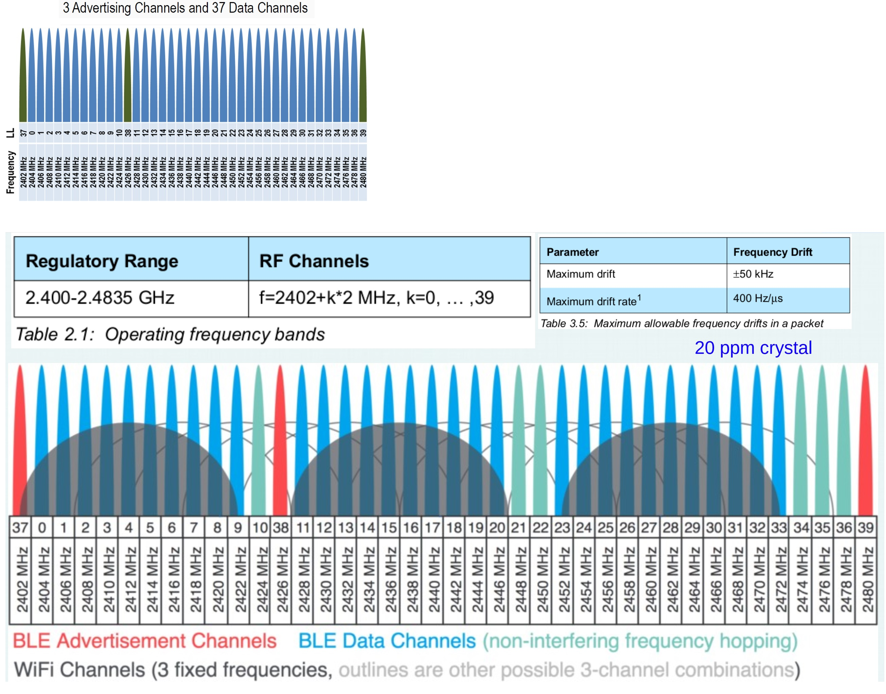
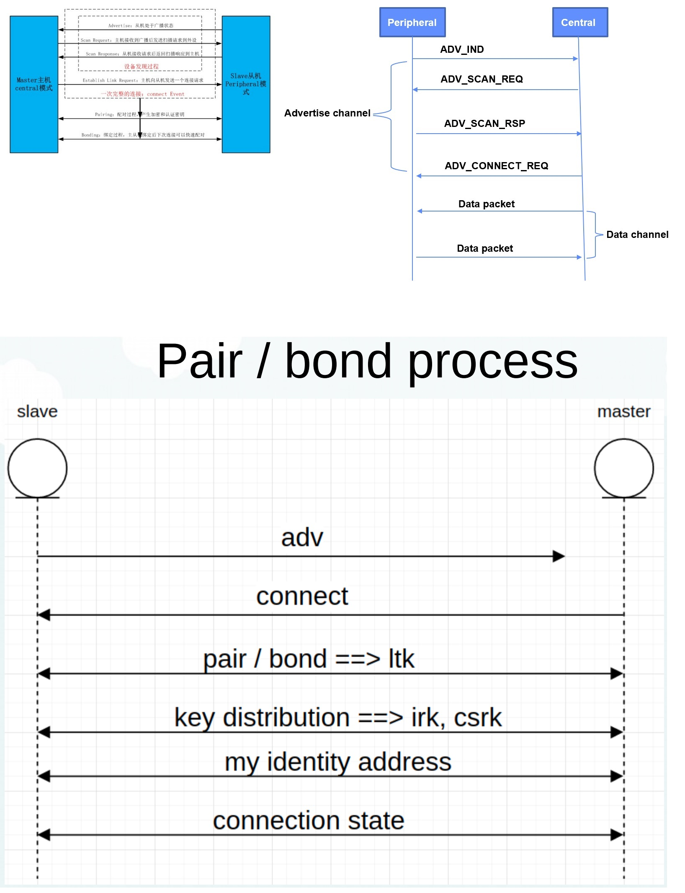
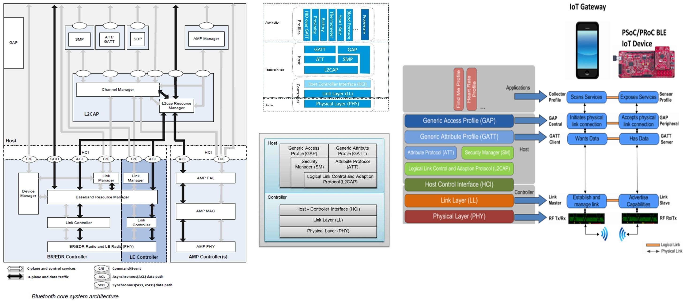

# BLE 低功耗蓝牙 Bluetooth Low Energy

BLE 的全称叫做 Bluetooth Low Energy，也称之为低功耗蓝牙，属于蓝牙技术中的一种。具有低成本、短距离、低功耗的特点，工作在免许可的2.4 GHz ISM 射频频段。与之对应的是 Classic Bluetooth，经典蓝牙。当然，经典蓝牙是最先推出来的，后面才有了 LE 的版本。在兼容性上，LE 的蓝牙不兼容 Classic 的版本，可以理解成为独立的一种蓝牙形态。旨在针对低功耗的领域进行的一种无线数据传送的解决方案。

## 蓝牙的发展历史

蓝牙技术是一项短距离无线通信的技术，其核心是基于跳频扩频（FHSS，Frequency Hopping Spread Spectrum）技术发展而来的。跳频扩频技术也是后面 CDMA、Wi-Fi、蓝牙的基础无线技术。

| 时间         | 版本     | 描述                                                         | 应用场景                                                     |
| ------------ | -------- | ------------------------------------------------------------ | ------------------------------------------------------------ |
| 1999 年      | 蓝牙 1.0 | 蓝牙技术联盟 SIG（Special Interest Group）组织发布了蓝牙 1.0 技术，确定使用公共的 2.4G 频段。 |                                                              |
| 2003 年      | 蓝牙 1.2 | 加入适应性跳频、eSCO 等技术后，才满足了无线语音和音频传输等功能的基本要求。 | 蓝牙耳机、蓝牙音箱，搭配手机来使用。                         |
| 2004、2007年 | 蓝牙 2.x | 2004年推出的蓝牙2.0版本和2007年推出的蓝牙 2.1版本新加了扩展数据率 (Enhanced Data Rate,EDR) 和安全简单配对 ( Secure Simple Pairing, SSP) 技术。 EDR 通过改变蓝牙空中传输的编码方式,将蓝牙的传输速率提高到了3Mbit/s（提升了3倍的传输速率）。 SP则改善了蓝牙设备的配对体验,让用户不需要输入 pin 码。 |                                                              |
| 2009 年      | 蓝牙 3.0 | 新增了 High Speed 功能,可以使蓝牙基于 Wi-Fi技术，实现高速数据传输,传输速率高达 24Mbits。 | 应用范围比较窄,基本上只有在电脑上出现过,手机和其他设备很少有支持High Speed 功能的。 |
|              |          |                                                              |                                                              |
| 2010 年      | 蓝牙 4.0 | 最重要增加了蓝牙低功耗((Bluetooth Low Energy)技术，提出了低功耗蓝牙 BLE 和经典蓝牙（耳机、音箱等）两种模式。 相比经典蓝牙,低功耗蓝牙拥有更快的响应速度,最短可在3ms 内完成连接设置并开始传输数据。 根据支持蓝牙模式的不同,蓝牙芯片又可以分为单模芯片( Single Mode)和双模芯片(Dual Mode)。 单模芯片只能支持低功耗蓝牙。 双模芯片除支持低功耗蓝牙外,还能兼容之前版本的经典蓝牙。 | 搭配手机一起使用的智能硬件。例如，蓝牙手环、温湿度传感、蓝牙体重秤等。但是这些设备无法自组网。 |
| 2016 年      | 蓝牙 5.0 | 在低功耗模式下具备更快更远的传输能力，其传输速率是蓝牙4.2版本的 2 倍 (速度上限为 2Mbit/s)，有效输离是蓝牙 4.2 的 4倍(理论上可达300m)，广播包容量是蓝牙 4.2 的 8 倍。 |                                                              |
| 2017 年      | mesh 1.0 | 发布了蓝牙 mesh 1.0 版本的协议议规格，一种基于低功耗蓝牙广播包来实现的 mesh 网络技术。 | 通过蓝牙 mesh 这项新的协议规格，正式进入物联网的领域。 解决智能硬件孤岛问题。比如，灯泡、插座、风扇可以通过蓝牙 mesh 技术自组织为一个网。 |
| 2019 年      | 蓝牙 5.1 | 引入了基于 AoA (到达角)和AoD(发射角)的定位技术。 测向功能和厘米级的定位服务，这项功能的加入使得室内的定位会变得更加精准，并且在小物体的位置上也能准确定位避免物品遗失。 |                                                              |
| 2020 年      | 蓝牙 5.2 | 主要的特性是增强版ATT协议、 LE功耗控制和信号同步，连接更快，更稳定，抗干扰性更好。 对ATT协议层进行了更新(Enhanced Attribute Protocol)，以能够快速读取属性值，此功能将提高ATT协议的信息沟通效率和快速服务发现(Fast Service Discovery)等功能，快速服务发现功能将在以低功耗为准的蓝牙音频技术中实现音频设备间快速交换服务信息。 |                                                              |

## 经典蓝牙模块（BT）vs 低功耗蓝牙（BLE）

蓝牙 4.0 标准包括传统蓝牙和低功耗蓝牙两部分。低功耗蓝牙是建立在传统蓝牙的基础上发展起来的，并且有别于传统蓝牙模块。

**蓝牙模块的分类：**

| 技术规范         | 经典蓝牙（BT）                   | 低功耗蓝牙（BLE）                        |
| :--------------- | :------------------------------- | :--------------------------------------- |
| 无线电频率       | 2.4GHz                           | 2.4GHz                                   |
| 距离             | 10 米                            | 最大 100 米                              |
| 发送数据时间     | 100ms                            | <3ms                                     |
| 响应延时         | 约 100ms                         | 6ms                                      |
| 安全性           | 64/128bit AES 及用户自定义应用层 | 128bit AES 及用户自定义应用层            |
| 能耗             | 100%（ref）                      | 1%-50%（ref）                            |
| 空中传输数据速率 | 1-3 Mb/s                         | 1Mb/s                                    |
| 主要用途         | 手机、耳机、汽车、PC             | 手表、手机、医疗保健、智能穿戴、家用电子 |

### 经典蓝牙模块（BT）

泛指蓝牙协议 4.0 以下的模块，一般用于数据量较大的传输：音乐、文件等。经典蓝牙模块可再细分为：传统蓝牙模块和高速蓝牙模块。传统蓝牙模块（2004年推出），主要支持蓝牙 2.1 协议；高速蓝牙模块（2009 年推出），速度提高到 24Mbps，用于高清电视、PC等设备数据传输。

### 低功耗蓝牙（BLE）

指支持蓝牙协议 4.0 或更高协议的模块，最大特点是成本和功耗降低，应用于实时性要求高，且数据传输速率比较低的产品，如遥控器（鼠标、键盘）、传感器设备数据传输（测心跳计、血压计、温湿度传感器）等。

# BLE 基础概念

## BLE 频段

低功耗蓝牙工作在 2.4GHz 的 ISM 频段，具有 40 个频道，每个频道为 2MHz。 如图所示。利用 GFSK 调制，它能够以 1Mbit/s 的速率发射数据。 与经典蓝牙一样，低功耗蓝牙使用跳频技术，但是它采用了自适应跳频技术并且跳频的频率很低。 40 个频道中，低功耗蓝牙利用 3 个频道用于广播，剩下的 37 个通道用于设备间传播数据。

在大多数情况下， BLE 设备可运行在 4 个基本的模式：主模式、从模式、广播模式以及扫描模式。 

- 广播模式下设备可以周期性地广播数据，也可以响应来自其它设备的扫描请求、连接请求。

- 扫描模式下设备主要功能是扫描广播包。

- 一旦处于广播模式下的设备接受了来自扫描模式下设备的连接请求，则两个设备就进入了连接状态。

- 只有在连接状态下，两个设备才能进行读写等操作。

- 与此同时，广播模式下的设备转变为从模式，扫描模式下的设备转变为主模式。

## BLE 数据包：广播包、数据包

低功耗蓝牙有两种类型的数据包：广播包、数据包。 两种类型拥有可变的数据长度。

BLE 数据包包含了： 8bit 的前导码、由 RF 通道所决定的 32bit 连接地址、可变长度的PDU（ 2 至 39 个字节）和 24bit 的 CRC 校验码。由此得知 BLE 数据包最短有 80Bits，最长有 376Bits，因此数据包的发射时间在 80 微秒至 300 微秒之间。

广播包数据中 PDU 包含一个 16bit 的包头和最多 31 字节的数据。

BLE 协议栈的广播数据包有一定的格式：长度（ 1 个字节） +类型（ 1 个字节） +数据（ N 个字节）。 并且最大长度为 31 个字节。

## BLE 建立连接

**主从机连接建立过程**

两个设备有三种关联方法：正常模式、带外工作和口令连接。

一个广播设备在广播通道上发送广播数据，其中的 PDU 带有设备地址和 31Bytes 的附加信息。

一个扫描设备是可以获取到广播者的地址的，并且根据广播者设置，更多的附加信息可以通过扫描者发送扫描请求获取。

这就意味着甚至在没有建立连接的情况下，扫描者就可以获得一定量的数据了。

广播者依次在三个广播通道发送广播数据，广播的时间间隔可以配置为20ms 到 10s 之间。

另一方面，扫描者也可以配置自己的扫描窗口（扫描多长时间）和扫描间隔（间隔多久扫描一次）。

一旦连接建立，

- 扫描者将提供给广播者 2 个重要的信息---连接间隔、从机延迟时间。
  - 连接间隔被用来确定连接事件的开始时间。因此，较长的连接间隔意味着较小的数据交换率，较小的功耗；相反，较短的连接时间间隔意味着较大的数据交换率，较大的功耗。
  - 从机延迟时间指在不丢失连接的情况下，从机可以忽略的最大连接事件个数。这么做是为了优化功耗。
- 一旦连接建立完成，数据的通信将在 37 个数据通道上进行。伴随着数据包头和 4 个字节的消息完整性检查字段。主从之间的信息交互由主设备发起的，直到任意一方中断连接。

# BLE 协议栈

蓝牙低功耗协议栈包含 2 个部分：控制器（Controller）和主机（Host）。

- 主机（Host）位于协议栈上层，包含应用、属性协议和 L2CAP。
- 控制器（Controller）位于协议栈的底层， 负责处理物理信道数据的接收与发射。

主机和控制器既可以在一块处理器上同时实现，也可以主机运行在应用处理器上，控制器运行 RF 控制处理器上，即主机和控制器之间的交互需要通过硬件控制接口（ HCI）来进行。

BLE 协议栈实现了低功耗蓝牙协议的全部功能，协议栈主要框架如下：

如上图，要实现一个 BLE 应用，首先需要一个支持 BLE 射频的芯片，然后还需要提供一个与此芯片配套的BLE协议栈，最后在协议栈上开发自己的应用。BLE 协议栈是连接芯片和应用的桥梁，是实现整个 BLE 应用的关键。

BLE 协议栈主要是用来对应用数据进行封包（包裹帧头和帧尾），以生成一个满足 BLE 协议的空中数据包。BLE 协议栈主要组成部分有：PHY 、LL 、HCI 、GAP、L2CAP 、SMP、ATT、GATT。

中央设备可以向外部设备发起建立连接的请求。连接请求包括如下的参数：

- 连接间隔---在两个 BLE 设备的连接中使用跳频机制，两个设备使用特定的信道收发数据，然后过了一段时间后再使用新的信道（链路层处理信道切换），两设备在信道切换后收发数据称之为连接事情。即使没用应用层数据的收发，两设备仍然会通过交换链路层数据来维持连接。连接间隔就是两个连接事件之间的时间间隔，连接间隔以 1.25 毫秒为单位，若连接间隔为 3200，则为 4 秒。不同的应用可能要求不同的时间间隔。长时间间隔的优势是显著地节省功耗，因为设备可以在连接事件之间有较长时间的休眠，坏处是当设备有应用数据需要发送时，必须要等到下一个连接事件；短的时间间隔优势是两个设备可以更快的交换数据，坏处则为功耗较大。

-  从机延时---这个参数的设备可以使从机（外部设备）跳过若干连接事件，这给了从机更多的灵活性，如果它没有数据发送时，可以选择跳过连接事件继续休眠，以节省功耗。

- 超时---这是两个成功连接事件之间的最大允许时间间隔。如果超过了这个时间而没有成功的发送连接事件，设备被认为是丢失连接，返回到未连接的状态。这个值的单位为 10ms，值范围是 10（ 100ms） ---3200（ 32s）。

 外部设备也可以通过向中央设备发送“连接参数更新请求”来改变连接设置。当中央设备收到请求后，可以选择或拒绝这些新的参数。

连接可以被主机或从机以任何原因自动终止。当一方发起终止连接时， 另一个方必须做出响应。然后两个设备才能退出连接状态。

## PHY 层（Physical Layer）

PHY 层（Physical Layer）物理层，用来指定 BLE 所用的无线频段、调制解调方式和方法等 。该层的处理直接决定整个 BLE 芯片的功耗、灵敏度等射频指数。

 1Mbps 自适应跳频 GSFK 调制的无线电，工作在 2.4GHz 的 ISM 频段。

## LL 层（Link Layer）

- LL 层（Link Layer）链路层。LL 层是整个 BLE 协议栈的核心 ，负责设备的 RF 状态。
- LL 层定义了两个设备如何利用无线电传输信息，包含了报文、广播、数据通道的详细定义，也规定了发现其他设备的流程、广播的数据、连接的建立、连接管理以及连接中数据的传输等。执行一些基带协议底层的数据包管理协议。
- 一般设备 RF 状态有五种可能的情况：待机（ Standby）、广播（ Advertising）、监听/扫描（ Scanner）、初始（ Initiating）和连接（ Connected）。
  - Standby（就绪态）：不进行数据的收发也不进行广播。
  - Advertising（广播态）：它将在广播通道上广播数据包，不需要建立连接就可以发送数据。
  - Scanning（监听/扫描态）：它将扫描广播通道上的广播数据包，接收广播态设备发出的数据。
  - Initiating（初始/发起态）：它将对特定的广播设备发起连接请求。通过发送连接请求来回应广播态设备，如果广播态设备接收连接请求，那么广播态设备和发起态设备将会进入连接态。发起连接的设备称为主机，接受连接的设备称为从机。
  - Connected （连接态）：当广播设备接收了该请求： 双方进入连接状态。
- 如果设备由初始态进入连接状态，则该设备充当主设备，而由广播态进入连接态的设备充当从设备。

## HCI 层（Host-Controller Interface）

HCI 层（Host-Controller Interface）主机控制接口层，HCI 层是可选的，提供了控制器（Controller）和主机（Host）之间的标准接口。

这些接口既可以通过软件 API 实现，对应主机和控制器在一块处理器上实现。

也可以通过硬件接口来实现，如 UART、 SPI 或者 USB，对应主机和控制器在两块处理器上实现。

## L2CAP 层（Logical Link Control and Adaptation Protocol）

L2CAP 层（Logical Link Control and Adaptation Protocol）逻辑链路控制及自适应协议层，主要功能:

- 为上层协议提供数据封装，L2CAP 层对 LL 层 payload（有效数据包）进行了一次简单封装，LL 层只关心传输的数据本身，L2CAP 层就要区分是加密通道还是普通通道，同时还要对连接间隔进行管理。
- 为下层控制器（ Controller） 提供多路复用和数据包分包功能。
- 总体来讲，实现逻辑上的端对端通信。

L2CAP  层有三种数据传输类型传入：属性协议（ATT）、安全管理协议（SMP）、低功耗信令信道。

## SM 层（Security Manager）

SM 层（Security Manager）安全管理层 ，用于身份验证与加密。SMP 层用来管理 BLE 连接的加密和安全，提供配对和密钥的分发，实现安全连接和数据交换。 它采用 AES-128 位加密算法并且还负责配对和密钥分配。它保障了连接和数据交换的安全性。

## ATT 层（Attribute Protocol）

ATT 层（Attribute Protocol）属性协议层，是专为优化小数据包传输所定义的通信方法。  

ATT 层用来定义用户命令及命令操作的数据，比如读取某个数据或者写某个数据。 ATT 层允许设备向另外一个设备展示一块特定的数据，称之为 attribute （属性），ATT 层定义了属性的内容，规定了访问属性的方法和权限 。展示属性的设备称为服务器，与之配对的设备称为客户端。  

ATT 是由许多成对的属性和值构成。这些属性和值可由其它设备读、写或者发现。  

**属性介绍**

属性是一条公开的带有标签的，可以被寻址的数据。

属性包括三种类型：服务项、特征值和描述符。三者之间存在树状包含关系，服务项包含一个或多个特征值，特征值包含一个或多个描述符，多个服务项组织在一起，构成属性规范（Attribute Profile）。 

属性由四个部分组成：属性句柄（Attribute Handle）、属性类型（Attribute Type）、属性长度（Attribute Value）以及属性许可证（Attribute Permission）。

- 属性句柄：0x0001 - 0xFFFF 的值，用于查询属性的一种方式，并且可以通过属性句柄操作多个同样的属性类型。

- 属性类型：用以区分当前属性是服务项或是特征值，用 UUID 表示。

- 属性值：用以存放数据的地方。如果是服务项或者特征值声明，该数据为UUID等信息，如果是普通的特征值，该数据则是用户的数据。 

- 属性权限：

  - 访问权限（Access Permission）– 只读、只写、读写

  - 加密权限（Encryption Permission）– 加密、不加密

  - 认证权限（Authentication Permission）– 需要认证、无需认证（密码配对过程）

  - 授权权限（Authorization Permission）– 需要授权、无需授权（授权要求设备必须是可信任 

    ，认证的设备未必被授权，授权的设备一定是认证的 ）

> 一个没有经过认证的设备，被称为 Unknown Device（未知设备）；经过了认证该设备会在绑定信息中被标记为 Untrusted，被称为 Untrusted Device（不可信设备）；经过了认证，并且在绑定信息中被标记为 Trusted 的设备被称为 Trusted Device（可信设备）。授权要求设备为Trusted Device（可信任设备）。

> 在实际使用中，经过配对以后设备即为 Untrusted Device——认证，在代码中调用API可以设置设备为Trusted Device——授权。

## GAP 层（Generic Access Profile）

GAP 层（Generic Access Profile）定义了设备之间的匹配与连接的一般方法。它是应用程序实现具体设备模式（广播者、扫描着等）的接口。GAP 层是对 LL 层 payload（有效数据包）如何进行解析的两种方式中的一种。

GAP 层负责处理设备访问模式和程序，包括设备发现、建立连接、结束连接、初始化安全特性和设备配置。

 GAP 层总是作为下面四种角色之一：

- Broadcaster 广播者——不可以连接的一直在广播的设备；
- Observer 观测者——可扫描广播设备，但不能发起建立连接的设备；
- Peripheral 从机/外部设备——可被连接的广播设备，可以在单个链路层连接中作从机。
- Central 主机/中央设备---扫描广播设备并发起连接请求，在单个链路层或多链路层连接中中作为主机。

在 TI 的 ble 协议栈中，一个主机可以连接三个从机。

## GATT 层（Generic Attribute Profile）

GATT 层（Generic Attribute Profile）负责描述不同的服务框架，它是 ATT 特定于蓝牙低功耗的一个扩展。它通过应用程序配置文件与应用层打交道。每一个应用程序配置文件定义了数据格式，以及它如何被应用程序所解释。

GATT 层用来规范 attribute 中的数据内容，并运用 group（分组）的概念对 attribute 进行分类管理。 

配置文件通过减少交换的数据量来减低功耗。

目前，蓝牙低功耗已经有许多特定的配置文件，比如：心率曲线，血糖，警报通知等等。

这使开发人员利用特定的配置文件可以很方便地开发对应特定的应用。

GATT 层实现两个设备应用数据的通信。从 GATT 角度来看，当两个设备建立连接后，他们处于下面两种角色之一：

- GATT 服务器---它是为 GATT 客户端提供数据服务的设备；

- GATT 客户端---它是从 GATT 服务器读写应用数据的设备。

- 主机从机既可以似乎 GATT 客户端也可以是 GATT 服务器。

一个 GATT 服务器可包含一个或多个 GATT 服务， GATT 服务是完成特定功能的一系列数据的集合。在 SimpleBLEPeripheral 工程中，有三个 GATT 服务：

- 强制的 GAP 服务---这一个服务包含了设备和访问信息。例如：设备名、设备供应商和产品标识。
- 强制的 GATT 服务---这一服务包含了 GATT 服务器的信息，是协议栈一部分，是BLE 协议规范对每一个 BLE 设备的要求。
- SimpleGATTProfile 服务---这个服务包含了应用数据的信息，与应用程序数据的传递密切相关，学生也可以按照特定的格式编写自己的 GATT 服务。

**属性分组**

属性有多级，顶级为 Profile，下辖多个服务项（Service），服务项下辖多个特性（Characteristic），特征值下辖多个描述符（Descriptor）。 

- profile：一个蓝牙服务器中的数据库，可以包含多个服务项；

- 服务项：一系列由数据和相关行为组成的集合，为了完成某个特定的功能和特性。一个服务项包含一个服务声明和 0 个或多个包含定义以及至少一个特性定义。

  - 服务声明：告诉其他蓝牙设备，该服务器设备提供什么服务，一般标识为 UUID；

  - 包含定义（include）：当一个服务需要用到别的服务的某些值的时候没需要包含定义；

- 特性（Characteristic）：包含特性声明、特性声明属性的值声明、特性描述符。

# BLE 降低功耗

### BLE 如何实现低功耗

低功耗蓝牙和传统蓝牙相比有如下几个方面改动：

- **待机功耗的减少**

传统蓝牙设备待机电量大是公认的缺点，主要因为传统蓝牙采用 16~32 个频道进行广播，低功耗蓝牙仅使用 3 个广播通道。此外低功耗蓝牙设计“深度睡眠”状态来替换传统蓝牙空闲状态。

- **快速连接的实现**

低功耗蓝牙的机制可以实现快速连接，在需要发送命令或传送状态时，可以快速的建立连接，完成后迅速断开连接，大大降低了低功耗产品的开发门槛。

- **峰值功耗的降低** 

射频物理层进行了低功耗的优化设计，使得在发射和接收时的峰值电流与传统蓝牙相比，大大降低。

- **缩短时间换取能量 **

时间的使用对于低功耗蓝牙来说是实现低功耗的关键，由于无线电处于发射及接收状态时对于能量的使用和消耗是较多的，因此低功耗蓝牙在实现超短数据包传输、缩短发射和接收的等待时间等方面进行处理来减少功耗。

### 蓝牙低功耗降低功耗的方法有以下几种：

- 首先，它使用一个较低的占空比，这味着它进入睡眠的时间较长，而唤醒来发送和接收数据包的频率较低。

- 其次，使用 GATT配置文件，它能够在短时间内发送较小的数据包来节省功耗。数据传输事件可以通过本

地事件触发，并且对于连接着的客户端在任何时间都是可访问的。 

- 最后，每当两个设备不通信时，连接的链路是不会被保持的；一旦数据通信完成，设备就进入睡眠模式且结束连接链路。 链路会在接下来的通信中快速重新建立。

# 蓝牙 mesh

蓝牙 mesh ，目前无线物联网主流技术之一。

蓝牙 mesh 的国际标准推出的时间不算早，2017 年年中，才发布了 1.0 版本。

## 蓝牙 mesh 生态

蓝牙芯片厂商：Nodic、Realtek、MTK、上海博通、平头哥、奉加、泰凌微等。

阿里巴巴提出一套 IoT Connect Kit 解决方案，该方案包含了语音配网、语音控制、互联互通标准、智能家电规范、SDK、模组、产品、认证、认证体系等一系列提高行业智能化改造效率的工具包，提高智能化效率。通过蓝牙 mesh 无线技术来组网，通过天猫精灵 AI 音箱作为主控，实现设备控制，语音控制、设备与传感器的联动控制等。

## 蓝牙 mesh 功能描述

蓝牙 mesh配网（Mesh Provisioning）、数据转发（Relay）、朋友关系（Friend）、低功耗、GATT（Generic Attribut Profile）代理、常用的 models（如，灯）等标准协议。

通过蓝牙交互广播方式实现快速配网。

通过 mesh 网络转发数据。

实现远程配网功能，实现 mesh provisioner 通信距离限制。

## 蓝牙 mesh VS Zigbee

为什么选择蓝牙 mesh?

| 对比因素         | 蓝牙 mesh                                 | Zigbee                                                   | NB-IoT | Z-Wave |
| ---------------- | ----------------------------------------- | -------------------------------------------------------- | ------ | ------ |
| 成本             | 蓝牙 mesh 在2018年有 37亿片的芯片采用量。 | Zigbee 只有几亿的芯片采用量,导致 Zigbee 的成本比蓝牙高。 |        |        |
| 手机支持度       | 蓝牙 mesh 是手机天生支持的。              | Zigbee是不支持和手机互联互通的。                         |        |        |
| 协议栈的复杂性   |                                           | Zigbee 使用了路由协议，协议栈更加复杂。                  |        |        |
| 是否需要网关支持 | 需要蓝牙 mesh 网关。例如，天猫精灵。      | 需要 Zigbee 的网关                                       |        |        |

综上所述,蓝牙 mesh 是更优的选择。

## 蓝牙 mesh 的基本概念

### 广播和洪泛

蓝牙 mesh 技术是基于低功耗蓝牙广播报文来实现的，这是一种基于洪泛 (Managed-flooding )的信息传递机制。

当蓝牙 mesh 网络中的一个节点需要向另一个节点发送消息时，它会广播一条消息。

所有收到这个消息的节点都接收并且转发这条消息。

这样就可以保证目标节点只要在整个网络的覆盖范围内，就能收到这条消息。

这种机制也有一个问题：网络的信息泛滥。

- 一条消息可能会被网络中的所有节点都转发一次
- 这样大大增加了网络中无用信息的数量
- 蓝牙 mesh 采用了信息缓存(Message Cache)队列和 TTL (Time To Live，信息寿命)字段这两种方案来避免信息被无限制地转发下去
- 在今后的协议版本中,也会考虑加入路由机制来减少网络中的无用信息数量

### 节点和设备

在蓝牙 mesh 网络中,我们通常把还未加入蓝牙 mesh 网络的设备叫作未配网设备(Unprovisioned Device)。

未配网设备加入一个蓝牙 mesh 网络之后就被称为节点(Node )。

把一个未入网设备加入蓝牙 mesh 网络变成节点的过程叫作配网过程(Provisioning) 。

通常是由一个配网器(Provisioner)来将未配网设备进行配网从而变成蓝牙 mesh 网络中一个节点的。

在蓝牙 mesh 网络中，节点进入蓝牙 mesh 网络后，节点自身具备配置服务端 (Configuration Server) 的功能,可以被网络中已存在的配置客户端 (Configuration Client) 管理。

例如，配置节点的转发功能、配置节点的订阅地址或者将节点移出蓝牙 mesh 网络等。

### 网络和子网

一个蓝牙 mesh网络中有 4 种资源是被整个网络共享的，包括：
- 节点的网络地址 (Network Address)
- 网络密钥 (Network Key)
- 应用密钥 (Application Key)
- IV Index

在这个基础上，蓝牙 mesh 网络可以划分出多个子网(Subnet)，这样就可以针对不同区域做到隔离。例如，在酒店蓝牙 mesh 网络里，可以单独将某个房间的设备划分到该房间的子网。

一个节点可以同时处于一个或多个子网内。在设备入网时，通常被配置在主子网 ( Primary Subnet)内，配置客户端可以根据需要将节点划分到不同的子网内。

### 元素

一个节点是由元素组成的，节点至少要包含一个主元素(Primary Element)，也可以包含多个元素。

每个节点里包含的元素个数和结构是固定的，每个元素都有自己的地址，主元素的单播地址在配网过程中由配网器下发，而节点中其余元素的地址则依序增加。

### 地址

蓝牙 mesh 网络节点的地址是一个 16 bit 的编码，地址共分为4类：

- 未分配地址 (Unassigned Address)：
  - 其中未分配地址是 0x0000，通常用于屏蔽一个设备。
- 单播地址( Unicast Address)
  - 单播地址分配给节点中的某个元素，用于对这个元素进行寻和定位
  - 在一个蓝牙 mesh 网络中，总共有(32767 个单播地址，范围是从 0x0001到 0x7FFF。
- 组播地址(Group Address)
  - 组播地址的范围是从 0xC000到0xFFFF。
  - 在一个蓝牙 mesh网络里，共有 16384个组播地址。
    组播地址和虚拟地址类似，都能用于表示一个或多个节点里的多个元素。
  - 组播地址包括 256 个固定组播地址和 16128 个可供动态分配的组播地址。
- 虚拟地址(Virtual Address)
  - 虚拟地址的范围是从 0x8000到0xBFFF。
  - 虚拟地址用于表示在一个或多个节点里的多个元素。
  - 每个虚拟地址都和一个标签（Label UUID）的哈希码对应，总共有16384个虚拟地址可供使用。
  - 而每个虚拟地址都能对应上百万个标签,所以可以认为虚拟地址的数量是无穷的。

### 状态

状态(State) 用于表示节点中元素处于的某一个特定状况。元素的状态是通过客户/服务器的机制来访问的。

例如，

- 某个节点（比如插座) 中的元素有通用开关模型的开关服务端，用来代表这个元素的开关状态。
- 另一个节点里的元素 (比如开关按钮) 有通用开关模型的开关客户端。
- 这样就可以通过开关按钮上的开关客户端，发送开关模型定义好的消息去访问或控制插座上开关服务端的开关状态。

### 消息

蓝牙 mesh  网络节点之间的通信都是通过消息来实现的。

每个状态都关联了一系列的消息，客户端会发送这些消息给服务端去读取或设置服务端的状态，服务端也会在状态改变时发出消息来通知其他节点的客户端。

蓝牙 mesh 的消息定义包含了消息报文格式及消息的交互机制。
消息报文格式由操作码和相关参数组成，操作码分为：
- 1 字节操作码(最常用的标准命令)
- 2 字节操作码(标准命令)
- 3 字节操作码(厂商自定义命令)

消息报文的最大长度依赖于传输层，尽管传输层具备拆包组包机制(SAR)，但为了高效地利用广播报文，蓝牙 mesh 协议设计的一个指导思想就是尽可能在单个广播报文中传输一个完整的消息报文。

因此，在不使用拆包组包机制的情况下，传输层最多能给上层应用提供 11 个字节的包含操作码的有效荷载。

传输层的分包组包机制最多可以将一个消息报文拆成 32个 分组。

因此，在使用分包组包机制的情况下，消息报文最长可以达到 384 字节。

消息分为需要回复的消息和不需要回复的消息，节点在收到需要回复的消息后，需要给发出这个消息的节点一个回复。节点在收到不需要回复的消息后则不需要发送回复。

### 模型

模型 (Model) 定义了节点具备的基本功能，包含实现这个功能所必需的状态和操作状态的消息及其他一些行为。

一个节点中可以包含多个模型。

在蓝牙 mesh 模型里，采用客户端=服务端的架构进行通信。

因此，在蓝牙 mesh 网络中的应用也被定义成这3种模型：

- 服务端模型
  - 服务端模型包含一个或多个元素上的一种或多种状态
  - 服务端模型定义了一系列必需的消息，以及元素收到这些消息时的应对方式。
- 客户端模型
  - 客户端模型定义了一系列的消息，用于客户端去请求、设置服务端的状态。
  - 客户端模型不需要有任何状态。
- 控制模型
  - 控制模型可以包含一个或多个客户端模型，用来和其他节点的服务端模型通信
  - 控制模型也可以包含一个或多个服务端模型，用于响应其他节点客户端模型发来的消息。

如图所示，设备 A 包含一个元素，这个元素上具备一个客户端模型，支持X、Y、Z，3 种消息。
设备C包含一个元素，这个元素上实现了一个服务端模型，这个服务端模型支持X、Y、z、R、S、T 这些消息。

蓝牙 mesh 规范定义模型，主要为了模型能在设备端更加灵活地被使用，模型可以被定义为网络相关的功能，如转发、密钥管理等，也可以被定义为实际的物理表现行为，如对电源、灯亮度的控制等。
这样做使得某些节点可以只做一些特定行为而不需要实现网络相关的功能，而另一些功能足够齐全的节点则可以充当蓝牙 mesh 网络的主干节点。

蓝牙mesh的每个模型都非常小并且是独立的。

如果模型 A 在一个设备上，模型 B 也被要求在同一个设备上，那么可以这样说，模型 A 是被模型 B 扩展出来的。

并且在一个元素上不可以有多个相同的模型实例。
如果一个模型不是被其他任何一个模型扩展出来的，那么这个模型就叫作根模型（RootModel)。

模型的定义是固化的。模型也没有版本和功能标志位，也就是说，如果一个模型需要增加行为或者状态的话，那么要为这些新需求创建一个新的扩展模型而无法修改之前的模型。

模型能够由蓝牙技术联盟定义，称为标准模型（SIG Adopted Model），用 16 bit 来标识。
也可以由各个生产厂商来定义，称为厂商模型（Vendor Model），用 32 bit 来标识。

### 发布和订阅

在蓝牙 mesh 网络中，节点在需要时可以向单播地址、组播地址、虚拟地址发布消息，而其他节点可以通过订阅这些地址来获得这些消息。

当节点里的模型要发布消息时，发布的目标地址可以是单播地址、组播地址或虚拟地址，如果模型发布的这条消息是另一条消息的回复，那么发布的目标地址是收到的消息的源地址。
如果节点模型要发布的消息是一条自发的消息，那么发布的目标地址是这个模型的发布地址。

节点如果订阅某些信息，那么节点里的每个模型都可以订阅一个或多个组播地址或者虚拟地址。如果节点收到的消息的目标地址在这个节点的订阅地址列表中，那么节点会处理这条消息。
如果节点具有多个元素，那么每个元素都会处理这条消息。
发布地址和订阅地址列表都是可以由配置服务器模型来设置的，一个节点可以支持任意多个订阅地址（上限取决于设备本身资源），便于灵活使用。
例如，蓝牙mesh 灯可以订阅“灯具”组播地址，也可以订阅“客厅”组播地址，或者订阅“1楼”、“家庭”组播地址。

### mesh 网络拓扑

节点要实现 mesh 网络定义的这些属性，需要4大功能：转发、代理、低功耗、朋友。
所有的 mesh 设备可以有选择地支持 4大功能的一种或多种，每种功能也都能设置成启用或者禁用状态。

- 转发功能：收到一条消息后将其转发出去，这样可以扩大mesh网络的覆盖范围，支持转发功能的节点被称为转发节点。
- 代理功能：为了兼容旧的不支持蓝牙BLE广播包传播的设备（比如手机），具备代理功能的设备可以与旧设备建立低功耗蓝牙GATT连接，在mesh广播数据包和meshGATT连接数据包之间转换，支持代理功能的节点被称为代理节点。
- 低功耗功能：能够有效降低设备工作时间占空比的功能，让mesh设备做到可以使用电池供电，需要与朋友功能配合使用。支持低功耗功能的节点被称为低功耗节点。
- 朋友功能：帮助其他支持低功耗功能的节点缓存信息，让支持低功耗功能的节点能在低功耗状态工作，支持朋友功能的节点被称为朋友节点。

从图可以看到，

- 蓝牙mesh网络中有中继节点Q、R、S。
  低功耗节点 I、J、K、L、M。
- 朋友节点 N、O、P。
- N 节点没有连接低功耗节点
- S 节点通过 GATT 连接了 T 节点 
- S 节点必须将蓝牙 mesh 网络中所有的广播包转换成 GATT 数据包转发给 T 节点，所以 S 节点也是代理节点。
- 当节点 A 想要发数据给节点 T 的时候，数据流是这样的：
  - A 广播一条消息 a 出来，目标地址是 T 的地址
  - 节点 B、Q 收到了消息 a，检查发现目标地址是 T,则 B、P 节点丢弃了这条消息，而Q节点转发了这条消息a'
  - 转发的消息 a' 被节点A、B、C、D、E、R、P 收到后，除了 R 之外其他节点都丢弃了消息 a'
  - 节点 R 转发了消息 a"
  - 节点 E、N、S、H 收到消息 a" 后，E、N、H 节点都丢弃了消息 a"
  - S 节点消息将消息 a" 发给 T 节点。

## 蓝牙 mesh 设备示例

有了以上概念，我们来看一个蓝牙mesh设备的具体实例，以帮助我们更好地理解蓝牙mesh的模型和设备，请看图所示的双孔位插座。

这个双孔位插座具有两个元素，每个元素都代表一个插座孔位，每个元素都分配有一个单播地址，每个元素都有通用功耗级别服务器模型（Generic Power Level Server Model)，这个模型定义了在服务端的一系列状态、消息及操作。

其他实现通用功耗级别客户机模型（Generic Power Level Client Model)的设备可以发送通用功耗级别设置（Generic Power Level Set)消息给这个插座的元素，用于设置插座的输出功率，消息的 DST 字段内容是孔位对应元素的单播地址，这样可以单独设置每个孔位的输出功率。

元素也可以主动上报状态，在这个双孔位插座中，每个孔位都可以上报这个孔位的输出功率和插在上面设备的使用功耗，使用功耗统计是由Sensor Server Model这个模型定义的，消息的 SRC 字段是上报孔位对应元素的单播地址，用于区分是哪个孔位上报的状态。

如图，是从设备-元素-模型的角度来描绘的双孔位插座图，设备的两个元素基本功能一致，唯一的区别是主元素具有配置服务器模型（Configuration Server Model)。

## 蓝牙 mesh 的网络安全

mesh 网络中传输的所有数据对应不同网络层次和不同应用，它们都是经过加密的。
蓝牙 mesh 又规定了采用不同的密钥进行加密。

- 所有网络层（Network Layer) 的数据都要使用网络密钥（Network Key）进行加密。
- 应用密钥（App Key）则是用于加密接入层（Access Layer）的数据。
- 配置模型（Configuration Model) 的数据则采用设备密钥（Device Key）进行加密。
- 

通过这样分层次地加密，蓝牙 mesh 可以做到根据不同应用场景来实现不同等级的数据加密来保证整个网络的数据安全。

## 蓝牙 mesh 的协议栈

