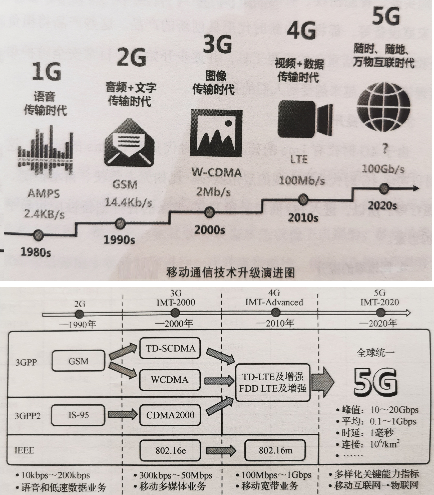
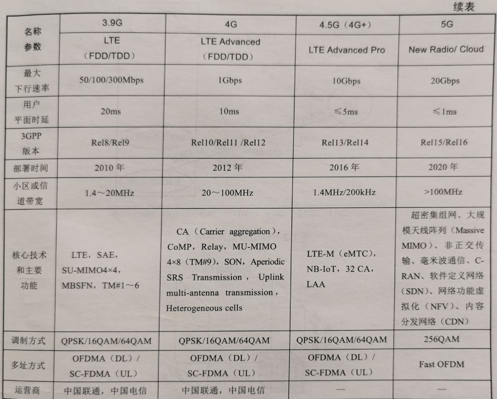
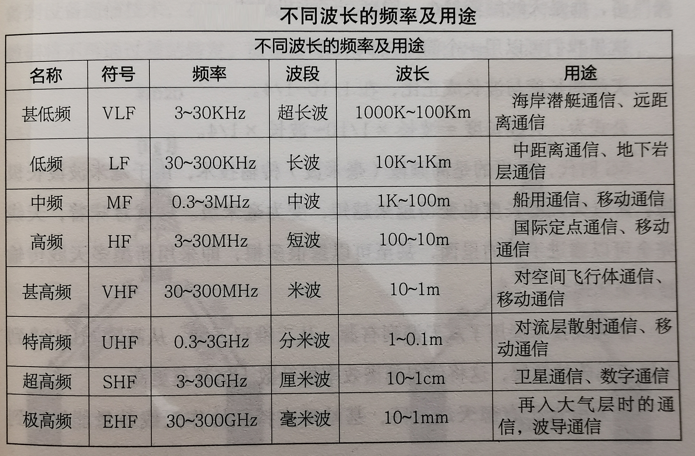
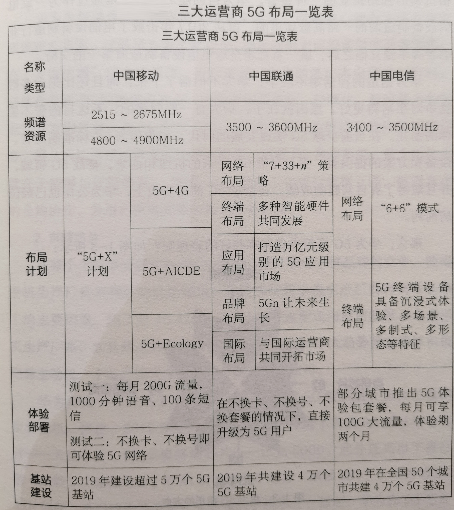

# 5G 第五代移动通信技术

5G 时代，不仅是通信技术的变革，更是一次产业跨界的大融合，将实现由人与人之间的通信，扩展到人与物、物与物的万物互联。

5G 应用将不再仅仅是手机，而是向着各领域不断进行渗透，为各领域带来巨大的市场空间。

2019 年，可以说是 5G 商用元年，越来越多的 5G 终端不断涌现，更丰富的应用也随之而来。

# 5G 常识

## 移动通信频谱效率演进

由于高阶调制技术和多天线技术的普遍采用，移动通信的频谱利用效率也在不断演进和提高。频谱利用率越来越接近香农定律的极限值。

- 高阶调制技术：QPSK→16QAM→64QAM→256QAM。
- 多天线技术：MIMO2x2→MIMO4x4→MIMO8x8→MIMO64x64→Massive MIMO256(大规模智能天线阵列）。

- 另外，由于要支持超高数据传输速率，除了上面说的频谱效率提升之外，蜂窝小区的工作带宽也自然变得越来越大，或者引入多载波聚合（CA)技术提升小区带宽：30kHz→200kHz→1.25MHz→5MHz→10MHz→20MHz→100MHz→200MHz
- 无线频段也随之越来越往高频段扩展，直至毫米波段（＞20GHz):700MHz→900MHz→1800MHz→2100MHz→2600MHz→3GMHz→6GMHz→10GHz→30GHz

而频率越高的无线电波传播的损耗也越大，穿透力也越差，导致小区覆盖范围也越来越小。

频段越高，小区越小，自然蜂窝网络密度也就越来越大，也就意味着运营商要部署更多的基站，5G基站将遍地皆是，沿街每一个路灯柱子上面都有可能安装有一个基站，每个家庭也将安装一个私有基站，面对这么庞大的网络基站规模，移动通信网络建设和维护成本也会越来越大。

因此，要求 5G 移动通信网络必须足够灵活，也就是说，网络应该具有强大的自治力、自适应力和创造力，并能从无线环境中学习，各网元、各基站之间能相互协同工作、自适应优化、自适应配置，从而实现任何时间、任何地点的高可靠高速率通信。只有这样才能实现网络功能的虚拟化（Network Function Virtual,NFV)、协作化、云化（Cloud)和软件化（Soft Defined Network,SDN)，网络维护成本才能足够低。

## 5G 相比前几代移动通信技术

移动通信每 10 年一次跨越。

5G 作为第五代移动通信技术，与之前几代移动通信技术相比，具有覆盖广、传输速度快、超低功耗、超低时延、超大容量等特点，而且还具有更强通话能力，还能融合多个业务、多项技术，随时随地实现万物互联。

## 5G 主要性能指标（与 4G 相比）

### 高速度

5G 的网速是 4G 的 100 倍，5G 的峰值理论传输速度可达 100 Gb/s，对于 5G 的基站峰值要求不低于 20 Gb/s。即，一部超高清电影，用 5G 的话，1 秒就可以完成下载。

移动情况下更稳定，即使在高速行驶的高铁上也能做到。

### 泛在网

在当前的 4G 时代，我们经常会发现在电梯、地下车库、高山、峡谷等地方会没有手机信号，也影响智能无人驾驶汽车在地下库正常泊车和充电。

而 5G 时代，这种现象将不存在。无论你处于哪个角落都会有网络覆盖，随时随地上网，这就是 5G 的泛在网特性。

### 低功耗

由于 4G 网络不够稳定，所以手机等终端设备会不断地搜索网络，这样就会使手机耗电量较大，功耗较高。

5G 时代，网络下分稳定和流畅，所以手机等终端无须不断搜索网络，能够有效节省能耗。

### 低时延

5G 的时延是 1 ms，甚至更低，快到我们无法感知。

相比于 3G 网络的时延大约为 100 ms，4G 网络的时时延大约为 20 ~ 80 ms。这样的时延对于无人驾驶汽车是绝对不允许的。

## 5G 的三个标准

- LTE（Long Term Evolution，长期演进技术）（授权频道）
- LTE-U（LTE-Unliceded）（非授权频道）
- NB-IoT（授权频道）

## 5G 频谱资源

不同的波长，其通信方面的用途也不尽相同。

### 5G 的主流频谱：3.5 GHz

- 中国移动：2515 ~ 2675 MHz（共 160 MHz 宽带的 5G 试验频率资源） 和 4800 ~ 4900 MHz 组合频段（共 100 MHz 宽带）。其中，2535 ~ 2675 MHz 频段为中国移动现有的 TDD-LTE（4G）频段。
- 中国电信：3400 ~ 3500 MHz，共 100 MHz 宽带。
- 中国联通：3500 ~ 3600 MHz，共 100 MHz 宽带。

### 毫米波高频段传输（30 GHz ~ 300 GHz）

针对 5G 技术，美国联邦通信委员会（Federal Communications Commission）首次允许手机信号进入更高（对人类仍然安全）的毫米波频段。

5G 与 4G 相比，采用新的频谱，即毫米波频段。毫米波作为极高频，其波长为 1~ 10 mm，其频率在 30 ~ 300 GHz。频率越高，其带宽就越大，速度就越快。但电波的频率和波长成反比，波长越短，其覆盖范围越小。故，5G 想使用超高频、极高频电波，就需要建立比 4G 时代数量更多的基站，形成超密集网络，大幅度提升系统容量，对数据业务进行有效分流，使得网络部署更加灵活，频率复用更加高效。但同时，功耗方面也会大很多。

由于毫米波波长极短，故天线的长度也变得越来越短，变为毫米级。这意味着，天线完全可以塞进手机里面，甚至可以塞很多根，即采用新型多天线传输技术。

多天线技术经历了无源到有源，从二维到三维，从高阶 MIMO（多个发射天线、多个接收天线）到大规模列阵的发展，使频谱效率提升数十倍甚至更高。

因为引入了有源天线列阵，基站可支持的协作天线数量，可以达到 128 根。另外，原来的二维天线列阵，拓展到三维天线列阵之后，形成新的三维 MIMO 技术，可以支持多用户同时使用 5G 通信网络，减少用户之间的干扰。

在毫米波频段中，28 GHz 频段和 60 GHz 频段是最有希望使用在 5G 的两个频段。

## D2D 设备到设备通信

D2D，即以设备为中心的全新通信方式，通常不需要与网络基础设施相连接，而是直接进行通信。即在同一基站下的两个用户，如果相互进行通信，他们的数据将不再通过基站转发，而是直接从手机到手机传输。

同时，也减轻了 5G 基站的压力。

## 5Ｇ 无线信号供能

5G 不仅提高了信息传输速度，5G 无线信号也能提供大量的能量。因此，未来许多低功耗无线设备，将无需接上电源就能获取电力。

### 设备是如何从无线信号中获取能量的？

- Wi-Fi 和5 G 使用的是电磁波，电磁波的频率有一个很宽的范围，包括调频广播（短波）、微波和毫米波。
- 天线是一种能接收电磁波的部件，因此能接收无线信号的能量（无线电波转化而来的电流）。
- 这些能量是交流电，因此天线需要将能量传输到整流电路（rectifier circuit)，整流电路能利用其半导体，
  将交流电转换为直流电，从而用于设备的充电或放电。
- 这种天线和整流器（或转换器）的组合被称为整流天线（rectenna)。
- 在整流天线后还配有电源管理电路（PMC)，PMC 不仅能起到放大电压的作用，还几乎没有功率损耗。
- 现在，许多初创公司都推出了无线充电器，但它们依赖的是专用的无线电发送器。不过，有研究表明很有可能在不远的未来，无线充电器将能够直接获取 Wi-Fi 和 5G 信号。

# 5G 商用、落地

5G 赋能游戏、直播、短视频领域，还来产业的升级，只是 5G 商用的冰山一角。

5G 商用，还将更多面向未来 VR/AR、车联网、无人驾驶、工业互联网、智能家居、云办公、游戏、超高清视频、智慧城市等应用场景，实现由个人应用向行业应用的转变。

4G 主要服务于个人消费者，即为个人消费者提供移动宽带体验；5G 除了服务个人消费者之外，还通过移动通信与各行各业相结合，为各个传统行业带来数字化转型。

5G 有三大应用场景：

- 强移动宽带场景（eMBB）
  - 宽带要求最高的 8K 视频，需要 135 Mbps 的宽带。宽带要求最低的入门级 4K 需要 18 ~ 24 Mbps 的宽带。 故 4G 网络无法完全满足网络流量、存储空间、回传时延等技术指标要求。
  - 而 5G 则可以应用于 4K、8K 超高清视频领域。如，大型赛事实时直播等。
- 大规模物联网场景（mMTC）
  - 5G 具有低功耗、低成本特点，可以用于智慧城市、环境监测、智能农业等以传感和数据采集为目标的应用场景。
- 低延时高可靠场景（uRLLC）
  - 支持高速移动（500Km/h）情况下的高可靠性（99.999%）
  - 自动驾驶、安全驾驶
  - 远程手术

## 5G 技术在垂直行业应用 

## 三大运营商 5G 布局

## 产业互联网，5G 商用的主战场

每一次技术变革，必将给工业带来巨大的颠覆。

### 工业 4.0

工业 4.0 是智能时代，被认为是人类步入智能制造为主导的第四次工业革命。建立一个高度灵活、个性化、数字化、智能化、网络化、集成化的生产车间，使生产全过程实现 “制造” 向 “智造” 的转变。

### 车联网

车联网，不是简单地将车联系在一起，还需要将车与行人、车与路、车与基础设施（如信号灯）、车与网络、车与云等连接在一起。在这么多连接下，车辆（Vehicle）是整个网络中的主体，即 V2X （X 代表 everything）。

5G 应用于车联网，相当于为车联网的发展按下了 “加速键”。

环境的数字化，人、车、路、网、图协同，助力智慧出行。

加强自动驾驶的感知、决策和执行。与 4G 时代相比，5G 网络则更为安全。除了低时延，自动驾驶可以通过 5G 网络的传输，从高精度地图获取必要的环境信息，形成高精度地图、精准定位。

基于 5G 网络技术的互联互通特点，交通信号灯可以把信号以无线信号的方式发给周边的车辆，有效避免交通事故。

### 农业互联网：智能农业

农业种植智能化。通过各种摄像头、人工智能识别、智能机器人、传感器、终端设备等通过 5G 网络互连起来，可以远程在线采集土壤盐碱度、酸碱度、养分等土壤探测。

在选种的过程，人工智能识别技术和智能机器人相结合，挑选更加优质、出芽率更高的种子。根据农作物生长周期，选择最优的肥料、施肥频次等。

在采摘过程中，实现机器人自动化识别和快速采摘。

另外，在食品安全问题，通过万物互联，组成的宠大的农业互联网，农业产品可追溯。

劳动力管理智能化。越来越多的劳动力将被取代。

### 智慧家居

强调的是 “主动智能”，所有的家用电器都可以通过物联网实现互联互动、主动服务、语音交互，为用户生活提供一站式服务。用户则可以节省出更多的时间和精力来陪伴家人或从事艺术创作等。

以燃气灶为例，燃气的火力会自动调节，比如在煮沸之前，开启大火档；快要溢出时，改为小火档。另外，油烟机也会自动开启，并根据油烟浓度来自动调节风量，燃气灶工作结束后，油烟机也会自动关闭。

速度提升多媒体内容流畅性。

时延减小，隐私性提高。智能家居之前采用的是终端采集数据，并传输到智能云端进行处理和管理的方式。5G 技术对现有模式进行改变，转化为一种全新的去中心化模式。即海量的终端同样具有智能属性（边缘计算），将采集来的数据进行理解，由终端来完成，自己仅在必要时，才与云端通信。

电池寿命得到有效提升。5G 技术，能够很好地解决智能家居设备的耗电问题。智能终端发送的信息能够被实时处理，并快速反馈到终端，极大地缩减了时间和能耗。同时，部分功耗也从设备终端转移到主机或云上。

### 智慧医疗

# 5G 与 万物互联

5G 与人工智能（AI）、物联网（IoT）、云计算（Cloud Computing）、大数据（Big Data）、边缘计算（Edge Computing）等新信息技术紧密融合，打造以 5G 为中心的泛智能基础设施。

## 5G + 物联网

5G + 物联网，将持续增强产业物联网专网 “云、网、边、端” 全链条的能力，构建产业物联网专网切片服务，以满足行业消费者对定制化、个性化的需求。

5G 本身主是为万物互联而生的，5G 网络实现每平方公里，至少承载 100 万台终端设备。实现真正的 ”万物联结“。

## 5G + 云计算

5G + 云计算，通过加快网络云化改造，构建以云为核心的新型网络架构。

5G 时代，所有的数据都集中在云端时，你不再需要超大内存的手机，只要有一个普通的芯片和一块不错的屏幕即可，而你所有照片、聊天记录等的备份，一切都在云端完成。游戏也不需要下载，只要在线登陆就能随时随地畅玩。

## 5G + 大数据

5G + 大数据，打造基于 5G 的行业领先的大数据能力平台，实现对数据采集、传输、存储、使用、分析的安全管控，构建大数据服务体系。

## 5G + 边缘计算

## 5G + 人工智能

5G + 人工智能，将充分发挥数据、算法、算力、应用场景等方面的优势，将 5G 在人工领域的布局，聚焦于网络、服务、管理、安全、应用五个方面。

5G 的低时延，满足虚拟现实技术中，语音识别、视线跟踪、手势感应等低时延的需求。

5G 与 AI、VR 的融合，将使人与人之间的沟通变得更加便捷，全息通话、实时视频高清通话，全新的社交方式将取代传统社交模式。

## 5G + 元宇宙

5G　将成为数字化转型的关键。从人人互联到万物互联，从生活到生产，从物理世界再到数字世界。

# 5G 与 网络安全、信息安全

# 5G 与 华为

## 鸿蒙 OS

2019 年 8 月，华为鸿蒙 OS 系统，成为华为 5G 时代，向全场景体验迈出的第一步。

鸿蒙 OS 所具有的四大特征：

- 终端无缝协同
- 低时延
- 安全可信
- 跨终端生态共享，能够与任何部署

## 自研芯片

2019 年，首款 5G 基站核心芯片——天罡芯片。

5G 多模终端芯片——巴龙 5000。

麒麟 990——融合 5G 和 AI 的 SoC 芯片。

2019年 8 月，华为首款 5G 商用手机——Mate 20X 5G版。

## 基站布局

5G 时代，移动通信将不再依赖于大型基站，而是由大量的小型基站，以覆盖那些大基站所无法触及的末梢通信。

华为在 5G 领域的技术优势，也体现在 5G 基站建设方面。

# 5G 动态信息

截止到 2021 年 11 月，我国已累计建成开通 5G 基站超过 139 万个，已建成全球规模最大 5G 独立组网网络。

