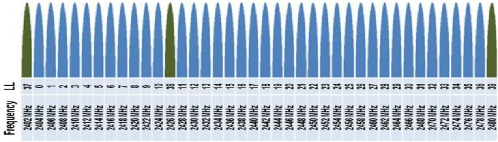
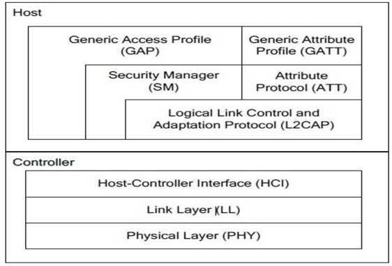

# BLE 低功耗蓝牙 Bluetooth Low Energy

BLE 的全称叫做 Bluetooth Low Energy，也称之为低功耗蓝牙，属于蓝牙技术中的一种。与之对应的是 Classic Bluetooth，经典蓝牙。当然，经典蓝牙是最先推出来的，后面才有了 LE 的版本。在兼容性上，LE 的蓝牙不兼容 Classic 的版本，可以理解成为独立的一种蓝牙形态。旨在针对低功耗的领域进行的一种无线数据传送的解决方案。

# 蓝牙的发展

蓝牙技术是一项短距离无线通信的技术，其核心是基于跳频扩频（FHSS，Frequency Hopping Spread Spectrum）技术发展而来的。跳频扩频技术也是后面 CDMA、Wi-Fi、蓝牙的基础无线技术。

| 时间         | 版本     | 描述                                                         | 应用场景                                                     |
| ------------ | -------- | ------------------------------------------------------------ | ------------------------------------------------------------ |
| 1999 年      | 蓝牙 1.0 | 蓝牙技术联盟 SIG（Special Interest Group）组织发布了蓝牙 1.0 技术，确定使用公共的 2.4G 频段。 |                                                              |
| 2003 年      | 蓝牙 1.2 | 加入适应性跳频、eSCO 等技术后，才满足了无线语音和音频传输等功能的基本要求。 | 蓝牙耳机、蓝牙音箱，搭配手机来使用。                         |
| 2004、2007年 | 蓝牙 2.x | 2004年推出的蓝牙2.0版本和2007年推出的蓝牙 2.1版本新加了扩展数据率 (Enhanced Data Rate,EDR) 和安全简单配对 ( Secure Simple Pairing, SSP) 技术。 EDR 通过改变蓝牙空中传输的编码方式,将蓝牙的传输速率提高到了3Mbit/s（提升了3倍的传输速率）。 SP则改善了蓝牙设备的配对体验,让用户不需要输入 pin 码。 |                                                              |
| 2009 年      | 蓝牙 3.0 | 新增了 High Speed 功能,可以使蓝牙基于 Wi-Fi技术，实现高速数据传输,传输速率高达 24Mbits。 | 应用范围比较窄,基本上只有在电脑上出现过,手机和其他设备很少有支持High Speed 功能的。 |
|              |          |                                                              |                                                              |
| 2010 年      | 蓝牙 4.0 | 最重要增加了蓝牙低功耗((Bluetooth Low Energy)技术，提出了低功耗蓝牙 BLE 和经典蓝牙（耳机、音箱等）两种模式。 相比经典蓝牙,低功耗蓝牙拥有更快的响应速度,最短可在3ms 内完成连接设置并开始传输数据。 根据支持蓝牙模式的不同,蓝牙芯片又可以分为单模芯片( Single Mode)和双模芯片(Dual Mode)。 单模芯片只能支持低功耗蓝牙。 双模芯片除支持低功耗蓝牙外,还能兼容之前版本的经典蓝牙。 | 搭配手机一起使用的智能硬件。例如，蓝牙手环、温湿度传感、蓝牙体重秤等。但是这些设备无法自组网。 |
| 2016 年      | 蓝牙 5.0 | 在低功耗模式下具备更快更远的传输能力，其传输速率是蓝牙4.2版本的 2 倍 (速度上限为 2Mbit/s)，有效输离是蓝牙 4.2 的 4倍(理论上可达300m)，广播包容量是蓝牙 4.2 的 8 倍。 |                                                              |
| 2017 年      | mesh 1.0 | 发布了蓝牙 mesh 1.0 版本的协议议规格，一种基于低功耗蓝牙广播包来实现的 mesh 网络技术。 | 通过蓝牙 mesh 这项新的协议规格，正式进入物联网的领域。 解决智能硬件孤岛问题。比如，灯泡、插座、风扇可以通过蓝牙 mesh 技术自组织为一个网。 |
| 2019 年      | 蓝牙 5.1 | 引入了基于 AoA (到达角)和AoD(发射角)的定位技术。 测向功能和厘米级的定位服务，这项功能的加入使得室内的定位会变得更加精准，并且在小物体的位置上也能准确定位避免物品遗失。 |                                                              |
| 2020 年      | 蓝牙 5.2 | 主要的特性是增强版ATT协议、 LE功耗控制和信号同步，连接更快，更稳定，抗干扰性更好。 对ATT协议层进行了更新(Enhanced Attribute Protocol)，以能够快速读取属性值，此功能将提高ATT协议的信息沟通效率和快速服务发现(Fast Service Discovery)等功能，快速服务发现功能将在以低功耗为准的蓝牙音频技术中实现音频设备间快速交换服务信息。 |                                                              |

# BLE 基础概念

## BLE 频段

低功耗蓝牙工作在 2.4GHz 的 ISM 频段，具有 40 个频道，每个频道为 2MHz。 如图所示。利用 GFSK 调制，它能够以 1Mbit/s 的速率发射数据。 与经典蓝牙一样，低功耗蓝牙使用跳频技术，但是它采用了自适应跳频技术并且跳频的频率很低。 40 个频道中，低功耗蓝牙利用 3 个频道用于广播，剩下的 37 个通道用于设备间传播数据。

在大多数情况下， BLE 设备可运行在 4 个基本的模式：主模式、从模式、广播模式以及扫描模式。 

- 广播模式下设备可以周期性地广播数据，也可以响应来自其它设备的扫描请求、连接请求。

- 扫描模式下设备主要功能是扫描广播包。

- 一旦处于广播模式下的设备接受了来自扫描模式下设备的连接请求，则两个设备就进入了连接状态。

- 只有在连接状态下，两个设备才能进行读写等操作。

- 与此同时，广播模式下的设备转变为从模式，扫描模式下的设备转变为主模式。

## BLE 数据包：广播包、数据包

低功耗蓝牙有两种类型的数据包：广播包、数据包。 两种类型拥有可变的数据长度。

BLE 数据包包含了： 8bit 的前导码、由 RF 通道所决定的 32bit 连接地址、可变长度的PDU（ 2 至 39 个字节）和 24bit 的 CRC 校验码。由此得知 BLE 数据包最短有 80Bits，最长有 376Bits，因此数据包的发射时间在 80 微秒至 300 微秒之间。

广播包数据中 PDU 包含一个 16bit 的包头和最多 31 字节的数据。

BLE 协议栈的广播数据包有一定的格式：长度（ 1 个字节） +类型（ 1 个字节） +数据（ N 个字节）。 并且最大长度为 31 个字节。

## BLE 建立连接

两个设备有三种关联方法：正常模式、带外工作和口令连接。

一个广播设备在广播通道上发送广播数据，其中的 PDU 带有设备地址和 31Bytes 的附加信息。

一个扫描设备是可以获取到广播者的地址的，并且根据广播者设置，更多的附加信息可以通过扫描者发送扫描请求获取。

这就意味着甚至在没有建立连接的情况下，扫描者就可以获得一定量的数据了。

广播者依次在三个广播通道发送广播数据，广播的时间间隔可以配置为20ms 到 10s 之间。

另一方面，扫描者也可以配置自己的扫描窗口（扫描多长时间）和扫描间隔（间隔多久扫描一次）。

一旦连接建立，

- 扫描者将提供给广播者 2 个重要的信息---连接间隔、从机延迟时间。
  - 连接间隔被用来确定连接事件的开始时间。因此，较长的连接间隔意味着较小的数据交换率，较小的功耗；相反，较短的连接时间间隔意味着较大的数据交换率，较大的功耗。
  - 从机延迟时间指在不丢失连接的情况下，从机可以忽略的最大连接事件个数。这么做是为了优化功耗。
- 一旦连接建立完成，数据的通信将在 37 个数据通道上进行。伴随着数据包头和 4 个字节的消息完整性检查字段。主从之间的信息交互由主设备发起的，直到任意一方中断连接。

## BLE 协议栈

蓝牙低功耗协议栈包含 2 个部分：控制器（Controller）和主机（Host）。

- 主机（Host）位于协议栈上层，包含应用、属性协议和 L2CAP。
- 控制器（Controller）位于协议栈的底层， 负责处理物理信道数据的接收与发射。

主机和控制器既可以在一块处理器上同时实现，也可以主机运行在应用处理器上，控制器运行 RF 控制处理器上，即主机和控制器之间的交互需要通过硬件控制接口（ HCI）来进行。

中央设备可以向外部设备发起建立连接的请求。连接请求包括如下的参数：

- 连接间隔---在两个 BLE 设备的连接中使用跳频机制，两个设备使用特定的信道收发数据，然后过了一段时间后再使用新的信道（链路层处理信道切换），两设备在信道切换后收发数据称之为连接事情。即使没用应用层数据的收发，两设备仍然会通过交换链路层数据来维持连接。连接间隔就是两个连接事件之间的时间间隔，连接间隔以 1.25 毫秒为单位，若连接间隔为 3200，则为 4 秒。不同的应用可能要求不同的时间间隔。长时间间隔的优势是显著地节省功耗，因为设备可以在连接事件之间有较长时间的休眠，坏处是当设备有应用数据需要发送时，必须要等到下一个连接事件；短的时间间隔优势是两个设备可以更快的交换数据，坏处则为功耗较大。

-  从机延时---这个参数的设备可以使从机（外部设备）跳过若干连接事件，这给了从机更多的灵活性，如果它没有数据发送时，可以选择跳过连接事件继续休眠，以节省功耗。

- 超时---这是两个成功连接事件之间的最大允许时间间隔。如果超过了这个时间而没有成功的发送连接事件，设备被认为是丢失连接，返回到未连接的状态。这个值的单位为 10ms，值范围是 10（ 100ms） ---3200（ 32s）。

 外部设备也可以通过向中央设备发送“连接参数更新请求”来改变连接设置。当中央设备收到请求后，可以选择或拒绝这些新的参数。

连接可以被主机或从机以任何原因自动终止。当一方发起终止连接时， 另一个方必须做出响应。然后两个设备才能退出连接状态。

### PHY 层（Physical Layer）

PHY 层（Physical Layer）是 1Mbps 自适应跳频 GSFK 调制的无线电，工作在 2.4GHz 的 ISM 频段。

### LL 层（Link Layer）

- LL 层（Link Layer）负责设备的 RF 状态。一般设备 RF 状态有五种可能的情况：待机（ Standby）、广播（ Advertising）、扫描（ Scanner）、初始（ Initiating）和连接（ Connected）。
- 当设备处于待机状态时，不进行数据的收发也不进行广播。
- 当设备处于广播状态时，它将在广播通道上广播数据包。
- 当设备处于扫描状态时，它将扫描广播通道上的广播数据包。
- 当设备处于初始态时，它将对特定的广播设备发起连接请求。
- 当广播设备接收了该请求， 双方进入连接状态。
- 如果设备由初始态进入连接状态，则该设备充当主设备，而由广播态进入连接态的设备充当从设备。

### HCI 层（Host-Controller Interface）

HCI 层（Host-Controller Interface）提供了控制器（Controller）和主机（Host）之间的标准接口。

这些接口既可以通过软件 API 实现，对应主机和控制器在一块处理器上实现。

也可以通过硬件接口来实现，如 UART、 SPI 或者 USB，对应主机和控制器在两块处理器上实现。

### L2CAP 层（Logical Link Control and Adaptation Protocol）

L2CAP 层（Logical Link Control and Adaptation Protocol）主要功能为上层协议提供数据封装，为下层控制器（ Controller） 提供多路复用和数据包分包功能。总体来讲，实现逻辑上的端对端通信。

### SM 层（Security Manager）

SM 层（Security Manager）用于身份验证与加密。它采用 AES-128 位加密算法并且还负责配对和密钥分配。它保障了连接和数据交换的安全性。

### ATT 层（Attribute Protocol）

ATT 层（Attribute Protocol）是专为优化小数据包传输所定义的通信方法。    ATT 是由许多成对的属性和值构成。这些属性和值可由其它设备读、写或者发现。  

### GAP 层（Generic Access Profile）

GAP 层（Generic Access Profile）定义了设备之间的匹配与连接的一般方法。它是应用程序实现具体设备模式（广播者、扫描着等）的接口。

GAP 层负责处理设备访问模式和程序，包括设备发现、建立连接、结束连接、初始

化安全特性和设备配置。 GAP 层总是作为下面四种角色之一：

- 广播者---不可连接的广播设备。

- 观察者---扫描广播，但不发起建立连接的请求。

- 外部设备---可连接的广播设备，在单个链路层连接中作为从机。
- 中央设备---扫描广播设备并发起连接请求，在单个链路层连接中作为主机。

### GATT 层（Generic Attribute Profile）

GATT 层（Generic Attribute Profile）负责描述不同的服务框架，它是 ATT 特定于蓝牙低功耗的一个扩展。它通过应用程序配置文件与应用层打交道。每一个应用程序配置文件定义了数据格式，以及它如何被应用程序所解释。

配置文件通过减少交换的数据量来减低功耗。

目前，蓝牙低功耗已经有许多特定的配置文件，比如：心率曲线，血糖，警报通知等等。

这使开发人员利用特定的配置文件可以很方便地开发对应特定的应用。

GATT 层实现两个设备应用数据的通信。从 GATT 角度来看，当两个设备建立连接后，他们处于下面两种角色之一：

- GATT 服务器---它是为 GATT 客户端提供数据服务的设备；

- GATT 客户端---它是从 GATT 服务器读写应用数据的设备。

- 主机从机既可以似乎 GATT 客户端也可以是 GATT 服务器。

一个 GATT 服务器可包含一个或多个 GATT 服务， GATT 服务是完成特定功能的一系列数据的集合。在 SimpleBLEPeripheral 工程中，有三个 GATT 服务：

- 强制的 GAP 服务---这一个服务包含了设备和访问信息。例如：设备名、设备供应商和产品标识。
- l 强制的 GATT 服务---这一服务包含了 GATT 服务器的信息，是协议栈一部分，是BLE 协议规范对每一个 BLE 设备的要求。
- SimpleGATTProfile 服务---这个服务包含了应用数据的信息，与应用程序数据的传递密切相关，学生也可以按照特定的格式编写自己的 GATT 服务。

# BLE 降低功耗

蓝牙低功耗降低功耗的方法有以下几种。 

- 首先，它使用一个较低的占空比，这味着它进入睡眠的时间较长，而唤醒来发送和接收数据包的频率较低。

- 其次，使用 GATT配置文件，它能够在短时间内发送较小的数据包来节省功耗。数据传输事件可以通过本

地事件触发，并且对于连接着的客户端在任何时间都是可访问的。 

- 最后，每当两个设备不通信时，连接的链路是不会被保持的；一旦数据通信完成，设备就进入睡眠模式且结束连接链路。 链路会在接下来的通信中快速重新建立。

