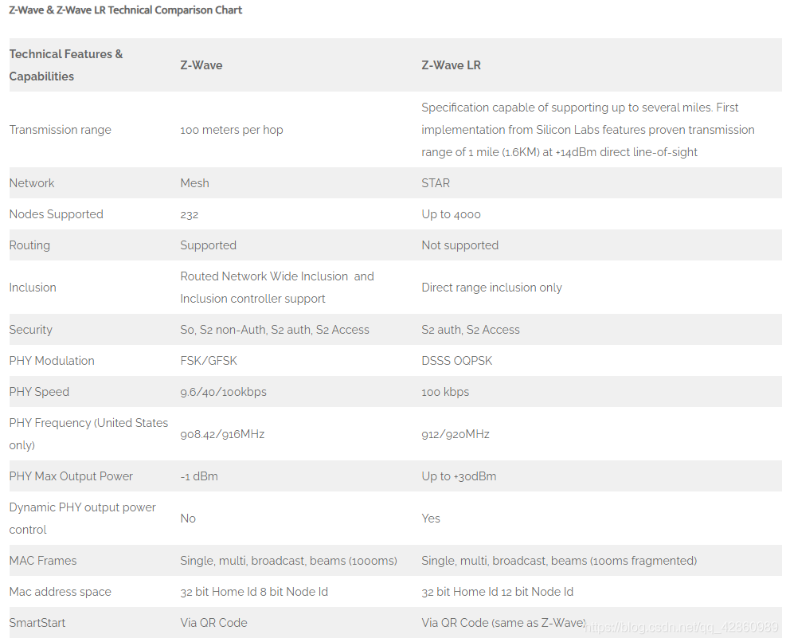
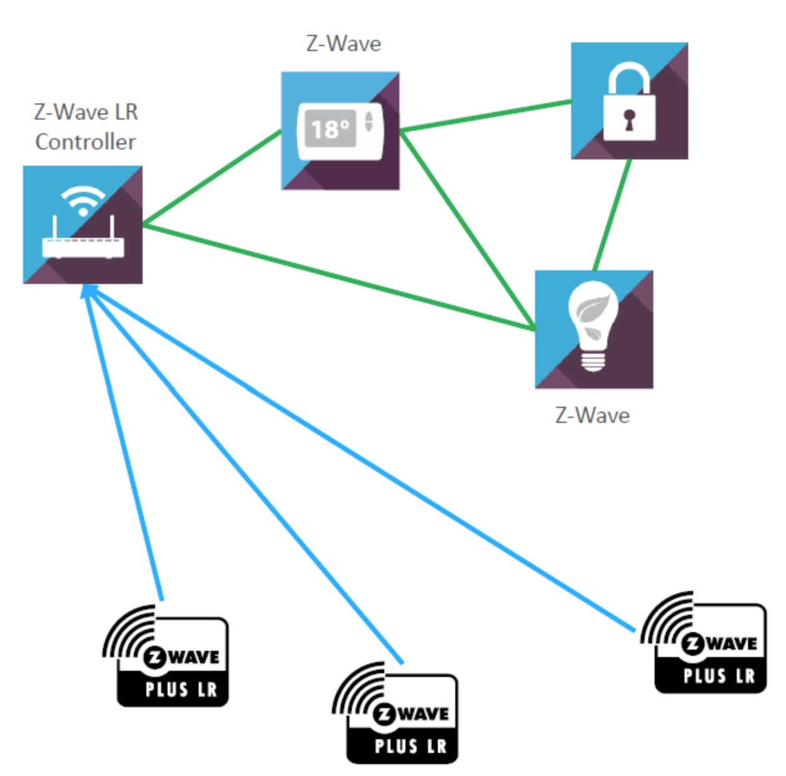

# Z-Wave 无线通信

Z-Wave 是由丹麦公司 Zensys 所一手主导的无线组网规格，Z-Wave 联盟 (Z-Wave Alliance) 虽然没有 ZigBee 联盟强大，但是 Z-wave 联 盟的成员均是已经在智能家居领域有现行产品的厂商，该联盟已经具有 160 多家国际知名公司，范围基本覆盖全球各个国家和地区。

Z-Wave 是一种新兴的基于射频的、低成本、低功耗、高可靠、适于网络的短距离无线通信技术。

2019年Silicon labs宣布开放Z-Wave协议，目前仅有芯科科技一家芯片公司提供Z-Wave芯片和协议栈。

## Z-Wave 的应用

随着通信距离的增大，设备的复杂度、功耗以及系统成本都在增加，相对于现有的各种无线通信技术，Z-Wave 技术将是最低功耗和最低成本的技术，有力地推动着低速率无线个人区域网。

Z-Wave 技术设计用于住宅、照明商业控制以及状态读取应用，例如抄表、照明及家电控制、HVAC、接入控制、防盗及火灾检测等。

## 为何 Z-wave 在智能家居方面占据了强势地位

- 这主要基于Z-Wave的属性。
- Z-Wave是一种新兴的基于射频的、低成本、低功耗、高可靠、适于网络的短距离无线通信技术。
- 工作频带为908.42MHz(美国)~868.42MHz(欧洲)，采用FSK(BFSK/GFSK)调制方式，数据传输速率为9.6kbps，信号的有效覆盖范围在室内是30m，室外可超过100m，适合于窄宽带应用场合。
- 随着通信距离的增大，设备的复杂度、功耗以及系统成本都在增加，相对于现有的各种无线通信技术，Z-Wave技术将是最低功耗和最低成本的技术，有力地推动着低速率无线个人区域网。

## 中国 Z-Wave 的厂家

山东智慧生活数据系统有限公司、上海多灵科技有限公司、fantem、丰唐物联 等。

WinTop（Z-Wave联盟成员）
WinTop是一家生产基地位于上海的港资公司，该公司生产基于Z-Wave的低端智能网关设备，在欧洲市场有产
品销售。WinTop现有的Z-Wave产品功能较薄弱，在处理器性能、蓝牙、OSGI方面难以满足需求。

丰唐物联（Z-Wave联盟成员）
目前丰唐物联的前身是位于硅谷的AeonLab公司，后来被深圳创业版上市企业英唐公司收购。主要从事Z-Wave
智能家居设备的设计和制造。丰唐的生产目前由母公司英唐来代工，它的智能家居设备处理器较弱，ROM、RAM的
容量较小，无2G/3G模块，支持WiFi。

欧西迪（非Z-Wave联盟成员）
欧西迪是一家东莞智能家居企业，主要从事欧美Z-Wave设备的ODM、OEM，在东莞和浙江有生产设施。欧西
迪的智能家居网关运行裁剪版Linux,不支持WiFi和USB，无2G/3G模块，ROM、RAM容量较小，支持Java。

# Z-Wave 的基础概念

## 频段

工作频带为 908.42 MHz (美国) ~ 868.42 MHz (欧洲)，采用 FSK (BFSK / GFSK) 调制方式，数据传输速率为 9.6 kbps，信号的有效覆盖范围在室内是 30m，室外可超过 100m，适合于窄宽带应用场合。

Z-WAVE可以在中国使用的，在中国使用的频段是868.40 MHz。

### Z-Wave 在全球无线电频率的分配

截止2016.6月，Z-Wave 在全球无线电频率的分配如下：

| 国家或地区                               | 标准                                       | Z-wave 频率                         |
| ---------------------------------------- | ------------------------------------------ | ----------------------------------- |
| Algeria阿尔及利亚（北非国家）            | ETSI EN 300 220                            | 868.40 MHz, 869.85 MHz              |
| Argentina阿根廷                          | FCC CFR47 Part 15.249                      | 908.40 MHz, 916.00 MHz              |
| Armenia亚美尼亚                          | ETSI EN 300 220                            | 868.40 MHz, 869.85 MHz              |
| Australia澳大利亚                        | AS/NZS 4268                                | 919.80 MHz, 921.40 MHz              |
| Bahamas巴哈马                            | FCC CFR47 Part 15.249                      | 908.40 MHz, 916.00 MHz              |
| Bahrain巴林                              | ETSI EN 300 220                            | 868.40 MHz, 869.85 MHz              |
| Barbados巴巴多斯                         | FCC CFR47 Part 15.249                      | 908.40 MHz, 916.00 MHz              |
| Bermuda百慕大                            | FCC CFR47 Part 15.249                      | 908.40 MHz, 916.00 MHz              |
| Bolivia玻利维亚                          | FCC CFR47 Part 15.249                      | 908.40 MHz, 916.00 MHz              |
| Brazil巴西                               | ANATEL Resolution 506                      | 919.80 MHz, 921.40 MHz              |
| British Virgin Islands英属维尔京群岛     | FCC CFR47 Part 15.249                      | 908.40 MHz, 916.00 MHz              |
| Canada加拿大                             | FCC CFR47 Part 15.249                      | 908.40 MHz, 916.00 MHz              |
| Cayman Islands开曼群岛                   | FCC CFR47 Part 15.249                      | 908.40 MHz, 916.00 MHz              |
| CEPT*                                    | EN 300 220                                 | 868.40 MHz, 869.85 MHz              |
| Chile智利                                | FCC CFR47 Part 15.249                      | 919.80 MHz, 921.40 MHz,  921.42 MHz |
| China中国                                | CNAS/EN 300 220                            | 868.40 MHz                          |
| Colombia哥伦比亚                         | FCC CFR47 Part 15.249                      | 908.40 MHz, 916.00 MHz              |
| Costa Rica哥斯达黎加                     | ARIB T96, ARIB STD-T108                    | 922.50 MHz, 923.09 MHz,  926.30 MHz |
| Ecuador厄瓜多尔                          | FCC CFR47 Part 15.249                      | 908.40 MHz, 916.00 MHz              |
| Egypt埃及                                | ETSI EN 300 220                            | 868.40 MHz, 869.85 MHz              |
| El Salvador萨尔瓦多                      | AS/NZS 4268                                | 919.80 MHz, 921.40 MHz              |
| EU欧洲联盟                               | EN 300 220                                 | 868.40 MHz, 869.85 MHz              |
| French Dept. of Guiana法属圭亚那的法国部 | ETSI EN 300 220                            | 868.40 MHz, 869.85 MHz              |
| Guatemala危地马拉                        | FCC CFR47 Part 15.249                      | 908.40 MHz, 916.00 MHz              |
| Haiti海地                                | FCC CFR47 Part 15.249                      | 908.40 MHz, 916.00 MHz              |
| Honduras洪都拉斯                         | FCC CFR47 Part 15.249                      | 908.40 MHz, 916.00 MHz              |
| Hong Kong (China)香港（中国              | HKTA 1035                                  | 919.80 MHz                          |
| India印度                                | CSR 564 (E)                                | 865.20 MHz                          |
| Indonesia印度尼西亚                      | ETSI EN 300 200                            | 868.40 MHz, 869.85 MHz              |
| Israel以色列                             |                                            | 916.00 MHz                          |
| Jamaica牙买加                            | FCC CFR47 Part 15.249                      | 908.40 MHz, 916.00 MHz              |
| Japan  日本                              | ARIB STD-T108                              | 922.50 MHz, 923.90 MHz,  926.30 MHz |
| Jordan约旦                               | ETSI EN 300 220                            | 868.40 MHz, 869.85 MHz              |
| Kazakhstan哈萨克斯坦                     | ETSI EN 300 220                            | 868.40 MHz, 869.85 MHz              |
| Lebanon黎巴嫩                            | ETSI EN 300 220                            | 868.40 MHz, 869.85 MHz              |
| Libya利比亚                              | ETSI EN 300 220                            | 868.40 MHz, 869.85 MHz              |
| Malaysia马来西亚                         | MCMC MTSFB TC T007:2014                    | 919.80 MHz, 921.40 MHz,  921.42 MHz |
| Mauritius毛里求斯                        | ETSI EN 300 220                            | 868.40 MHz, 869.85 MHz              |
| Mexico墨西哥                             | FCC CFR47 Part 15.249                      | 908.40 MHz, 916.00 MHz              |
| New Zealand新西兰                        | AS/NZS 4268                                | 921.40 MHz, 919.80 MHz              |
| Nicaragua尼加拉瓜                        | FCC CFR47 Part 15.249                      | 908.40 MHz, 916.00 MHz              |
| Nigeria尼日利亚                          | ETSI EN 300 220                            | 868.40 MHz, 869.85 MHz              |
| Oman阿曼                                 | ETSI EN 300 220                            | 868.40 MHz, 869.85 MHz              |
| Panama巴拿马                             | FCC CFR47 Part 15.249                      | 908.40 MHz, 916.00 MHz              |
| Paraguay巴拉圭                           | AS/NZS 4268                                | 919.80 MHz, 921.04 MHz              |
| Peru秘鲁                                 | AS/NZS 4268                                | 919.80 MHz, 921.40 MHz              |
| Qatar卡塔尔                              | ETSI EN 300 220                            | 868.40 MHz, 869.85 MHz              |
| Russian Federation俄罗斯联邦             | GKRCh/ETSI 300 220                         | 869.00 MHz                          |
| Saudi Arabia沙特阿拉伯                   | ETSI EN 300 220                            | 868.40 MHz, 869.85 MHz              |
| Singapore新加坡                          | TS SRD/ETSI 300 220                        | 868.40 MHz, 869.85 MHz              |
| South Africa南非                         | ICASA/ETSI 300 220                         | 868.40 MHz, 869.00 MHz              |
| Republic of Korea大韩民国                | Clause 2, Article 58-2  of Radio Waves Act | 920.90 MHz, 921.70 MHz,  923.10 MHz |
| St Kitts & Nevis圣基茨和尼维斯           | FCC CFR47 Part 15.249                      | 908.40 MHz, 916.00 MHz              |
| Suriname苏里南                           | FCC CFR47 Part 15.249                      | 908.40 MHz, 916.00 MHz              |
| Taiwan (China)台湾（中国）               | NCC/LP0002                                 | 922.50 MHz, 923.90 MHz,  926.30 MHz |
| Trinidad & Tabago特立尼达和多巴哥        | FCC CFR47 Part 15.249                      | 908.40 MHz, 916.00 MHz              |
| Turks & Caicos Islands特克斯和凯科斯群岛 | FCC CFR47 Part 15.249                      | 908.40 MHz, 916.00 MHz              |
| UAE阿联酋                                | ETSI EN 300 220                            | 868.40 MHz, 869.85 MHz              |
| Uruguay乌拉圭                            | AS/NZS 4268                                | 919.80 MHz, 921.40 MHz              |
| USA美国                                  | FCC CFR47 Part 15.249                      | 908.40 MHz, 916.00 MHz              |
| Yemen也门                                | ETSI EN 300 220                            | 868.40 MHz, 869.85 MHz              |

## 网络结构

每一个 Z-Wave 网络都拥有自己独立的网络地址(HomeID)。

网络内每个节点的地址 (NodeID)，由控制节点 (Controller)分配。

每个网络最多容纳 232 个节点(Slave)，包括控制节点在内。

控制节点可以有多个，但只有一个主控制节点，即所有网络内节点的分配，都由主控制节点负责，其他控制节点只是转发主控制节点的命令。

已入网的普通节点，所有控制节点都可以控制。

超出通信距离的节点，可以通过控制器与受控节点之间的其他节点，以路由(Routing)的方式完成控制。

## 路由技术

Z-Wave 采用了动态路由技术，每个 Slave 内部都存有一个路由表，该路由表由 Controller 写入。动态路由是指路由器能够自动地建立自己的路由表，并且能够根据实际情况的变化适时地进行调整。

存储信息为该 Slave 入网时，周边存在的其他 Slave 的 NodeID。这样每个 Slave 都知道周围有哪些 Slaves，而 Controller 存储了所有Slaves 的路由信息。

当 Controller 与受控 Slave 的距离超出最大控制距离时，Controller 会调用最后一次正确控制该 Slave 的路径发送命令，如该路径失败，则从第一个 Slave 开始重新检索新的路径。

## 传输速率

在技术面上，Z-Wave 从原本的 9.6Kbit/s 提升到 40Kbit/s，并宣称提升后原本的 9.6Kbit/s 能与 40Kbit/s 共存。在节点数方面，一个 Z-Wave网路可支援两百三十二个点。

## Z-Wave 和 Z-Wave LR 

Z-Wave 协议支持Z-Wave和Z-Wave LR两种模式，Z-Wave是Mesh网络，Z-Wave LR是星形网络，这两种网络可以无缝兼容，100%共存。

Z-Wave 网络最多可包含 232 个节点。节点可以重传消息以保证传递。 两个节点之间的典型通信范围是 100 米。 

Z-Wave LR可以包含4000个节点。在14dbm(最大30dbm)的输出功率下可达1.6Km的直线距离。

# Z-Wave 无线协议栈

Z-Wave协议是一种低带宽半双工协议，旨在实现可靠的低成本无线网状网络通信协议。

Z-Wave 是一种面向住宅控制和自动化市场的无线网状网络协议，但也可用于商业环境。 

Z-Wave工作在Sub-1Ghz的ISM(industrial, scientific, and medical)频段，成功的避开了2.4GHz(Wi-Fi, Bluetooth, Zigbee)的干扰，同时拥有极远的传输距离。

Z-Wave 生态系统提供了一个路由协议栈和一个完整的 Z-Wave应用程序框架，通过设备类型和命令类型保障设备之间的互操作部署。通过Z-Wave 认证计划，确保了所有设备类型之间的100%互操作性。

