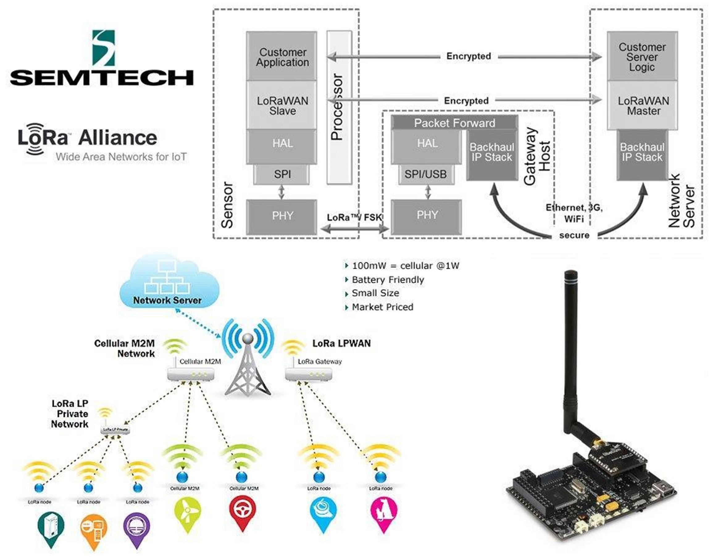
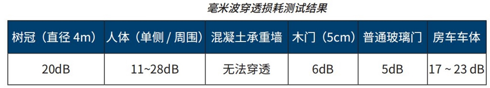
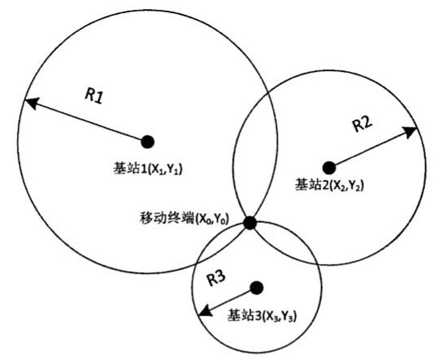
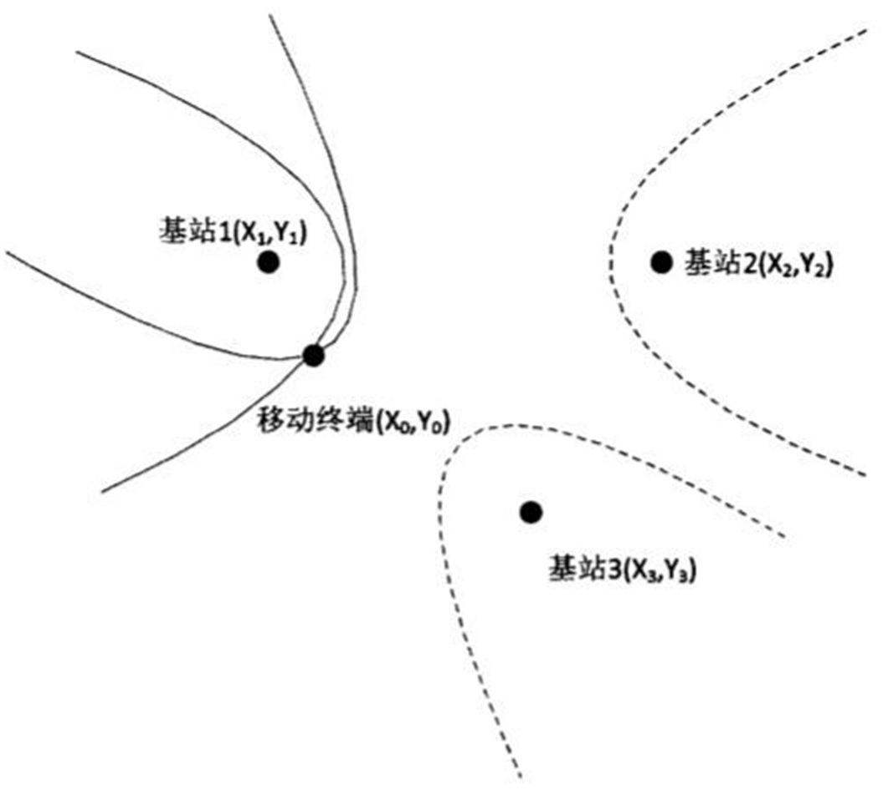
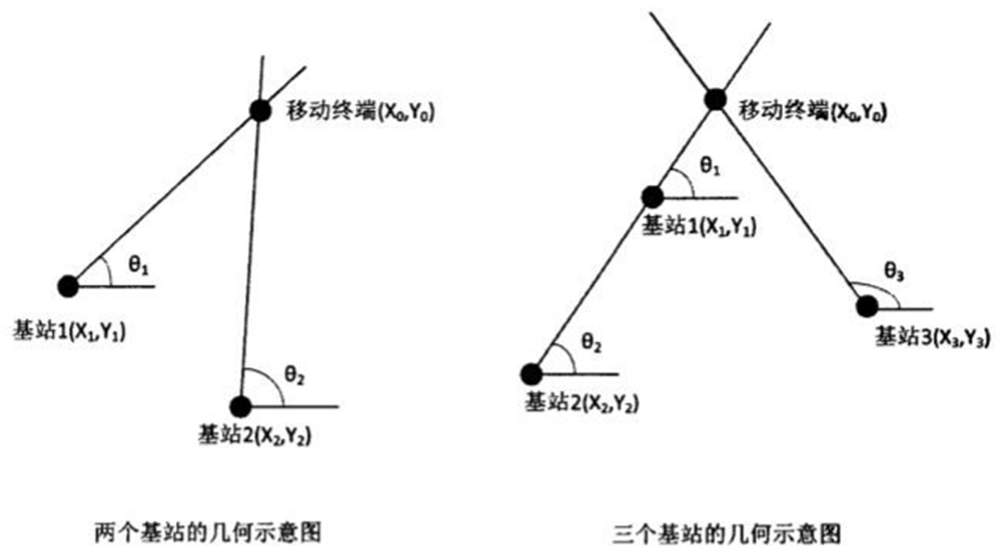
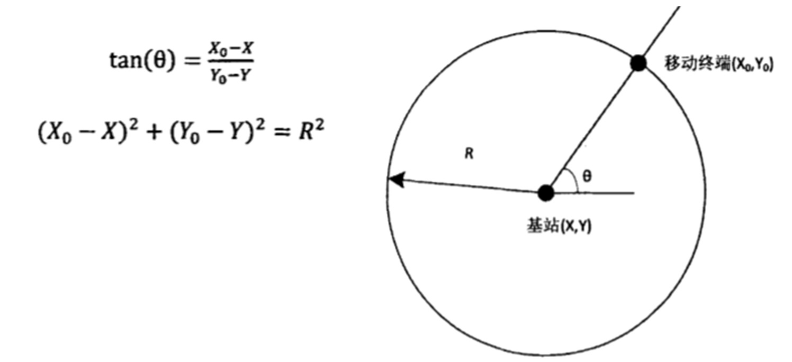
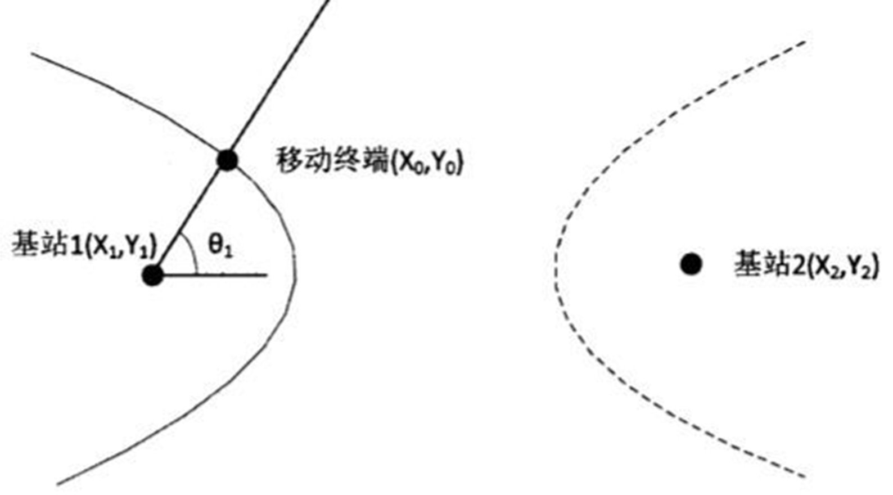

# Wireless 无线通信

# ■■■■■■■■■■■■■■■■■■■■■■

# 无线通信的基础概念

## 宽带

在通信业里，带宽可能有两个意义。一个是频带宽度，简称带宽，单位是Hz。

另外一个网络的最大传输速率,单位是 bps。

而宽带则是一个人为定义的，没有严格标准的名词。宽带是一个相对于窄带而言的概念。宽带网，简单地说，就是指高带宽的网络。通常，人们把骨干网传输速率在 2.5G 以上，接入网能够达到1兆的网络定义为"宽带网"。

与传统的窄带网络相比，宽带网在速度上占据极大的优势，它可以为上网者提供更为平滑的视频图像，更为清晰逼真的声音效果和更为迅速的网站搜索服务。

不同的移动通信制式支持的带宽也是不同的，比如 LTE 就可以支持 1.4Mhz、3Mhz、5Mhz、10Mhz、15Mhz、20Mhz 这些不同的带宽。

## 窄带

通常窄带是以语音64Kbps作为参考值。

窄带物联网 NB-IoT 技术。

56kbps MODEM 拨号上网就是窄带，因为其理论信道带宽仅为 56kbps，换算成字节流量，理论传输能力就是 56k/8 = 7k/秒。而这个速度仅仅能满足少量文字信息的传输，对于大量数据的视频、音频、图象信息来说，却无力承载。

## 频段

Sub-1GHz 频带由于载波较长，可以传播较长的距离，这使其能够穿透墙壁。但是，距离越长，数据速率可能就需要越低，因为会出现数据丢失现象。

此外，您可以选择使用功率放大器 (PA)，通过将它们与适当的外部天线配对来延长应用的通信距离。

### 4G频率

- 中国移动 4G 频率：TD-LTE频率：1880-1900MHz、2320-2370 MHz、2575-2635 MHz。
- 中国电信4G频率： TD-LTE频率：2370-2390MHz、2635-2655MHz，FDD-LTE频率：1755-1785MHZ、1850-1880MHz。
- 中国联通4G频率：TD-LTE频率：2300-2320 MHz、2555-2575 MHz，FDD-LTE频率：1755-1765MHz、1850-1860MHz。
- 相关说明：
  - 1.LTE就是网络制式；
  - 2.目前基于LTE的4G标准有两个：分别是LTE-FDD和LTE-TDD（国内习惯于将LTE TDD称为TD-LTE）。这两大标准都是基于LTE的不同分支。
  - 3.为了发挥二者各自的优势，国际上已经有了将TD-LTE与FDD混合组网的模式，TD-LTE用于热点区域覆盖，FDD用于广域覆盖。这样可以发挥各自的长处。

## Balun 巴伦

射频输出的是差分射频信号，后面就接了一个 balun，然后是天线，为什么要那个 balun？它对输出的信号功率有什么影响？

目的是为了发射单元的输出阻抗与天线阻抗匹配，这两者不匹配会产生驻波（输出信号没有经过天线发射出去而返回到了发射单元），影响输出功率，严重失配时有可能损坏发射单元。balun（巴伦）有两个作用，阻抗变换和非平衡-平衡转换。

现在很多小信号的无线电收发 IC 的 LNA 是差分输入的，甚至它的射频功放也是差分输出的，此时如果天线是单端的，则需要用 balun 来进行单端到差分（平衡不与不平衡）的转换，许多基带低频电路也用此来进行平衡与不平衡转化。

## LNA 低噪声放大器 Low Noise Amplifier

LNA 是低噪声放大器，主要用于接收电路设计中。因为接收电路中的信噪比通常是很低的，往往信号远小于噪声，通过放大器的时候，信号和噪声一起被放大的话非常不利于后续处理，这就要求放大器能够抑制噪声。

LNA 的作用是从天线获取极其微弱的不确定信号，这些信号通常是微伏数量级的信号或者低于-100 dBm，然后将该信号放大至一个更有用的水平，通常约为0.5 到1 V。具体来看，在 50 Ω 系统中10 μV 为-87 dBm，100 μV 等于-67 dBm。

## PA 功率放大器 Power Amplifier

PA 是指能输出大功率信号的放大电路。

无线 PA 可能是指无线信号从基站发射出去的基站功率放大器。

PA（功放）主要功能是功率放大，以满足系统要求，最重要的指标就是输出功率大小，其次线性如何等等，一般用在发射机的最后一级。

## 50欧姆阻抗

50Ω 传输线，就是特性阻抗为 50Ω 同轴射频电缆。

为什么很多工程师用 50 Ohm PCB 传输线，有些时候这则成为 PCB 布线的默认设置。为什么不是 60 Ohm 或者 70 Ohm？

RF 系统选择 50 ohm 的原因：

- 在线宽固定的情况下，有三个主要因素影响 PCB 的阻抗。
  - 第一，到 PCB 传输线最近的电磁干扰层的影响正比于PCB传输线到最近的参考平面的距离，越小的距离就越小的辐射。
  - 第二，串扰也随传输线的厚度有则明显的变化，减少一半的传输线厚度将减少传输线串扰。
  - 第三，越小的距离产生越小的阻抗，这个有利于减少容性负载的影响。
- 同时我们也要考虑机械问题（制程问题）。
  - 如，在高密度多层板的高压合夹层空间下，70Ω 的传输线在现在微小印刷技术下很难被制造出来。
  - 在这种情况下，50Ω 的传输线允许用比 70Ω 更宽的线宽，从而使电路板存在可制造性。
- 功率容量，抗击穿电压和衰减之间的综合考虑。
- 机械美观上的考虑。

一般 RF IC 都是做好了 50 欧姆阻抗的，所以你只需保证走线为 50 欧姆就行了，不然阻抗失配会造成信号的大量反射。我们射频板用的都是特殊的板材，一般是罗杰斯的，板厚一般为 0.508，通过 ADS 可以计算出 50 欧姆的线宽。看你的板子估计用的不是罗杰斯板材，你自己计算费事，而且对板材参数了解得也不是太清楚，建议你告诉 PCB 厂家，指定哪些线做 50 欧姆匹配，厂家会帮你修改线宽的。

## SAW

SAW也有多种用途，最主要的是做滤波器和谐振震荡用。

- 做滤波器用时，由于它插入损耗有点大，使用时最好不要放在 LNA 前面。一定要放前面的话，最好在放大器作适当补偿，使整个电路的噪声系数改善些。
  - saw里面集成了滤波器。可以更好的改善接收信号的质量。
  - SAW 滤波器在抑制电子信息设备高次谐波、镜像信息、发射漏泄信号以及各类寄生杂波千扰等方面起到了良好的作用，可以实现所需任意精度的幅频特性和相频特性的滤波，这是其它滤波器所难以实现的。
- 作谐振震荡用时常用在要求不高的地方，因为它的频率稳定性远不及晶振。

任何接收机都是有工作带宽的。但是由于实际无线环境的复杂，常常会有带外的信号通过天线进入到接收线路中，如果没有SAW Filter的滤波作用，带外的信号就会对本接收机的工作造成干扰。

因为接收机前端的 LNA 工作带宽都是大于接收机实际工作带宽的，带外的信号进来也会被放大，在进行混频解调的过程中会导致接收机的误判决。另外，带外的信号也可能因为互调（intermodulation）作用对接收机的工作造成干扰。

在手机上，最明显的例子就是 Wi-Fi 发射对 GPS 造成的干扰。

因此，一般的接收机前端，都一定会有一个 SAW filter（ filter是一定有的，但不一定是声表面波的工艺）。

LNA 本身的非线性效应  所导致的 DC offset  就靠那颗外挂的 SAW 来滤除了 。 

如果他们自知 LNA 线性度不够，那当然就需要加 SAW。

可是若他们有自信，LNA 线性度够，不加 SAW 也 OK  那就可以拿掉。

# ■■■■■■■■■■■■■■■■■■■■■■

# 无线低功耗

无线做超低功耗，可以从以下 几个角度，进行优化。

## 从硬件角度

- 选择比较好的 MCU 和射频芯片。（例如，以前都用 CC1101，现在基本换成其他芯片了。MCU 一般选择 Cortex-M0+ 的超低功耗的 MCU）
- 如果需要上拉电阻，尽量先大一点的上位电阻。因为，例 3V 的电源，用 1M 的上拉电阻，就会产生 3 uA 的静态电流。
- 外部电路，例按键电路，我们会通过 2 个 GPIO 来实现按键。这样比较省电。当需要采样按键值时，用一个 GPIO 对按键电路供电。另一个 GPIO 用来采样按键是否按下。平时，则处于断电模式，不会耗电。便要注意，RC 电路的取值。
- 注：时间常数  RC 电路有个时间常数 T = R x C。根据公式可知，当 R x C 越大，时间常数越大，积分电路充放电就慢。反之，当 R x C 越小，时间常数越小，积分电路充放电就快。
- 尽量少用 I2C 通信接口。（ 2 个上拉电阻，静态电流，比较大）
- 时钟的选择也很重要。（一般用 MCU 内部 RC 作为时钟源，但精度不够，需要用高精度的时钟来较校准这个内部的 RC 时钟源。）

 

## 从 RF 无线射频角度

- 选择接收灵敏度高，RX 电流和 Tx 电流都比较小的 SoC 芯片或射频前端。
- RF 天线，匹配电路弄好。尽量以较小的 Tx 功率，实现相关的无线传输距离。
- 尽可能缩短 RSSI 的稳定时间。例如，更换 CC1101 成 SPIRIT1，则相应的 RSSI 的稳定时间，从 630uS（CC1101） 缩短到 300uS（SPIRIT1）。这样的话，可以减少 RF 芯片在 RX 状态的持续时间，从而降低功耗。（因为 RX 状态下的功耗也是比较大的。）

 

## 从软件角度

- 把整个中断向量表，在芯片初始化时，全部复制到 RAM 中，并重定向到 RAM。
- 同理，将经常调试的代码，从 Flash 拷贝到 RAM 中运行，以提高程序运行的速度，从而降低功耗（即尽快回到低功耗模式）。
  - 例如， IAR 下，可使用 “__ramfunc” 关键字。可以在同样的系统时钟，运行更快，进一步减少功耗，可以省个5%的功耗。（说白了，就是以空间换时间）
  - ramfunc 来声明将某个函数放到 RAM 中运行。该函数用 ramfunc 声明后，编译器将这段程序和其他需要初始化的变量，放在一个具有读/写属性的区域（SECTION）。系统启动时，自动和其他的需要初始化的变量，一起从 ROM 拷贝到 RAM。
  - 使用 __ramfunc 关键字的缺点，就是不能指定具体的 RAM 位置。而且在 ramfunc 的函数中调试不是 ramfunc 的函数会降低执行速度。
- While 循环里面代码、驱动，尽量不要调库，直接对芯片的寄存器操作。
- 减少一些函数的嵌套，减少出栈入栈所消耗的时间。尽可能地减少指令周期。

 

## 从无线协议角度

- 通过无线协议，将功耗转移到 panel 或基站端。
- 切换 SystemTick 时基：
  - 运行协议栈时，切到 10ms 中断一次。
  - 平时睡眠时，不需要运行协议栈时，切到 100ms 中断一次。
- 传感器和Panel主机之间的心跳包。Supervision 周期尽量拉长。例烟雾报警器，最长可以设置 1 小时的 Supervision 周期。
- 延长 Sensor 的唤醒时间。（但，同时，也会延长 Sensor 反应时间，即延迟）
- 使用 PSM 模式 （Power Saving Mode）
  - 待机功耗只有微安级别，这相当于部分关闭，降低了天线、射频、信令处理等功耗。
  - PSM 模式的优点是可以长时间睡眠，但缺点是无法及时应对终端接收（移动终端、MT）服务。
  - PSM 模式主要应用在远程抄表和一些对实时性要求不高的场景中。

# ■■■■■■■■■■■■■■■■■■■■■■

# 无线协议：

## 无线协议：比较

| 特性和规格 | 经典蓝牙     | 低功耗蓝牙                 | Zigbee             | Thread        | Wi-Fi        | 私有 Sub-1G        |
| ---------- | ------------ | -------------------------- | ------------------ | ------------- | ------------ | ------------------ |
| 通信范围   | 长达 100m    | 长达 200m 或 400m(支持 LR) | 长达 200m          | 长达 200m     | 长达 200m    | 长达 1600m         |
| 通讯频率   | 2.4 GHz      | 2.4 GHz                    | 2.4 GHz            | 2.4 GHz       | 2.4 GHz      | 低于 1GHz          |
| PHY 吞叶量 | 高达 3 Mbps  | 高达 2 Mbps                | 高达 250 kbps      | 高达 250 kbps | 高达 72 Mbps | 500 kbps           |
| 网络类型   | 点对点、星型 | 点对点、星型、广播         | 网状               | 网状          | 点对点、星型 | 点对点、星型、网状 |
| 网络规模   | 8            | 30                         | 500+               | 350+          | 250          | 1000+              |
| 电池类型   | 单节 AA 电池 | 纽扣电池                   | 纽扣电池和能量收集 | 纽扣电池      | 双节 AA 电池 | 纽扣电池           |
|            |              |                            |                    |               |              |                    |

# ■■■■■■■■■■■■■■■■■■■■■■

# 无线协议：2.4 GHz

## Wi-Fi

### Wi-Fi 的优点

- 网络类型：
  - Wi-Fi 通常是星型连接，但也支持网状网络功能。
- 无线稳健性：
  - Wi-Fi 在 2.4GHz 和 5GHz 两个频谱上运行，这两个频谱在全球范围内都是开放的无线频谱。
  - 而且， Wi-Fi 使用多个频率信道来避免冲突。
- 安全性：
  - Wi-Fi 拥有一个活跃的生态系统，它不断地发展该技术的安全性，使其保持最新状态和稳健，以抵御黑客的攻击。
  -  Wi-Fi 数据在传输之前可以通过 WPA 加密技术进行加密。
  -  Wi-Fi 还具有多层安全性，因为它具有本地 IP（如 TLS）。 
- 吞吐量：
  - Wi-Fi 旨在用于支持高数据速率。
  - 随着新标准的定义，它现在可通过多输入多输出 (MIMO) 实施支持超过 1Gbps 的传输速率。
- 功耗：
  - Wi-Fi 也是同等数据传输位数情况下最省电的方式。
  - 该协议还非常灵活，允许电池应用以非常低的平均功率持续连接到网络。

- 目标应用：
  - 它通常用于消费类、工业和企业应用。
  - Wi-Fi 可用于笔记本电脑、智能手机、恒温器控制器和许多其他需要连接到互联网的应用。 
  - Wi-Fi 是应用最广泛的无线通信标准之一，用于在设备与互联网之间进行高吞吐量通信。

### Wi-Fi 的潜在缺点

- 功耗。Wi-Fi 峰值功耗较高，因此需要较大的电池，如 AA 型号的电池。
- 距离。Wi-Fi 旨在用于本地化网络。在 5 GHz 的频率下，相应频谱很快就会衰减或被屏蔽，因此无法穿过墙壁。

## 经典蓝牙

### 经典蓝牙的优点

- 网络类型：经典蓝牙旨在用于短距离应用，支持点对点 (P2P) 和星型网络拓扑等网络类型。
- 吞吐量：经典蓝牙旨在用于高数据吞吐量应用（如音频流传输），数据速率高达 3Mbps。
- 示例应用：通过无线耳机、扬声器和条形音箱进行音频流传输。

### 经典蓝牙的潜在缺点

经典蓝牙未针对低功耗应用进行优化。

## BLE 低功耗蓝牙

### 低功耗蓝牙的优点

- 网络类型
  - 低功耗蓝牙旨在用于短距离应用，支持点对点 (P2P)、星型和广播设备角色。
  - 低功耗蓝牙可用 于运行状况监视器、个人电子产品和资产跟踪器等多种应用。
  - 蓝牙是一种出色的无线技术媒介，它可以在 两个设备（如智能汽车接入）之间快速建立连接并交换数据。
- 功耗
  - 低功耗蓝牙旨在用于超低功耗无线通信，只需一节纽扣电池即可运行数年。
  - 该协议旨在实现轻 量级应用，且可灵活地调整各种通信间隔参数，例如以 1 秒间隔进行广播。
- 吞吐量
  -  低功耗蓝牙 BT4 及更高版本的标准数据速率为1  Mbps，这对于大多数类型的通信来说已经足够 了。
  - 但是，低功耗蓝牙 BT5 现在还支持高达 2 Mbps 的速率，可实现更快的数据传输。
- 无线稳健性
  - 低功耗蓝牙使用 2.4 GHz 无线频带，会有其他无线技术（如 Wi-Fi、 Zigbee 和 Thread） 与其共用该频带。
  - 为了在这个拥挤的频带内减少冲突，蓝牙会在通信前使用跳频找到一个开放的信道。
- 安全性
- 示例应用
  - 无线键盘、心率监视器、血压监视器、智能汽车接入等等。
  - 低功耗蓝牙是应用最为广泛的 无线技术，因为它普遍应用于每一款智能手机或平板电脑中。

### 低功耗蓝牙的潜在缺点

- 距离
  - 蓝牙不适用于需要远距离连接的应用。
- 蓝牙需要一个网关网桥来连接到 IP 网络。

## Zigbee

### Zigbee 的优点

- 网络类型 
  - Zigbee 技术是一种基于网状网络的协议，它允许网络根据应用的需要而扩增。
  - 该技术支持自生自愈的网状网络。
  - 总共有四种不同的 Zigbee 角色：协调器、路由器、终端设备和绿色电源设备。
  -  Zigbee 主要用于楼宇和家庭自动化。
- 功耗
  - Zigbee 是一款低功耗无线通信技术，可在终端应用中实现极长的电池寿命。
  - 为了实现这种等级的功耗， 终端设备会周期性地唤醒以发送数据，然后尽快重新回到低功耗模式。 
  - Zigbee 绿色电源设备甚至可以实现无电池应用，例如使用太阳能电池板收集能量。
- 无线稳健性 
  - Zigbee 是基于 IEEE 802.15.4 的无线堆栈（作为物理层和 MAC 层）。
  -  Zigbee 应用能够选择一个特定的信道来与多达 16 个信道通信。 
  - Zigbee 是一种自愈型技术，可以识别网络中断开的 节点并根据需要重新路由，以保护相应网络。
- 距离
  - Zigbee 应用的典型距离是长达 200m 的视线范围（单跳）。
  - 但是，Zigbee 可以通过其网状网络功能实现远距离通信，方法是在网络中以菊链式方式连接多个 Zigbee 路由器。
- 安全性
- 目标应用
  - Zigbee 网络可用于各种家庭自动化控件，如无线照明开关、恒温器等等。 
  - Zigbee 认证可保证与来自其他供应商的 Zigbee 认证产品的互操作性。

### Zigbee 的潜在缺点

- 网络类型
  - Zigbee 无法提供轻松连接到云的方法。连接到 IP 网络需要一个网关和地址转换层。
- 吞吐量
  - Zigbee 不适用于高数据速率传输。
  - 该技术旨在用于低数据速率应用，最大吞吐量为  250 kbps。

## Thread

### Thread 的优点

- 网络类型
  - Thread 旨在用于在基于 IP 的网络中使用网状拓扑的互联家居应用。
  - 它主要设计用于楼宇自动化，以控制照明、恒温器和其他产品。 
  - Thread 可自生自愈，这意味着它会自动升级或降级节点，以确保 网络中没有单点故障。
  - 此外， Thread 可以与任何 IPv6 网关协同工作，因此可以轻松地在网络中添加新设备。
- 功耗 
  - Thread 旨在用于在低功耗传感应用中运行，并将传感器连接到 IPv6 网络。 
  - Thread 终端设备可以长时间睡眠，从而延长电池寿命。
- 距离
  - Thread 的典型距离是长达 200m 的视线范围（单跳）。 
  - Thread 是一种网状网络，最多可通过 32 跳来延长距离。
- 安全性
  - 默认情况下，使用 AES-128 来保护设备间通信。
  - 调试则使用支持 ECJ-PAKE 的标准 DTLS。
- 目标应用 
  - Thread 网络可用于各种家庭自动化设备，如灯泡、电子锁等等。
  -  Thread 还被设计为可通过任何经Thread 认证的设备进行控制。
  - 它可以轻松与任何现有的应用框架集成。

###  Thread 的潜在缺点

- 吞吐量
  - 基于 IPv6 的网络有可能会出现高开销。
  - 因此，Thread 250kbps 的吞吐量可能不足以满足现有的 IPv6 部署。
- 应用不可知性
  - Thread 没有规定一个可互操作的应用框架；
  - 虽然 Thread 证明了网络互操作性，但应用框架互操作性无法得到保证。

## 私有 2.4 GHz

### 专有 2.4GHz 的优点

- 网络类型
  - 通过专有 2.4GHz 网络，您可以灵活地设计点对点、网状或星型网络配置，从而灵活地定制自己的无线应用层协议。 
  - 2.4GHz 的运行频带在世界各地均无需许可，这意味着您可以以较低的成本部署应用。
- 功耗 
  - 专有解决方案可实现最佳的潜在功率优化，因为它在自定义数据传输的计时和持续时间方面不受限制。
- 吞吐量
  - 它可以实现比大多数无线标准更高的有效数据传输速率，因为您可以优化通常与无线协议相关的通信开销。
- 目标应用 | 非常适合定制无线协议应用，且与传统 2.4GHz 无线协议应用具有互操作性。

### 专有 2.4GHz 的潜在缺点

- 标准
  - 选择采用专有 2.4GHz 是为了支持与现有标准不同的定制协议。
  - 当在不同对等点之间通信时，必须定义应用层协议。专有 2.4GHz 协议无法与使用任何其他无线标准的设备进行互操作。
- 距离 
  - 2.4GHz 网络通常并不提供最远距离（如需远距离专有网络，则需要采用“专有低于 1GHz”或采用 mesh 网状网络）。
  - 但是，您可以选择带有功率放大器 (PA) 的无线设备，通过将它们与适当的外部天线配对来延长应用的通信距离。（但会提高功耗。）

# ■■■■■■■■■■■■■■■■■■■■■■

# 无线协议：Sub-1 GHz

## Z-Wave

### 频段

工作频带为 908.42 MHz (美国) ~ 868.42 MHz (欧洲)，采用 FSK (BFSK / GFSK) 调制方式，数据传输速率为 9.6 kbps，信号的有效覆盖范围在室内是 30m，室外可超过 100m，适合于窄宽带应用场合。

Z-WAVE可以在中国使用的，在中国使用的频段是868.40 MHz。

### 网络结构

每一个 Z-Wave 网络都拥有自己独立的网络地址(HomeID)。

网络内每个节点的地址 (NodeID)，由控制节点 (Controller)分配。

每个网络最多容纳 232 个节点(Slave)，包括控制节点在内。

控制节点可以有多个，但只有一个主控制节点，即所有网络内节点的分配，都由主控制节点负责，其他控制节点只是转发主控制节点的命令。

已入网的普通节点，所有控制节点都可以控制。

超出通信距离的节点，可以通过控制器与受控节点之间的其他节点，以路由(Routing)的方式完成控制。

### 路由技术

Z-Wave 采用了动态路由技术，每个 Slave 内部都存有一个路由表，该路由表由 Controller 写入。动态路由是指路由器能够自动地建立自己的路由表，并且能够根据实际情况的变化适时地进行调整。

存储信息为该 Slave 入网时，周边存在的其他 Slave 的 NodeID。这样每个 Slave 都知道周围有哪些 Slaves，而 Controller 存储了所有Slaves 的路由信息。

当 Controller 与受控 Slave 的距离超出最大控制距离时，Controller 会调用最后一次正确控制该 Slave 的路径发送命令，如该路径失败，则从第一个 Slave 开始重新检索新的路径。

### 传输速率

在技术面上，Z-Wave 从原本的 9.6Kbit/s 提升到 40Kbit/s，并宣称提升后原本的 9.6Kbit/s 能与 40Kbit/s 共存。在节点数方面，一个 Z-Wave网路可支援两百三十二个点。

### 为何 Z-wave 在智能家居方面占据了强势地位

- 这主要基于Z-Wave的属性。
- Z-Wave是一种新兴的基于射频的、低成本、低功耗、高可靠、适于网络的短距离无线通信技术。
- 工作频带为908.42MHz(美国)~868.42MHz(欧洲)，采用FSK(BFSK/GFSK)调制方式，数据传输速率为9.6kbps，信号的有效覆盖范围在室内是30m，室外可超过100m，适合于窄宽带应用场合。
- 随着通信距离的增大，设备的复杂度、功耗以及系统成本都在增加，相对于现有的各种无线通信技术，Z-Wave技术将是最低功耗和最低成本的技术，有力地推动着低速率无线个人区域网。

## LoRa

低功耗广域网络 LPWAN 有诸多流派，其中 LoRa 和 NB-IoT 却是最受欢迎的两大流派。  

LoRa 工作在 1GHz 以下的非授频段，在应用时不需要额外付费。

LoRa 技术，需要用户自己建设基站，但是由于采用了先进的信道编码技术，LoRa 节点的接收灵敏度可以到达 -142dBm，可以实现超低功耗下的长距离通信，最长通信距离可以达到 30 公里。

LoRa是一种异步的基于ALOHA的协议，也就是说节点可以根据具体应用场景需求进行或长或短的睡眠。

## NB-IOT

窄带物联网NB-IoT技术。

  例：只消耗大约 180kHz 的带宽，可直接部署于 GSM 网络、UMT S网络或 LTE 网络，以降低部署成本、实现平滑升级。NB-IoT 物联网终端 TW810 具有覆盖广、连接多、速率低、成本低、功耗低、架构优等特点。  

## LTE-M

## 私有 Sub-1GHz

国内最好使用 430-440MHz 段，如：433.92MHz是使用最普遍的，配套产品齐全。315MHz也可以，但使用的人太多，容易受干扰。868,915MHz不太适合用在国内，该频段主要用于民用手机市话通的收费设备。

### 专有 Sub-1GHz的优点

- 网络类型
  - 通过专有Sub-1GHz 网络，您可以灵活地设计点对点、网状或星型网络配置，从而灵活地定制 自己的无线应用层协议。
- 无线稳健性
  - Sub-1GHz 通常也不像 2.4GHz 频带那样拥挤，因此可提供更加稳健的无线通信。
  - 但是，低 于1GHz 频带（通常为 300MHz 至 900MHz）因地理区域而异，在设计用于全球部署的产品时需要考虑频带许 可问题。
  - 有些国家/地区在低于 1GHz 的频率范围内具有无需许可的特定频带。
  - 例如， 915MHz 在美国是一个无需许可的频带，但在全球范围内不是。
- 功耗
  - 专有解决方案可实现最佳的潜在功率优化，因为它在自定义数据传输的计时和持续时间方面不受限制。
- 距离
  - Sub-1GHz 频带由于载波较长，可以传播较长的距离，这使其能够穿透墙壁。
  - 但是，距离越长，数据速率可能就需要越低，因为会出现数据丢失现象。
  - 此外，您可以选择使用功率放大器 (PA)，通过将它们 与适当的外部天线配对来延长应用的通信距离。
- 目标应用
  - 非常适合需要远距离通信的应用，如建筑物和工业应用中的仪表、烟雾探测器或温度传感器。

###  专有 Sub-1GHz 的潜在缺点

- 标准 
  - 目前，在 Sub-1GHz 频带内，尚没有广泛接受的无线标准。
  - 在专有网络中，当在不同对等点之间通信时，必须定义应用层协议。
- 吞吐量
  - Sub-1GHz 可以实现从 5kbps 到 500kbps 不等的数据吞吐量，因此有效地低于较高频率的数据传输，如 2.4GHz。
  - 频率越低，由于频率带宽的原因，可以传输的数据带宽就越低。

# ■■■■■■■■■■■■■■■■■■■■■■

# 无线协议：其他频段

## 5G 第五代移动通讯技术

全球5G部署的频段只有两种，sub-6GHz 和 毫米波。

Sub-6 GHz频段最大的优势是信号穿透力强，覆盖范围广，成本更低，并且较于4G，网速已经有了数倍的增长。而5G毫米波更容易实现密集的小区部署，适合应用在大型场所如会议室、音乐会、体育馆、地铁站等人口密集区域，但是，对信号条件有着更高的要求。

 全球移动通信系统协会（GSMA）发表的《5G 毫米波技术白皮书》中就专门强调，目前毫米波技术所面临的最首要的挑战，就是信号覆盖率。中国联通曾对此进行过实测，结果发现，5G 毫米波的穿透损耗远高于Sub-6  GHz，如遭遇恶劣天气，雨、雪、雾等夹杂，对毫米波的传播也非常不利。  

## LTE 

不同的移动通信制式支持的带宽也是不同的，比如LTE就可以支持1.4Mhz、3Mhz、5Mhz、10Mhz、15Mhz、20Mhz这些不同的带宽。

## 毫米波 millimeter wave

毫米波 （millimeter wave ）：毫米波频段没有太过精确的定义，通常将30~300GHz的频域(波长为1～10毫米)的电磁波称毫米波，波长为1～10毫米的电磁波称毫米波，它位于微波与远红外波相交叠的波长范围，因而兼有两种波谱的特点。毫米波的理论和技术分别是微波向高频的延伸和光波向低频的发展。

除了30GHz之内的频谱资源已被运营商和各类机构瓜分殆尽外，5G使用毫米波的理由简单极了，因为这部分频谱拥有连续可用的超大带宽，可以满足5G对超大容量和极高速率的传输需求。

但是，频率越高的电磁波传播距离越近，属于极高频的毫米波在传播时有很大的路径损耗，不但难以穿过建筑或障碍物，甚至一片叶子、一滴雨水都有可能将它吸收。

需要了解的是，全球的 5G 网络频段主要分为 Sub-6 GHz 和毫米波两大类型。Sub-6 GHz 是波长为厘米级的电磁波，可以理解为「厘米波」，顾名思义占据了 6GHz 以下的网络频段，而毫米波是波长为毫米级的电磁波，通常所指频段为 30 - 300 GHz，往往也包含 24 GHz 以上频段。单从速度上来说，毫米波具有绝对优势，美版 iPhone 12 Pro在毫米波网络环境下，理论下载速率可达 4Gbps (512MB/s)。

美国在5G试验和商用部署时使用了毫米波，中国工程院院士刘韵洁曾分析称，关键原因在于美国6GHz以下的频段全部归军方使用。

在《5G 毫米波技术白皮书》也提到，相比 Sub-6 GHz 这类中低频不同，5G 毫米波更容易实现密集的小区部署。这使得 5G 毫米波很适合应用在大型场所如会议室、音乐会、体育馆、地铁站等人口密集区域。所以说 5G 毫米波和中低频的 Sub-6 GHz 具有各自不同的性能优势，它们之间的互相配合、互相补充，是实现 5G 完整体验的关键。

### 毫米波这么厉害，为什么我们不用

在我国的 5G 发展路径上，目前首要采用是 Sub-6 GHz 方案。

我们前面提到，由于两种频段的不同特性，Sub-6 GHz 的速度并不如毫米波，但也不能就此否定 Sub-6 GHz 的能力，该频段最大的优势是信号穿透力强，覆盖范围广，成本也更低。

比如，目前国内 5G 套餐的资费在全球已经非常实惠，同时运营商还在大力推出不同速率的 5G 套餐，尽管它的速度不如毫米波，但比之前的 4G 要快上太多了。

由此也不难发现，我国选用 Sub-6 GHz 作为现阶段的首选方案，也是想要先解决 5G 网络覆盖的问题，继而尽快把 5G 投入到实际应用中来

根据实测结果，我们可以看到 5G 毫米波的穿透损耗远高于 Sub-6 GHz，同时恶劣天气如雨、 雪、雾等对毫米波的传播也有不利影响。

我国在现阶段选择押宝 Sub-6 GHz，是看中它比毫米波更强的覆盖能力和更低的成本，因为在目前 5G 网络还没有全面覆盖、杀手级 5G 应用还充满未知数的前提下，毫米波技术现阶段的意义并不大。但站在长远的角度看，毫米波在未来绝对是热点区域主力的解决方案。

## 超宽带 UWB

超宽带（Ultra Wide Band，UWB）技术是一种使用1GHz以上频率带宽的无线载波通信技术。它不采用正弦载波，而是利用纳秒级的非正弦波窄脉冲传输数据，因此其所占的频谱范围很宽。尽管使用无线通信，但其数据传输速率可以达到几百兆比特每秒以上。

使用UWB技术可在非常宽的带宽上传输信号，美国联邦通信委员会（FCC）对UWB技术的规定为：在3.1~10.6GHz频段中占用500MHz以上的带宽。

UWB 实质上是以占空比很低的冲击脉冲作为信息载体的无载波扩谱技术，它是通过对具有很陡上升和下降时间的冲击脉冲进行直接调制。典型的UWB直接发射冲击脉冲串，不再具有传统的中频和射频的概念，此时发射的信号既可看成基带信号（依常规无线电而言），也可看成射频信号（从发射信号的频谱分量考虑）。

由于UWB技术具有数据传输速率高（达1Gbit/s）、系统复杂度低、发射信号功率谱密度低、对信道衰落不敏感、抗多径干扰能力强、功耗低、成本低、穿透能力强、截获率低、定位精度高、与现有其他无线通信系统共享频谱等特点，UWB技术成为无线个人局域网通信技术（WPAN）的首选技术，尤其适用于室内等密集多径场所的高速无线接入。

### 超宽带 UWB 的优势

- 系统结构的实现比较简单
  - 当前的无线通信技术所使用的通信载波是连续的电波，载波的频率和功率在一定范围内变化，利用载波的状态变化来传输信息。
  - 而UWB技术则不使用载波，它通过发送纳秒级非正弦波窄脉冲来传输数据信号。
  - UWB系统中的发射器直接用脉冲小型激励天线，不需要传统收发器所需要的上变频，从而不需要功用放大器与混频器。
  - UWB系统允许采用非常低廉的宽带发射器。
  - 同时，在接收端，UWB系统的接收机也有别于传统的接收机，它不需要中频处理，因此，UWB系统结构的实现比较简单。
- 高速的数据传输
  - 民用商品中，一般要求UWB信号的传输范围为10m以内，根据经过修改的信道容量公式，民用商品数据传输速率可达500Mbit/s，UWB技术是实现个人通信和无线局域网的一种理想调制技术。
  - UWB技术以非常宽的频率带宽来换取高速的数据传输，并且不单独占用已经拥挤不堪的频率资源，而是共享其他无线技术使用的频带。
  - 在军事应用中，UWB 技术可以利用巨大的扩频增益来实现远距离、低截获率、低检测率、高安全性和高速的数据传输。
- 功耗低
  - UWB 系统使用间歇的脉冲来发送数据，脉冲持续时间很短，一般在0.20~1.5ns之间，有很低的占空比，系统耗电很低，在高速通信时系统的耗电量仅为几百微瓦至几十毫瓦。
  - 民用 UWB 设备的功率一般是传统移动电话所需功率的 1/100 左右，是蓝牙设备所需功率的 1/20 左右。
  - 军用的 UWB 电台耗电也很低。因此，UWB设备在电池寿命和电磁辐射上，与传统无线通信设备相比，有着很大的优势。
- 安全性高
  - 作为通信系统的物理层技术，UWB 技术具有天然的安全性能。
  - 由于 UWB 信号一般把信号能量弥散在极宽的频带范围内，对于一般通信系统来说，UWB 信号相当于白噪声信号。
  - 并且在大多数情况下，UWB 信号的功率谱密度低于自然的电子噪声的功率谱密度，从电子噪声中将脉冲信号检测出来是一件非常困难的事。
  - 采用编码对脉冲参数进行伪随机化后，脉冲的检测将更加困难。
- 多径分辨能力强
  - 由于常规无线通信的射频信号大多为连续信号或其持续时间远大于多径传播时间，多径传播效应限制了通信质量和数据传输速率，由于超宽带无线电发射的是持续时间极短且占空比极小的单周期脉冲，多径信号在时间上是可分离的。
  - 假如多径脉冲要在时间上发生交叠，其多径传输路径长度应小于脉冲宽度与传播速度的乘积。
  - 由于脉冲多径信号在时间上不重叠，很容易分离出多径分量以充分利用发射信号的能量。
  - 大量的实验表明，对常规无线电信号多径衰落深达 10~30dB 的多径环境，对超宽带无线电信号的衰落最多不到 5dB。
- 定位精确
  - 冲激脉冲具有很高的定位精度。
  - 采用 UWB 技术，很容易将定位与通信合一，而常规无线电难以做到这一点。
  - UWB 技术具有极强的穿透能力，可在室内和地下进行精确定位，而 GPS（全球定位系统）只能工作在 GPS 定位卫星的可视范围之内。
  - 与 GPS 提供绝对地理位置不同，超宽带无线电定位器可以给出相对位置，其定位精度可达厘米级。
  - 此外，超宽带无线电定位器在价格上更为便宜。
- 工程简单造价便宜
  - 在工程实现上，UWB 技术比其他无线技术要简单得多，可全数字化实现。
  - 它只需要以一种数学方式产生脉冲，并对脉冲进行调制，而实现上述过程所需的电路都可以被集成到一个芯片上，设备的成本很低。
  - UWB 系统发射和接收的是纳秒级的非正弦波窄脉冲，不需要采用正弦载波而直接进行调制。
  - 接收机利用相关器件能直接完成信号检测，这样，收发信机不需要复杂的载频调制解调电路和滤被器，只需要一种数字方式来产生纳秒级的非正弦波窄脉冲。
  - 因此，采用 UWB 技术可以大大降低系统的复杂度，减小收发信机的体积，降低收发信机的功耗，易于数字化和采用软件无线电技术。

### UWB 的定位原理

定位算法中比较成熟的有：TOA（到达时间）、TDOA（到达时间差）、AOA（到达角度或称为DOA估计）定位技术和这三种技术的混合技术。

#### TOA（到达时间）

TOA 通过分别测量移动终端与三个或更多基站之间信号的传播时间来定位。它采用了圆周定位，

 

假如己知移动终端到基站i的直线距离尺Ri， 那么由几何原理可知，移动终端的位置一定在以基站i的位置为圆心，Ri为半径 的圆周上。即若移动终端的位置(X0，Y0)，基站位置为(Xi，Yi)，则两者满足如下 关系：

下面的图非常形象的诠释了 TOA 算法的原理：

然而，事情都具有两面性：

- TOA定位对传播中产生的误差比较敏感，这些误差来自于传播中的反射、 多径传播、非视距传播和噪声等干扰，会造成各圆无法相交或相交处不是一个点而是一个区域。
- 同时，TOA 定位要求移动终端和基站之间在时间上要准确同步，1ns 的同步误差将会给定位带来大约 0.3米 的不确定性。
- 纳秒级的同步精度在 许多通信系统中是达不到的。
- 因此，实际中很少使用单纯的TOA定位。

#### TDOA（到达时间差）

正因为如此，TDOA 对 TOA 技术加以了改进。

TDOA 定位不必要进行基站和移动终端之间的同步，而只需要基站之间进行同步。

因为基站的位置是固定的，基站之间进行同步与基站和移动终端之间进行同步要容易实现得多。

这使得TDOA定位比TOA定位要更加容易实现，所以 TDOA定位的应用非常广泛。

它通过测量出两个不同基站与移动终端的传输时延差来进行定位。假设移动终端的位置与基站1和基站2的距离差为R21=R2-R1，则移动终端的位置必定在以两个基站为焦点，与两个焦点的距离差恒为R21的双曲线上。即若移动终端的位置为(X0,Y0)，基站1位置为(X1,Y1)，基站2位置为(X2,Y2)，则它们满足关系。

再通过另一组移动终端与基站1基站3或基站2基站3的TDOA，可以得到 另一组双曲线，两组双曲线将最多产生两个交点，再根据先验知识(如半径范围 等)判断出移动终端的位置。

它的基本原理可以从下面的图得到良好的诠释：

#### AOA（到达角度或称为DOA估计）

AOA 估计也叫 DOA (Direction ofArrival)估计或者方向识别DF(DirectionFinding）。

 AOA 的优点是所需要的基站比较少，最少只要两个基站就可以进行定位。在LTE系统之前，由于以前的基站并没有天线阵列，而只为了进行定位而对基 站进行更换，不仅需要投入庞大的资金也会破坏原有系统的结构和工作模式，使通信系统无法正常工作，因此AOA定位并不受人重视。在LTE系统中应用了 OFDM和多天线阵技术，使得基于LTE的AOA定位成为了研究热点。AOA的缺点是当移动终端和基站的距离比较远的时候，即使有微小的定位角度的误差，都会造成比较大的定位距离的偏差。因此AOA定位多见于中、短距离的定位。

下图很好的诠释了 AOA 的基本原理：

#### 混合定位技术

目前，混合定位技术是UWB定位研究领域中的新趋势，具有广大的发展前景。

混合定位技术就是混合使用上述的两种或三种定位技术，比如TOA-TDOA、 TOA-AOA、TDOA-AOA等，通过检测并提取相关的定位参数，用于定位解算。混合定位技术可以运用多种定位参数实现定位，综合不同定位技术的特点，在各 种定位技术的特性中取长补短，让最终的定位性能得到优化。

##### TOA-AOA 圆角定位

对于基于TOA-AOA的技术，又叫圆角定位，利用这种方法可以实现利用单个基站进行定位。首先利用TOA的值计算出移动终端和基站之间的距离R，那么可以确定用终端的位置在以基站为圆心，R为半径的圆周上。接着利用天线阵 列测量出的移动终端到基站的AOA，作出一条射线。则射线与圆之间的交点就是移动终端的位置。若移动终端的位置为（X0，Y0)，基站位置为(X，Y)在基站测得的移动终端发出的信号的到达角度为θ，基站和移动终端的距离为R，则他们满足如下方程：

##### TDOA-AOA定位

对于TDOA-AOA定位，可以通过下图形象的理解其定位原理：

# ■■■■■■■■■■■■■■■■■■■■■■

# 无线安全

万物互联，安全为先。

当物联网中的节点数目达到一个惊人的量级的时候，安全问题必将成为一个关键环节。要解决安全问题，必须从多方面综合考虑，比如添加安全认证芯片，引入防拆解技术，增加安全启动，进行通信加密等。

