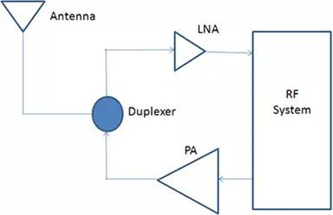

# Wireless 无线通信

# 无线通信的基础概念

## 宽带

在通信业里，带宽可能有两个意义。一个是频带宽度，简称带宽，单位是Hz。

另外一个网络的最大传输速率,单位是 bps。

而宽带则是一个人为定义的，没有严格标准的名词。宽带是一个相对于窄带而言的概念。宽带网，简单地说，就是指高带宽的网络。通常，人们把骨干网传输速率在 2.5G 以上，接入网能够达到1兆的网络定义为"宽带网"。

与传统的窄带网络相比，宽带网在速度上占据极大的优势，它可以为上网者提供更为平滑的视频图像，更为清晰逼真的声音效果和更为迅速的网站搜索服务。

不同的移动通信制式支持的带宽也是不同的，比如 LTE 就可以支持 1.4Mhz、3Mhz、5Mhz、10Mhz、15Mhz、20Mhz 这些不同的带宽。

## 窄带

通常窄带是以语音64Kbps作为参考值。

窄带物联网 NB-IoT 技术。

56kbps MODEM 拨号上网就是窄带，因为其理论信道带宽仅为 56kbps，换算成字节流量，理论传输能力就是 56k/8 = 7k/秒。而这个速度仅仅能满足少量文字信息的传输，对于大量数据的视频、音频、图象信息来说，却无力承载。

## 频段

Sub-1GHz 频带由于载波较长，可以传播较长的距离，这使其能够穿透墙壁。但是，距离越长，数据速率可能就需要越低，因为会出现数据丢失现象。

此外，您可以选择使用功率放大器 (PA)，通过将它们与适当的外部天线配对来延长应用的通信距离。

## Balun 巴伦

射频输出的是差分射频信号，后面就接了一个 balun，然后是天线，为什么要那个 balun？它对输出的信号功率有什么影响？

目的是为了发射单元的输出阻抗与天线阻抗匹配，这两者不匹配会产生驻波（输出信号没有经过天线发射出去而返回到了发射单元），影响输出功率，严重失配时有可能损坏发射单元。balun（巴伦）有两个作用，阻抗变换和非平衡-平衡转换。

现在很多小信号的无线电收发 IC 的 LNA 是差分输入的，甚至它的射频功放也是差分输出的，此时如果天线是单端的，则需要用 balun 来进行单端到差分（平衡不与不平衡）的转换，许多基带低频电路也用此来进行平衡与不平衡转化。

## LNA 低噪声放大器 Low Noise Amplifier

LNA 是低噪声放大器，主要用于接收电路设计中。因为接收电路中的信噪比通常是很低的，往往信号远小于噪声，通过放大器的时候，信号和噪声一起被放大的话非常不利于后续处理，这就要求放大器能够抑制噪声。

LNA 的作用是从天线获取极其微弱的不确定信号，这些信号通常是微伏数量级的信号或者低于-100 dBm，然后将该信号放大至一个更有用的水平，通常约为0.5 到1 V。具体来看，在 50 Ω 系统中10 μV 为-87 dBm，100 μV 等于-67 dBm。

## PA 功率放大器 Power Amplifier

PA 是指能输出大功率信号的放大电路。

无线 PA 可能是指无线信号从基站发射出去的基站功率放大器。

PA（功放）主要功能是功率放大，以满足系统要求，最重要的指标就是输出功率大小，其次线性如何等等，一般用在发射机的最后一级。

## 50欧姆阻抗

50Ω 传输线，就是特性阻抗为 50Ω 同轴射频电缆。

为什么很多工程师用 50 Ohm PCB 传输线，有些时候这则成为 PCB 布线的默认设置。为什么不是 60 Ohm 或者 70 Ohm？

RF 系统选择 50 ohm 的原因：

- 在线宽固定的情况下，有三个主要因素影响 PCB 的阻抗。
  - 第一，到 PCB 传输线最近的电磁干扰层的影响正比于PCB传输线到最近的参考平面的距离，越小的距离就越小的辐射。
  - 第二，串扰也随传输线的厚度有则明显的变化，减少一半的传输线厚度将减少传输线串扰。
  - 第三，越小的距离产生越小的阻抗，这个有利于减少容性负载的影响。
- 同时我们也要考虑机械问题（制程问题）。
  - 如，在高密度多层板的高压合夹层空间下，70Ω 的传输线在现在微小印刷技术下很难被制造出来。
  - 在这种情况下，50Ω 的传输线允许用比 70Ω 更宽的线宽，从而使电路板存在可制造性。
- 功率容量，抗击穿电压和衰减之间的综合考虑。
- 机械美观上的考虑。

一般 RF IC 都是做好了 50 欧姆阻抗的，所以你只需保证走线为 50 欧姆就行了，不然阻抗失配会造成信号的大量反射。我们射频板用的都是特殊的板材，一般是罗杰斯的，板厚一般为 0.508，通过 ADS 可以计算出 50 欧姆的线宽。看你的板子估计用的不是罗杰斯板材，你自己计算费事，而且对板材参数了解得也不是太清楚，建议你告诉 PCB 厂家，指定哪些线做 50 欧姆匹配，厂家会帮你修改线宽的。

## SAW

SAW也有多种用途，最主要的是做滤波器和谐振震荡用。

- 做滤波器用时，由于它插入损耗有点大，使用时最好不要放在 LNA 前面。一定要放前面的话，最好在放大器作适当补偿，使整个电路的噪声系数改善些。
  - saw里面集成了滤波器。可以更好的改善接收信号的质量。
  - SAW 滤波器在抑制电子信息设备高次谐波、镜像信息、发射漏泄信号以及各类寄生杂波千扰等方面起到了良好的作用，可以实现所需任意精度的幅频特性和相频特性的滤波，这是其它滤波器所难以实现的。
- 作谐振震荡用时常用在要求不高的地方，因为它的频率稳定性远不及晶振。

任何接收机都是有工作带宽的。但是由于实际无线环境的复杂，常常会有带外的信号通过天线进入到接收线路中，如果没有SAW Filter的滤波作用，带外的信号就会对本接收机的工作造成干扰。

因为接收机前端的 LNA 工作带宽都是大于接收机实际工作带宽的，带外的信号进来也会被放大，在进行混频解调的过程中会导致接收机的误判决。另外，带外的信号也可能因为互调（intermodulation）作用对接收机的工作造成干扰。

在手机上，最明显的例子就是 Wi-Fi 发射对 GPS 造成的干扰。

因此，一般的接收机前端，都一定会有一个 SAW filter（ filter是一定有的，但不一定是声表面波的工艺）。

LNA 本身的非线性效应  所导致的 DC offset  就靠那颗外挂的 SAW 来滤除了 。 

如果他们自知 LNA 线性度不够，那当然就需要加 SAW。

可是若他们有自信，LNA 线性度够，不加 SAW 也 OK  那就可以拿掉。

