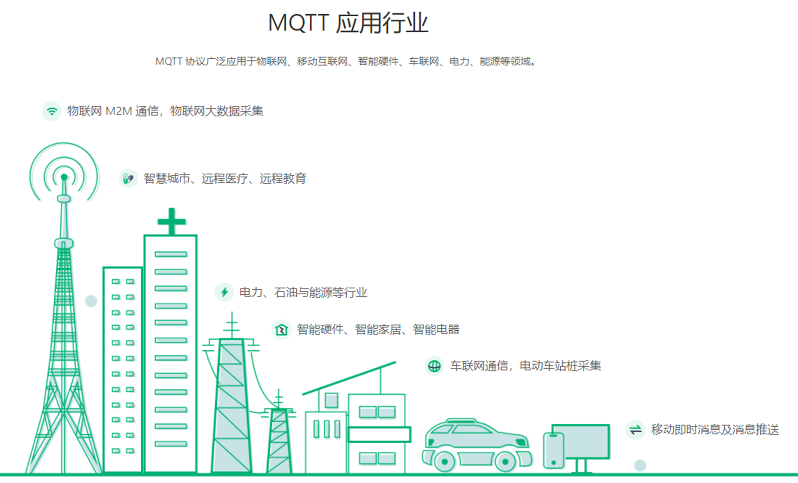

# MQTT 消息队列遥测传输

MQTT 消息队列遥测传输 Message Queuing Telemetry Transport 是 IBM  在 1999 年开发的即时通信协议。MQTT 是一种轻量级的以 “发布 & 订阅”（publish/subscribe）方式工作的 CS 架构的协议。

通过 MQTT 协议，目前已经扩展出了数十种 MQTT 服务器端程序，可以通过 PHP、Java、Python、C、C# 等语言向 MQTT 发送消息。

此外，国内很多企业都在广泛使用 MQTT 作为 Android 手机客户端与服务器端推送消息的协议。

Facebook 在 iOS 应用中也采用 MQTT 协议更新通知、消息、书签等。

由于开放源代码、耗电量小等特点，MQTT 非常适用于物联网领域，如传感器与服务器之间的通信、传感器信息采集等。

## MQTT 特点

MQTT 协议运行在 TCP/IP 或其他网络协议之上，它将建立客户端到服务器的连接，提供两者之间的一个有序的、无损的、基于字节流的双向传输。  

MQTT 是一个基于客户端-服务器的消息发布/订阅传输协议。

MQTT 最大优点在于，可以以极少的代码和有限的带宽，为连接远程设备提供实时可靠的消息服务。

 MQTT 协议是轻量、简单、开放和易于实现的，作为一种低开销、低带宽占用的即时通讯协议，使其在物联网、小型设备、移动应用等方面有较广泛的应用。 

当应用数据通过 MQTT 网络发送时， MQTT 会把与之相关的服务质量（QoS）和主题名（Topic）相关连，其特点包括：  

- 使用发布/订阅消息模式，它提供了一对多消息分发，以实现与应用程序的解耦。
- 对负载内容屏蔽的消息传输机制。
- 对传输消息有三种服务质量（QoS）：  
  - 最多一次，这一级别会发生消息丢失或重复，消息发布依赖于底层 TCP/IP 网络。即： <=1  
  - 至多一次，这一级别会确保消息到达，但消息可能会重复。即： >=1  
  - 只有一次，确保消息只有一次到达。即：＝ 1。在一些要求比较严格的计费系统中，可以使用此级别。  
- 数据传输和协议交换的最小化（协议头部只有 2 字节），以减少网络流量。  
- 通知机制，异常中断时通知传输双方。  

## MQTT 资源、网站

- MQTT 官网：https://mqtt.org/
- https://mqtt.org/software/
- https://www.emqx.cn/mqtt

## MQTT 应用场景

## MQTT 版本

### MQTT v3.1.1

MQTT V3.1.1协议规范：http://docs.oasis-open.org/mqtt/mqtt/v3.1.1/os/mqtt-v3.1.1-os.html

### MQTT v5.0

MQTT V5.0 协议规范：https://docs.oasis-open.org/mqtt/mqtt/v5.0/cs02/mqtt-v5.0-cs02.html

https://www.emqx.cn/mqtt/mqtt5  

### MQTT-SN v1.2

MQTT-SN：MQTT for sensor network可以基于蓝牙或UDP。

## 为什么选择 MQTT

- 轻量可靠
  - MQTT 报文紧凑，可在严重受限的硬件设备和低带宽、高延迟的网络上实现稳定传输。
- 生态更完善
  - 覆盖全语言平台的客户端和 SDK， AWS IoT Core、 Azure IoT Hub 等顶级云厂商物联网平台标准通信协议，物联网事实标准。
- 发布/订阅模式
  - 基于发布/订阅模式，发布订阅模式的优点在于发布者与订阅者的解耦：订阅者与发布者不需要建立直接连接、也不需要同时在线。
- 为物联网而生
  - MQTT是为了物联网场景设计的基于TCP的Pub/Sub协议，有许多为物联网优化的特性，比如适应不同网络的QoS、层级主题、遗言等等。
  - 提供心跳机制、遗嘱消息、QoS 质量等级+离线消息、主题和安全管理等全面的物联网应用特性。

- 低功耗
  - MQTT保证每个消息极其小（一个MQTT control message可以只有2byte），因此节约带宽也节约了接收端的电能。

## MQTT vs  WebSocket

- WebSocket 是为了 HTML5 应用方便与服务器双向通讯而设计的协议，HTTP 握手然后转 TCP 协议，用于取代之前的 Server Push、Comet、长轮询等老旧实现。
- WebSocket 需要 Web Client Application（通常是浏览器），MQTT 不需要。
- WebSocket 实现的是 Web Client 端和服务器端的长连接（即：管道。避免了 RESTful 那样的短连接），节省的是多次握手的开销。
- MQTT 跟 WebSocket 可以认为是不同层面的协议。MQTT 做原生设备的通信，MQTT over WebSocket 主要用于 MQTT 设备跟 Web 端通信。
- MQTT 跟 Websocket 两者之所有有交集，是因为一个应用场景：如何通过 HTML5 应用来作为 MQTT 的客户端，以便接受设备消息或者向设备发送信息，那么 MQTT over WebSocket 自然成了最合理的途径了。
- MQTT 实现的是“发布/订阅”模型（名字里就有 Message Queue），不保持 Client 和 Broker 之间的连接。
-  MQTT Client 和 Broker 之间的连接仍然是基于 TCP/IP 协议，但是理论上任何支持有序双向连接的网络协议都可以支持 MQTT，比如 MQTT-SN：MQTT for sensor network可以基于蓝牙或 UDP。  
- MQTT 的接收广播的消息是通过 MQTT client，而不是 Web Client。由于在物联网应用场景中很多应用是没有 Web Client 的（比如你家微波炉上面不会安个浏览器。）

### MQTT over WebSocket

- Web Links：

  https://www.emqx.cn/blog/connect-to-mqtt-broker-with-websocket

  http://test.mosquitto.org/ws.html

- MQTT over WebSocket 是把 MQTT control message 包装成 WebSocket 包，通过 WebSocket 管道发送。即使用 WebSocket 来支持MQTT Client 和 Broker 的连接。

- MQTT over WebSocket 的思路，是想既利用 mqtt 的诸多优良特点，同时又可以对防火墙友好，不需要找 IT 开 1883/8883 端口。
- 从部署成本的角度来说，在很多正规的客户企业现场部署物联网客户端的的时候，如果是 mqtt/ mqtts，就要找客户IT管理员在防火墙开 1883 和 8883 端口。用 WebSocket，就不需要找IT。
- 更复杂点儿，还可以RDP / VNC / 串口透传 / 网口透传 / 文件 over mqtt over websocket。

# MQTT 协议工作原理  

在 MQTT 协议中有三种身份：发布者（Publish）、代理（Broker）（服务器）和订阅者（Subscribe）。其中消息的发布者和订阅者都是客户端，消息代理是服务器，消息发布者可以同时是订阅者，这三者的关系如下图所示：

 

## MQTT 协议的实际使用流程

- 发布者通过代理服务器向指定的 Topic 发布消息。
- 订阅者通过代理服务器订阅所需要的 Topic。
- 订阅成功后如果有发布者向订阅者订阅的 Topic 发布消息，那么订阅者就会收到代理服务器的推送消息，通过这种方式可以进行高效的数据交换。

## MQTT 客户端  

一个使用 MQTT 协议的应用程序或者设备，它总是建立到服务器的网络连接。客户端可以：

- 与服务器建立连接
- 发布其他客户端可能会订阅的信息
- 接收其它客户端发布的消息
- 退订已订阅的消息  

## MQTT 服务器端  Broker   

QTT 服务器以称为 “消息代理”（Broker），可以是一个应用程序或一台设备。它是位于消息发布者和订阅者之间，它可以：  

- 接受来自客户的网络连接
- 接收客户发布的应用信息
- 处理来自客户端的订阅和退订请求
- 向订阅的客户转发应用程序消息

# MQTT 协议

## MQTT 协议中的方法  

MQTT 协议中定义了一些方法（也被称为动作），用来表示对确定资源所进行操作。这个资源可以代表预先存在的数据或动态生成数据，这取决于服务器的实现。通常来说，资源指服务器上的文件或输出。  

- Connect：等待与服务器建立连接。
- Disconnect：等待 MQTT 客户端完成所做的工作，并与服务器断开 TCP/IP 会话。
- Subscribe：等待完成订阅。
- UnSubscribe：等待服务器取消客户端的一个或多个 Topics 订阅。
- Publish： MQTT 客户端发送消息请求，发送完成后返回应用程序线程。

## MQTT 协议中的订阅、主题、会话  

### 订阅（Subscription）

- 订阅包含主题筛选器（Topic Filter）和最大服务质量（QoS）。
- 订阅会与一个会话（Session）关联。一个会话可以包含多个订阅。
- 每一个会话中的每个订阅都有一个不同的主题筛选器。

### 会话（Session）

- 每个客户端与服务器建立连接后就是一个会话，客户端和服务器之间有状态交互。
- 会话存在于一个网络之间，也可能在客户端和服务器之间跨越多个连续的网络连接。

### 主题名（Topic Name）

- 连接到一个应用程序消息的标签，该标签与服务器的订阅相匹配。
- 服务器会将消息发送给订阅所匹配标签的每个客户端。

### 主题筛选器（Topic Filter）

- 一个对主题名通配符筛选器，在订阅表达式中使用，表示订阅所匹配到的多个主题。

### 负载（Payload）

消息订阅者所具体接收的内容。

### 应用消息（Application Message）

- MQTT 协议通过网络传输应用数据。

- 应用消息通过 MQTT 传输时，它们有关联的服务质量（QoS）和主题（Topic）。

### 控制报文（MQTT Control Packet）

- 通过网络连接发送的信息数据包。
- MQTT 规范定义了十四种不同类型的控制报文，其中一个（PUBLISH 报文）用于传输应用消息。

