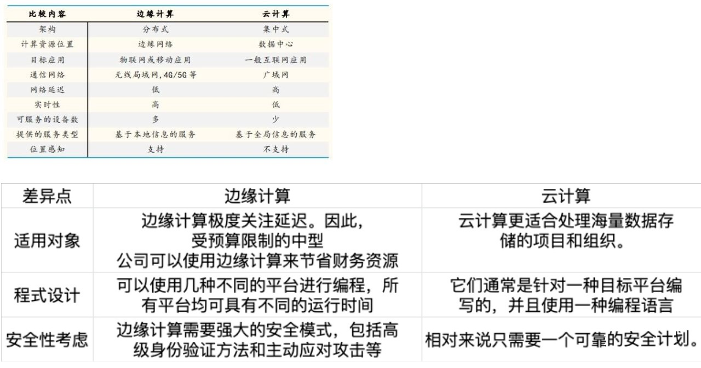

# Edge Calculation 边缘计算

边缘计算是一种云计算的优化方式，它通过网络边缘设备和计算单元进行协作，允许附近的传感器和中央数据之间进行通信，比如电脑和智能手机等。

## 边缘计算的优势和发展

边缘计算的发展前景广阔，被称为“人工智能的最后一公里”，但它还在发展初期，有许多问题需要解决，如：框架的选用，通讯设备和协议的规范，终端设备的标识，更低延迟的需求等。随着 IPv6 及 5G 技术的普及，其中的一些问题将被解决，虽然这是一段不小的历程。
相较于云计算，边缘计算有以下这些优势。

- 优势一：更多的节点来负载流量，使得数据传输速度更快。
- 优势二：更靠近终端设备，传输更安全，数据处理更即时。
- 优势三：更分散的节点相比云计算故障所产生的影响更小，还解决了设备散热问题。

## 为什么需要边缘计算

云计算的不足随着边缘计算的兴起，在太多场景中需要计算庞大的数据并且得到即时反馈。这些场景开始暴露出云计算的不足，主要有以下几点：

- 大数据的传输问题：020 年，每人每天平均将产生 1.5 GB 的数据。随着越来越多的设备连接到互联网并生成数据，以中心服务器为节点的云计算可能会遇到带宽瓶颈。
- 数据处理的即时性：据统计，无人驾驶汽车每秒产生约 1 GB 数据，波音 787 每秒产生的数据超过 5 GB；2020 年我国数据储存量达到约 39 ZB，其中约 30%  的数据来自于物联网设备的接入。海量数据的即时处理可能会使云计算力不从心。
- 隐私及能耗的问题：云计算将身体可穿戴、医疗、工业制造等设备采集的隐私数据传输到数据中心的路径比较长，容易导致数据丢失或者信息泄露等风险；数据中心的高负载导致的高能耗也是数据中心管理规划的核心问题。

# 边缘计算和云计算

## 边缘计算和云计算的区别

首先，边缘计算和云计算，是属于两个层面的概念，实际上应用领域并不相同。

从原理上来看：边缘计算是指在数据源头的附近，采用开放平台，就近直接提供最近端的服务。而云计算，则是指通过网络，把众多数据计算处理程序分解，通过服务器组成的系统，把这些分解的小程序再处理分析来得到结果。

从特点上来看：边缘计算的应用程序是在数据源头边缘侧发起的，减少了数据在网络上转移的过程，那么所产生的网络服务也会更快，在一些行业中的实时业务、应用智能、安全与隐私保护等方面应用都很不错。云计算则融入了分布式计算、效用计算、负载均衡、并行计算、网络存储、热备份冗杂和虚拟化等计算机技术，具有虚拟化技术、动态可扩展、按需部署、灵活性高、可靠性高、性价比高、可扩展性的优点。

边缘计算需要自行处理大量的数据，在实际的生产应用中，也需要配备合适的硬件，来存储、处理数据。而网关设备一般拥有较强的CPU和存储资源，非常适合作为边缘计算的软硬件平台。

### 整体与局部

云计算把握整体，边缘计算更专注于局部。

### 实时与长期

边缘计算更靠近设备端，靠近用户，着眼于实时、短周期数据的分析，以更好地支撑本地业务及时处理执行。而云计算是一个统筹者，负责长周期数据的大数据分析，能够在周期性维护、业务决策等领域运行。

有很多应用场景是无法接受把数据上传到云端再做决策和交互的，比如无人驾驶或者精密机床的场景——因为数据传导回去之后，场景可能就已经过时不适用了。在这些场景下，云计算无法满足需求，边缘计算则可以通过在更靠近数据源的位置来执行计算，改善服务。

### 分散与集中

比如数据隐私问题，如果大量的用户信息资源高度集中于云计算平台，一旦受到攻击，将造成严重的隐私泄露，而用户数据的所有权和管理如果在云计算平台中是分开的，也将导致私人数据的泄露和丢失。

使用邻近的边缘服务器则有希望避免出现这样的问题。一方面是由于分布式部署、规模较小，有价值信息集中度较低，边缘服务器不太可能成为安全攻击的目标。另一方面 ，由于许多边缘服务器是私有云，外界访问困难，可以从某种程度上缓解信息泄露问题。此外，需要在终端用户和服务器之间进行敏感信息交换的应用程序也更受益于边缘计算。

### 高能耗与低能耗

由于端侧非常适合解决个体的问题，信息处理的效率更高；云侧解决的是更大的问题，可进行更复杂的计算，所以如果不需要那么精确的场景，推到云端将增加成本、降低效率。

所以云边端协同计算，能将数据中心的任务迁移至靠近数据的边缘节点上执行，可以很大程度避免数据中心过载，减少云端的网络传输需求，降低网络传输能耗。

## 边缘计算和云计算的联系

### 边缘计算是云计算的补充和延伸

云计算是人和计算设备的互动，而边缘计算则属于设备与设备之间的互动，最后再间接服务于人。边缘计算可以处理大量的即时数据，而云计算最后可以访问这些即时数据的历史或者处理结果并做汇总分析。

万物互联将带来大量的计算能力，如果仅有端，或者仅有云，都很难满足需求。虽然今后会将越来越多的基础任务交给边缘计算来完成，但是这只能代表边缘所在的装置设备会越来越灵敏，但是不能直接说这些任务和云毫无关系。

边缘计算靠近设备端，也为云端数据采集做出贡献，支撑云端应用的大数据分析，云计算也通过大数据分析输出业务规则下发到边缘处，以便执行和优化处理，他们是一种让彼此更完美的存在。

所以，云（云端数据中心）、边（边缘服务器）、端（终端设备）是相互协同，各有分工的，云和边缘彼此优化补充，达到平衡，智能产业落地的速度才能更快。

### 云边端三位一体

如今 5G 的出现，让云、边、端三位一体成为可能。5G 最大的好处就是打通了云和边缘，使得云和边缘之间的同步变得更加简单。很多业务原来只开发云侧，或者只注重端侧，5G 可以使得端云协同变得更好，端云的架构也会在 5G 架构下有新的面貌。

# 物联网里面的边缘计算

通过边缘计算可以提升物联网的智能化。

对于垂直行业和投入者来说，基于云的万物互联过于集中化和平台化，而实施者对于掌控的需求，就需要着眼于物联网中的边缘计算的设备形态和所处的位置。

边缘计算在具有低时延、高带宽、高可靠、海量连接、 异构汇聚和本地安全隐私保护等特点的应用场景，如智能交通、智慧城市和智能家居等行业或领域，存在非常突出的优势。这里以智能交通的一个点，大件的智能汽车为例，快速处理数据是一种至关重要的能力，而边缘计算是实现自动驾驶的关键。智能汽车本质上可以看作是一台车轮上的大型高功率计算机，其通过多个传感器收集数据。为了使这些车辆安全可靠地运行，这些传感器需要立即响应周围环境，处理速度的任何滞后都可能是致命的。

自动驾驶汽车需要利用边缘计算，这涉及到本地化计算处理能力和存储器容量需要能够确保车辆和AI能够执行其所需的任务。5G核心网控制面与数据面彻底分离，NFV令网络部署更加灵活，从而使之能分布式的边缘计算部署。边缘计算将更多的数据计算和存储从“核心”下沉到“边缘”，部署于接近数据源的地方，一些数据不必再经过网络到达云端处理，从而降低时延和网络负荷，也提升了数据安全性和隐私性。

# 边缘计算的AI芯片

作为边缘计算的核心基础，边缘AI芯片有着重要地位，边缘AI芯片厂商作为产业链上游参与方投入大量资源进行技术研发，从供给方面为边缘智能的实现打下坚实牢固基础。AI根据参考文献的分类包括三类，
1） 经过软硬件优化可以高效支持AI应用的通用芯片（GPU）
2） 侧重加速机器学习（尤其是神经网络、深度学习）算法的芯片
3） 受生物脑启发设计的神经形态计算芯片
