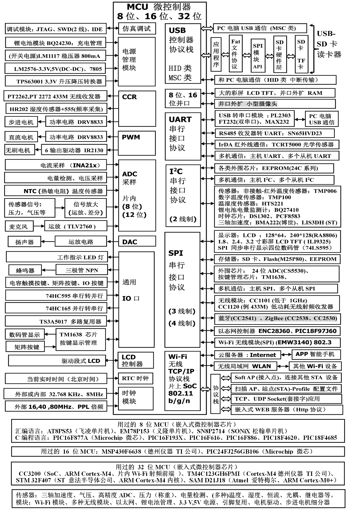
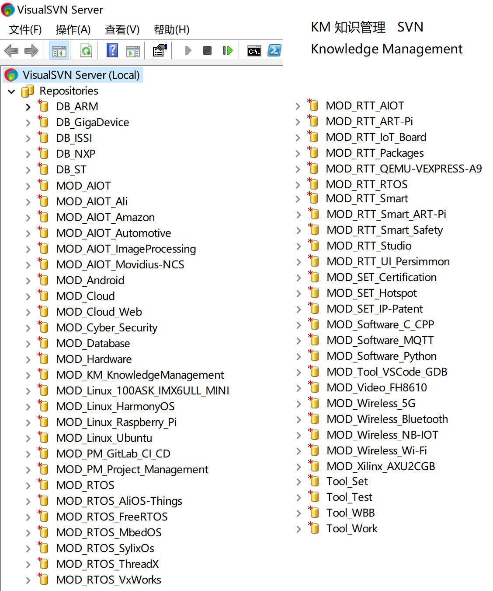
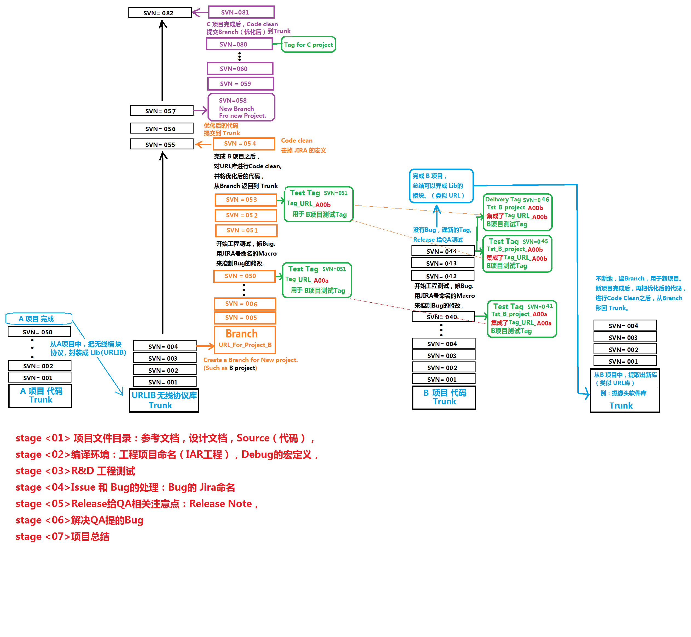

# SummarySet__AIOT_Cloud_Meta_BigData_Blockchain

Technology Summary and Sharing for Wireless Communication(e.g. 5G, BLE), AI, IOT, AIOT, Blockchain, Security & Encryption, Big Data, Cloud Computing, and Meta. 

IT 技术总结与分享。

专注嵌入式、无线通讯（5G、BLE）、AIOT、物联网、人工智能、区块链、信息安全、大数据、云计算、以及 元宇宙、等技术信息的收集和总结！

寻找将这些技术关联点和应用落地! 

从下层到上层的应用落地：

- 从最底层的 IOT 传感器模块（如，烟雾传感器、空气质量传感器）--> 
- IOT 的无线连接模块（如，BLE 无线通信技术）--> 
- IOT 的中间层模块（如，网关设备、控制主机）--> 
- IOT 的云模块（如，设备管理与控制，传感器数据存储、数据分析等）--> 
- 更上层应用（如，AI 应用、Meta等）

具体实施，重点关注以下大主题与小主题。

# 1、IOT 物联网

## 1.1 收集模块：边缘设备（传感器和执行器）

### 1.1.1 传感器

#### 1.1.1.1 烟雾传感器

#### 1.1.1.2 空气质量传感器

### 1.1.2 执行器

## 1.2 连接模块：无线或有线方式

### 1.2.1 BLE 低功耗蓝牙

### 1.2.2 NB-IoT 窄带物联网

### 1.2.3 5G 第五代移动通信

### 1.2.4 MQTT 消息队列遥测传输

### 1.2.5 WebSocket 网络通信协议

## 1.3 控制模块：网关设备、控制主机设备等

## 1.4 云模块：数据中心、数据存储、数据分析等

## 1.5 安全模块：网络安全、信息安全、加密与解密等

## 1.6 Edge Calculation 边缘计算模块：AIOT

## 1.7 RTOS 嵌入式实时操作系统

## 1.8 Embedded Linux 嵌入式操作系统 

# 2、Security & Encryption 安全与加密

## 2.1 Blockchain 区块链

## 2.2 TPM 可信赖平台模块 

## 2.3 OpenSSL 开放式安全套接层协议

## 2.4 mbedTLS 算法库

# 3、Big Data 大数据

## 3.1 MongoDB 文档型数据库

# 4、AI 人工智能

## 4.1 Machine Learning 机器学习

## 4.2 Deep Learning 深度学习

## 4.3 TensorFlow 深度学习-开源

## 4.4 TensorFlow Lite 深度学习-开源-嵌入式

## 4.5 Keras 深度学习

## 4.6 PyTorch 深度学习

## 4.7 Image Recognition 图像识别

## 4.8 OpenCV 计算机视觉库

## 4.9 Speech Recognition 语音识别

# 5、Cloud Computing 云计算

## 5.1 物联网云平台

## 5.2 AIoT Platform 物联网云平台

# 6、Meta 元宇宙

## 6.1 AR 增加现实

## 6.2 VR 虚拟现实

# KM=KnowledgeManagement 知识管理

## KM__IOT 嵌入式软硬件经验总结：模块、传感器、芯片 等 驱动经验总结

## KM 知识管理（SVN-Git）

## KM_流程图 代码模块化、库化 （闭环：优化、迭代、复用）

